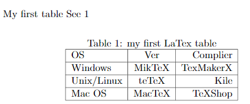
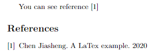

- [各种符号](https://blog.csdn.net/gsww404/article/details/78684278)

# 图片

```latex
\usepackage{graphicx} %最开头

\begin{figure}[htb]
    \centering
    \fbox{\includegraphics[scale=0.2, angle=225]{pic}} %fbox边框
    \caption{The pic}
    \label{fig:universe} %\ref可用
\end{figure}
```


“h t b p” 选项用来指定插图的理想位置，这几个字母分别代表 here, top, bottom, float page，也就是就这里、页顶、页尾、浮动页 (专门放浮动体的单独页面)

`\centering`用来使插图居中

`\caption`命令设置插图标题，LaTeX 会自动给浮动体的标题加上编号

`\label`应该放在标题之后

# 表格

[link](https://www.kancloud.cn/thinkphp/latex/41808)

```latex
My first table See \ref{tab:cde}
\begin{table}[htb] % 先here再top再bottom
\centering
\caption{my first LaTex table}\label{tab:cde}
\begin{tabular}{|l|c|r|}
    \hline
   OS& Ver& Complier\\
    \hline
   Windows & MikTeX & TexMakerX \\
    \hline
   Unix/Linux & teTeX & Kile \\
    \hline
   Mac OS & MacTeX & TeXShop \\
    \hline
\end{tabular}
\end{table}
```



# 公式

引用

```latex
\begin{equation}\label{eq:abc} %给公式起名
    y=X_{ij}+\frac{1}{2\ominus}+\sqrt[4]{123}
\end{equation}
In the equation (\ref{eq:abc}) 
```


# 引用

```latex
\usepackage{natbib} %?


You can see reference \cite{chen2020}
\begin{thebibliography}{2} % 最多2个
    \bibitem{chen2020} Chen Jiasheng. A LaTex example. 2020
\end{thebibliography}

blarblar\citep{adams1995hitchhiker}
\bibliographystyle{plain}
\bibliography{references} % references.bib文件

% references.bib文件
@book{adams1995hitchhiker, % 标签
  title={The Hitchhiker's Guide to the Galaxy},
  author={Adams, D.},
  isbn={9781417642595},
  url={http://books.google.com/books?id=W-xMPgAACAAJ},
  year={1995},
  publisher={San Val}
}
```

