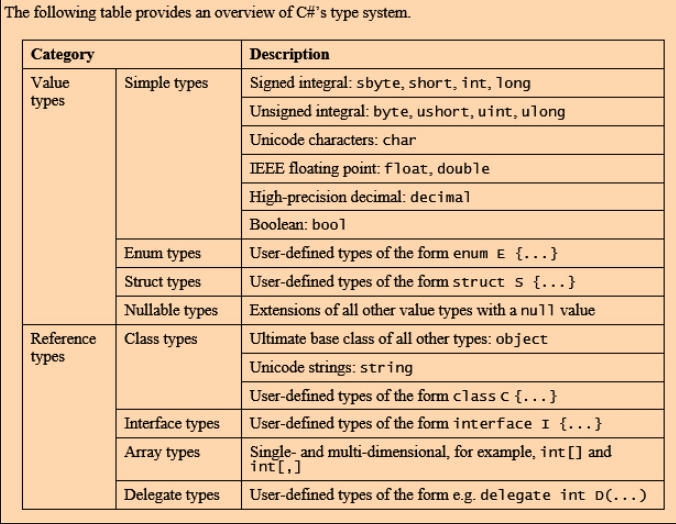
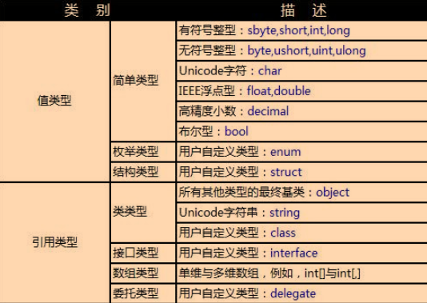
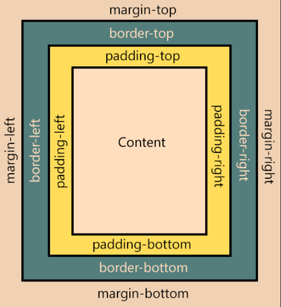

概念

## .NET框架组件

- CLR (Common Language Runtime)  公共语言运行库
  - 提供.Net应用程序所需要的核心服务
- 类库
  - 与CLR紧密集成的可重用的类的集合
  - 为开发和运行.Net应用程序提供各种技术支持
  - 类库中的每个类均按照功能划分到不同的命名空间下面

## 命名空间

> 对类的一种逻辑上的分组
>
> 即将类按照某种关系或联系划分到不同的命名空间下
>
> (类似子目录和文件划分的方式)

- 命名空间又可以包含其它的命名空间
  - 语法: `命名空间.命名空间.....命名空间.类名称.静态方法(参数, ......);`

## 关键字

### using

- 引用指令

  - 用于为命名空间导入其他命名空间中定义的类型

- 别名指令

  - 用于简化命名空间的表达形式

  - ```c#
    using wf = System.Windows.Form;
    System.Windows.Form.MessageBox.Show("hello"); = wf.MessageBox.Show("hello");
    ```

- 语句

  - 定义一个范围, 执行到范围末尾, 会立即释放using的小括号内创建的对象
  - 文件流, 数据库连接
  - 可嵌套

### Main

> 应用程序的入口点

- 只能声明为public static int, 或 public static void

# I/O

```c#
Console.WriteLine("{0:D}", 10); // 10
Console.WriteLine("{0:D5}", 10); // 00010
Console.WriteLine("{0:D}", 10.0); // 爆错

Console.WriteLine("{0:F}", 10); // 10.00
Console.WriteLine("{0:F4}", 10.12345); // 10.1235
Console.WriteLine("{0:F5}", 10.125); // 10.12500

```

## 文件读写

```c#
File.AppendAllText(path, appendText, Encoding.Default);// 追加

string s = File.ReadAllText(path, Encoding.Default);// 读每一行

File.WriteAllLines(path, appendText, Encoding.Default);//创建新文件, 写入, 存在则覆盖

string[] s = File.ReadAllLines(path, Encoding.Default);

using(StreamReader sr = new StreamReader("FileName.txt")){
    String line;
    while((line=sr.ReadLine()) != null){
        Console.WriteLine(line);
    }
}
using(StreamWriter sw = new StreamWriter("FileName.txt")){
    sw.WriteLine("Content");
}
```


# 数据类型

## 类型





### 值类型

> 值类型变量直接在堆栈中保存变量的**值**

### 引用类型

> 引用类型的变量在堆栈中保存变量的**引用地址**

- ==比较地是两个变量引用的是否是一个对象, 要比较值得用`Equals()`, String可以用==来比较值, 因为方便

### 区别

| 特征                  | 值类型             | 引用类型                     |
| --------------------- | ------------------ | ---------------------------- |
| 内存<u>空间</u>配置   | 堆栈(**stack**)    | 受管制的堆(managed **heap**) |
| 保存的<u>内容</u>     | 实际数据           | 指向实际数据的引用指针       |
| 内存<u>需求</u>       | 较少               | 较多                         |
| 内存<u>释放时间点</u> | 超过变量的作用域时 | 有垃圾回收机制负责回收       |
| 执行效率              | 较快               | 较慢                         |

- 引用类型要占更多的空间, 值类型的内存利用率高 [link](https://www.cnblogs.com/yangecnu/archive/2013/02/19/reference_type_internal.html)
- 值类型在内存中通常是连续分配的, 而引用类型不同, 在托管堆上, 不一定连续分配, 所以慢

## 运算符

### ?

### ??

```c#
int j = i ?? 0; // 如果i不为null, 则j=i, 否则j=0
```

### is

> 检查对象是否与给定类型兼容
>
> 返回true, false

```c#
static void Test(object o){
	if(o is Class1){
		a = (Class1)o;
	}
}

int a = 10;
if (a is int){           
    Console.WriteLine("yes");
} // yes
```

### as

```c#
Class1 c = new Class1();
Base b = c as Base;// 如果c是Base类型, 返回c, 否则返回null
// base必须是可空的, 如引用
if(b!=null){ 
	...
}

int a = 10;
int? b = a as int?;
if (b != null){
    Console.WriteLine("yes");
}// yes
```

### typeof

```c#
Console.WriteLine(typeof(int));
// System.Int32
```


## Object

- 所有类型的基类
- 可以显式转换为任何一种对象

## 整型

- Byte
  - 0~255

- Unit
  - U, u
- Long
  - L, l
- Ulong
  - UL, ul
  - 64位

```c#
long y = 1234;
long x = 1234L; // 一开始就分配8个字节
```

## 浮点型

```c#
float x = 2.3f
double y = 2.3
decimal z = 300.12345M
```

## 布尔型

bool 只认True, False, int i=5; if(i)… (❌)

## 字符型

- 表示单个Unicode字符, 两字节(16位)

  ```c#
  // 十六进制
  char c2 = '\x0041';
  Console.WriteLine(c2); //A
  
  // Unicode表示法
  char c3 = '\u0041';c#
  Console.WriteLine(c3); //A
  ```

## 枚举

- 表示一组同一类型的常量
- 所有常量值必须是同一基础类型
- 基础类型只能是**8种整型类型**之一
- 不指定默认是 int 类型

```c#
public enum MyColor{red, green, blue};
等价于:
public enum MyColor{red=0, gree=1, blue=2};

public enum Number:byte{x1=3, x2=5, x3}; // x1:3, x2:5, x3:6
public enum Number:byte{x1=255, x2}; // 编译错误


enum Number : byte { x1 = 3, x2 = 5, x3 };
enum Days { Sun, Mon, Tue};
public static void Main()
{
   Console.WriteLine((int)Number.x3); //6
   Console.WriteLine(Number.x3); //x3 
   Days day = (Days)2;
   Console.WriteLine(day); // Tue
}
```

```c#
enum Days { Sun, Mon, Tue};
public static void Main()
{
	Days day = Days.Mon;
   Console.WriteLine(day); //Mon

   string[] sd = Enum.GetNames(typeof(Days));
   Console.WriteLine(string.Join(",", sd)); //Sun,Mon,Tue
}
```

## 字符串

```c#
string s1 = "this is a string"
string s2 = new string('a', 4)
string s3 = new string('a', 5)

string.Compare(s1, s2) // 1 s1>s2

string.Compare(s2, s3) // -1 s2<s3

string s4 = s1.Substring(2, 5) // is is
    
string s5 = s1.Remove(2) // th
string s5 = s1.Remove(2, 1) // ths is a string
    
var a1 = s1.Split(' ', ',');
var b1 = string.Join(",", a1);// this,is,a,string
```

## 数组

```c#
int[] a = new int[30];

// 简化
string[] a1 = new string[]{"first", "second"};
string[] a1 = {"first", "second"};

string[] a2;
a2 = new string[]{"first", "second"}; // 简化形式只能用在声明语句中, 这里不能省

int[] a = {23, 64, 15, 72, 36};
// 排序
Array.Sort(a);
Array.Reverse(a); // 逆序, 不是降序, 都会对数组本身产生改变, 和Sort组合可做到降序
a.Max();
a.Min();
a.Average();
```


# 数据转换

## 隐式转换

> 低精度, 小范围的数据转换为高精度, 大范围的数据类型

## 显式转换

> 强制转换

```c#
int r = 300;
byte b = checked((byte)r); // 异常
```

## 装箱

> boxing
>
> 将值类型隐式转换为Object类型

- 装箱一个数值会为其分配一个对象实例, 并将该数值复制到新对象中

  ```c#
  int i = 123;
  object o = i; // o引用了堆上int类型的数值, 而该数值是赋给变量i的数值的备份
  ```

## 拆箱

> unboxing
>
> 显式地把Object类型转换为值类型

- 步骤

  1. 检查对象实例, 确认它是否包含了值类型的数
  2. 把实例中的值复制到值类型的

  ```c#
  int i = 123; // 值类型
  object box = i; // 装箱
  int j = (int)box; // 拆箱
  ```

  

# 类

## 关键字

### internal

- 同一程序集中的代码都可以访问, 程序集外的其他代码无法访问

### protexted

- 类的内部可访问, 或者从该类继承的子类可以访问

### static

- 静态类
  - 仅包含静态成员
  - 无法实例化 (这与在非静态类中定义私有构造函数可阻止类被实例化的机制相似)
  - 不能包含实例构造函数, 但可以包含静态构造函数
  - 是密封的, 因此不能被继承
- 静态方法
  - 可以被重载, 但不能被重写, 因为静态方法属于类, 而不是输入类的实例
- 静态字段

### readonly

- 在程序运行期间只能初始化一次的字段, 初始化后字段的值不能再更改
- `static readonly` 作用和用`const`声明定义一个常量相似

## 成员

### 初始化顺序

1. 继承类静态变量
2. 继承类实例变量
3. 基类静态变量
4. 基类实例变量
5. 基类构造方法
6. 继承类构造方法 

### 构造函数

- 可以被重载, 不能被继承
- 种类
  - 实例构造函数
  
  - 重载构造函数
  
  - 静态构造函数
  
    [docs](https://docs.microsoft.com/zh-cn/dotnet/csharp/programming-guide/classes-and-structs/static-constructors)
  
    - 创建第一个实例或引用任何静态成员之前, CLR都会自动调用静态构造函数, 所以是**在实例构造函数之前执行**的
    - 没有访问修饰符, 没有参数
    - 无法直接调用静态构造函数, 无法控制何时执行
    - 仅调用一次
    - 用途
      - 当类使用日志文件时, 使用静态构造函数想日志文件写入项
  
  - 默认构造函数
    - 数值型初始化为0
    - bool型初始化为false
    - 引用型初始化为null
    
  - 私有构造函数
  
    - 通常用在只包含静态成员的类中, 用来阻止该类被实例化

### 析构函数

- 不带参数, 不包含访问修饰符
- 自动调用

### 字段

- 类, 或结构声明的

- "类"级别变量
- 整个类内部的所有方法和事件都可以访问
- 一般将私有或受保护的变量声明为字段, 向类外部代码公开的数据应通过方法, 属性, 索引器提供

### 属性

- 对字段的扩展
- 和字段的区别是: 不表示存储位置
- get 方法
- set 方法

  - 当某个属性作为赋值的目标被引用时, 会自动调用set访问器, 并传入提供新值的实参
- 声明方式

  - 先定义私有字段, 再在get, set里面加代码

  - 用自动实现的 ` public string Name{get; set;}`里面不写任何代码

    - 如果只读, 用 
    - public string Name{get; private set;}
      public string Name{get;}

### 局部变量

- 块的成员, "块"级别的变量
- 局部变量不会被自动初始化

## 继承

- C#只能单继承
- 继承多个可用接口
- 所有的类从 `System.Object`派生, `Object`本身有一些方法
  - 如`Equals()`判断地址是否先相同
- 构造函数不能被继承
- C#中类对象构造的顺序
  1. 按照类中成员的声明顺序进行构造
     2. 从扩充类(派生类)一次向上寻找其基类, 直到找到最初的基类 (所以首先会调用System.Object的构造函数)
     3. 默认执行的是基类不带参数的构造函数

## 多态

- 通过继承实现多态
- 通过抽象类实现多态
  - 抽象类的部分或全部成员不一定都要实现, 但是要在继承类中全部实现
  - 抽象类中已实现的成员仍可被重写
- 通过接口实现多态

## 虚拟和重写

- 虚拟方法
  - 虚拟方法不能声明为静态(static)的 (静态方法是在类层面的, 虚拟方法是在对象层面的)
  - virtual 和 private 不能共用
  - 重写方法的名称, 参数个数, 参数类型, 返回类型要和虚拟方法一样
  - 扩充类没写override的话, 调用的是基类的同名方法

## 隐藏

- 隐藏基类

# 结构

- 值类型, 保存在堆栈中
- 默认隐式从Object类继承
- 不能继承其他结构, 但可用接口

# LINQ

- 不会立即执行
- 使用 ToList(), ToArray(), Distinct() 可以立即执行

```sql
var q = from n in numbers
    	where n % 2 == 0
    	select n;

--无重复值
var q = (from n in numbers
       where n % 2 == 0
       select n).Distinct();
       
var q = from t in students
		where t.Name[0]=='Lee' && t.Gender=='Female'
		select t;
		
var q = from t in students
		where t.Score > 0
		orderby t.Score descending t.name ascending
		select t;
		
var q = from t in students
		select new {姓名=t.Name, 成绩=t.Score};
		
var q = from t1 in students
		from t2 in studentsInfo
		where t1.ID = t2.StudentID
		select new {姓名=t1.Name, 父亲=t2.FatherName}
```

# WPF

- 也是从Main开始执行, 但是Main被隐藏起来了
- 只有一个Application类的实例, 单例

## 窗口

- 模式窗口
  - ShowDialog()
- 无模式窗口
  - Show()
  - Hide(): 对象没有被撤销
- 关闭窗口
  - Closing: 可阻止窗口关闭, 在窗口关闭之前触发
  - Closed: 不可阻止

## 颜色

```c#
btn.Background = Brushes.AliceBlue;

SolidColorBrush sb = new SolidColorBrush(Color.AliceBlue);
btn.Background = sb;

Button btn = new Button();
SolidColorBrush sb = new SolidColorBrush();
sb.Color = Color.FromArgb(255, 255, 0, 0);
btn.Background = sb;
```

## 事件路由决策

- 直接

  - 该事件值针对元素自身, 不会再路由到其他元素

- 冒泡

  - 从事件源依次向父元素方向"向上"查找, 直到找到根元素

  - 目的是搜索父元素中是否包含针对该元素的附加事件声明

  - 这样就可以在某个父元素上一次性为多个子元素注册同一个事件

  - 从Button开始, 首先会执行StackPanel注册的事件, 然后是Border注册的事件, Window注册的事件

    ```xaml
    <Window>
        <Border>
            <StackPanel Button.Click = "Btn_Click">
                <Button Name="yes">
                <Button Name="no">
            </StackPanel>
        </Border>
    </Window>
    ```

- 隧道

  - 跟冒泡路由相反: 从根元素开始向子元素依次路由, 直到找到事件源为止

## 控件模型



## 内容模型

### Text内容模型

- TextBox
- PasswordBox
- TextBlock

### Content内容模型

- Label
- Button
- Image
- CheckBox

## 布局控件

- Grid
- StackPanel
- Canvas
  - Canvas.Left 表示x坐标
  - Canvas.Top 表示y坐标
  - Canvas.ZIndex
  - ClipToBounds: true表示裁掉超出的部分

# XAML

## 资源样式

- 资源
  - 静态资源
    - WPF加载XAML过程中, 会首先查找所有静态资源, 并将资源值替换成实际的属性值
    - 不是每次使用属性值时都去查找资源引用, 所以无法再执行过程中动态改变它的值
  - 动态资源
    - 程序执行到某个属性的值时, WPF回去查找该属性引用的资源
    - 慢于静态资源
    - 比静态资源灵活

- Style

  ```xaml
  <Style x:Key=键值 TargetType="控件类型" BasedOn="其他样式中定义的键值">
  ```

  - 隐式样式设置
    - 只声明TargetType
    - TargetType, 如Button, 会对所有Button空间起作用
  - 显式样式设置
    - 只声明x:Key
    - Key, 只有显式用Style特征引用该x:Key的值时才会起作用
    - Key, 关键字, 标识
  - 同时声明x:Key和TargetType
    - 引用了显式样式的控件不再应用隐式样式
  - 样式继承
    - `BaseOn="{StaticResource FatherStyle}"`
    - 将该样式和BaseOn中的样式合并起来共同起作用

- 样式的级联控制

  - 内联式
    - 就是最常用的那种...
    - 无法一次性设置全部窗口
  - 框架元素样式
    - 在框架元素(Window, Page, UserControl, StackPanel? etc.)的Resource属性中定义的样式
    - 或者说在根元素定义
    - 作用范围为该元素的所有子元素
  - 应用程序样式
    - 在App.xaml的Application.Resources中声明
    - 作用范围时整个应用程序
  - 资源字典
    - 在单独的XAML文件中用ResourceDictionary定义的样式
    - 既可以让其对项目中的所有元素起作用, 也可以让其对项目的所有元素起作用

