<center><bold><large>感谢闫令祺老师的精彩课程!</large></bold></center>


[toc]

# Introduction

CG和CV的区别


# math

## LA

### dot prodct

> [link](https://zh.wikipedia.org/wiki/%E7%82%B9%E7%A7%AF)


### cross product

> 叉乘

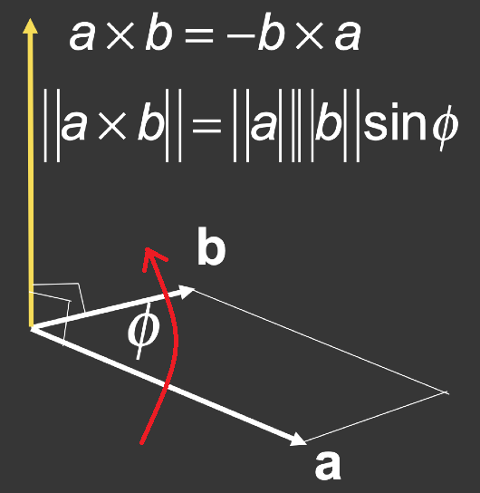

- Cross product is orthogonal to two initial vectors：叉乘会得到一个新的向量，这个向量同时垂直于a和**b**
- Direction determined by right-hand rule：新向量的方向由右手定则来确定（右手的四个手指弯曲使其在水平面同时垂直于**a**、**b**向量，如图中红线所示，拇指指向的方向为新向量的方向）
- Useful in constructing coordinate（坐标） systems


#### 计算


- 右手坐标系，$\overrightarrow{x}× \overrightarrow{y} = \overrightarrow{z}$；

- 左手坐标系，$\overrightarrow{x}× \overrightarrow{y} = -\overrightarrow{z}$，OpenGL用的是左手坐标系

- 向量自己跟自己叉乘得到的是一个0**向量**，不是0

- 

  推导过程详见 [link](https://zh.wikipedia.org/wiki/%E5%8F%89%E7%A7%AF)

- 

#### 作用

- Determine left / right

  

- Determine inside / outside

  

## Probability

### PDF

> Probability Distribution Function 概率分布函数


#### importance sampling

> 允许arbitrary pdfs
>
> 针对不同函数有不同的采样方法

### Monte Carlo 

$$
\int f(x)dx = \frac{1}{N}\sum^N_{i=1}\frac{f(X_i)}{p(X_i)}
$$

- $X_i\sim p(x)$

- $f(X_i)$: $X_i$ 的函数值

- 为什么要除以概率$p$? 因为

   详见[link](https://blog.csdn.net/ACM_hades/article/details/104643999)

# Transformation

- 2D: rotation, scale(缩放), shear
- 3D

## Linear Transforms

所有的线性变换都可以写成下面这样


### shear


垂直方向不变，水平方向偏移ay

但是平移（translation）不能用上面那种形式表示（一个矩阵乘以一个向量），得用下面这种


叫做Affine map = linear map + translation

为了能够统一地表示所有这些操作（旋转，缩放，平移），需要引入齐次坐标(Homogenous Coordinates)

### rotate

逆时针，绕原点


可以找两个特殊点，来推

看看逆时针和顺时针旋转，会发现这两个矩阵刚好互逆($R^T$是$R$的转置)

$R_\alpha= \begin{pmatrix}cos\alpha&-sin\alpha \\ sin\alpha&cos\alpha\end{pmatrix}$

$R_{-\alpha} = \begin{pmatrix}cos\alpha&sin\alpha \\ -sin\alpha&cos\alpha\end{pmatrix} = R^T_\alpha$ 

BTW: 如果一个矩阵的逆等于它的转置，这个矩阵就叫做正交矩阵。

### Homogenous Coordinates

> 齐次坐标


如果是点，最后一个维度的最后加的是1，前面都为0

如果是向量，最后一个维度都为0，因为向量有**平移不变性**（向量只跟长度、方向有关，与起点无关）所有要加0保护，不让平移操作改变它

增加一个维度还有一个好处，就是运算

- vector + vector = vector

- point - point = vector

- point + vector = point （一个点延一个方向移动到另一个点）

- point + point = 变成这两个点之间的中点, 因为

  $\begin{pmatrix}x \\y \\w\end{pmatrix}$是一个2维的点$\begin{pmatrix}x/w\\y/w\\1\end{pmatrix},w\not= 0$

#### scale

$$
S(s_x, s_y) = \begin{pmatrix}s_x&0&0 \\ 0&s_y&0\\0&0&1\end{pmatrix}
$$


#### rotation

$$
R(\alpha) = \begin{pmatrix}cos\alpha&-sin\alpha&0 \\ sin\alpha&cos\alpha&0\\0&0&1\end{pmatrix}
$$


#### translation

$$
T(t_x, t_y) = \begin{pmatrix}1&0&t_x \\ 0&1&t_y\\0&0&1\end{pmatrix}
$$


## Inverse Transform

$M^{-1}$is the inverse of transform $M$ in both a matrix and geometric sense

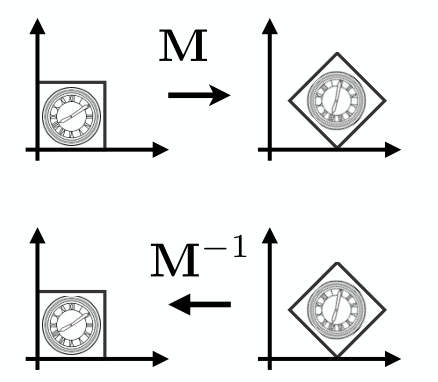

## Composing Transforms


## Decomposing Comples Transforms

## 3D Transforms


**很重要，如果w不为0，x、y、z都要除以w得到的才是要的点**


左上角的3*3矩阵还是表示线性变换, $t_x, t_y, t_z$ 还是表示平移。

### scale

> 缩放


### translation

> 平移


### rotate 


- $R_x$是绕x旋转，x轴的坐标不变，所以（0，0）位置是1
- 任何旋转都可以分解为绕x, y, z 旋转
- xyzxyz, 三个轴循环对称，x×y得z，y×z得x，z×x得y，是x×z得-y     ？？？

#### Rotation Formula

> Rodrigues’ rotation formula
>
> 罗格里德斯旋转公式


- **n**是旋转轴：默认是过原点，方向是**n**的方向。如果要沿任意轴旋转，需要先移动到原点再移动回去。
- N那个矩阵其实是向量**n**（可以到上面看叉乘的公式）

## View Transformation

> 观测变换

步骤（用拍照来做比喻）MVP变换

1. **model** transformaiton（模型变换，把要拍照的人都找来）
2. **view/camera** transformaiton（视图变换，找一个好的角度）
3. **projection** transformation（投影，Cheese!）
4. 视口（在下面光栅化部分）

### M

- 调整好模型, 比如先旋转好

### V

> 视图变换
>
> 也叫ModelView Transformation，MVP中的MV

- 假定相机永远在原点，朝向-z方向。如果一开始相机不满足条件，只需移动相机，移动的同时保持相机和物体相对静止即可。

  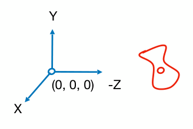

- 定义相机

  - position 位置：$\overrightarrow{e}$

  - look-at / gaze direction 仰角（垂直）：$\hat{g}$
  - up direction 倾斜角（水平）：$\hat{t}$

- $M_{view}$表示相机要进行变换的矩阵：也就是

  - Translates e to origin 平移到原点

  - Rotates g to -Z 

  - Rotates t to Y

  - Rotates (g × t) To X

    

- $M_{view} = R_{view} T_{view}$，$M_{view}$需要通过平移和旋转得到

  - $T_{view}$ 是平移矩阵，平移到原点，
    $$
    T_{view} = \begin{bmatrix} 1&0&0&-x_e  \\  0&1&0 &-y_e \\ 0&0&1&-z_e \\ 0&0&0&1 \end{bmatrix}
    $$
  
- $R_{view}$是旋转矩阵，作用是：Rotate g to -Z, t to Y, (g × t) to X。但是不好算，只能Consider its inverse rotation: X to (g × t), Y to t, Z to -g
    $$
    R_{view}^{-1} = \begin{bmatrix} x_{\hat{g}×\hat{t}}&x_t&x_{-g}&0  \\  y_{\hat{g}×\hat{t}}&y_t&y_{-g}&0 \\ z_{\hat{g}×\hat{t}}&z_t&z_{-g}&0 \\ 0&0&0&1 \end{bmatrix}
    $$
    
  
  （可以拿向量$\begin{bmatrix} 1\\0\\0\\0 \end{bmatrix}$，$\begin{bmatrix}0\\1\\0\\0 \end{bmatrix}$，$\begin{bmatrix} 0\\0\\1\\0 \end{bmatrix}$分别去做$R_{view}^{-1}$旋转，就可以得到相机原来的位置）
  
  因为旋转矩阵是正交矩阵，旋转矩阵的逆是其转置，所以
  $$
    R_{view} = \begin{bmatrix} x_{\hat{g}×\hat{t}}&y_{\hat{g}×\hat{t}}&z_{\hat{g}×\hat{t}}&0  \\  x_t&y_t&z_t&0 \\ x_{-g}&y_{-g}&z_{-g}&0 \\ 0&0&0&1 \end{bmatrix}
  $$
  

### P

> 投影变换

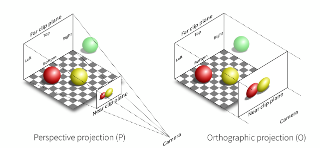

#### Orthographic Projection

> 正交投影

- A simple way of understanding 简单的做法

  - Camera located at origin, looking at -Z, up at Y (looks familiar?) 相机位于原点

    

  - Drop Z coordinate，这就是朝向-Z的好处，只要拿掉Z坐标就得到了投影

  - Translate and scale the resulting rectangle to [-1, 1]$^2$ 为了方便其他计算，也算是约定俗成的，之后可能再做一次缩放

    

- In general 通常的做法

  - We want to map a cuboid [l, r] × [b, t] × [f, n] to the “canonical (正则、规范、标准)” cube [-1, 1]$^3$

  

  ​	l, r, b, t, f, n 表示 left, right, bottom, top, far, near, 由于是右手系，far的z值反而会比near的z值小

  - 对比<u>简单的做法</u>，<u>通常的做法</u>需要先将cuboid的中心center与原点origin重合，然后缩放到一个 “canonical” cube

##### 计算

1. translate (center to origin)
2. scale (length/width/height to 2) 

Transfomation Matrix:
$$
M_{ortho}=
\begin{bmatrix} 
\frac{2}{r-l}&0&0&0\\
0&\frac{2}{t-b}&0&0\\
0&0&\frac{2}{n-f}&0\\
0&0&0&1\\
\end{bmatrix}
\begin{bmatrix} 
1&0&0&-\frac{r+l}{2}\\
0&1&0&-\frac{t+b}{2}\\
0&0&1&-\frac{n+f}{2}\\
0&0&0&1\\
\end{bmatrix}
$$

- 右边是平移矩阵：负的是因为要回到原点
- 左边是缩放矩阵：最后$r-l$这段长度会变成$(r-l) * \frac{2}{r-l}$这么长，也就是2，为-1到1的距离

#### Perspective Projection

> 透视投影(近大远小)


- 要用到的一些性质（齐次坐标）
  - (x, y, z, 1), (kx, ky, kz, k != 0), (xz, yz, z 2 , z != 0) all represent the same point (x, y, z) in 3D
    e.g. (1, 0, 0, 1) and (2, 0, 0, 2) both represent (1, 0, 0)
  - simple, but useful


- 投影步骤
  1. “squish” the frustum into a cuboid (n -> n, f -> f) ($M_{persp->ortho}$ ) 先将远平面挤到和近平面一样大
  2. Do orthographic projection (M ortho , already known!) 再正交投影

- 一些规定
  - 近平面啥都不变
  - 远平面的z不变，中心也不变

##### 计算

1. 首先将远平面缩成近平面的大小，所以先找远近平面的关系

   

   这里面有两个相似三角形，比值是$\frac{n}{z}$

   $y'=\frac{n}{z}y$，$x'=\frac{n}{z}x$

   所以我们知道了缩放后远平面x，y的变化，远平面上的点的变化：
   $$
   \begin{pmatrix}
      x \\
      y \\
      z \\
      1
   \end{pmatrix} \implies
   \begin{pmatrix}
      nx/z \\
      ny/z \\
      unknow \\
      1
   \end{pmatrix} ==
   \begin{pmatrix}
      nx \\
      ny \\
      still\space unknow \\
      z
   \end{pmatrix}
   $$

   - $z$在这里还不知道是怎么变化。
   - 点的坐标都乘上一个数（比如$z$），点还是那个点。

2. 尝试推一下$M^{(4×4)}_{persp->ortho}$
   $\because M^{(4×4)}_{persp->ortho}   \begin{pmatrix}      x \\      y \\      z \\      1   \end{pmatrix} =   \begin{pmatrix}      nx \\      ny \\      unknow \\      z   \end{pmatrix}$
   
   $\therefore M_{persp->ortho} =    \begin{pmatrix}      n&0&0&0 \\      0&n&0&0 \\   	?&?&?&?\\      0&0&1&0   \end{pmatrix}$
   
   - 由于不知道z最后变成什么，也就无法逆推原来是什么乘z
   
3. 寻找更多的线索来确定$M_{persp->ortho} $第三行，比如

   1. **所有近平面的点位置都不变**，所以近平面的点做$M_{persp->ortho} $变化（缩放到和近平面一样大）得到的还是近平面。

      设近平面的点为$\begin{pmatrix}x \\   y \\   n\\   1\end{pmatrix}$，且 $M^{(4×4)}_{persp->ortho}   \begin{pmatrix}      x \\      y \\      z \\      1   \end{pmatrix} =   \begin{pmatrix}      nx \\      ny \\      unknow \\      z   \end{pmatrix}$

      

      由于近平面的点变化后不变，且格式是$\begin{pmatrix}      nx \\      ny \\      unknow \\ n \end{pmatrix}$ ，所以$unknow$应该是$n^2$，也就是说$M_{persp->ortho}\begin{pmatrix}      x \\      y \\      n\\      1   \end{pmatrix} = \begin{pmatrix}      nx \\      ny \\      n^2 \\      n   \end{pmatrix}$，逆推得$\begin{pmatrix}0&0&A&B\end{pmatrix} \begin{pmatrix}      x \\      y \\      n\\      1   \end{pmatrix} = n^2$，$M_{persp->ortho}$的第三行是$\begin{pmatrix}0&0&A&B\end{pmatrix}$，即$An+B=n^2$。

      由于有两个未知数A，B，我们需要更多线索

   2. **所有远平面的点z值都不变**，那我们不妨拿中心点$\begin{pmatrix} 0\\0\\f\\1 \end{pmatrix}== \begin{pmatrix} 0\\0\\f^2\\f \end{pmatrix}$来看看，$M_{persp->ortho}\begin{pmatrix} 0\\0\\f\\1 \end{pmatrix}=\begin{pmatrix} 0\\0\\f^2\\f \end{pmatrix}$，所以$\begin{pmatrix}0&0&A&B\end{pmatrix}\begin{pmatrix} 0\\0\\f\\1 \end{pmatrix} = f^2$，即$Af+B=f^2$

4. 整理一下已获得的线索

   $An+B=n^2\\Af+B=f^2$，得 $A=n+f\\B=-nf$ 

5. Finally, every entry in $M_{persp->ortho}$ is known! $ M_{persp->ortho} =    \begin{pmatrix}      n&0&0&0 \\      0&n&0&0 \\   	0&0&n+f&-nf\\      0&0&1&0   \end{pmatrix}$

6. Do orthographic projection ($M_{ortho}$ ) to finish: $M_{persp} = M_{ortho} M_{persp->ortho}$ 

##### 问题

**如果一个平面位于远平面和近平面之间，做透视投影后，z的值会变吗？**

我的答案是会变得靠近远平面：

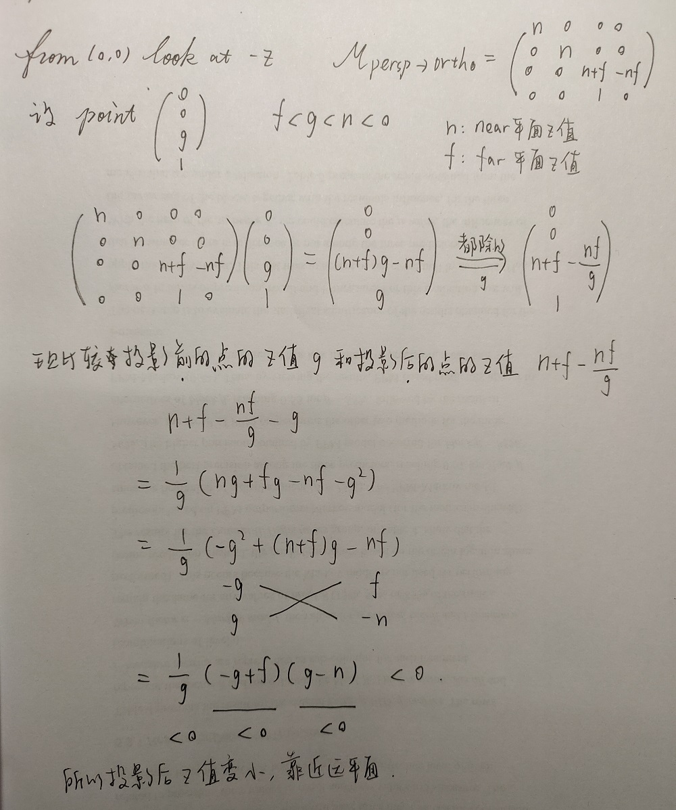

所以可以看出, 透视投影并不是按照与近平面的距离等比例地缩放, 如下图(Frustum切面的上一半), 如果是等比例地缩放, 投影后的红色点应该也是均匀分布


结果是投影后的点靠近远平面


##### 其他概念


- field-of-view(fovY) 垂直可视角度。角度越小的话透视投影的结果会更像正交投影（大小差得比较小）；角度越大差得越大。

- aspect ratio 宽高比

  

- $aspect = \frac{r}{t}$

- $tan\frac{fovY}{2} = \frac{t}{|n|}$

# Rasterization

> 光栅化 (采样+深度测试)
>
> MVP之后图像在[-1,1]$^3$的立方体中，光栅化就是把图像画到屏幕上
>
> raster == screen in German (屏幕也叫光栅成像设备)

实时图形学(>30fps)常用到光栅化

## Viewport Transform

> 视口变换

- irrelevant to z

- Transform in xy plane: [-1, 1]$^2$ to [0, width] x [0, height]

- Viewport transform matrix:

  $M_{viewport} = \begin{pmatrix}      \frac{width}{2}&0&0&\frac{width}{2} \\ 0&\frac{height}{2}&0&\frac{height}{2} \\ 0&0&1&0 \\      0&0&0&1   \end{pmatrix}$

  z方向不动，x，y缩放到屏幕大小，然后平移到原点处

## Triangle

> （fundamental shape primitive）

- 性质
  - most basic polygon，任何其他多边形都可以拆成三角形
  - Guaranteed to be planar：三角形内部一定是一个平面，折一个三角形的话就变成两个三角形了。
  - Well-defined interior：多边形有凹凸，三角形没有，可以通过向量的叉积来判断点在三角形内还是外
  - Well-defined method for interpolating values插值 at vertices over triangle (barycentric interpolation)：三角形内部的插值

### 是否在三角形内


沿一个方向，比如顺时针，计算$\vec{P_1P_2}×\vec{P_2Q}$，$\vec{P_2P_0}×\vec{P_2Q}$，$\vec{P_0P_1}×\vec{P_0Q}$ 如果得出的三个结果都为正或者都为负，说明点在三角形内。

点刚好在边上可以不做严格处理。

### Bounding Box

> 包围盒

- 包围盒的水平范围是从x最小到x最大，垂直范围是从y最小到y最大，不在这个范围内的像素可以不光栅化。

## Sampling

> 采样
>
> Evaluating a function at a point is sampling.

We can discretize a function by sampling.

### 1D

```cpp
for (int x = 0; x < xmax; ++x)
	output[x] = f(x);
```

### 2D

$inside(t, x, y) = \begin{cases} 1 &\text{Point } (x,y) \text{ in triangle }t \\ c & otherwise\end{cases}$

```cpp
for (int x = 0; x < xmax; ++x)
	for (int y = 0; y < ymax; ++y)
		image[x][y] = inside(tri, x + 0.5, y + 0.5);  // 由像素点的中心点来决定这个像素在不在三角形内
```

## Artifact

> sampling artifact (error/mistakes/inaccuracies/瑕疵)

- Sampling Artifacts in Computer Graphics:
  - Jaggies, aliasing(staircase pattern 锯齿) —— sampling in space
  - Moiré Patterns(摩尔纹) —— undersampling images 隔行采样的结果
  - Wagon whheel effect(高速旋转的车轮看起来是倒转的，因为人眼的采样速度跟不上) —— sampling in time
  - . . . 
- Behind the Aliasing Artifacts: Signals are **changing too fast** (high frequency), but **sampled too slowly** 本质都是采样速度慢

## Antialiasing

> 反走样


- Note antialiased edges in rasterized triangle
  where pixel values take intermediate values
- 顺序不能颠倒，必须先模糊再采样

### Frequency Domain 

- 傅里叶变换能把图片从时域（空间中不同的位置）变到频域

  

  - 频率图中间是低频信号，四周是高频信号。自然界中的图片信息也是大部分都集中在低频区。

### Conovolution

> 卷积

- Filtering = Convolution ( = Averaging)？比如低通滤波过滤掉了高频信息，相当于平均了

#### Filter Kernel


卷积核如果变大，图片会变模糊（可以这么理解，考虑最极端情况，如果卷积核和图片一样大，那么得出的结果是所有的像素都是一样的颜色）


### Convolution Theorem

**Convolution in the spatial domain is <u>equal to multiplication in the frequency domain</u>, and vice versa** 时域的卷积等于频域的乘积，时域的乘积等于频域的卷积


例如以下两个操作得到的结果是一样的：

Option1:

1. Filter by convolution in the spatial domain 时域上的卷积

Option2:

1. Transform to frequency domain (Fourier transform) 先用傅里叶变换把图片从时域变到频域

2. Multiply by Fourier transform of convolution kernel 把卷积核也变到频域上，把两者相乘
3. Transform back to spatial domain (inverse Fourier) 用逆傅里叶变换从频域变到时域


### 采样,走样,反走样


- (c)为冲激函数，只在特定的位置有值
- (e)是(a)(c)相乘的结果
- (f)是(b)(d)做卷积的结果: 采样就是在重复原始信号的频谱, 当这些信号的频谱发生重叠时, 图像就走样了:


- 采样不够快, 信号的频谱间隔会变小(时域和频域很多关系是相反的…)

(铺垫这么多终于到反走样了)

How Can We Reduce Aliasing Error?

Option 1: Increase sampling rate

- Essentially increasing the distance between replicas in the Fourier domain 用分辨率高的显示器, 分辨率高所以像素点小, 像素点小说明采样率高, 采样率高频谱重叠的就少
- Higher resolution displays, sensors, framebuffers…
- But: costly & may need very high resolution

Option 2: **Antialiasing**

- Making Fourier contents “narrower” before repeating
- i.e. Filtering out high frequencies before sampling

### 反走样

**Antialiasing = Limiting, then repeating**


(先砍掉高频信号, 再采样)

1. Convolve f(x,y) by a 1-pixel box-blur

   (Recall: convolving = filtering = averaging)

   使用卷积来模糊, 下面是像素大小的卷积核

   

2. Sample at every pixel’s center

   In rasterizing one triangle, the average value inside a pixel area of f(x,y) = inside(triangle,x,y) is equal to the area of the pixel covered by the triangle.

   

   像素颜色的深度和被三角形覆盖的面积大小成正比, 就是把黑色平均到整个像素


#### MSAA

> Multisample anti-aliasing

- 不是通过提升分辨率来反走样, 增加采样点只是为了近似一个合理的三角形覆盖率, 最后像素的数量没变
- 计算量会增加

步骤还是先模糊再采样

1. 模糊

   Approximate the effect of the 1-pixel box filter by sampling multiple locations within a pixel and averaging their values 通过对一个像素内的多个位置进行采样并求其值的平均值，来近似1像素滤波器的效果:

   

   1. Take NxN samples in each pixel.

      

   2. Average the NxN samples “inside” each pixel.

      

      

      

      This is the corresponding signal emitted by the display 显示器发出的相应信号

      

2. 采样: 采样很简单, 每个像素还是只有一个颜色

效果对比嘿嘿(加了抗锯齿有不正常的黑边)


16个采样点的效果:happy: ​


#### FXAA

> Fast Approximate AA

- 找到边界->换成没有锯齿的边界

#### TAA

> Temporal/tɛmˈp(ə)r(ə)l/ AA (重音不同, 和‘临时的’做区分)

- 复用上一帧的信息

#### DLSS

> Deep Learning Super Sampling

- Super resolution / super sampling
  - From low resolution to high resolution
  - Essentially still “not enough samples” problem

## Z-buffering

- Store current min.z-value **for each sample** (pixel) 每个像素点都记录一个最浅的深度, 

- Needs an additional buffer for depth values

  - frame buffer stores color values
  - depth buffer (z-buffer) stores depth

- IMPORTANT: For simplicity we suppose

  **z is always positive**
  (smaller z -> closer, larger z -> further)

### 实现

- Initialize depth buffer to $\infty$

- During rasterization:

  ```cpp
  for (each triangle T)
  	for (each sample (x,y,z) in T)
  		if (z < zbuffer[x,y]) // closest sample so far
  			framebuffer[x,y] = rgb; // update color
  			zbuffer[x,y] = z; // update depth
  		else
  			; // do nothing, this sample is occluded
  ```


- 复杂度: O(n)

# Shading

> 着色


- 从上到下分别是 高光, 漫反射, 环境光照


## Blinn-Phong Reflection Model


$$
\begin{aligned}
	L &= L_a + L_d + L_s\\
	  &= k_aI_a + 
	  	 k_d(I/r^2)max(0,\vec{n}\cdot \vec{l}) +  
	  	 k_s(I/r^2)max(0,\vec{n}\cdot \vec{h})^p
\end{aligned}
$$

### Diffuse Reflection

> 漫反射

Diffusely(Lambertian) Reflected Light:
$$
L_d=k_d(I/r^2)max(0,\vec{n}\cdot \vec{l})
$$

- $\vec{n}$: 平面的法向量, 单位向量

- $\vec{l}$: 光的入射方向, 单位向量

- $L_d$: diffusely reflected light

- $k_d$: diffuse coefficient(color) 定义一个点的不同属性, 可以是反射系数, 如果是1说明全部反射, 如果是0说明全部吸收了; 也可以是纹理的颜色

- $(I/r^2)$: **到达的能量** energy arrived at the shading point

  (球体表面积计算公式为S=4πr²) 能量跟距离成反比

  

- $\vec{n}\cdot \vec{l}$: **接收的能量** 与光线的直射的角度的关系, 如果结果是1, 说明是直射; 如果结果是0, 说明光线和平面平行, 没有光线照射; 如果结果是负的, 说明点光源在平面表面的另一边, 没有意义不考虑


- 漫反射和观测角度 $\vec{v}$ 没有关系, 公式中也没有出现 $\vec{v}$

### Specular Highlights

> 镜面高光

- Intensity depends on view direction
- Bright near mirror reflection direction


- $\vec{R}$为可以看到高光的角度


半程向量
$$
\begin{aligned}
\vec{h} &= bisector(\vec{v},\vec{l})\\
	    &= \frac{\vec{v}+\vec{l}}{||\vec{v}+\vec{l}||}
\end{aligned}
$$
Specularly Reflected Light
$$
\begin{aligned}
	L_s &=k_s(I/r^2)max(0,cos\alpha)^p\\
		&=k_s(I/r^2)max(0,\vec{n}\cdot \vec{h})^p\\
\end{aligned}
$$

- $\vec{n}$: normal vector, 平面的法向量, 单位向量

- $\vec{h}$: half vector, $\vec{v}$和$\vec{l}$的中间向量, 单位向量

  $\vec{v}$ close to mirror direction ⇔ **half vector near normal**, Measure “near” by dot product of unit vectors, 通过半程向量和法向量是否接近来判断观看角度和高光角度是否接近

- $k_s$: 镜面反射系数

- 颜色, 通常高光是白的

- $\vec{n}\cdot \vec{h}$: 得两个向量夹角的$cos$值, 越接近1说明观看角度越接近高光角度

- $^p$: Increasing p narrows the reflection lobe 控制高光大小

  

  $cos$ 的容忍范围太大, 即使差了45°, 数值上也差不了多少, 导致高光范围太大, 即使角度偏很多还是能看到高光, 实际情况应该是和只要偏离一点就看不到高光. 所以需要让它的变化更陡峭一些

  通常会取到100, 200

  

- 没有考虑$\vec{n}\cdot \vec{l}$(接收的能量)……

### Ambient Lighting

> 环境光照

- Shading that does not depend on anything
  - Add constant color to account for disregarded
    illumination and fill in black shadows

  - This is approximate / fake!

    

$$
L_a = k_aI_a
$$

- 公式中没有出现$\vec{l}$, 与直接光照方向无关; 也没有出现$\vec{v}$, 与观测方向也无关. 所以是一个常数
- $k_a$: 环境光系数
- $I_a$: 环境光的强度

## Shading Frequencies


当顶点数足够多, 用简单的模型就能达到挺好的效果

### flat shading


• Triangle face is flat — one normal vector 一个三角形一个法向量, 所以整个三角形的颜色都是一样的
• Not good for smooth surfaces

### Gouraud shading


- **Interpolate** colors from vertices across triangle 
- Each vertex has a normal vector (how?) 三角形的三个顶点求法向量, 三角形内的颜色用插值

#### Per-Vertex Normal Vectors

> 逐顶点法向量

- Best to get vertex normals from the underlying geometry 最好从基础几何体获取顶点法线

  - e.g. consider a sphere 球

    从球心连向顶点

    

- Otherwise have to infer vertex normals from triangle faces

  - Simple scheme: **average surrounding face normals**
    $$
    N_v = \frac{\sum_iN_i}{||\sum_iN_i||}
    $$
    相邻的面的法向量的平均(可以加上权重)

    

### Phong shading

- Interpolate normal vectors across each triangle
- Compute full shading  model at each pixel 通过三角形三个顶点的法向量插值出三角形内每个像素的法向量, 然后再着色
- Not the Blinn-Phong Reflectance Model

#### Per-Pixel Normal Vectors

- **Barycentric interpolation**

  

  (Don’t forget to **normalize** the interpolated directions)

## Shader Programs

- Describe operation on a single vertex (or fragment) 只需要定义一个顶点或fragment(不是每个fragment都定义), 如果定义的是一个顶点的上色规则, 那就叫vertex shader(顶点着色器), 如果定义的是一个fragment, 那就叫fragment shader, pixel shader

- Shader function executes once per fragment. 每个fragment执行一次

- Outputs color of surface at the current fragment’s screen sample position.

- This shader performs a texture lookup(纹理查找) to obtain the surface’s material color at this point, then performs a diffuse lighting calculation. 先查找纹理看应该是什么颜色, 再计算光线

- Example GLSL fragment shader program

  ```cpp
  // uniform 全局变量
  uniform sampler2D myTexture;  // 纹理
  uniform vec3 lightDir;   // 光照方向
  varying vec2 uv;  // 
  varying vec3 norm;  // 顶点法线, 可以是插值出来的
  void diffuseShader()
  {
  	vec3 kd;  // 漫反射系数
  	kd = texture2d(myTexture, uv);  // // material color from texture
  	kd *= clamp(dot(–lightDir, norm), 0.0, 1.0);  // 简化Lambertian shading model嘿嘿, 入射方向和上面的模型相反
  	gl_FragColor = vec4(kd, 1.0); // // output fragment color
  }
  ```

## Barycentric Coordinates Interpolate

> 重心坐标 插值

- Why do we want to interpolate?
  - Specify values at vertices. 
  - Obtain smoothly varying values across triangles. 因为很多属性都是定义在三角形的顶点上, 要想在三角形的内部得到一个平滑的过渡, 从一个顶点过渡到另一个顶点就需要用到插值
- What do we want to interpolate?
  - Texture coordinates, colors, normal vectors, … 三角形的顶点可以定义映射到纹理的哪一个三角形(空间的三角形到平面的三角形), 定义颜色, 法线(Phong shading)
  - 所以要用到重心坐标

### 公式


$$
(x, y) = \alpha A+\beta B + \gamma C\\
\alpha +\beta  + \gamma =1\\
\alpha = \frac{A_A}{A_A+A_B+A_C}\\
\beta = \frac{A_B}{A_A+A_B+A_C}\\
\gamma = \frac{A_C}{A_A+A_B+A_C}
$$

- Inside the triangle if all three coordinates are **non-negative**. 

- 举例: A点坐标$(\alpha, \beta, \gamma) = (1,0,0)$, 重心坐标A点坐标$(\alpha, \beta, \gamma) = (1/3,1/3,1/3)$

- $A_A$表示三角形$A$的面积

  

- 具体计算

  

- 编程 (上面公式+化简)

```cpp
// 插值三角形内点的z值
static std::tuple<float, float, float> computeBarycentric2D(float x, float y, const Vector3f* v)
{
	float alpha = (x*(v[1].y() - v[2].y()) + (v[2].x() - v[1].x())*y + v[1].x()*v[2].y() - v[2].x()*v[1].y()) / (v[0].x()*(v[1].y() - v[2].y()) + (v[2].x() - v[1].x())*v[0].y() + v[1].x()*v[2].y() - v[2].x()*v[1].y());
	float beta =  (x*(v[2].y() - v[0].y()) + (v[0].x() - v[2].x())*y + v[2].x()*v[0].y() - v[0].x()*v[2].y()) / (v[1].x()*(v[2].y() - v[0].y()) + (v[0].x() - v[2].x())*v[1].y() + v[2].x()*v[0].y() - v[0].x()*v[2].y());
	// float gamma = (x*(v[0].y() - v[1].y()) + (v[1].x() - v[0].x())*y + v[0].x()*v[1].y() - v[1].x()*v[0].y()) / (v[2].x()*(v[0].y() - v[1].y()) + (v[1].x() - v[0].x())*v[2].y() + v[0].x()*v[1].y() - v[1].x()*v[0].y());
	float  gamma = 1-alpha-beta;  // gamma和上面的算法最大有0.000001的不同
	
    return {alpha, beta, gamma};
}

// 调用
auto[alpha, beta, gamma] = computeBarycentric2D(x, y, t.v);
float w_reciprocal = 1.0/(alpha / v[0].w() + beta / v[1].w() + gamma / v[2].w());  // 倒数
float z_interpolated = alpha * v[0].z() / v[0].w() + beta * v[1].z() / v[1].w() + gamma * v[2].z() / v[2].w();
z_interpolated *= w_reciprocal;

float z_interpolated2 = alpha * v[0].z() + beta * v[1].z() + gamma * v[2].z();
```

  - v是三角形三个顶点的集合
  - z_interpolated *= w_reciprocal是$\displaystyle{\frac{1}{\frac{\alpha}{A_w}+\frac{\beta}{B_w}+\frac{\gamma}{C_w}}×(\frac{\alpha}{A_w}A_z + \frac{\beta}{B_w}B_z + \frac{\gamma}{C_w}C_z)}$ 或者直接 z_interpolated = $\alpha A_z + \beta B_z + \gamma C_z$, 二者算出来的结果差别不大。

### 使用


$$
V = \alpha V_A+\beta V_B+\gamma V_C
$$

- $V_A$, $V_B$, $V_C$ can be positions, texture coordinates, color, normal, depth, material attributes…
- However, barycentric coordinates are not invariant under projection! 投影前后重心坐标可能会不一样. 如果要插值三维中的属性, 不能用投影了的三角形的坐标去算, **要用投影前的三维坐标去算**(应用逆变换可得到投影前的坐标) 
- $\alpha + \beta + \gamma = 1$, 所以不需要再归一化

## Texture

- In modern GPUs, texture = memory + range query (filtering) 纹理就是一块内存，然后可以在这块内存上进行范围查询，不局限于图像上
  - General method to bring data to fragment calculations

### Texture Mapping

Each triangle “copies” a piece of the texture image to the surface.


Each triangle vertex is assigned a texture coordinate (u,v). u, v的范围[0,1]


### Texture Applying

```cpp
for each rasterized screen sample (x,y):
	(u,v) = evaluate texture coordinate at (x,y)  // Using barycentric coordinates
	texcolor = texture.sample(u,v);
	set sample’s color to texcolor;  // Usually the diffuse albedo Kd (recall the Blinn-Phong reflectance model)
```

- 纹理坐标都定义在三角形的顶点上, 通过插值得到点在三角形的哪, 算出(u, v), 然后查纹理, 就可以知道颜色

### Texture Magnification

> texture is too small


- Generally don’t want this — insufficient texture resolution. 通常不会这么做, 但还是会存在这种现象

- A pixel on a texture — a **texel** (纹理元素、纹素)
- 

#### Nearest


- Red point: Want to sample texture value f(x,y) at red point
- Black points: indicate texture sample locations, 
- $u11$方格内的点都会被映射到$u11$, 所以会一块块

- 点对应到纹理上的位置时, 因为点多纹理小, 所以位置可能是小数, 就只能四舍五入, 这样的话不同的pixel会被映射到用一个texel上, 所以生成的效果图中有小方格

#### Bilinear 

> bilinear 插值两趟, 下图是水平两次, 竖直一次


- Take 4 nearest sample locations, with texture values as labeled. And fractional offsets, (s,t) as shown

- 线性插值 Linear interpolation(1D)
  $$
  lerp(x,v_0 ,v_1 ) = v_0 + x(v_1 - v_0)
  $$
  $x$是0时, 值为$v_0$, $x$是1时, 值为$v_1$

- 双线性插值
  $$
  f(x,y) = lerp(t, u_0, u_1)\\
  u_0 = lerp(s, u_{00}, u_{10})\\
  u_1 = lerp(s, u_{01}, u_{11})\\
  $$

- Bilinear interpolation usually gives pretty good results at reasonable costs

#### Bicubic

> bi cubic

- bilinear 取周围4个点, bicubic 取周围16个点

### Texture Minification

如果还是插值, 然后取纹理上的点, 那么由于远近的像素覆盖的纹理范围不同, 远处的一个像素要覆盖一大片纹理, 会导致摩尔纹, 近处一个像素要覆盖的纹理还是比较大的话, 会产生锯齿. 可以用超采样MSAA来解决, 有效果但是比较费力


#### Mipmap


<center><small><small><small>“Mip” comes from the Latin “multum in parvo", meaning a multitude in a small space</small></small></small></center>

- Allowing (fast, approx., square) range queries

  - 范围查询, 如查找一个范围内颜色的平均值
  - 快, 只能做近似的正方形的范围查询

- Mid hierachy 

  

  - level = D

- storage overhead of a mipmap: 1/3 of the original

##### Computing Mipmap Level

- 计算到哪一层去查找

- 屏幕上点与点之间的距离是一个像素, 


Estimate texture footprint using texture coordinates of neighboring screen samples. 


$$
D = log_2L\\
L = max(\sqrt{(\frac{du}{dx})^2+(\frac{dv}{dx})^2}, \sqrt{(\frac{du}{dy})^2 + (\frac{dv}{dy})^2})
$$

- 用上图中的实线框来近似上上图中的虚线框中的区域, 取到上面的点和到右边的点中最长的那一段作为边长

- 如果L的长度是1, 那么$D=log_21=0$, 就在第0层, 也就是最原始的纹理上去查找; 如果L的长度是4(4*4的区域), 屏幕上一个区域可以覆盖纹理中的4\*4的区域, 那说明要到第$D=log_24=2$层上去查, 因为第0层经过第1层的mipmap后变为2\*2, 在到第2层变为1\*1, 原来纹理上16个区域的信息映射到屏幕只有一个区域, 第2层的一个区域就汇总了这16个区域的信息, 所以到第2层上去查

- D rounded to nearest integer level. D取整数, 没有0.5层这种, 所以过渡不是很好

  

##### Trilinear Interpolation

> tri linear, 水平插值两趟, 在竖直方向(mipap层与层之间)再插值一次


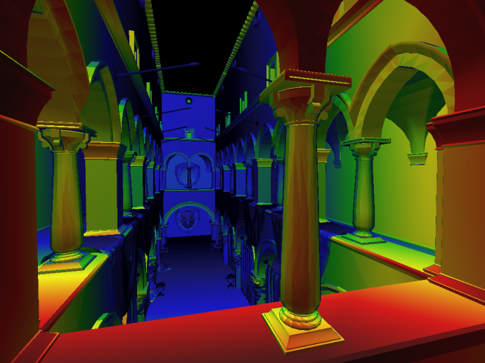

- 开销不会大很多, 游戏中很常用


- 但是在远处, 图片糊了(Overblur), 原因有: 插值与真实值的误差, mipmap取的是一个**方块**的平均值, 如果不是方块那就没办法了

#### Anisotropic Filtering

> 各向异性过滤


<center><small>Ripmaps(水平竖直压扁) and summed area tables</small></center>

- mipmap都是等比例缩放的, 也就是只计算了上图中对角线部分. 各向异性过滤过滤会多很多不等比例的缩放, 不用限制在正方形区域内
- Diagonal footprints still a problem

- Can look up axis-aligned rectangular zones. 如果是垂直压扁的图, 那么压扁的图的一个方格其实代表了压扁前的原图的一个长方形区域. 
- 从上图中可以看出, 开销是原来的三倍(原图只占了1/4)


- mipmap把上图中的长方形也用方格框起来, 因为取的是最长的距离作为方格的边长, 所以会框出上图中的红色区域, 再取个平均, 糊得就很厉害
- 各向异性过滤对矩形能够很好地框起来, 但是如果是斜着的矩形依然不好框

#### EWA filtering


- Use multiple lookups
- Weighted average
- Mipmap hierarchy still helps
- Can handle irregular footprints

### Texture Application

纹理不局限于图像，它还有很多应用，比如：

- Environment lighting 环境光照
- Store microgeometry 
- Procedural textures
- Solid modeling
- Volume rendering
- ......

#### Environment lighting 

犹他茶壶


##### Spherical Map


spherical map problem

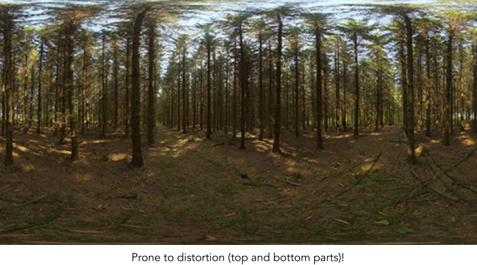


##### Cube Map

> A vector maps to cube point along that direction. 
>
> The cube is textured with 6 square texture maps.


但是需要先计算在哪一个面

#### Bump Mapping

> 凹凸贴图 法线贴图

- Adding surface detail without adding more triangles

- Perturb surface normal per pixel (for shading computations only) 扰动法线

- “Height shift” per texel defined by a texture **纹理定义的任何一个点相对法线方向的高度移动**. 通过改变高度来改变法线. 高度变了, 计算出来的法线就跟着变了,  着色也会变, 从而欺骗人眼, 让人以为有凹凸(height->normal->shading)

  

  (黑色线为原本物体的表面)

  

##### Perturb the normal in flatland

> 计算法线的变化

1. Original surface normal n(p) = (0, 1)  原来的法线是垂直向上的

2. Derivative at p is dp = c * [h(p+1) - h(p)]  p点的导数是相邻两个点的高度差除以距离1. c是一个常数, 定义凹凸贴图的影响程度

3. Perturbed normal is then n(p) = **(-dp, 1)**.normalized() 导数逆时针旋转90°得到法线, 然后归一化

   (FYI: 旋转公式$\begin{bmatrix} cos\theta & -sin\theta \\ sin\theta     & cos\theta\end{bmatrix}$ 逆时针90°就是$\begin{bmatrix} 0 & -1 \\ 1     & 0 \end{bmatrix}$ 也就是交换给y加上符号, 然后交换x, y, 所以原来的向量是(1, dp)旋转后就是(-dp, 1))

   

##### Perturb the normal in 3D

1. Original surface normal n(p) = (0, 0, 1)
2. Derivatives at p are 导数
   - dp/du = c1 * [h(u+1) - h(u)]
   - dp/dv = c2 * [h(v+1) - h(v)]
3. Perturbed normal is n = **(-dp/du, -dp/dv, 1)**.normalized()  (类比上面, 推导比较麻烦:cry:)
4. Note that this is in local coordinate!

编程：

```cpp
Vector3f n = normal;

// 第二步:
float dU = c * (texture.getColor(u + 1/w, v) - texture.getColor(u, v));  // w是纹理的宽度, 1/w是纹理宽上的单位距离, color是一个Vector3, 所以要norm()
float dV = c * (texture.getColor(u, v + 1/h) - texture.getColor(u, v));  // h是纹理的高度
```

*正规的凹凸纹理应该是只有一维参量的灰度图*

#### Displacement Mapping

> 位移贴图
>
> a more advanced approach
> - Uses the same texture as in bumping mapping
> - Actually moves the vertices


- 凹凸贴图在边缘, 以及自己的突起的投影会露馅

#### Provide Precomputed Shading

- 比如先计算好阴影


#### 3D Textures & Volume Rendering

## Shadow Mapping

- An Image-space Algorithm
  - no knowledge of scene’s geometry during shadow
  computation
  - must deal with aliasing artifacts
- Key idea:
  - the points NOT in shadow must be seen both **by the light and by the camera** 

### 步骤

1. 假设光源处有个一摄像机（虚拟的），从光源看向场景，记录能看到的任何点的深度值，也就是shadow map

   

   深度图

2. 将真正的摄像机（Eye处）看到的点p投影回虚拟摄像机的位置，以查出光源处到点的深度是多少a；计算实际上点p到光源的距离是多少b。

   - 如果 a==b，那么点p能够被光源看到
   - 如果 a<b，说明光源看不到，点p在阴影中

   

   

   - Green is where the distance(light, shading point) ≈ depth on the shadow map
   - Non-green is where shadows should be
   - 图片不是很清晰干净是因为：
     - 浮点数的判等有误差
     - 跟深度图shadow map的分辨率有关

### Problems

- Hard shadows (point lights only) 只支持点光源

  - 上图是硬阴影，下图是软阴影

    

- Quality depends on shadow map resolution (general problem with image-based techniques)  shadow map分辨率高的话开销也会很大

- Involves equality comparison of floating point depth values means issues of scale, bias, tolerance

  

# Curves & Meshes

> 几何 Geometry

## Geometry

分类

### Implicit

> 隐式

- Points satisfy some specified relationship 满足一定关系的点
  - E.g. sphere: all points in 3D, where x^2+y^2+z^2 = 1

Pros & Cons

- Pros
  - certain queries easy (inside object, distance to surface) 很容易判断点在不在面上
  - compact description (e.g., a function) 一个公式就能搞定
  - good for ray-to-surface intersection
  - for simple shapes, exact description / no sampling error
  - easy to handle changes in **topology** (e.g., fluid)
- Cons
  - difficult to model complex shapes

#### CSG

> Constructive Solid Geometry

- Combine implicit geometry via **Boolean** operations

  

#### Distance Functions

> 距离函数

Instead of Booleans, gradually blend surfaces together using Distance functions:
	giving minimum distance (could be **signed** distance) from anywhere to object 距离是点到物体表面的最短距离, 可以有符号, 比如在物体里面为负, 物体外面为正


An Example: Blending (linear interp.) a moving boundary


- A表示只遮挡了1/3, B表示遮挡了2/3, blend(A, B)应该是一个中间状态, 也就是遮挡了1.5/3 

- SDF() 表示Signed Distance Function, 在面上SDF的值为0, 离面越远, SDF的绝对值越大

- 要计算中间状态就将A, B的SDF加起来, 然后把其中SDF的值为0的部分恢复成一个面, 得到的就是中间状态

  

#### Level Set Methods

- Closed-form equations are hard to describe complex shapes. Alternative: store a grid of values approximating function


​	(使用双线性插值找到0位置)

- Surface is found where interpolated values equal zero
- Provides much more explicit control over shape (like a
  texture)

#### Fractals

### Explicit

> 显示表示

- All points are **given directly** or via **parameter mapping** 参数映射

  

  遍历uv中的每个点, 然后做变换, 就能得到想要的几何

- advantage

  - 很容易得到几何长啥样

- disadvantage

  - 很难判断点在不在面上

#### Point Clouds

> 点云

- Easiest representation: list of points (x,y,z)
- Easily represent any kind of geometry
- Useful for LARGE datasets (>>1 point/pixel)
- Often converted into polygon mesh 点转成面, 如三角形
- Difficult to draw in undersampled regions 点的密度低就不好画


#### Polygon Mesh

> 如Triangle Mesh

- Store vertices & polygons (often triangles or quads)
- Easier to do processing / simulation, adaptive sampling
- More complicated data structures
- Perhaps most common representation in graphics


#### Bezier Surfaces

> 贝塞尔面

#### Subdivision Surfaces

#### NURBS

## Curves

### Bezier curves


#### De Casteljau’s algorithm


#### Algebraic Formular


$b0$, $b1$ 线性插值得$b_0^1$ 

比如计算下图中的$b_0^2$


公式如下, 最终的公式可以看出, 只和三个控制点有关
$$
b_0^1(t) = (1-t)b_0+tb_1\\
b_1^1(t) = (1-t)b_1+tb_2\\
~\\
b_0^2(t) = (1-t)b_0^1+tb_1^1\\
~\\
b_0^2(t) = (1-t)^2b_0 + 2t(1-t)b_1 + t^2b_2
$$

##### Bernstein polynomial

$$
b^n(t)=b_0^n=\sum^n_{i=0}b_iB_i^n(t)\\
B_i^n(t)=\begin{pmatrix}
            n\\
            i
        \end{pmatrix}
        t^i(1-t)^{n-i}
$$

- $b_i$: 控制点control point, 总共有n+1个控制点(0~n)
- $b^n(t)$: Bézier curve of order n (n阶贝塞尔曲线) 在任意的时间 $t$ 都是 n+1 个控制点的线性组合, 线性组合的系数是一个与时间有关的多项式, 这个多项式就是伯恩斯坦多项式


Example:

assume $n$ = 3 (and we are in $R^3$)

we could have control points in 3D such as

$b_0$ = (0, 2, 3), $b_1$ = (2, 3, 5), $b_2$ = (6, 7, 9), $b_3$ = (3, 4, 5)
These points define a Bezier curve in 3D that is a cubic polynomial in t:

$b^n(t) = b_0 (1-t)^3 + b_1 3t(1 - t)^2 + b_2 3t^2(1 - t) + b_3 t^3$


#### Properties

- 过起点, 终点

- <u>Affine transformation</u> property: 把线上的每个点做仿射变换的结果等于将控制点做仿射变换再画线的结果, 所以可以Transform curve by transforming control points (但投影不行)
- Convex hull property 凸包性质: Curve is within convex hull of control points, 比如4个控制点, 那么画出来的曲线在这个四边形内

#### Piecewise Bézier Curves

> 分段贝塞尔曲线


##### Continuity

- $C^0$ continuity

  - 

    中间那个控制点重合

- $C^1$ continuity

  - 

    长度一样, 斜率一样(一阶导数连续)

- $C^2$ continuity 二阶导数连续

### B-splines

> 样条
>
> basis splines

[link](https://www.bilibili.com/video/av66548502?from=search&seid=65256805876131485)

## Surfaces

### Bezier surfaces

- Input: 4x4 control points

- Output is 2D surface parameterized by (u,v) in [0,1]$^2$ 

  

  

  先画出四条曲线, 再用这四条曲线上的点画线, 所有线构成面

### Triangle & quad

> 三角形和四边形

#### Mesh Subdivision

> 网格细分


- Common subdivision rule for triangle meshes: 
  1. create more triangles (vertices)
  2. tune their positions

##### Loop Subdivision

> Loop 是发明人的姓😓

triangle meshes: 

1. create more triangles (vertices): Split each triangle into four

   

2. tune their positions: assign new vertex positions according to weights, new / old vertices updated differently

   - new vertices

     Update to: $3/8 * (A + B) + 1/8 * (C + D)$

     

   - old vertices 更新老的顶点一部分要看自己原来的位置，一部分要看连接的点，如果连接的点少，那自己原来的位置的权重就要高一些，反之少一些

     Update to: $(1 - n*u) * \text{original_position} + u * \text{neighbor_position_sum}$ 

     - $n$: vertex degree 连接的点的数量, 如图中白点的degree为6
     - $u$: $3/16 \text{ if } n=3, 3/(8n) \text{   otherwise}$, (如果n=3就取3/16, 否则...)

     

   

##### Catmull-Clark Subdivision

- loop 细分只能处理三角形, 而这个算法可以处理多边形

  

- 标三角形的面是Non-quad face, 非四边形面

- 原点是奇异点Extraordinary vertex, 也就是degree != 4的点, 途中的紫色的的degree为5

- Each subdivision step 每一步细分:

  1. Add vertex in each face 取每个面的中点
  2. Add midpoint on each edge 取每条边的中点
  3. Connect all new vertices

- Non-quad face一次细分后会引入一个奇异点, 这个奇异点能让Non-quad face变成quad face

  

  


更新点(点有三种情况): 通过平均的方式来达到平滑, 类似图片的模糊

- Face point 

  $f = \frac{v1+v2+v3+v4}{4}$

- Edge point  边的中心

  $e = \frac{v1+v2+f1+f2}{4}$

- Vertex point 

  $v = \frac{f1+f2+f3+f4+2(m1+m2+m3+m4)+4p}{16}$

  - $m$: midpoint of edge
  - $p$: old "vertex point"
  - $v$: 是更新后新的点

#### Mesh Simplification

> Downsampling


##### Edge Collapse

> 边坍缩


如何确定坍缩后的新点可以使用Quadric Error Metrics（⼆次误差度量）


- Quadric error: new vertex should minimize its sum of square
  distance (L2 distance) to previously related triangle planes! 新点与相关的所有面的距离的平方和要最小（优化问题）
- 先从二次误差度量最小的点开始坍缩。因为坍缩后会使这个点旁边的点的二次误差度量也发生变化，所以每一次坍缩后都要更新一下周边的点的二次误差度量，然后再取最小的进行坍缩（使用优先队列，堆）。

#### Mesh Regularization

> 正规化


# Ray Tracing

> 光线追踪

- why
  - 光栅化不能很好地表示全局效果，比如soft shadow, indirect illumination(光线弹射的多次后再进入人眼)
- 三个假设
  - Light travels in straight lines (though this is wrong)
  - Light rays do not “collide” with each other if they cross
    (though this is still wrong)
  - Light rays travel from the light sources to the eye (but
    the physics is invariant under path reversal - reciprocity).

## Reflection & Refraction

> 反射和折射


- 右边的有颜色, 说明光线被部分吸收(全吸收就是黑的), 因为颜色在球壳内

### Reflection

> Perfect Specular Reflection

- 推导 [link](https://blog.csdn.net/yinhun2012/article/details/79466517)

- 出射光线的计算方式

  

  也可以旋转方位角, 俯视图如下

  

### Refraction

> Specular Refraction

- 折射率

  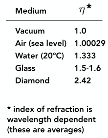

#### Snell's law

> 斯涅尔定律

- 

- 推导出射方向 [link](https://blog.csdn.net/yinhun2012/article/details/79472364)

  

  通过建立单位圆辅助计算，通过标量推导出向量的模长，然后通过向量平行和同异方向推导出向量，推出OB，推导到这里，我们就把OB的公式用cos sin以及入射光向量AO和介质法向量N来计算了，这时候我们就思考如何计算cosβ cosθ，让这两个值使用已知的n1，n2，AO，OE来替换，如下图：

  

  总结

  

#### Code

- 需要考虑光线是否在物体内
  - 如果光线在物体内：
  - 如果光线在物体外：
  
```cpp
// I 是入射光的方向, 即公式中的AO
// N 是物体表面的法向量, 即公式中的OE
// ior 是物体的折射率
Vector3f refract(const Vector3f &I, const Vector3f &N, const float &ior)
{
    float cosi = clamp(-1, 1, dotProduct(I, N));  // cosi 就是公式中的 AO·OE 这个的作用应该是把cosi的值严格限定在[-1, 1]之间吧, 防止精度损失导致大于1或者小于-1
    float n1 = 1, n2 = ior;
    Vector3f n = N;  // OE
    
    if (cosi < 0)  // 光线在外面  因为光线是从其他地方指向交点, 法向量是从交点指向其他地方, 然后你仔细想
    	{cosi = -cosi;}
    else  // 光线在里面
    	{std::swap(n1, n2); n= -N;}
    
    float eta = n1 / n2;
    float k = 1 - eta * eta * (1 - cosi * cosi);
    return k < 0 ? 0 : eta * I + (eta * cosi - sqrtf(k)) * n;
}

inline float clamp(const float& low, const float& high, const float& v)
{
    return std::max(low, std::min(high, v));
}
```

### Fresnel Reflection

> 菲涅耳反射


- [link](https://zhuanlan.zhihu.com/p/144403005)

- 折射的代码中要对k开根号, 其实k有可能是负的. 如果从一个折射率大的空间折射入一个折射率小的空间, 折射角度会变大, 且n1/n2 > 1, 要是入射的 θ 足够大, 1-cos$^2$θ 就会接近1, 那么此时k就是负的, **这意味着此时没有折射项, 所有的光线都被反射, 也就是全反射现象**

- 下图展示了光线从空气射向不同材质时的菲涅耳反射比(来自 Akenine-Möller, Tomas, Eric Haines, and Naty Hoffman. *Real-time rendering,* Third Edition. CRC Press, 2008.  P. 233)

  

  - $R_F$: 菲涅耳反射比, 为1时表示全都反射没有折射(透射)
  - 横轴是入射角, 当入射角 接近90°的时候, 无论什么材质反射比都趋向于1
  - 另外，导体（conductor）和半导体（semiconductor）的菲涅耳方程会更复杂一些，而且不同波长的影响较大（上图中红色和紫色曲线分别对应 RGB 三种波长）。导体在垂直看的时候也是反射很多. 

#### Fresnel equation

> 描述光线经过两个介质的界面时, 反射和折射的光强比重
>
> [Milo_Yip_菲涅耳方程](https://zhuanlan.zhihu.com/p/31534769)


- $R$ 为反射比, 因能量守恒，透射比为 $T=1-R$ 

  
  
  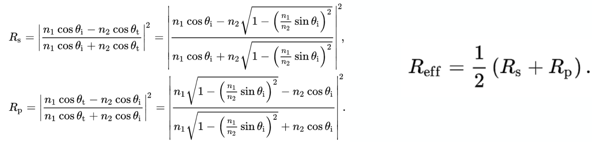

#### Code

```cpp
// [comment]
// Compute Fresnel equation
// \param I is the incident view direction
// \param N is the normal at the intersection point
// \param ior is the material refractive index
// [/comment]
float fresnel(const Vector3f &I, const Vector3f &N, const float &ior)
{
    float cosi = clamp(-1, 1, dotProduct(I, N));
    float etai = 1, etat = ior;
    if (cosi > 0) { std::swap(etai, etat); }
    
    // Compute sini using Snell's law
    float sint = etai / etat * sqrtf(std::max(0.f, 1 - cosi * cosi));
    
    // Total internal reflection
    if (sint >= 1) {
        return 1;
    }
    else {
        float cost = sqrtf(std::max(0.f, 1 - sint * sint));  // 出射角cos
        cosi = fabsf(cosi);
        float Rs = std::pow(((etai * cosi) - (etat * cost)) / ((etai * cosi) + (etat * cost)), 2);
        float Rp = std::pow(((etai * cost) - (etat * cosi)) / ((etai * cost) + (etat * cosi)), 2);
        return (Rs + Rp) / 2;
    }
    // As a consequence of the conservation of energy, transmittance is given by:
    // kt = 1 - kr;
}
```

### Schlick approximation


- 90°的时候等于1
- 不管是导体还是绝缘体都可以使用

## Recursive Ray Tracing

> Recursive (Whitted-Style) Ray Tracing
>
> 这个是 Whitted style ray tracing


- 如果光源能够照亮每一个弹射的点(图中黑点), 就把这些点的着色值都加起来作为那个像素的值
- primary ray: 也就是eye ray, 眼睛打出来的光线
- secondary ray: eye ray 弹射的光线 (图中非eye ray的蓝线)
- eye-tracing: 从相机处连一根光线到物体, 最后到光源, 而不是反过来从光源到相机

## Ray-Surface Intersection

### Ray Equation

> Ray is defined by its origin and a direction vector 是一根射线
>
> 

$$
\bold{r}(t) = \bold{o} + t\bold{d} \quad 0\leq t\leq \infty
$$

- $\bold{r}$: point along ray, (vector)
- $t$: "time"
- $\bold{o}$: origin 起点
- $\bold{d}$: (normalized) direction

### Plane Equation

> Plane is defined by normal vector and a point on plane
>
> 

Plane Equation (if $\bold{p}$ satisfies it, then $\bold{p}$ is on the plane):
$$
\bold{p}: (\bold{p}-\bold{p'})\cdot \bold{N} = 0
$$

- $\bold{p}$: all points on plane
- $\bold{p'}$: one point on plane
- $\bold{N}$: normal vector

### With Plane


### With Implicit Surface

> 光线和隐式平面的交点

- Ray: $\bold{r}(t) = \bold{o} + t\bold{d} \quad 0\leq t\leq \infty$

- General implicit surface: $\bold{p}: f(\bold{p}) = 0$  (比如圆的话就是 $\bold{p}: (\bold{p}-\bold{c})^2 - R^2 = 0$)

  

有没有交点就看有没有点同时满足光线和平面两条等式, 比如圆就是求解$(\bold{o} + t\bold{d} - c)^2 - R^2 = 0$, 如果求出来有两个$t$, 那么代入 Ray Equation 就能得到两个点的坐标

### With Triangle Mesh

> 光线和显式平面之三角形 mesh 的交点


- Why
  - Rendering: visibility, shadows, lighting …
  - Geometry: inside/outside test 可以判断点在物体内还是外 (连接光线和点, 如果穿过物体表面奇数次, 那么点在物体里面; 如果偶数次, 点在物体外面. 光线在物体外?)
- 算和Triangle Mesh的交点其实就是算和Mesh中每个三角形的交点

### With Triangle

- 看光线与三角形是否有交点的最基本思想
  1. Ray-plane intersection 光和三角形所在平面有没有交点 (*With plane* 在上面)
  2. Test if hit point is inside triangle 如果有交点, 这个交点是否在三角形内

#### Möller Trumbore Algorithm


- 如果光线和三角形的交点在三角形内，那就一定可以用重心坐标表示，就有解
- $t, b_1, b_2$共三个未知数, $\bold{O}, \bold{D}, \bold{P_0}, \bold{P_1}, \bold{P_2}$ 是3*1的向量, 所以可以解方程 (克拉默法则)
- 解出来后看$t$是否是正的, 看$b_1, b_2, 1-b_1-b_2$是否也是正的, 保证在三角形内部

### Accelerating

- why
  - 每个三角形去求交点太慢!

#### Bounding Volumes

> 类似包围盒 Bounding Box

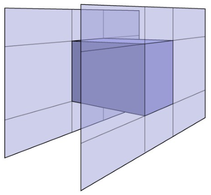

- often use an **Axis-Aligned Bounding Box (AABB)** (轴对齐包围盒) (i.e. any side of the BB is along either x, y, or z axis)

  - 轴对齐的计算量少

    

    计算光打到平面的时间t只需要计算p点和o点x坐标值的差除以d在x轴的分量

##### 工作方式

- Compute intersections with slabs and take intersection of t_min/t_max intervals (slabs是指和轴平行且过立方体面的无限大的平面)
- 2D example; 3D is the same!


- 求靠左的两个线段的**交集**就可以得出右边的线段(光线进入盒子和离开盒子的时间)
- Recall: a box (3D) = three pairs of infinitely large slabs 三对平行于坐标轴的大平面围成一个立方体
- Key ideas
  - The ray enters the box **only when** it enters all pairs of slabs  光线在一对slab之间就算进入这对slab
  - The ray exits the box **as long as** it exits any pair of slabs 光线只要离开任何一对slab就算离开了这个box
- For each pair, calculate the t_min and t_max (negative is fine)
- For the 3D box, t_enter = **max**{t_min}, t_exit = min{t_max}
- <u>Ray and AABB intersect iff: t\_enter < t\_exit && t_exit >= 0</u>
  - if t_exit < 0: The box is “behind” the ray — no intersection!
  - if t_exit >= 0 and t_enter < 0: The ray’s origin is inside the box — have intersection!

#### Uniform Spatial Partitions

> Gribs

##### 工作方式

1. Find bounding box 找到能包围所有物体的大盒子

2. Create grid 大盒子分成小盒子

   - 分太密太稀疏都不行, 和物体的数量有关

3. Store each object in overlapping cells

  

4. Step through grid in ray traversal order. 从光线进入的grib开始, 跟据光线的朝向去看看周围的grib有没有交点来判断光线下一个进入哪个grib

   For each grid cell: Test intersection with all objects stored at that cell. 

   

#### Spatial Partitions

- why
  - Grids work well on large collections of object that are distributed evenly in size and space 物体在空间中分布均匀的时候用Uniform spatial partitions 效果不错, 但是如果类似 “Teapot in a stadium” 就不合适

##### Oct-Tree

> 八叉树
>
> 

- 把立方体切成8块
- 维度高的时候就成了2^n叉树了

##### KD-Tree

> 


Data Structure

- Internal nodes store
  - split axis: x-, y-, or z-axis 当前是沿哪个轴划分的
  - split position: coordinate of split plane along axis 划分的位置
  - children: pointers to child nodes 
  - No objects are stored in internal nodes
- Leaf nodes store
  - list of objects

##### BSP-Tree

> 

- 三维的话需要一个平面来划分, 高维的话需要超平面

#### Object Partitions

> Object Partitions & Bounding Volume Hierarchy (BVH)

- Why
  - Spatial Partitions 要求交包围盒和三角形. 这个的话一个三角形只能出现在一个包围盒中


##### 工作方式

1. Find bounding box
2. **Recursively** split set of objects in two subsets 递归地把包围盒内的物体分成两部分
   - subdivide a node
     - Always choose the longest axis in node 沿着最长的轴分成两部分
     - Split node at location of **median** object 1~n个三角形的话在1/2 n处分成两部分, 保证数量相当, 二叉树比较平衡些
     - ...
3. Recompute the bounding box of the subsets 
4. Stop when necessary
5. Store objects in each leaf node

- Termination criteria: for example, stop when node contains few elements


### Code

#### 方向的表示

[Ray-Tracing: Generating Camera Rays](https://www.scratchapixel.com/lessons/3d-basic-rendering/ray-tracing-generating-camera-rays/generating-camera-rays?http://www.scratchapixel.com/lessons/3d-basic-rendering/computing-pixel-coordinates-of-3d-point?)

- 通常相机放在原点, 朝向-z(RenderMan, Maya, PBRT and OpenGL都是这样), image plane(见图中) is often placed exactly 1 unit away from the camera's origin, 也就是(0, 0, -1)

  


- 从相机连一根光线到像素的中心

- 坐标变换(遍历每一个像素的时候是从左上角到右下角, 也就是左上角是(0,0), 要变换成最下面[-1:1]的形式)

  

  Converting the coordinate of a point in the middle of a pixel to world coordinates requires a few steps. The coordinates of this point are first expressed in raster space (the pixels coordinate plus an offset of 0.5), then converted to NDC(Normalized Device Coordinates) space (the coordinates are remapped to the range [0,1]) then converted to screen space (the NDC coordinates are remapped to the [-1,1]). Applying the final camera-to-world transformation 4x4 matrix transform the coordinates in screen space to world space.

- 公式

  

  - 如果宽高比是1.4的话, 那么变换后y范围是[-1,1], x的范围是[-1.4, 1.4] (more generally [-aspect ratio, aspect ratio])

## Radiometry

> 辐射度量学

### Radiant Energy

> 能量
>
> 

### Radiant Flux

> 单位时间能量
>
> 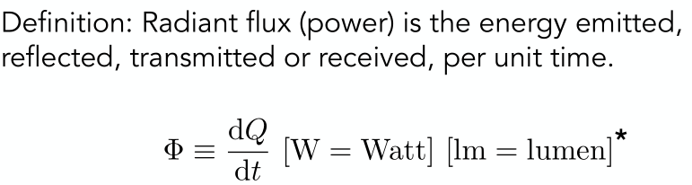

### intensity

> Radiant Intensity
>
> 能量每立体角 与半径无关
>
> 
>
> 
>
> 
>
> - The candela is one of the seven SI base units. intensity的单位, 标准单位制中的单位

#### Solid angle

- **Solid angle** $Ω$: ratio of subtended area on sphere to radius squared 覆盖半球表面区域的面积除以半径的平方

  - $Ω = \frac{A}{r^2}$, sphere has $4\pi$ steradians

    
  
- **Angle** $\theta$: ratio of subtended arc length on circle to radius

  - $\theta = \frac{l}{r}$, circle has $2\pi$ radians 

    

#### Differential Solid Angles

> 单位立体角


- 圆上的单位面积大小: 
  $$
  dA = (r\>d\theta)(rsin\theta\> d\phi) = r^2sin\theta\>d\theta d\phi
  $$

  - FYI: 弧长等于半径乘圆心角度数(弧度制)

- 单位立体角: 
  $$
  d\omega = \frac{A}{r^2}=sin\theta d\theta d\phi
  $$

  - 有$sin\theta$, 可以看出不是在球面上均匀变化

- 整个球的立体角

  

- 所有方向的单位立体角的强度Intensity积分起来得到能量, 如果是Isotropic Point Source 均匀辐射能量的点光源: , 它的intensity就是, 能量去除以立体角

### irradiance

> 接受的能量 
>
> The irradiance is the power per unit area incident on a surface point.
>
> 
>
> 

- 和角度, 距离有关, 在布林冯模型有
- 如果 light is emitting power in a uniform angular distribution 光线均匀辐射， 球面上点的能量是

### radiance

> power **per unit solid angle**, **per projected unit area** 
>
> 能量每单位立体角，单位面积
>
> 
>
> 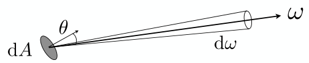
>
> 比如这个灰色面积朝某个方向辐射的能量，与面积，方向有关。
>

$$
L(p, \omega) ≡ \frac{d^2\varPhi(p, \omega)}{d\omega    \;dAcos\theta}
$$

- 两次积分 ($cos\theta$应该是光线和平面法向量的夹角, 详见布林冯模型)
- ≡: 恒等于
- $p$: power
- $\omega$: 立体角


与 intensity 和 irradiance的联系：

- Recall

  - Irradiance: power per projected unit area 能量每单位面积, <u>考虑来自任何方向的能量; radiance只考虑一个方向进来的能量</u>
  - Intensity: power per solid angle 能量每立体角, 

- So

  - Incident Radiance 进来的光: Irradiance per solid angle 每单位立体角的能量进入到每单位面积 
    $$
    L(p, \omega) = \frac{dE(p)}{d\omega \;\cos\theta}
    $$

  - Exiting Radiance 辐射出去的光: Intensity per projected unit area 每单位面积的能量辐射到每单位立体角
  $$
    L(p, \omega) = \frac{dI(p, \omega)}{dA\;cos\theta}
  $$


Irradiance vs. Radiance

- Irradiance: total power received by area dA

- Radiance: power received by area dA from “direction” dω

- 

  irradiance 是各个方向的能量积分起来

## BRDF

> Bidirectional Reflectance Distribution Function
>
> 双向反射分布函数
>
> 光线从一个方向进来, 反射到其他地方的方程

### Reflection

1. Radiance from direction $\omega _i$ turns into the power E that $dA$ receives

   Differential **irradiance** incoming 吸收能量(考虑的是单位面积): 
   $$
   dE(\omega_i) = L(\omega_i)\>cos\theta_i\>d\omega_i
   $$

2. Then power $E$ will become the radiance to any other direction $ω$ 辐射能量

   Differential radiance exiting (due to $dE(\omega_i)$): 
   $$
   dL_r(\omega_r)
   $$

   - ?

The BRDF represents how much light is reflected into each outgoing direction from each incoming direction 

每个出射方向的radiance除以图中方格接收到的irradiance, 得到一个比例. 简单说就是光线打进来, 然后又辐射出去后的一个能量分布,  这就是BRDF. (如果是漫反射, 那就是均等分布)


$$
f_r(\omega_i\to \omega_r) = \frac{dL_r(\omega_r)}{dE_i(\omega_i)} = \frac{dL_r(\omega_r)}{L_i(\omega_i)\>cos\theta_i\>d\omega_i}
$$

### Reflection Equation

> 反射方程

$$
L_r(p, \omega_r) = \int_{H^2} f_r(\omega_i\to \omega_r) \; L_i(\omega_i)\>cos\theta_i\>d\omega_i
$$

- $\omega_i$: 光线入射的方向
- $d\omega_i$: 入射光线的立体角的微元面积(也就是无穷小的面积, 即单位面积), 积分后就是整个半球的面积
- $L_i(\omega_i)$: Incident Light (from light source) 入射光, 准确的说是入射光线单位面积光通量
- $L_i(\omega_i)\>d\omega_i$: 积分后表示每个方向入射的光
- $L_i(\omega_i)\>cos\theta_i\>d\omega_i$: 小方块收到的 irradiance
- $f_r(\omega\to \omega_r)$: BRDF 这个光对出射的贡献率, 其实也是入射光线和出射光线亮度的反射比例系数
- $ f_r(\omega_i\to \omega_r) \; L_i(\omega_i)\>cos\theta_i\>d\omega_i$: irradiance × BRDF 就是出射的 radiance 
- $H^2$: 表示半球, 来自半球下面的光不考虑
- $\int_{H^2}$: 将所有入射对出射的贡献积起来
- 整个积分要表达的意思就是在单位半球表面收集所有方向的入射光线亮度和面积信息以及对应的反射系数，用这些参数在半球表面的作积分。
- [link](https://zhuanlan.zhihu.com/p/21489591)


- 入射方向 -> 着色点 -> 出射方向


困难: Reflected radiance depends on incoming radiance, but incoming radiance depends on reflected radiance. 这个点接收光, 又辐射光, 辐射的光可能被其他点接收. 这是一个递归的过程

### Rendering Equation

> 渲染方程
>
> 所有限制于物体表面的光线传播都满足

Adding an Emission term to make *Reflection Equation*  general
$$
L_r(p, \omega) = L_e(p, \omega_r) + 
\int_{\varOmega+}
f_r(p, \omega_i, \omega_r)\; 
L_i(p, \omega_i)\;
(n\cdot\omega_i)\;
d\omega_i
$$

- $L_r(p, \omega)$: Reflected Light (Output Image)

- $L_e(p, \omega_o)$: Emission, 物体自己产生的光

- **NOTE**: 假设所有光都向外, 也就是从球心指向外面(即使是入射进来的)

- $\varOmega+$: 表示上半球

  
  
- [link](https://zhuanlan.zhihu.com/p/21489591)

#### 全局光照

- 如果多个光源, 将多个光源的结果加起来

  

- 如果有面光源, 把面光源当成很多点光源的集合(积分)

  

- 如果有其他物体反射过来光, 把其他物体当作光源

  

  (因为方向相反, 所以$\omega_i$带了负号)

- 给式子做一个简写

  

  - 方框中是已知的, 可以定义物体的材质是glossy, 还是diffuse的...
  - 未知的是物体反射出去的radiance

- 消除递归

  

  - $I$: 为单位矩阵

- 全局光照

  

  - Shading in Rasterization 光栅化就是 $L= E+KE$, 也就是光源直接到眼睛 + 一次弹射

## Path Tracing

- why

  - Whitted-style ray tracing:
    - Always perform specular reflections / refractions

    - Stop bouncing at diffuse surfaces 如左图所示，天花板都是黑的

      

### 求解反射方程

#### 1st step

> 不考虑物体发光
>
> 只考虑直接光照

使用蒙特卡洛
$$
\begin{equation}
\begin{split}

L_r(p, \omega_r)

&= 
\int_{\varOmega+}
f_r(p, \omega_i, \omega_r)\; 
L_i(p, \omega_i)\;
(n\cdot\omega_i)\;
d\omega_i
\\
&\approx 
\frac{1}{N}\sum ^N_{i=1}
\frac
	{
        f_r(p, \omega_i, \omega_r)\; 
        L_i(p, \omega_i)\;
        (n\cdot\omega_i)\; 
	}
	{
		p(\omega_i)
	}
	
\end{split}
\end{equation}
$$

- assume uniformly sampling the hemisphere均匀采, 那么PDF is $p(\omega_i) = 1/2 \pi$
- 在半球上均匀地取入射方向

着色代码

```cpp
shade(p, wo)
	Randomly choose N directions wi~pdf // 采N个不同的方向
	Lo = 0.0  // 初始化结果
	For each wi
		Trace a ray r(p, wi)  // 打出一根光线
		If ray r hit the light  // 如果光线打到光源
			Lo += (1 / N) * L_i * f_r * cosine / pdf(wi)
		
	Return Lo
```

#### 2nd step

> 全局光照
>
> 考虑间接光照


```cpp
shade(p, wo)
	Randomly choose N directions wi~pdf // 采N个不同的方向
	Lo = 0.0  // 初始化结果
	For each wi
		Trace a ray r(p, wi)  // 打出一根光线
		If ray r hit the light  // 如果光线打到光源
			Lo += (1 / N) * L_i * f_r * cosine / pdf(wi)
		Else If ray r hit an object at q
			Lo += (1 / N) * shade(q, -wi) * f_r * cosine / pdf(wi)  // 递归调用shade, Q点的直接光照的结果作为P点的入射光照, 方向相对来说相反, 因为都假设光线朝外(见上面)
	Return Lo
```

#### 3rd step

- why
  1. 如果采样100个角度, 也就是打出100根光线, 那么如果打到一个物体, 那又得采样100个角度, 再打出100根光线, 指数爆炸. 解决方法: N取1, 只用1根光线
  2. 递归停不下来. 如果限制在一定次数, 那么会有能量损失. 解决方法 RR

```cpp
shade(p, wo)
	Randomly choose ONE direction wi~pdf(w)
	Trace a ray r(p, wi)
	If ray r hit the light
		Return L_i * f_r * cosine / pdf(wi)
	Else If ray r hit an object at q
		Return shade(q, -wi) * f_r * cosine / pdf(wi)
```

##### Problem 1

- N取1, 那一根光线结果会不会太noisy? 

  

渲染图片代码

```cpp
ray_generation(camPos, pixel)
	Uniformly choose N sample positions within the pixel // 在像素内均匀地取不同位置
	pixel_radiance = 0.0
	For each sample in the pixel
		Shoot a ray r(camPos, cam_to_sample)  // 从摄像机位置连光线到样本
		If ray r hit the scene at p  // 打到p点, 算p点着色
			pixel_radiance += 1 / N * shade(p, sample_to_cam)  // 出射方向变成了从sample到camera
	Return pixel_radiance
```

##### Problem 2

Russian Roulette (RR)

- Previously, we always shoot a ray at a shading point and get the shading result **Lo**
- Suppose we manually set a probability P (0 < P < 1) 有时候打光线有时候不打
  - With probability <u>P</u>, shoot a ray and return the **shading result divided by P: Lo / P**  打光线的话, 结果除以P
  - With probability <u>1-P</u>, don’t shoot a ray and you’ll get **0** 
- In this way, you can still **expect** to get Lo!:
  E = P * (Lo / P) + (1 - P) * 0 = Lo  期望并没有变

```cpp
shade(p, wo)
    Manually specify a probability P_RR
    Randomly select ksi in a uniform dist. in [0, 1]
    If (ksi > P_RR)  // 递归退出 
    	return 0.0;

    Randomly choose ONE direction wi~pdf(w)
    Trace a ray r(p, wi)
    If ray r hit the light
    	Return L_i * f_r * cosine / pdf(wi) / P_RR
    Else If ray r hit an object at q
	    Return shade(q, -wi) * f_r * cosine / pdf(wi) / P_RR
```

#### 4th step

- why

  - 不够高效, 如果光源很小的话, 从物体均匀地打出光很难打中光源

    

    A lot of rays are “wasted” if we uniformly sample the hemisphere at the shading point.

    解决方法: 在光源上采样 Monte Carlo methods allows any sampling methods, so we can sample the light (therefore no rays are “wasted”)

因为是在x上采样(采不同的立体角), 所以就得在x上积分, 要对光源进行采样, 就得做一些改写


- $dA$: 光源表面

- $d\omega$: $dA$投射到单位圆的立体角大小
  $$
  d\omega = \frac{dA\;cos \theta '}{||x'-x||^2}
  $$

  - $dA\;cos \theta '$: 表示正对单位圆的有效面积
  - 除以$||x'-x||^2$: 可以参见立体角定义


(针对直接光照的哦)
$$
\begin{equation}
\begin{split}

L_r(p, \omega_r)

&= 
\int_{\varOmega+}
f_r(p, \omega_i, \omega_r)\; 
L_i(p, \omega_i)\;
cos\theta\;
d\omega_i
\\
&=
\int_{A}
f_r(p, \omega_i, \omega_r)\; 
L_i(p, \omega_i)\;
cos\theta \frac{cos \theta'}{||x'-x||^2}dA
\\
&\approx 
\frac{1}{N}\sum ^N_{i=1}
\frac
	{
        f_r(p, \omega_i, \omega_r)\; 
L_i(p, \omega_i)\;
cos\theta \frac{cos \theta'}{||x'-x||^2}dA
	}
	{
		p(\omega_i)
	}

	
\end{split}
\end{equation}
$$

- 改成对光源采样, 对光源积分
- 对光源均匀采样, 那么PDF就是 1/A 咯

##### 总结

Previously, we assume the light is “accidentally” shot by uniform hemisphere sampling

Now we consider the radiance coming from two parts:

1. light source (direct, no need to have RR)  直接光照无需RR
2. other reflectors (indirect, RR)

```cpp
shade(p, wo)
	// Contribution from the light source.
	Uniformly sample the light at x’ (pdf_light = 1 / A)
	L_dir = L_i * f_r * cos θ * cos θ’ / |x’ - p|^2 / pdf_light
    
	// Contribution from other reflectors.
	L_indir = 0.0
	Test Russian Roulette with probability P_RR  // 如果通过RR, 计算这根光 
	Uniformly sample the hemisphere toward wi (pdf_hemi = 1 / 2pi)
	Trace a ray r(p, wi)
	If ray r hit a non-emitting object at q  // q点不能是光源, 光源的贡献上面已经计算
		L_indir = shade(q, -wi) * f_r * cos θ / pdf_hemi / P_RR
    
	Return L_dir + L_indir
```

#### 5th step

- why
  - 万一物体和光源之间有东西挡住呢. 解决方法: 从物体打一根光线, 如果能到光源, 就可以

```cpp
shade(p, wo)
	// Contribution from the light source.
	Uniformly sample the light at x’ (pdf_light = 1 / A)
    Shoot a ray from p to x’
    If the ray is not blocked in the middle
        L_dir = L_i * f_r * cos θ * cos θ’ / |x’ - p|^2 / pdf_light
    
	// Contribution from other reflectors.
	L_indir = 0.0
	Test Russian Roulette with probability P_RR  // 如果通过RR, 计算这根光 
	Uniformly sample the hemisphere toward wi (pdf_hemi = 1 / 2pi)
	Trace a ray r(p, wi)
	If ray r hit a non-emitting object at q  // q点不能是光源, 光源的贡献上面已经计算
		L_indir = shade(q, -wi) * f_r * cos θ / pdf_hemi / P_RR
    
	Return L_dir + L_indir
```

#### more

- Uniformly sampling the hemisphere
  - How? And in general, how to sample any function?
  (sampling)
- Monte Carlo integration allows arbitrary pdfs
- What's the best choice? (importance sampling)
- Do random numbers matter?
  - Yes! (low discrepancy sequences)
- I can sample the hemisphere and the light
  - Can I combine them? Yes! (multiple imp. sampling)

- The radiance of a pixel is the average of radiance on all paths  passing through it 从一个像素打出去的光线的权重是否一样，从像素中心打出去的光线的权重是不是应该高一些
  - Why? (pixel reconstruction filter)
- Is the radiance of a pixel the color of a pixel?
  - No. (gamma correction, curves, color space) 算出来的radiance不是颜色，需要伽马矫正
- Asking again, is path tracing still “Introductory”?
- This time, yes. Fear the science, my friends.

# Materials & Appearances

- 在渲染方程(rendering equation)中的BRDF决定了物体的材质是什么, 因为BRDF决定了光如何被反射

  **Material == BRDF**

## Diffuse Material

> Diffuse / Lambertian Material

- 假设物体不发光, 不吸收光, 入射和出射的irradiance相等, 且radiance都是uniform(均匀)的, 那么入射光的radiance和出射光的radiance是一样的

  因为能量守恒, 有

  
  - 入射的radiance($L_i$)是常数, BRDF($f_r$)也是常数, 提到外面

  - $\int_{H^2} cos\theta_i\>d\omega_i = \int_{0}^{2\pi}\int_0^{\frac{\pi}{2}} cos\theta_isin\theta_id\theta d\phi$

    1. $\int_0^{\frac{\pi}{2}} cos\theta_isin\theta_id\theta = \frac{1}{2}\int_0^{\frac{\pi}{2}} 2sin\theta_icos\theta_id\theta = \frac{1}{2}[sin^2(\frac{\pi}{2}) - sin^2(0)] = \frac{1}{2}$
       - $2sin\theta cos\theta = sin(2\theta)$ 
       - $(sin^2\theta)' = sin(2\theta)$

    2. $\int_{H^2} cos\theta_i\>d\omega_i = \frac{1}{2}\int_{0}^{2\pi} d\phi = \pi$

  - 能量守恒, 要使入射等于出射, $f_r$只能是$\frac{1}{\pi}$

  - $\rho$: albedo, 反射率, 材质颜色, [0, 1] 可以是单通道, 也可以是多通道的

  - (可以参见solid angle, rendering equation)

  - [link](https://zhuanlan.zhihu.com/p/21489591)


## Microfacet Material


- 从<u>近处</u>看有不同的<u>几何</u>, 从<u>远处</u>看几何会消失, 变成<u>材质</u>
  - Macroscale: flat & rough 从远处看是一个粗糙(材质粗糙)的平面
- Microscale: bumpy & specular 从近处看是一个表明是凹凸不平的, 每一个小的表面的微元是镜面的

### BRDF

$$
f(\bold{i},\bold{o}) = \frac
{\bold{F}(\bold{i},\bold{h})\;
 \bold{G}(\bold{i},\bold{o},\bold{h})\;
 \bold{D}(\bold{h})}
{4(\bold{n}, \bold{i})(\bold{n}, \bold{o})}
$$

- $\bold{F}(\bold{i},\bold{h})$: Fresnel term 反射程度, 反射能量的多少

- $ \bold{G}(\bold{i},\bold{o},\bold{h})$: shadowing-masking term 几何项 光比较和平面平行地打进来的时候(grazing angle), 会发生自遮挡, 自投影, 这一项就是为了修正grazing angle的, 不然渲染球的时候, 球的边界会很亮

- $ \bold{D}(\bold{h})$: distribution of normals 法线分布

  - 

    光滑的表明法线集中, 粗糙的表明反之

- $\bold{h}$: 是half vector

  

## Isotropic / Anisotropic Materials

### BRDF

- 如果$f_r(\theta_i, \phi_i, \theta_r, \phi_r) \neq f_r(\theta_i, \theta_r, \phi_r-\phi_i)$, 也就是在方位角上旋转得到的BRDF不一样, 那就是各向异性 [link 61:30](https://www.bilibili.com/video/BV1X7411F744?p=17)

- 
  - 各向同性的法线分布均匀

## Properties of BRDFs

- Reciprocity principle 可逆性

  

- Energy conservation 能量守恒

  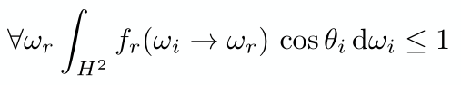

- Isotropic vs. anisotropic

  

  - 如果是各向同性材质, 那BRDF只和相对的方位角($\phi_r - \phi_i$)有关, 因为不管怎么旋转, $\phi_r - \phi_i$都一样. 那么原来四维现在只要三维就够了. 
  - 因为可逆性, 交换入射光和出射光结果不变, 所以绝对值号也可以省了

## Measuring BRDFs

## Appearance Modeling

外观就是材质, 材质就是BRDF

### Non-Surface  Models

#### Participating Media

> 散射介质 参与介质

- fog
- cloud
- Phase Function 


# Light

## The Plenoptic Function

> 全光函数
>
> the set of all things that we caan ever see


- Can reconstruct every possible view, at every moment, from every position, at every wavelength($\lambda$)
- completely captures our visual reality

## Light Field

>也叫Lumigraph
>
>在任何一个位置, 往任何一个方向, 发射出的光的强度
>
>

- 光场是全光函数的一部分, 只有位置(二维, 三维物体的表面用二维的平面就能表示, texture mapping)和方向(二维, $\theta, \phi$)

- 由于我们看一个三维的物体其实也只是看他发出的光映射到我们视网膜上的二维图像, 所以如果是二维的平面能发出一样的光其实也是一样的.

- 可以把物体抽象成一个立方体

  

  只要它发出的光和原来的物体一样, 那在眼睛看来就是一样的, 而不用去管盒子里是什么

- 光线可以用一个原点和方向来表示

  

  也可以用两个点带上正负号来表示

  

  

- 

  - 物体在st右边

  - (a)是从uv连线到st, 所以得到的是从一个角度看物体的一张物体的图像 (右上的图); 从不同的角度看物体得到的所有图像就是光场 (中上的图)

    

    每个相机的位置就是uv上的点, 从uv上一个点连到所有st上的点就是一个相机拍出来的图像

  - (b)是从st连线到uv, 得到的是从不同的角度看物体同一个位置的图像(就是盯着一个点, 然后改变自己的位置看到的) (右下的图)

## Light Field Camera


- 普通的摄像机会把成像平面放在图中黄色透镜的位置, 也就是将来自不同方向的光(irradiance)给平均起来, 得到一个个像素. 但是光场摄像机在原本像素的位置放置了一个个微透镜, 透镜可以将来自不同方向的光分散到不同的方向上去, 分开后再成像
- 黄色透镜左边的那部分其实就是一个光场

光场摄像机拍出来的原始图片(可以放大看看🔍)


- Each pixel (irradiance) is now stored as a block of pixels (radiance), 原本的一个像素现在是一个圆, 如果将一个圆内所有的像素平均起来得到的就是普通相机拍出来的一个像素. 一个圆内部的所有像素记录的其实就是在这个位置来自不同方向的光(可以看上面Light Field的(b))
- 一个像素原本记录的irradiance被拆开, 每个方向的radiance都被分别记录


- How to get a “regular” photo from the light field photo? 从光场图片中得到普通照片
  - 每个透镜只取来自某一个方向的光, 如图得到的结果就相当于普通照相机从上面拍得到的结果
  - Essentially “moving the camera around” 所以有了光场摄像机就可以虚拟地移动摄像机的位置
- Computational / digital refocusing
  - Same idea: visually changing focal length, picking the refocused ray directions accordingly

### problems

- Insufficient spatial resolution (same film used for both spatial and directional information) 分辨率不足, 原本一个像素的信息现在需要更多的像素来记录
- High cost (intricate designation of microlenses) 
- Computer Graphics is about trade-offs

# Animation

> Simulation 模拟

## Keyframe animation

## Physical simulation

### Mass Spring System

> 质点弹簧系统


$a$ 点受到 $b$ 点的力的公式: 
$$
f_{a\to b} = k_S\frac{\bold{b}-\bold{a}}{||\bold{b} - \bold{a}||}(||\bold{b} - \bold{a}||-l)
$$

- $k_S$: 劲度系数 a spring coefficient: stiffness
- $\bold{b}-\bold{a}$: 两个都是向量, 所以即表示长度又表示方向
- $\frac{\bold{b}-\bold{a}}{||\bold{b} - \bold{a}||}$: 力的方向
- $||\bold{b} - \bold{a}||-l$: 弹簧形变长度

还需要摩擦力, 不然弹簧会一直运动下去, 摩擦力公式: 
$$
f_b = -k_d\frac{\bold{b}-\bold{a}}{||\bold{b} - \bold{a}||}\cdot(\bold{\dot{b}} -\bold{\dot{a}})\cdot\frac{\bold{b}-\bold{a}}{||\bold{b} - \bold{a}||}
$$

- $-$: 负号表示力的方向是和速度方向相反的
- $k_d$: damping coefficient
- $\bold{\dot{b}}$: $\bold{b}$ is vector fot the position of a point of interest.  $\bold{\dot{b}}$ 是 $\bold{b}$ 的一阶导数, 也就是速度 ($\bold{\ddot{b}}$ 则表示二阶导数, 即加速度)
- $(\bold{\dot{b}}-\bold{\dot{a}})$: 要考虑的是$\bold{b}$和$\bold{a}$的相对速度, 因为弹簧可能作为一个整体一起运动. 
- $\frac{\bold{b}-\bold{a}}{||\bold{b} - \bold{a}||}\cdot(\bold{\dot{b}}-\bold{\dot{a}})$: Relative velocity projected to the direction from a to b (scalar) 只取沿力方向的速度
- $\frac{\bold{b}-\bold{a}}{||\bold{b} - \bold{a}||}$: 方向


应用

- 布

  

### Particle Systems

> 粒子系统

先模拟后渲染, 先模拟例子怎么运动的, 再根据需要渲染成水或沙子

## Kinematics

> 运动学

## Rigging

- 加控制点

# Real-time Rendering Pipeline

> Graphics (Real-time Rendering) Pipeline
>
> 实时渲染管线
>
> render: assign a color to each pixel of the frame


- 第二张图是把点投影到屏幕
- Fragment是OpenGL的概念, 不考虑抗锯齿, MSAA的话, 一个Fragment可以类比一个像素?(每个基本采样点叫fragment?如果没用MSAA一个像素就是一个fragment, 如果用了MSAA, 那好多的fragment才能形成一个像素)
- 定义所有的顶点, 然后定义哪三个顶点形成一个三角形, 也可以合为一步

## Vertex, Triangle Processing

Model, View, Projection transforms


## Rasterization

Sampling triangle coverage 采样, 判断是否在三角形内


## Fragment Processing

> 控制fragment如何着色

判断fragment是否可见(也可以归到光栅化部分)


如果是Gouraud shading, 那还和Vertex Processing有关


