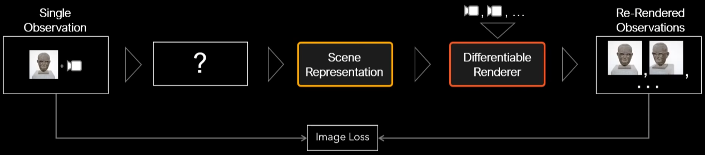

# Novel View Synthesis

> or Image-based Rendering

## NeRF

> Neural networks as a volume representation, using volume rendering to do view synthesis
>
> A method that achieves state-of-the-art results for synthesizing novel views of complex scenes by optimizing an underlying continuous volumetric scene function using a sparse set of input views.
>
> [NeRF](https://www.matthewtancik.com/nerf)

- Key points

  - continuous neural network as a volumetric scene representation (5D = xyz + direction)

    - 
    - neural network replaces large N-d array
    - MLP使用8个完全连接层（ReLU激活，每层256个通道）处理输入，输出σ和256维特征向量。然后，将此特征向量与摄像机视角连接起来，传递到4个附加的全连接层（ReLU激活，每层128个通道），以输出视点相关的RGB颜色。

  - use volume rendering model to synthesize new views, optimize using rendering loss for one scene (no prior training)

    - 

    - generate views with traditional volume rendering

    - 

      

      - Sigma parameterization for continuous opacity, 沿着camera ray 的每一步步长可以不一样, 步长会影响到分辨率
      - 分两步

    - optimize with gradient descent on rendering loss

      

    - 

  - one extra trick for passing coordinates into network to get high frequency details

    - ?

- position embedding 在实验中发现假如只是输入position, 输出会很模糊(over smooth), 因为好像神经网络只能学到低频的东西. 所以NeRF把输入做了embedding. 就是将3d的输入映射到一个高维的空间去

  - 将每个输入的坐标映射到一个更高的维空间中，这使得我们能够成功地优化神经辐射场，以表示高频场景内容。

- 用神经网络来拟合一个类似voxel的模型

- 体模型由3D grid中的每个格点(体素voxel)构成, 每个体素有颜色(RGB值)+透明度(α值)属性, NeRF的想法就是用一个全连接神经网络来<u>拟合出一个连续的体素表示</u>. 这个全连接网络输入想要的位置(x, y, z), 以及看的角度(φ, ψ), 输出该位置的颜色(r, g, b)和该点的透明度/density(α)

- 需要输入角度是因为要拟合这个场景的光照

- 

- 

  物体外的点是0, 内的是1

- 

  - 在物体边缘采样更多

---

- [图形学新高潮? NeRF 笔记 - 知乎 (zhihu.com)](https://zhuanlan.zhihu.com/p/187541908)
- [非卷积5D中文翻译及学习笔记](https://blog.csdn.net/ftimes/article/details/105890744)
- [Matthew Tancik: Neural Radiance Fields for View Synthesis - YouTube](https://www.youtube.com/watch?v=dPWLybp4LL0&ab_channel=AndreasGeiger) 
- [Neural Rendering (CVPR 2020) - Morning Session](https://www.youtube.com/watch?v=LCTYRqW-ne8&ab_channel=NeuralRendering)

### Pipeline

1. 让摄像机光线穿过场景生成一组采样的三维点
2. 使用这些点及其相应的二维观察方向作为神经网络的输入，生成一组颜色和密度的输出
3. 使用传统的 volume rendering 技术将这些颜色和密度累积到二维图像中

- 这个volume rendering的函数是可微的, 所以目标就是最小化 预测的颜色值 - ground truth 

### Positional encoding

- why
  - 要表示更高频的函数

- 作用: map each input 5D coordinate into a higher dimensional space. 

### Hierarchical sampling

> 分层采样

- why
  - 高分辨率的采样频率要高很多, 使用分层采样能减少采样次数

### ???

- [ ] 不用卷积, 参数数量不会爆炸吗

- [ ] 这篇论文是怎么应用可微分渲染的?

optimize the scene representation by minimizing the error of rendering all camera rays from a collection of standard RGB images 

把一个static的场景表示为一个连续的5D函数

- [ ] 为什么半球形的采样没有深度估算误差造成的问题， 深度不也是网络预测出来的吗
- [ ] 输出的数据是什么样的， RGB吗? 有深度吗? 
- [x] 球形的采样是不是要建立3D模型? 

好像是由一系列向量构成的一个场景的volumetric representation, 每个向量都有($x, y, z, \theta, \phi$), 位置和方向, 同一个camera ray上的向量排成一条线, 然后优化这个vector-valued function. 回想ray-tracing, 图像不就是通过发射一根根光线构成的吗

- [ ] 向量的方向都是从camera到物体的, 优化后也是, 那变换视角后, 这些向量还能用吗, 如果用, 怎么选用那个camera ray 上的向量? 

体模型由3D grid中的每个格点(体素voxel)构成, 每个体素有颜色(RGB值)+透明度(α值)属性, NeRF的想法就是用一个全连接神经网络来<u>拟合出一个连续的体素表示</u>. 

- [ ] 如果是一个体模型, 每个体素有一个颜色, 那么当视角发生变化的时候, 颜色如何跟着发生变化? 不是还和输入的视角有关吗?

- [ ] 那相机都在一个平面有深度吗? 
- [ ] 这个全连接网络的输入和输出分别是什么?

输入就是每个向量的位置, 方向(5D)

输出的是那个向量的RGB radiance(view-dependent), 以及volume density(这个向量在当前camera ray的贡献值, camera ray上所有向量的贡献值加起来是1) 

- [x] 每个像素是怎么算出来的? 

用体渲染的技术, camera ray 上的vector的值加起来

- [ ]  网络结构是什么样的? 

fully connected deep network

- [ ] 高频信息如何处理? 用更多的 voxel 吗? 
- [ ] 高频场景如何减少存储空间? 

- [ ] voxel 和 向量什么关系? 

### todo

- [ ] 看看 https://github.com/bmild/nerf 跟unity的结合

