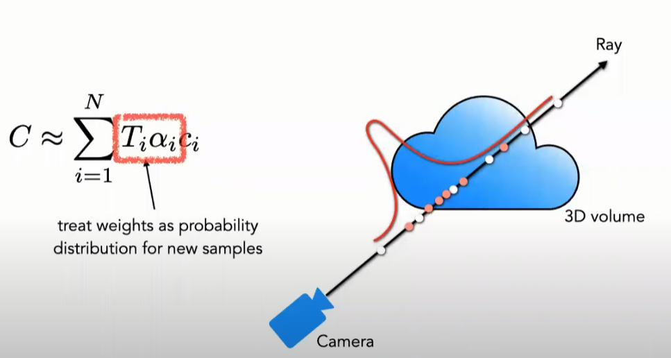
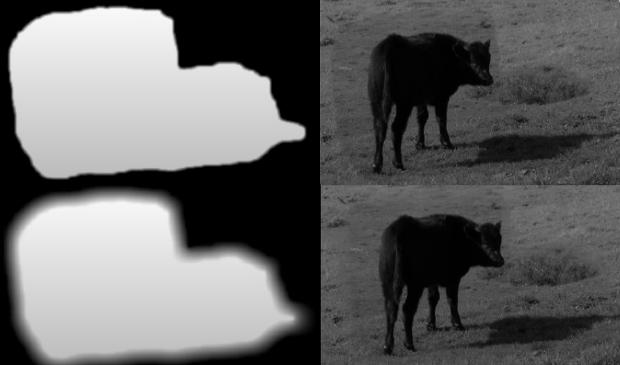

# Novel View Synthesis

> or Image-based Rendering

## NeRF

> Neural networks as a volume representation, using volume rendering to do view synthesis
>
> A method that achieves state-of-the-art results for synthesizing novel views of complex scenes by optimizing an underlying continuous volumetric scene function using a sparse set of input views.
>
> [NeRF](https://www.matthewtancik.com/nerf)

- Key points

  - continuous neural network as a volumetric scene representation (5D = xyz + direction)

    - 
    - neural network replaces large N-d array
    - MLP使用8个完全连接层（ReLU激活，每层256个通道）处理输入，输出σ和256维特征向量。然后，将此特征向量与摄像机视角连接起来，传递到4个附加的全连接层（ReLU激活，每层128个通道），以输出视点相关的RGB颜色。

  - use volume rendering model to synthesize new views, optimize using rendering loss for one scene (no prior training)

    - 

    - generate views with traditional volume rendering

    - 

      

      - Sigma parameterization for continuous opacity, 沿着camera ray 的每一步步长可以不一样, 步长会影响到分辨率
      - 分两步

    - optimize with gradient descent on rendering loss

      

- position embedding 在实验中发现假如只是输入position, 输出会很模糊(over smooth), 因为好像神经网络只能学到低频的东西. 所以NeRF把输入做了embedding. 就是将3d的输入映射到一个高维的空间去

  - 将每个输入的坐标映射到一个更高的维空间中，这使得我们能够成功地优化神经辐射场，以表示高频场景内容。

- 用神经网络来拟合一个类似voxel的模型

- 体模型由3D grid中的每个格点(体素voxel)构成, 每个体素有颜色(RGB值)+透明度(α值)属性, NeRF的想法就是用一个全连接神经网络来<u>拟合出一个连续的体素表示</u>. 这个全连接网络输入想要的位置(x, y, z), 以及看的角度(φ, ψ), 输出该位置的颜色(r, g, b)和该点的透明度/density(α)

- 需要输入角度是因为要拟合这个场景的光照

- 

- 

  物体外的点是0, 内的是1

- 

  - 在物体边缘采样更多

### Pipeline

1. 让摄像机光线穿过场景生成一组采样的三维点
2. 使用这些点及其相应的二维观察方向作为神经网络的输入，生成一组颜色和密度的输出
3. 使用传统的 volume rendering 技术将这些颜色和密度累积到二维图像中

- 这个volume rendering的函数是可微的, 所以目标就是最小化 预测的颜色值 - ground truth 

### Positional encoding

- why
  - 要表示更高频的函数, 不然会oversmooth

- 作用: map each input 5D coordinate into a higher dimensional space. 

### Hierarchical sampling

> 分层采样

- why
  - 高分辨率的采样频率要高很多, 使用分层采样能减少采样次数

###  Structure

1. 输入: 3D coordinate $\bold{x} = (x, y, z, θ, φ)$ (位置, 方向)
2. 中间: 8 fully connected layers (ReLU, 256 channels per layer)
3. 输出: $\bold{\sigma}$(向量在当前camera ray的贡献值, camera ray上所有向量的贡献值加起来是1), a 256-dimensional feature vector 
4. 输入: the 256-dimensional feature vector, camera ray's view direction
5. 中间: fully connected layer (ReLU, 128 channels)
6. 输出: view-dependent RGB color (颜色)

### Math

期望的camera ray $\bold{r} = \bold{o} + t\bold{d}$ 的颜色 $C(\bold{r})$ 算法: 
$$
C(\bold{r}) = \int_{t_n}^{t_f}
T(t)\;
\sigma(\bold{r}(t))\;
\bold{c}(\bold{r}(t), \bold{d})\;dt,\\
\text{where}\;
T(t) = exp(-\int_{t_n}^t\sigma(\bold{r}(s))\;ds).
$$

- $t_n$: near bound
- $t_f$: far bound
- $T$: 累计透过率 the accumulated transmittance along the ray from $t_n$ to $t$ (the probability that the ray travels from $t_n$ to $t$ without hitting any other  particle)

实际的颜色 $\hat{C}(\bold{r})$ 算法:
$$
\hat{C}(\bold{r}) = \sum_{i=1}^{N}
T_i(1-exp(-\sigma_iδ_i))\bold{c}_i, \;
\\\text{where}\;
T_i = exp(-\sum_{j=1}^{i-1}\sigma_jδ_j),
\\\text{where}\; δ_i = t_{i+1}-t_i
$$

- $δ_i$: 两个相邻样本的距离

### Questions

- [ ] 不用卷积, 参数数量不会爆炸吗

分成了两个网络

- [ ] 这篇论文是怎么应用可微分渲染的?

optimize the scene representation by minimizing the error of rendering all camera rays from a collection of standard RGB images 

把一个static的场景表示为一个连续的5D函数

- [ ] 为什么半球形的采样没有深度估算误差造成的问题， 深度不也是网络预测出来的吗

深度也是网络预测出来的, 但是不一定和实际的深度一样, 只是看起来没问题, 

- [x] 输出的数据是什么样的， RGB吗? 有深度吗

RGB, 无深度

- [x] 球形的采样是不是要建立3D模型

好像是由一系列向量构成的一个场景的volumetric representation, 每个向量都有($x, y, z, \theta, \phi$), 位置和方向, 同一个camera ray上的向量排成一条线, 然后优化这个vector-valued function. 回想ray-tracing, 图像不就是通过发射一根根光线构成的吗

- [ ] 向量的方向都是从camera到物体的, 优化后也是, 那变换视角后, 这些向量还能用吗, 如果用, 怎么选用那个camera ray 上的向量

density(σ) 只和位置有关, color 和位置和相机的视角都有关

- [x] 如果是一个体模型, 每个体素有一个颜色, 那么当视角发生变化的时候, 颜色如何跟着发生变化 不是还和输入的视角有关吗 

是和view direction有关, 所以每个体素?不是一个颜色, 想想Lumigraph

- [x] 那相机都在一个平面有深度吗

有

- [x] 每个像素是怎么算出来的

用体渲染的技术, camera ray 上的vector的值加起来

渲染一个视角就是计算每个像素的$C(\bold{r})$

- [ ] 高频信息如何处理 用更多的 voxel 吗
- [ ] 高频场景如何减少存储空间
- [ ] voxel 和向量什么关系
- [ ] 如果是σ和位置和视角有光, color只和位置有关呢
- [ ] 是不是分成了两个网络来训练 如果是, 为什么

### Todo

- [ ] 看看https://github.com/bmild/nerf跟unity的结合
- [ ] 看看[issue](https://github.com/bmild/nerf/issues)里的问题

### Reference

- [图形学新高潮? NeRF 笔记 - 知乎 (zhihu.com)](https://zhuanlan.zhihu.com/p/187541908)
- [非卷积5D中文翻译及学习笔记](https://blog.csdn.net/ftimes/article/details/105890744)
- [Matthew Tancik: Neural Radiance Fields for View Synthesis - YouTube](https://www.youtube.com/watch?v=dPWLybp4LL0&ab_channel=AndreasGeiger) 
- [Neural Rendering (CVPR 2020) - Morning Session](https://www.youtube.com/watch?v=LCTYRqW-ne8&ab_channel=NeuralRendering)

- [翻译+笔记 NeRF](https://blog.csdn.net/ftimes/article/details/105890744)
- [翻译+笔记 NeRF 2](https://www.flyinghuster.com/[%E8%AE%BA%E6%96%87%E8%A7%A3%E8%AF%BB]NeRF-Representing%20Scene%20as%20Neural%20Radiance%20Fields%20for%20View%20Synthesis/)

## NeRF-W

> NeRF in the wild

- 可能有两个误差
  - 可能有遮挡, 所以要考虑一个参数, 这个参数只会影响到颜色, 不会影响到σ
  - 空间位置可能不同, 这会影响到σ, 颜色
- 都是用的网络, 没有图形学

[NeRF-W bilibili](https://www.bilibili.com/video/BV1Qi4y1u7Es?from=search&seid=501675493729586449)

- Target: given a set of photographs of an object or a scene, estimate the most likely 3D shape that explains those photographs, under the assumptions of known materials, viewpoints, and lighting conditions
- There exist many cues that can be used to extract geometry from photographs: <u>texture, defocus, shading, contours, and stereo correspondence</u>.

# MVS

> Multi-View Stereo
>
> 多视图三维重建

## Pipeline

multi-view stereo pipeline. 

1. imagery collection
2. camera parameters estimation
3. 3D geometry reconstruction
4. textured 3D geometry

## Imagery Collection

- One can roughly classify MVS capture setups into three categories
  - Laboratory setting,
  - Outdoor small-scale scene capture,
  - Large-scale scene capture using fleets or crowd-sourcing, e.g. cars, planes, drones, and Internet.

## Camera Parameters Estimation

> Camera Parameters: 
>
> - camera pose information consisting of location and orientation
> - camera intrinsic properties such as focal length and pixel sensor size

### Camera Projection models

- [Camera Intrinsic & Extrinsic矩阵](http://zhixinliu.com/2016/11/15/2016-11-15-camera-intrinsic/)
- [MVS Tutorial p18]() 

### SfM

> Structure from Motion
>
> compute the camera parameters

- commonly used to compute camera models of unordered sets of images, usually offline. 

- SfM重构的思想是利用相机运动轨迹来估算相机参数. 相机在不同视点摄取多幅图像，利用这些图像计算出相机的位置信息以及运动轨迹，从而在空间坐标系下生成三维点云，恢复出物体的空间结构．由于初步匹配过程形成的特征点较为粗糙，因此在估算相机参数之前，<u>常用几何约束删除匹配错误的特征点对</u>．SfM重构的方法主要有增量式和全局式两种

- SfM算法是一种基于各种收集到的无序图片进行三维重建的离线算法。在进行核心的算法structure-from-motion之前需要一些准备工作，挑选出合适的图片

  1. 从图片中提取焦距信息(之后初始化BA需要)
  2. 利用SIFT等特征提取算法去提取图像特征
  3. 用KD-tree模型去计算两张图片特征点之间的欧式距离进行特征点的匹配，从而找到特征点匹配个数达到要求的图像对
  4. 对于每一个图像匹配对，计算对极几何，估计F矩阵并通过ransac算法优化改善匹配对。这样子如果有特征点可以在这样的匹配对中链式地传递下去，一直被检测到，那么就可以形成轨迹。
  5. 进入structure-from-motion部分

  关键的第一步就是选择好的图像对去初始化整个BA过程。首先对初始化选择的两幅图片进行第一次BA，然后循环添加新的图片进行新的BA，最后直到没有可以继续添加的合适的图片，BA结束。得到相机估计参数和场景几何信息，即稀疏的3D点云。其中两幅图片之间的bundle adjust用的是稀疏光束平差法sba软件包，这是一种非线性最小二乘的优化目标函数算法。

- input: a set of images

- output: 

  - the camera parameters of every image
  - a set of 3D points visible in the images which are often encoded as **tracks** (A track is defined as the 3D coordinates of a reconstructed 3D point and the list of corresponding 2D coordinates in a subset of the input images. )

- Most of the current state-of-the-art SfM algorithms share the same basic processing pipeline

  

  feature detection, feature matching, track generation, structure-from-motion and bundle adjustment

- One of the key developments for SfM was the use of RANSAC [61] to robustly estimate the epipolar geometry between two or three views given noisy matches.

- every image has to be matched to every other image, which is computationally very expensive. Efficient indexing combined with high quality **descriptors** allowed efficient pairwise matching of millions of images. Further work on simplifying the connectivity graph of the tracks (简化连通图的迹点) and parallelization (并行) lead to the current state-of-the-art SfM pipelines used in the industry. 

#### 增量式重构

- 增量式重构是从两张图像中重建出部分场景以及两相机的***R***（旋转矩阵）、***T***（平移矩阵），然后添加图像，利用PnP计算出第三幅图像的***R***、***T***， 通过三角化重建出更多的场景．由于在求位姿与三维点时会有大量噪声干扰，后续计算结果会发生漂移，因此引入BA（Bundle Adjustment）算法进行优化．在每次添加图像完成三角化后都需要进行优化．
- 步骤
  1. 初始化
  2. PnP解算
  3. 三角化
  4. BA算法优化．其中较为重要的步骤是利用PnP算法求解相机位姿．(PnP有很多种类，如P3P、EPnP、DLT、UPnP和MRE

[Bundle Adjustment](https://blog.csdn.net/OptSolution/article/details/64442962)

### VSLAM

> Visual Simultaneous Localization and Mapping

- specializes in computing the location of a camera from a video stream, usually real-time.

## Reference

- [三维重建算法研究综述](http://nxdxb.cnjournals.org/ch/reader/download_pdf.aspx?file_no=20200509&year_id=2020&quarter_id=5&falg=1)

## ?

- [ ] 

# Texturing

## pipeline

1. determine the visibility of faces in the input images

## MRF

> Markov Random Field
>
> 马尔可夫随机场，也叫马尔可夫网。无向图模型也叫马尔科夫随机场(Markov Random Fields)或马尔科夫网络

- [马尔可夫随机场_百度](https://baike.baidu.com/item/马尔可夫随机场/3287733#reference-[1]-2313875-wrap)
- [计算机视觉方向简介 | 多视角立体视觉MVS (careerengine.us)](https://posts.careerengine.us/p/5e1b48bf626378473bdf97f5)
- 马尔可夫性质：它指的是一个随机变量序列按时间先后关系依次排开的时候，第N+1时刻的分布特性，与N时刻以前的随机变量的取值无关, 只与N时刻的随机变量的取值有关。
- 随机场：当给每一个位置中按照某种分布随机赋予相空间的一个值之后，其全体就叫做随机场。我们不妨拿种地来打个比方。其中有两个概念：位置（site），相空间（phase space）。“位置”好比是一亩亩农田；“相空间”好比是种的各种庄稼。我们可以给不同的地种上不同的庄稼，这就好比给随机场的每个“位置”，赋予相空间里不同的值。所以，俗气点说，随机场就是在哪块地里种什么庄稼的事情。
- 马尔可夫随机场：马尔科夫随机场是具有马尔科夫特性的随机拿种地打比方，如果任何一块地里种的庄稼的种类仅仅与它邻近的地里种的庄稼的种类有关，与其它地方的庄稼的种类无关，那么这些地里种的庄稼的集合，就是一个马尔可夫随机场。
- 在随机场的基础上添加马尔科夫性质，从而得到马尔科夫随机场。把马尔科夫随机场映射到**无向图**中，此无向图中的节点都与某个随机变量相关，连接着节点的边代表与这两个节点有关的随机变量之间的关系，所以，马尔科夫随机场其实表达出随机变量之间有些关系因素是必须要考虑的，而另外则有些是可以不用考虑的。<u>马尔科夫随机场的某个随机变量，仅仅只与其相邻的随机变量有关，与那些不相邻的随机变量无关。</u>
- MVS中的MRF是以mesh面为

 

- considerations
  - $I_i = \alpha _iF_i + (1-\alpha _i)B_i \;\; \alpha_i \in [0,1]$
    - matting equation
    - $I_i$ 是像素块 $i$ 的 RGB 色彩，a pixel in the composite image
    - $F_i$: foreground pixel
    - $B_i$: background pixel
    - $\alpha _i$: 未知蒙版估计（matte estimation） alpha channel is 0 if the pixel is transparent
  - adjacent values of $\alpha$, $ F$, $B$ to be similar (except when there is an edge) 
  -  $\alpha$, $ F$, $B$ should be guided by user scribbles (初始化的时候需要用户标一下哪是foreground，哪是background)

### Energy Formulation

> 能量函数, 能量越小越稳定, 和cost function的意义相似

why: :question: smoothing or stereo correspondence problem
$$
E(l) = \sum_{F_i\in Faces}E_{data}(F_i, l_i) + \sum_{(F_i, F_j)\in Edges}E_{smooth}(F_i, F_j, l_i, l_j)
$$

- $l$: label $l$ assigns a view $l_i$ to be used as texture for each mesh face $F_i$
- $l_i$: view
- $F_i$: mesh face
- $E_{data}(\cdot, \cdot)$: 数据项data term, prefers "good" views for texturing a face
- $E_{smooth}(\cdot, \cdot, \cdot, \cdot)$: 平滑项smoothness term, minimizes seam(edge between faces textured with different images) visibility. 
- $E(l)$ 越小越好: 通过 graph cuts 和 alpha expansion 来最小化

## Graph Cuts

- why: 它可在保持相关的尖锐不连续性（sharp discontinuities）的同时，加强分段平滑性

- 

- 一张image可以看作是一个矩阵, 图中的每个像素就是矩阵中的一个位置，这个像素可以看做是图中的一个顶点。把相邻顶点之间用短线(有向或无向)连接起来就形成了边，也就构成一幅Graph了。

- 边的权值由平滑项和数据项组成，这2部分的比重用1个系数来平衡，

  - 平滑项B(A)主要体现顶点像素和其相邻区域像素之间值的变化强度，如果变化剧烈说明这两者很有可能出于边缘部分，则被分割开的可能性比较大，:question:而按照最小割的分割原理，这时2者的平滑项权值应该较小
  - 数据项R(A)则表示对应顶点属于前景或者背景的惩罚项

  

- [Graph Cuts初步理解 - 钟离踏雪 - 博客园](https://www.cnblogs.com/saliency/p/3659026.html)

- [Graph Cuts in Vision and Graphics概述 - 知乎 (zhihu.com)](https://zhuanlan.zhihu.com/p/210236545?utm_source=qq)

- Graph Cuts中的Cuts是指这样一个边的集合，很显然这些边集合包括了上面2种边，该集合中所有边的断开会导致残留”S”和”T”图的分开，所以就称为“割”。如果一个割，它的边的所有权值之和最小，那么这个就称为最小割，也就是图割的结果。:question:而福特-富克森定理表明，网路的最大流max flow与最小割min cut相等。所以由Boykov和Kolmogorov发明的max-flow/min-cut算法就可以用来获得s-t图的最小割。这个最小割把图的顶点划分为两个不相交的子集S和T，其中s ∈S，t∈ T和S∪T=V 。这两个子集就对应于图像的前景像素集和背景像素集，那就相当于完成了图像分割。

- 图像分割可以看成pixel labeling（像素标记）问题，目标（s-node）的label设为1，背景（t-node）的label设为0，(s, t最后要分离), 这个过程可以通过:question:最小化图割来最小化能量函数得到。那很明显，发生在目标和背景的边界处的cut就是我们想要的（相当于把图像中背景和目标连接的地方割开，那就相当于把其分割了）。同时，这时候能量也应该是最小的。假设整幅图像的标签label（每个像素的label）为L= {l1,l2, , , , lp}，其中li为0（背景）或者1（目标）。那假设图像的分割为L时，图像的能量可以表示为：

  

  其中，R(L)为区域项（regional term），B(L)为边界项（boundary term），而a就是区域项和边界项之间的重要因子，决定它们对能量的影响大小。如果a为0，那么就只考虑边界因素，不考虑区域因素。E(L)表示的是权值，即损失函数，也叫能量函数，图割的目标就是优化能量函数使其值达到最小。

- [Graph Cuts 图分割学习 - 知乎](https://zhuanlan.zhihu.com/p/58185005)

- 

- [ ] 如何和MRF结合起来

  

  [Grouping and segmentation (iitd.ac.in)](https://web.iitd.ac.in/~sumeet/14.pdf)

  通常是相邻的像素点或者体素点, 但这篇论文用的相邻的mesh face

- [ ] 贴纹理需要又不是图像分割, 这里应该如何修改

### graph cut

- a cut separates **F**(foreground) from **B**(background), and no path  between them
- target: seek the minimum cut. 

$$
|C| = \sum _{(i, j)\in C} w_{ij}
$$

- $|C|$: the cost of the cut

- each edge gets a weight
  - $w_{ij}$: weight between adjacent pixels
  - $w_{iF}, w_{iB}$: weight between pixel & terminals

### edge weights

- 像素到F, B的权重

  - F scribble: 很肯定是属于foreground的
    - $w_{iF} = \infty$: 要砍断它和F的代价是很大的, 所以不能分离
    - $w_{iB} = 0$ 
  - B scribble: 
    - $w_{iF} = \infty$
    - $w_{iB} = 0$
  - for non-scribble pixels, use scribbles to build **P(F)** (probability of foreground pixel), **P(B)** distributions. 
    - $w_{iF} = -\lambda\>log\>P_B(i)$ : 如果像素 $i$ 和 $B$ 连的概率很小, 那么 权重 $w_{iF}$ 就会很大, 要分开 $i$ 和 $F$ 的代价就很大
    - $w_{iB} = -\lambda\>log\>P_F(i)$

- 像素与像素之间的权重
  $$
  w_{ij} = e^{-\frac{1}{\alpha \sigma^2}||I_i-I_j||^2}
  $$

  - 如果颜色相似, 那么$w_{ij}$接近1
  - 如果颜色差很多, 那么$w_{ij}$接近0, so that edge is appealing to cut
  - $\sigma$: 表示高斯函数的宽度, 决定对 pixel similarity 的宽容度

  

  this can also be turned into an MRF/GIBBS energy
  $$
  E = E_{data} + E_{smoothness}
  $$

  - $E_{data}$: 相当于是 $w_{iF}, w_{iB}$
  - $E_{smoothness}$: 相当于是 $w_{ij}$ 

## α-expansion

- why: minimize energy 能量最小化
- 是一个[非凸优化](https://www.zhihu.com/question/20343349)问题, 求全局最优是NP-hard的, 可用蒙特卡洛?

- *Fast Approximate Energy Mi nimization via Graph Cuts*
- [Alpha-expansion and Alpha-beta-swap Algorithm Flow-CSDN](https://blog.csdn.net/nothinglefttosay/article/details/48554555)

## mean shift

- [Mean Shift 聚类算法](https://blog.csdn.net/hjimce/article/details/45718593) 
  - 没核函数 就是相当于求解一个向量，使得圆心一直往数据集密度最大的方向移动。说的再简单一点，就是每次迭代的时候，都是找到圆里面点的平均位置作为新的圆心位置。
  - 有核函数: 带权重的偏移

## Poisson image editing

[Seamless cloning泊松克隆 通俗易懂](https://blog.csdn.net/hjimce/article/details/45716603)

[Poisson Image Editing 公式](https://blog.csdn.net/zhaoyin214/article/details/88196575)

[image blending](https://www.youtube.com/watch?v=UcTJDamstdk&t=613s&ab_channel=RichRadke)

[一个真实的例子 人脸图像融合](https://blog.csdn.net/qq_20474257/article/details/89785478)

[拉普拉斯算子 推导](https://blog.csdn.net/saltriver/article/details/78990520)   [图像二阶导数的本质](https://blog.csdn.net/saltriver/article/details/78990575)

- 图片有低频信息也有高频信息(边界). 边界不需要blend, 不需要宽的transition band(过渡区, transition region), 低频的地方可以用宽的transition band, 

### hard compositing

> "硬"合成, "硬"混合

$$
I(x,y) = M(x,y)S(x,y) + (1-M(x,y))T(x,y)
$$

- 如果$M(x,y) = 1$ 那就是只要source的颜色
- 如果$M(x,y) = 0$ 那就是只要target的颜色

#### weight transition region

- 两条虚线之间是一个过渡缓冲区. 外虚线处只有target的颜色, 然后慢慢递减到内虚线为0; 内虚线处只有source的颜色, 然后递减到外虚线为0. 

- 操作方法: 将mask Gaussian blur 高斯模糊一下, 再应用上面的hard compositing (模糊的mask不是非0即1的, 所以融合得更自然一些) 

  

### Gaussian Pyramid

- $K = 5*5$ Gaussian Filter 高斯卷积核

- $G_0 = $ Original image (full resolution)
- $G_i = (K * G_{i-1})_{\downarrow2}$  模糊操作
  - $K*G_{i-1}$: convolution
  - $\downarrow2$: down sample by 2 in both dimension, 操作后图像会变成原来的1/2

### Laplacian Pyramid

- Differences of gaussian at each scale: $L_i= G_i - (K*G_i)$ 
  - $L_i$: high-pass image at scale $i$ (high-pass = original - low-pass), 也就是得到边缘信息, $i$越大, 小的边缘信息保留得越少
  - $G_i$: Gaussian Pyramid image at scale $i$
  - $K*G_i$: blurred version of that image
  - $\{L_i\}$: $L_i$的集合构成 Laplacian Pyramid
  - $i$最大的时候, $L_{maxi}$是彩色的图像, 也就是$G_{maxi}$, 其余的都是"边缘"图像

### recover original image

recover original image as:  

$I = \sum_{i=0}^N(L_i)_{\uparrow\text{ to full size}}$ 

- Add back all the edges at different scales to get the original image. 
- **Base image is smallest, blurriest image($G_N = L_N$)** 从那个最小的, 也就是最模糊的图片开始. 

- [x] :question: 分辨率不一样怎么加: 

放大, 小分辨率图的一个像素在大分辨率里表示好多个 up sample

- [x] :question: 为什么用的是Laplacian加起来怎么会得到原图? Laplacian得到的不是边缘信息吗?

最小那个$L_N$等于$G_N$, 不是边缘信息, 是彩色的

### image composition

- to do image composition

  1. compute Laplacian pyramids for $S, T$, called $L^S, L^T$

  2. compute Gaussian pyramids for mask $M$, called $G$

  3. make a Laplacian pyramid for composite混合后的图像
     $$
     L^I_i = G_i*L_i^S + (1-G_i)*L_i^T\\
     (i=0, ...N)
     $$
     (与上面的hard compositing思想一样, 但是符号不同)

  4. add up to get the final composite 把最右边result那一列加起来就得到最终结果
  
     

### Poisson image editing

- $\partial \Omega$: 边界

- idea: to reduce color mismatch between source and target, create composite in **gradient domain**. 
- Target: 
  - gradient of the composite **inside the region($Ω$)** to look as close as possible to the source image gradient. 
  - the composite must match(相等) target image **on the boundary of the region($\partial \Omega$)**

- [x] :question:为了和source的梯度尽可能一样, target里的图像的边界不会被抹平吗? 感觉是和target的梯度一样才对啊. 

emm 是看的那篇博客的图有问题. 就是我想的那样, composite 里的梯度要尽可能和source里的(也就是那头牛)一样. 

- [x] :question:$\partial \Omega$ 不就是mask的那条线吗? 这个不是要尽可能看不见吗, 为什么是相等? 

composite的边界要和target的边界完全一样

写成公式: 

#### problem

$$
\min\limits_{I(x,y)\in\Omega} 
\iint\limits_\Omega 
||\triangledown I(x,y) - \triangledown S(x,y)||^2 dxdy \\
S.T. \> \> I(x,y) = T(x,y) \>\>\>on \> \partial \Omega
$$

- $S.T.$: subject to (the constraint) 约束条件, 边界要相等

#### solution

Poisson equation
$$
\triangledown^2I(x,y) = \triangledown^2S(x,y)\>\>in\>\> \Omega \\
I(x, y) = T(x,y)\>\>on\>\>\partial\Omega
$$

- $\triangledown^2$: Laplacian
- $I$: source中mask那部分混合后的RGB值

- discretizing and solving the problem: 

  1. for a pixel p inside $\Omega$

     $\triangledown^2I(x,y) = \triangledown^2S(x,y)$

     

  2. for a pixel p  whose neighborhood is  inside $\Omega$ 

     

     - $T(x,y-1), T(x-1,y)$都是已知的. 

- A: sparse matrix(mostly 0, some -4, 1)
  - $I$ 中第 i 行是边界的RGB, 那么A中第 i 行存的就是一个1, 其余是0; 
  - $I$ 中第 i 行不是边界的RGB, 那么A中第 i 行存的就是一个-4, 四个1, 其余是0; 
- x: 存的是source贴到target应有的颜色
- b: 
  - $I$ 中第 i 行是边界的RGB, 那么b中第 i 行存的就是边界RGB, 因为边界要和target的颜色一样
  - $I$ 中第 i 行不是边界的RGB, 那么b中第 i 行存的就是$I$中第 i 行那个像素的散度Laplacian. 计算的话可以拿target中那个位置的像素的Laplacian和source中那个位置的像素的Laplacian去做一个composition(见image composition部分)

### Mixed-gradient compositing

- [ ] :question: 偏导那个不会少了个平方吗? 

- Difference: the right hand side need not arise from the Laplacian of a real image (non-conservative vector field).  原来是要和原图像的Laplacian(散度)一样, 现在只要不一定了, 可以是随机的一个散度. 

e.g.

比如图中山的部分的梯度要比source中天空的那部分梯度要大, 所以保留的是山

## 图像配准

> image registration

[图像配准综述](https://zhuanlan.zhihu.com/p/80985475)

**图像配准与相关**[[1\]](https://zhuanlan.zhihu.com/p/80985475#ref_1)是图像处理研究领域中的一个典型问题和技术难点，其目的在于比较或融合针对同一对象在不同条件下获取的图像，例如图像会来自不同的采集设备，取自不同的时间，不同的拍摄视角等等，有时也需要用到针对不同对象的图像配准问题。

具体地说，对于一组图像数据集中的两幅图像，<u>通过寻找一种空间变换把一幅图像（浮动图像，moving image）映射到另一幅图像（参考图像，fixed image）上，使得两图中对应于空间同一位置的点一一对应起来</u>，从而达到信息融合的目的。

Multi-view Analysis: 多视图配准：同一物体在同一场景不同视角下的图像配准。从多个视角捕获相似对象或场景的图像，以便获得扫描对象或场景的更好表示。如使用图像拼接，从2D图像重建3D模型等。

## LTBC

### view selection

> select which view(s) should be used to texture each face

- why: yield a preliminary texture

### color adjustment

> this texture is optimized for consistency

- why: avoid seams between adjacent texture patches 

1. global adjustment with support region 
   - why: alleviate color artifact
2. Poisson editing ()
   - why: fix remaining visible seams

## Seamless Mosaicing of Image-Based Texture Maps

### 步骤

1. backprojecting original view onto the obtained surface

2. A texture is mosaiced from these backprojections, whereas the quality of the mosaic is maximized within the process of **Markov Random Field** energy optimization. MRF 用来选合适的view的texture

   :question: 怎么选

3. the residual seams between the mosaic components are removed via seam levelling procedure (which is equivalent to gradient domain based stitching techniques). 

- 不需要resample所以没有质量损失

### MRP-based mosaicing

- labeling
  - mesh faces: $F_1, F_2, ...F_K$

  - texture fragments: $V^1, V^2,...V^N$

  - labeling vector $M = \{m_1, m_2, ...,m_K\}\in\{0..N\}^K$

    描述 $F_i$ 到 $V^{m_i}$ 的对应关系

- smoothness term 是两个纹理块之间的缝隙的颜色差的积分

  

- the MRF is **mesh-based**, its nodes correspond to mesh faces, and the node interactions are defined by faces adjacency. 

# ghost

## Mini Cut

## Gradient Magnitude

[math - What is the gradient orientation and gradient magnitude? - Stack Overflow](https://stackoverflow.com/questions/19815732/what-is-the-gradient-orientation-and-gradient-magnitude/19816362)

## Mean-Shift

- 简单说，就是有一个点 x,它的周围有很多个点 x_i 我们计算点 x 移动到每个点 x_i 所需要的偏移量之和，求平均，就得到平均偏移量 m, （<u>该偏移量的方向是周围点分布密集的方向</u>）该偏移量是包含大小和方向的。然后点 x 就往平均偏移量方向移动，再以此为新的起点不断迭代直到满足一定条件结束。

- mean-shift的算法流程是： 

  1. 选取中心点 x，以半径 h 做一个高维球（如果我们是在图像或者视频处理中，则是2维的窗口，不限定是球，可以是矩形），标记所有落入窗口内的点为  x_i 
  2. 计算 m，如果 m 的值小于阈值或者是迭代次数到达某个阈值，则停止算法，否则利用上面求圆心的公式更新圆点，继续步骤1

  

- [meanshift算法图解_csdn](https://blog.csdn.net/csdnforyou/article/details/81161840)

- [Meanshift，聚类算法 - Liqizhou - 博客园 (cnblogs.com)](https://www.cnblogs.com/liqizhou/archive/2012/05/12/2497220.html)

# IBR

> image-based rendering

- IBR 通常有两种方法: 
  - VDTM (view-dependent texture mapping)
    - 不用很多图, 但是几何要求高. VDTM assumes a relatively accurate geometric model, but requires only a small number of textures from input cameras that can be in general position.
  - light field/lumigraph
    - 需要大量图片, 但几何要求不高. Light field rendering requires **a large collection of images** from cameras whose centers lie on a regularly sampled two-dimensional patch, but it makes few assumptions about the **geometry** of the scene. 

