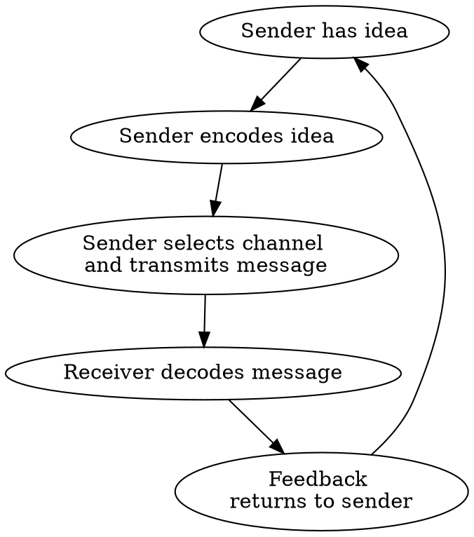

# 1. bussiness communication in the digital age

# 2. Professionalism
## meeting
### planning a productive meetings
1. invite the right people
2. distribute an agenda
3. use digital calendar for scheduling
4. train participants on technology
distribute documents in advance and log on early

### running the meetings
1. start on time and **introduce the agenda**
2. **appoint a secretary and a recorder**
3. **encourage participation**
4. confront conflict frankly
5. summarize along the way
stay focus on the topic
silence the phone
be ready to deal with the confilct

### ending the meeting and following up
1. review meeting decisions
2. distribute minutes of meeting
3. remind what participants need to do

### be a good listener
- avoid interruptting, let them finish
- make a note
- avoid seeming judgmental (don't make an opinion on the speaker)
- focus fully on the speaker eye contact
- keep silence while others are speaking

# 3. Intercultural communicaton
## high-context culture
## low-context culture

---
## .
- IT workers rely on knowledge in their jobs.
- **writing** skills are the most important
  - be concise
  - write clearly. Don't use IT acronyms to the people who is not in this field.
  - KISS rule
  - use appropriate language (no LOL, ROFL)
  -
## Vocabulary
- connectedness: being joined or linked
- Adhoc: created or done for a particular purpose

- synchronous: occuring at the same time (video conferencing)
- asynchronous: not occuring at the same time

Customer DATA -> Database -> **Cloud**

## The Global Market Place and Competition
- understanding different customs, lifestyles, and bussiness practices.
- coping with challenges of multiple time zones, vast distances, and different language.
- developing new skills and attitudes.
- practicing cultural awareness, flexibility and patience
  - visit them
  - movie, music, food
  - practice religion

## Shrinking Management Layers:
**hierarchy**
Boss
middle Manager
worker

Advantages:

## Collaborative Environments and Teaming
### cross function team do:
### project-based teams do:
- meet ad hoc to solve a particular problem
- disband

# communicaton
## overcoming barriers to effective communicaton
- create smaller operating units and work teams
- shorten long chains of communicaton
- provide greater transparency through communicaton through company publications, meetings, blogs, internal social network,
- provide an open, trusting envi
- encourage regular meeting
- hotline

## informal communicaton channel
- grapevine: gossip
-

# ethic
## goals of ethical bussiness communicaton
- use inclusive language (eg. fireman->firefighter)
-

# skills
hard skills: technical skills
soft skills: communicate, be able to work with other people

## why form teams
- greater buy-in
- reduced risks

## four phases team development
- forming
  - build trust
  - select members
  - become acquainted
- storming
  - identify problems
  - collect and share info
  - establish decision criteria
- norming
  -
- performing

## defining successful teams
- share leadership
- accept ethical responsibilities

## deal with confilct
1. listen
2. understand other points of view
3. show you care about the relationship
4. look for common ground
5. invent new problem-solving options
6. reach an aggrement based on what is fair

---

# 4. planning bussiness messages
## the communication process

水平沟通效率高
越级沟通, 斜线沟通的效率不高
## facters tha shape understanding
不同的人会有不同的理解, 因为: 文化,
造成误解的其他因素: 注意力分散(个人的着装, 手势动作)

## defining your bussiness writing goals
- Purposeful
- Econimical
直接用数据说明, 有说服力
用简明的, 通俗的词汇, 提高交流的效率
- Audience oriented

## 3-x-3 writing process
1. prewriting(planning) (25% of time)
analyze audience & purpose
anticipate audience and its reaction to message(primary audience, secondary audience)
adapt message to audience
2. drafting (25% of time)
research bg, collect info
organize info
draft first version
3. revising (50% of time)
edit for clarity
proofread
evaluate whether the message will accomplish goals

## expressions
- "You" view
- "You claim that ..." means: I don't believe you

## informal research methods
1. identify research needs/ purpose, information needs
2. information sources:
- primary data(一手数据):
  - talk to experts and 整理数据
  - 问卷调查之后总结
- secondary data(二手数据):
  - journal
  - internet
  - books

先收集二手数据缩小范围, 再收集一手数据

  <b>Reference List</b>:
-
