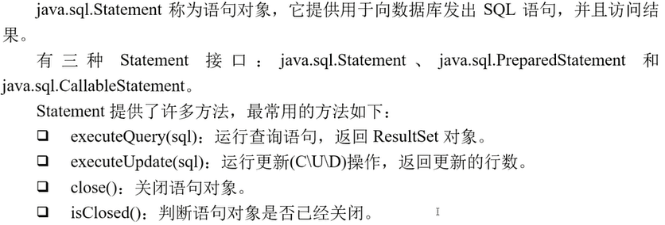

# 概述


- 应用服务器除了提供web容器和EJB容器外还有其他的东西, 如数据库连接池...
- Web浏览器客户端: BS结构
- Java应用客户端: CS结构 


# Servlet

> 服务器端小程序

## 执行过程


 

## 继承关系


- GenericServlet实现了部分Servlet
- HttpServletRequest and ServletRequest are different

## 目录结构


- other direstories: pic

## Web描述文件

> web.xml

可以用 WebServlet注解 代替

配置文件

[link](https://docs.oracle.com/cd/E13222_01/wls/docs81/webapp/web_xml.html)

```xml
<?xml version="1.0" encoding="UTF-8"?>
<web-app xmlns="http://xmlns.jcp.org/xml/ns/javaee"
         xmlns:xsi="http://www.w3.org/2001/XMLSchema-instance"
         xsi:schemaLocation="http://xmlns.jcp.org/xml/ns/javaee http://xmlns.jcp.org/xml/ns/javaee/web-app_4_0.xsd"
         version="4.0">
    <servlet>
        <servlet-name>FirstServlet</servlet-name>
        <servlet-class>com.jason.FirstServlet</servlet-class>
    </servlet>
    <servlet-mapping>
        <servlet-name>FirstServlet</servlet-name>
        <url-pattern>/FirstServlet</url-pattern>
        <url-pattern>/first</url-pattern>
    </servlet-mapping>
    <welcome-file-list>
        <welcome-file>index.jsp</welcome-file>
        <welcome-file>index.html</welcome-file>
    </welcome-file-list>
</web-app>
```

## WebServlet注解


- loadOnStartup: 非负, 越小越先加载 

## 请求和响应


### HttpServletRequest


### HttpServletResponse


setContentType() 还可以设置字符集 

## Web状态保持

### URL重写


### 隐藏域

- `<input type="hidden"/>`

### Cookie

- 超时时间必须设置, 否则无效

- 可长半个月

- 添加cookie

  ```java
  String username = resquest.getParameter("username");
  
  Cookie cookie = new Cookie(name:"username", username); // key-value pair
  cookie.setMaxAge(1000); // expire 1000s
  response.addCookie(cookie); // 添加Cookie要在out.close() 之前
  
  PrintWriter out = response.getWriter();
  out.print(str);
  out.close();
  ```

- 取出cookie

  ```java    
  String pname = null;
  Cookie[] cookies = request.getCookies(); // all cookies
  if(cookies != null){
     for(Cookie cookie : cookies){
  		if(cookie.getName().equals("username")){
  			pname = cookie.getValue();
  			break;
  	}
  }
  ```

- 删除cookie需要 `cookie.setMaxAge(0);`

### Session

- Session存储在服务端, Cookie存放在客户端

- 浏览器关了, Session就没了

- 用于登陆注册

  

#### 设置Session超时时间

- 如果在服务器端中设置超时时间, 部署在之下的web应用程序都会被影响

  

  优先级最低

- 

  优先级中

- 

  优先级最高, 单位秒

#### 操作

- 获得值, 设置Session的值

  ```java
  String username = resquest.getParameter("username");
  
  HttpSession session = request.getSession();
  session.setAttribute("username", username); 
  ```

- 取出Session值

  ```java
  HttpSession session = request.getSession();
  
  String pname = (String)session.getAttribute("username"); // 取出来是Object要转换
  ```

-  删除Session

  ```java
  HttpSession session = request.getSession();
  session.removeAttribute("username");
  ```

  

## Servlet过滤器


- 功能: 日志记录, 提高性能, 安全处理, 会话处理, 编码转换等

- 

  chain过滤链

### 用web.xml的方法

```xml
<!--web.xml-->
<filter>
    <filter-name>CharacterEncodingFilter</filter-name>
    <filter-class>com.zhijieketang.CharacterEncodingFilter</filter-class>
    <!--初始参数, 设置初始编码是gbk-->
    <init-param>
        <param-name>encoding</param-name>
        <param-value>gbk</param-value>
    </init-param>
</filter>
<filter-mapping>
    <filter-name>CharacterEncodingFilter</filter-name>
    <url-pattern>/*</url-pattern>
</filter-mapping>
```

```java
// CharacterEncodingFilter.java
public class CharacterEncodingFilter implements Filter {
    protected String encoding;
    public void init(FilterConfig config) throws ServletException {
        encoding = config.getInitParameter("encoding"); // 取写在web.xml中的初始参数
    }

    public void doFilter(ServletRequest req, ServletResponse resp, FilterChain chain) throws ServletException, IOException {
        if (encoding != null) {
            req.setCharacterEncoding(encoding);
        }
        chain.doFilter(req, resp); // 继续向上或向下传递
    }

    public void destroy() {
        encoding = null;
    }
}
```

- 过滤器是一种特殊的Servlet, 所以它也有上面下面这两种设置初始化参数的方法

### 用注解的方法

```java
// CharacterEncodingFilter.java

@WebFilter(fileName = "CharacterEncodingFilter", 
       urlPatterns = {"/*"}, 
       initParams = {@WebInitParam(name = "encoding", value = "utf-8")}
)
public class CharacterEncodingFilter implements Filter {
    protected String encoding;
    public void init(FilterConfig config) throws ServletException {
        encoding = config.getInitParameter("encoding"); // 取写在web.xml中的初始参数
    }

    public void doFilter(ServletRequest req, ServletResponse resp, FilterChain chain) throws ServletException, IOException {
        if (encoding != null) {
            req.setCharacterEncoding(encoding);
        }
        chain.doFilter(req, resp); // 继续向上或向下传递
    }

    public void destroy() {
        encoding = null;
    }
}
```

- 注解是一种硬编码, 修改完程序代码后需要重新编译, 因为Filter是一个Java类, 所以用部署描述文件`web.xml`会好一些

# JSP

> java servlet page

- 本质还是servlet
- 

## 指令元素

- page

  - 提供了全局属性

  - ```jsp
    <%@ page import="java.text.DateFormat" %>
    <%@ page import="java.text.SimpleDateFormat" %>
    <%@ page import="java.util.Date" %>
    <%@ page contentType="text/html;charset=UTF-8"%>
    ```

- include

  - 包含其他文件

  - ```jsp
    <%@ include file="filename"%>
    ```

  - 引入的文件要指定字符集, 要加`<%@ page contentType="text/html;charset=UTF-8"%>` 

  - 静态的, 一经编译, 文件就不能变

- taglib

## 动作元素

- `<jsp:include>`

  - ```jsp
    <jsp:include page="fileName" flush="true"/>
    
    <jsp:include page="fileName" flush="true">
    	<jsp:param name="paramName" value="paramValue"/>  // 可以传递参数
    </jsp:include>
    ```

  - 执行时才确定内容, 和`<%@ include file="filename"%>`不同

  - flush一般设置为true, 意思时当数据达到一定规模的时候, 就写到客户端, 防止服务器内存不够

- `<jsp:forward`

  - 允许将请求转发到另一个资源(JSP, Servlet或者静态文件)

  - 请求被转向的资源必须位于同JSP发送请求相同的上下文环境中

  - 每当遇到此操作, 就停止执行当前的JSP页面, 转而执行被转到的资源

  - ```jsp
    <jsp:forward page="url"/>
    
    <jsp:forward page="url">
    	<jsp:param name="paramName" value="paramValue"/>  // 可以传递参数
    </jsp:forward>
    ```

## 内部对象

> 隐含对象

- 不用显式声明


### 数据保存

- 4种范围

  - 页面: 当前页面范围内, pageContext默认存取
  - 请求: 一次请求范围内, 通过request或pageContext存取
  - 会话: 一次会话范围内, 通过session或pageContext存取
  - 应用程序: 服务器的启动到停止范围内, 通过application或怕个Context存取

  

  

  - 把pageContext的scope设置为PageContext.SESSION_SCOPE就能代替session
  - getAttribute 取出的是对象, 要类型转换, getParameter 取出的是字符串
    - request要设置编码, 但session, application不用是因为request的数据是从客户端传过来的, 要重新设置一下, 但是session, application的数据一直在服务端, 所以不需要

###  转发和重定向

- 转发
  - `request.getRequestDispatcher(url).forward(request, response)`
  - `<jsp:forward>`
  - 一次请求, **一个request对象**
  - 
- 重定向
  - 服务器端在响应第一次请求的时候, 让浏览器再向另一个URL发出请求, 从而达到转发的目的
  - 本质上是两次HTTP请求, 对应**两个request对象**
  - `response.sendRedirect(url)`
  - 

## EL

> Expression Language 表达式语言


- 使用的目的是为了不再jsp中写java脚本代码

### 隐含对象

- 与范围有关的隐含对象
  - applicationScope
  - sessionScope
  - requestScope
  - pageScope
- 与输入参数有关的隐含对象
  - param: 获取请求参数, 等同于`HttpServletRequest.getParameter(String name)`
  - paramValues: 获得所有同名请求参数, 等同于`HttpServletRequest.getParameterValues(String name)`
- 其他隐含对象
  - cookie: Cookie对象
  - header: 从请求头中获得的对象, 等同于 `HttpServletRequest.getHeader(String name)`
  - headerValues: 从请求头中获得所有同名参数, 等同于`HttpServletRequest.getHeader(String name)`
  - initParam: 获得再Servlet初始化的参数, 比如再`web.xml`中的初始化参数, 等同于`ServletContext.getInitParameter(String name)`
  - pageContext: 表示此JSP的PageContext对象

### 运算符


## JSTL

> JavaServer Pages Standard Tag Library


### 基本输入输出

- \<c:out\>
  - 
- \<c:set\>
  - 
- \<c:remove\>
  - 

### 流程控制

- \<c:if\>
  - 
- \<c:choose\>
- \<c:when\>
- \<c:otherwise\>
  - 

### 迭代操作

- \<c:forEach\>

  - 

    

    

- \<c:forTokens\>

# JavaBean

- 设计规范
  - 必须实现java.io.Serializable
    - 在java中, 如果要序列化, 反序列化就一定要实现这个接口. 
      - 序列化: 可以将一个java对象保存成一个文件
      - 反序列化: 文件->对象
  - 必须有一个空构造方法
  - 不应有公共实例变量
  - 一个实例变量应该通过一组存取方法(getXxx 和 setXxx) 来访问

## 动作元素

- \<jsp:useBean>
  - 可以在JSP页面创建一个JavaBean实例
  - `<jsp:useBean id="id" scope="page|request|session|application" class="className"/>`
    - id: 名字, 大小写相关
    - scope: 使用范围
      - page: 当前页面
      - request: 请求过程的生命周期
      - session: session范围内有效
      - application: 当前应用程序的生命周期(命最长, 占资源, 少用好)
    - class类名
- \<jsp:setProperty>
  - `<jsp:setProperty name="" property="" value=""/>`
- \<jsp:getProperty>

# JDBC

- Java官方提供JDBC接口, 由各个数据库厂商提供接口的实现, 不管是什么数据库, 接口都是一样的, 开发人员用的是一致的API

## 建立连接

- DriverManager 的 getConnection() 方法
  - 
- JDBC协议URL语法
  - 

## 接口

### Connection

- 

- 预编译: sql语句得编译成二进制才能被执行, 但每次都要编译就会很慢, 所以先把语句中固定的编译好, 参数用"?"占位, 之后填完直接就能运行了, 比较快, 且可以防sql注入

- connection数据库连接对象不能由java虚拟机回收, 因为它是保存在数据库服务器端的, 所以得手动close()

  ```java
String url = "jdbc:mysql://localhost:3306/dbbook?useUnicode=true&characterEncoding=utf8&serverTimezone=GMT";
  String user = "root";
  String password = "root";
  
  // Java>7    
  try (Connection connection = DriverManager.getConnection(url, user, password)){
      System.out.println("数据库连接成功" + connection);
  } catch (SQLException e) {
      e.printStackTrace();
      System.out.println("数据库连接失败");
      return;
  }
  
  // Java<7
  Connection connection = null;
  try {
      connection = DriverManager.getConnection(url, user, password);
      System.out.println("数据库连接成功" + connection);
  } catch (SQLException e) {
      e.printStackTrace();
      System.out.println("数据库连接失败");
      return;
  } finally {
    if(connection != null){
        try {
            connection.close();
        } catch (SQLException e) {
            e.printStackTrace();
      }
    }
  }
  ```
  

### Statement

- 
- executeCreate(sql), executeDelete(sql)
- PrepareStatement继承Statement, CallableStatement继承PrepareStatement

### ResultSet

- 
- 二进制大型对象: 图片, 声音; Clob: 书
- 可以不手动close(), 相关的statement释放了, 它会自动释放

## CRUD

- 过程

  

  - 3是预编译

### 模板设计模式

- CRUD中有些步骤是固定的, 把他们放到一个对象里, 这个对象叫做模板对象, 把可变化步骤放到另一个接口里, 实现这个接口的对象叫做回调(Callback)对象
- 

### 数据库配置文件

可以是 .properties 文件, 也可以是 .xml 文件

- .properties 文件会被编译到 class目录下, 因为这种文件相当于一个类

- 如果是 .xml 文件, 应该放到 `WEB-INF` 目录下, 与 `web.xml` 一起, 但这样的话, 如果要访问 `WEB-INF`目录, 需要 Servlet, 而Servlet是web层, 表示层的内容, 访问数据库的类DBHelper又是位于数据持有层, 这样数据持有层就依赖于web层, 这样不好.

