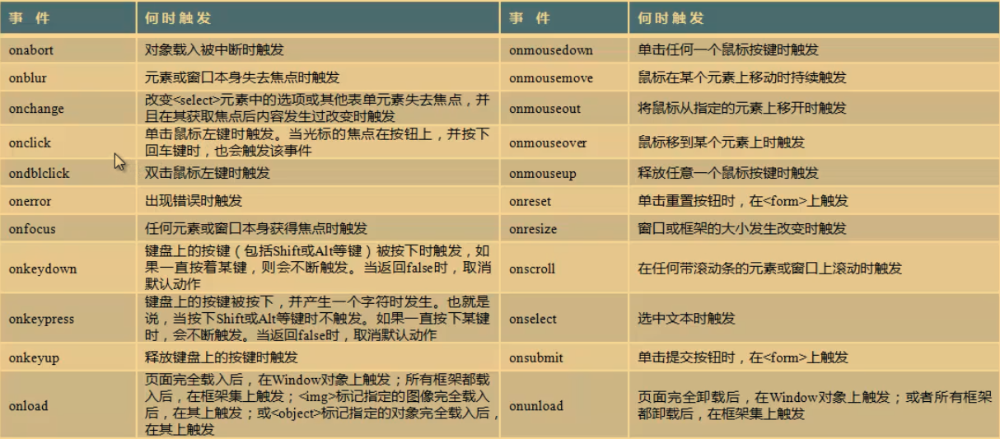
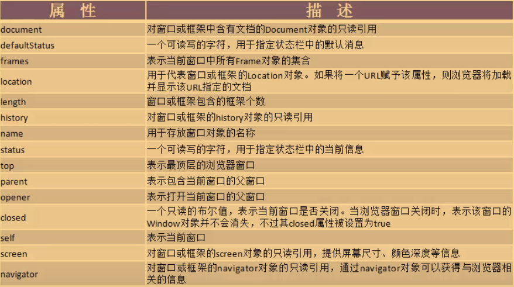

# 导入JavaScript
- 内置
```html
<script type="text/javascript">
    function doDel(id){
        if(confirm("Are you sure to del?")){
            window.location = 'action.php?action=del&id='+id;
        }
    }
</script>
```
- 外部文件
```html
<script type="text/javascript" src="01.js"></script>
```
- 内嵌
```html
<input name="btn" type="button" value="弹出消息框" onclick="javascript:alert('欢迎你');"/>
```

# 事件



# Window对象

- 所有对象的顶级对象

- 不需要实例化, 直接用



# 坑:hole:

- 一个html元素只能指定一个id, 不然js通过id来控制这个元素的时候会出现问题
- [form表单验证失败，阻止表单提交](https://www.cnblogs.com/yz-blog/p/6632227.html)
- id的名字最好和函数名, 类名什么的意义, 太tm坑了 [TypeError: xxx is not a function](https://blog.csdn.net/qq_25407771/article/details/81103604)
- 