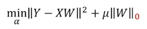

- 几何层面上的理解能让你知道要用什么工具, 以及为什么会有用, 以及结果为什么会这样; 数值层面上的理解能让你顺利使用这些工具
- 线性代数围绕两种基本运算: 向量加法（vector addition）和标量数乘（scalar multiplication） 

# 向量&矩阵

## 线性

- 严格的线性性质: 可加性, 成比例

  

  - L() 应该代表线性变换
  - 比如等距分布的点经过线性变换后仍保持等距分布

### 线性组合

> linear combination

- 为什么叫线性呢？如果你固定其中一个标量，让另一个标量自由变化，这两个向量合起来指向的终点会描出一条直线；如果让两个标量同时自由变化，就能够得到所有可能的向量。
- 为什么要定义基向量呢？随便找两个向量不就能表达任何向量了吗？因为如果这两个向量刚好共线或者是零向量就不妙了。

- 给定向量线性组合的向量集合称为给定向量张成的空间(span)
- 张成空间（span）：如果共线，span就是一条线
- span其实就是仅通过vector addition和scalar multiplication这两种基础运算能获得的所有向量集合

### 线性相关

> linearly dependent

如果有3个**随机的**向量，这么这3个向量的组合能包含3维空间内的所有向量。

如果一个向量可以表示为其他向量的线性组合，因为这个向量已经落在向量张成空间中，那么它们**线性相关**

如果所有向量都给张成空间添加了新的维度，那么这些向量**线性无关**。

### 线性变换

> linear transformation

线性变换需要具有以下两条性质：

1. all lines must remain lines, without getting curved. 保持坐标网格线平行且等距分布 (parallel and evenly spaced)
2. the origin must remain fixed in place. 原点保持不动

比如旋转坐标，剪切（Shear，就是将网格倾斜），拉伸或挤压坐标轴等

- 需要满足那两个性质的原因是: 向量v是基向量i, j的特定线性组合, 变换后v也是i, j同样的线性组合. 已知变换前v和i, j的关系, 根据变换后的i, j就可以推断变换后的v

- 例子: i从(1,0)变到(1, -2); j从(0, 1)变到(3, 0). 二维线性变换仅由4个数字完全确定

  

- 把图中绿色部分看作是第一个基向量变化后的样子, 红色部分看作是第二个基向量变化后的样子. 
- 没有变换的情况, 也就是 $\begin{bmatrix} x \\ y \end{bmatrix}$ 表示在普通直角坐标系中（基向量是$\begin{bmatrix} 1 \\ 0 \end{bmatrix}$，$\begin{bmatrix} 0 \\ 1 \end{bmatrix}$）$x\cdot \begin{bmatrix} 1 \\ 0 \end{bmatrix} + y \cdot \begin{bmatrix} 0 \\ 1 \end{bmatrix}$ 后的向量

- 更多例子

  

  - $\begin{bmatrix} 1 \\ 0 \end{bmatrix}$是新坐标的一个基向量，$\begin{bmatrix} 1 \\ 1 \end{bmatrix}$ 是另一个基向量，$\begin{bmatrix} x \\ y \end{bmatrix}$ 要从原来的普通直角坐标转成这个新的坐标，就只要乘以$\begin{bmatrix} 1&1 \\ 0&1 \end{bmatrix}$就可以了。

  - $\begin{bmatrix} 1&0 \\ 0&1 \end{bmatrix}\begin{bmatrix} x \\ y \end{bmatrix} = \begin{bmatrix} x \\ y\end{bmatrix}$ 知道为什么结果是这样了吧？因为$\begin{bmatrix} 1&0 \\ 0&1 \end{bmatrix}$是普通的直角坐标系。
  - 矩阵（如$\begin{bmatrix} 1&1 \\ 0&1 \end{bmatrix}$ ）可以看作是对空间的一种特定变换（transformation of space），而由于新坐标的网格线具有平行且等距分布，原点不动的性质，要想得到向量$\begin{bmatrix} x \\ y \end{bmatrix}$变换后的结果，只要让$x，y$乘以变换后的新的基向量（如$\begin{bmatrix} 1&1 \\ 0&1 \end{bmatrix}$ ）

图中绿橙两个基向量是线性无关的，如果是线性相关，那就成一条直线了，如下面所示

矩阵向量乘法就是计算**线性变换作用于给定向量**的一种途径。可以把矩阵解读为对空间的一种特定变换

#### 复合变换

> 旋转和剪切（Shear）两种线性变换同时使用，就是“复合变换”

$\begin{bmatrix} x \\ y \end{bmatrix}$乘以一个旋转后的新坐标，再乘以一个剪切后的新坐标，效果等同于直接乘以一个已经旋转剪切过的新坐标。

- 可以看出，两个矩阵相乘相当于对原坐标做了两次线性变换。建议每次计算矩阵乘法的时候可以想想这个。

- BTW：$\begin{bmatrix} 0&-1 \\ 1&0 \end{bmatrix}$ 是旋转矩阵，原来的两个基坐标是(1, 0) (0, 1) ，变成了(0, 1) (-1, 0)，画下图就知道旋转了90°

##### 性质

有了几何层面的理解, 有时候一些证明不需要矩阵的运算就能得证, 比如: 

1. **矩阵相乘的时候，顺序会影响结果**, 证明如下

    

   将这两个动作叠加，顺序不同，结果不同

   

2. **(AB)C=A(BC)​ 证明矩阵乘法符合结合律**

   等式左边可以看作先执行$C$变换，再执行$AB$两个迭加变换；等式右边可以看作先执行C变换，再B变换，最后A变换。整个的顺序没有变，所以就应该相等。

#### 基变换

- 假设有一个叫Jennifer的网格, 她的基向量为(2, 1)和(-1, 1) (这两个坐标是用我们的语言描述的, 如果是用Jennifer的语言的话, 那么她的基向量依然是(1, 0), (0, 1)). 

  - 下面这个矩阵作用是将一个用Jennifer的语言描述的向量, 转化为用我们的语言来描述. 这个矩阵是用我们的坐标来描述Jennifer的基向量. 

    

    
    
    例如: 下面这个向量, 在Jennifer的语言中是(-1, 2). 乘以上面那个矩阵, 得到(-3, 1), 这个是用我们的语言描述这个向量的. 

  

  - 下面这个矩阵上面那个矩阵的逆, 作用是将一个用我们的语言描述的向量, 转化为用Jennifer的语言来描述. 

    

    
  
    例如: 下面这个向量, 在我们的语言中是(3, 2). 乘以上面那个矩阵, 得到(5/3, 1/3), 这个是用Jennifer的语言描述这个向量的.
    
    
  
    用Jennifer的语言描述
    
    

#### $A^{-1}MA$

> $A^{-1}MA$暗示一种数学上的转移作用. 
>
> 中间$M$代表一种你所见的变换, 比如旋转
>
> 外侧两个矩阵代表转移作用, 也就是视角上的转化
>
> 整个仍然代表同一个变换$M$, 只不过是从其他人的角度来看的, **用其他人的语言描述**的
>
> 如果是反过来的, 最后是要用我们的语言的话那就是$AMA^{-1}$, 可以参见特征向量中求矩阵的幂的例子. [如何利用特征向量和对角矩阵求变换矩阵的100次幂](https://www.zhihu.com/question/279480476)

例子: 

我们的语言描述逆时针旋转90°的矩阵是$\begin{vmatrix}
  0 & -1 \\
  1 & 0
  \end{vmatrix}$, 表示我们的基向量的变化, 如要用于Jennifer的坐标的话, 需要变为描述Jennifer基向量的变化. 最终这个$A^{-1}MA$的作用是: 

- 输入: 用Jennifer语言描述的向量
- 输出: 旋转后的用Jennifer语言描述的向量

这个$A^{-1}MA$是: 

从右到左分别是: 

1. 向量v是用Jennifer语言描述的向量
2. 基变换矩阵, 将向量转化为用我们的语言描述, 其中列代表的是用我们的语言描述Jennifer的基向
3. 线性变换矩阵, 旋转矩阵, 矩阵是用我们的语言描述的
4. 基变换矩阵, 将向量转化为用Jennifer语言描述

- 计算三个矩阵的乘积会得到$\begin{vmatrix}
    1/3 & -2/3 \\
    5/3 & -1/3
    \end{vmatrix}$, 这其实也是用Jennifer语言描述的, Jennifer的基向量旋转后的样子

- 旋转前

  

  旋转后

  

#### 三维空间

这种3个基向量互相垂直的坐标可以用$\begin{bmatrix} 1&0&0 \\ 0&1&0\\0&0&1\end{bmatrix}$表示，3个基向量的坐标分别是(1,0,0)、(0,1,0)、(0,0,1)

一个例子

绕y轴旋转90° (红色的保持不变)

向量和矩阵的乘法和二维空间的同理

矩阵和矩阵的乘法也和二维空间的类似

相当于两次坐标变换的复合

## 向量

- 函数

  - 函数也具有向量的特性, 实际上是另一种向量

  - 两个函数相加得到新函数, 就跟两个向量相加得到新向量, 只不过函数有无穷个坐标要相加, 数乘也一样

  - 函数的线性变换的例子: 导数

    

    

    

什么是向量, 只要有以下性质的都是, 不管是空间中的箭头, 一组数, 函数的集合, 线性代数中所有关于向量, 线性变换和其他的概念都适用于它. 这些类似向量的事物(箭头, 一组数, 函数)构成的集合被称为“向量空间”

比如线代中的点积, 对应函数的内积, 特征向量对应特征函数, 

## 逆矩阵

- 相当于逆变换

### 几何解释

- 行列式为0时, 说明变换后空间被降维, 被压缩到更低的维度上, 就没有逆变换, 因为有的信息已经丢失, 无法将一条线“解压缩”成一个平面

- 先来看看这个

  

  要计算这个二元一次方程，可以想象成是某个向量x经过矩阵A的变换后得到了向量v

  这里的A要分成两种情况，一种是行列式为0，一种是不为0

  - det(A) != 0

    - $A^{-1}A = \begin{bmatrix} 1&0 \\ 0&1 \end{bmatrix}$, $A^{-1}$是$A$的逆操作(inverse transformation)，x通过A变换得到v，那么v通过A的逆变换$A^{-1}$就得到x，方程得解：$\vec{x} = A^{-1}\vec{v}$

  - det(A) == 0

    - 如果A的行列式为0的话，执行A变换后就降维了，也就没有逆变换，因为信息已经丢失，你无法将一个低维的东西解压缩为高维的。或者说这不是一个函数能做的（函数只有一个输入，一个输出，映射才能多个输出）

    - 一个函数不能将转成这个

    - 解

      

### 计算

### 特征

可逆的等价命题

## 列空间

> column space / span of column
>
> 矩阵的列向量张成的空间

- 零向量一定能会被包含在列空间中 (因为线性变换必须保持原点位置不变)

## 秩

> rank
>
> 代表变换后列空间的维数
>
> 用初等行变换将矩阵A化为阶梯型矩阵, 则矩阵中非零行的个数就是这个矩阵的秩

- 2*2的矩阵, 秩最大是2; 3\*3的矩阵, 秩为2意味着空间被压缩了
- 当矩阵的秩小于方程组未知数的个数时, 方程有无数个解
- 当矩阵的秩等于方程组未知数的个数时, 方程有唯一解

### 满秩 

> full rank
>
> 矩阵的秩和矩阵的列向量的个数相等

- 对于满秩变换来说, 唯一能在变换后落在原点的就是零向量自身; 

- 对于非满秩变换来说 (把空间压缩到一个更低的维度上) , 可能会有一系列向量在变换后变成零向量

  
  
  (上图是蓝绿色的线条被压缩到一条直线的过程, 同时黄色线上的向量最后都变成零向量)
  
- 列满秩矩阵: 矩阵的列向量组都是线性无关的

## 零空间

> null space / kernel 核
>
> 变换后落在原点(零向量)的向量的集合称为矩阵的“零空间”或“核”

- 零空间一定包含零向量, 因为不管是满秩变换还是很非满秩变换, 零向量始终在原点
  - 一个二维线性变换将空间压缩到一条直线上, 那么沿某个不同方向直线上的所有向量就被squished到原点(如上图)
  - 一个三维线性变换将空间压缩到一个平面上, 会有一整条线上的向量在变换后落在原点
  - 一个三维线性变换将空间压缩到一条线上, 会有一整个平面上的向量在变换后落在原点 [link](https://www.bilibili.com/video/BV1ys411472E?p=8)
- 解 $A \overrightarrow{x}=\overrightarrow{v}$ 的时候, 如果 $\overrightarrow{v}$ 是零向量, 零空间给出的就是这个向量方程所有可能的解

## 非方阵

- 和之前矩阵代表的意思一样, 两列分别表示原来平面上的两个二维基向量变换后的位置. 
- 几何意义: 将二维空间映射到三维空间上, 因为矩阵有两列表明输入空间有两个基向量; 有三行表明每个基向量在变换后需要用三个独立的坐标描述
- 这个矩阵的列空间是一个三维空间中过原点的二维平面. 秩还是2. 
- 这个矩阵是满秩的, 因为秩 (变换后列空间的维数) 和矩阵的列向量的个数相等. 

- 几何意义: 矩阵有三列表明原始空间有三个基向量, 原始空间是三维的, 两行表明这三个基向量在变换后仅需两个坐标描述, 这三个基向量都落在一个二维平面上

## 条件数

>  
>
> 是一个矩阵（或者它所描述的线性系统）的稳定性或者敏感度的度量
>
> 如果一个矩阵的 condition number 在1附近，那么它就是well-conditioned的，如果远大于1，那么它就是 ill-conditioned 的，如果一个系统是 ill-conditioned 的，它的输出结果就不要太相信了（因为这个系统对输入太过敏感了，有时甚至计算机的存储误差对结果都会有显著的影响）
> [link](https://blog.csdn.net/qq_32742009/article/details/81638588)

[【数学基础】L2范数之解救矩阵病态](https://blog.csdn.net/qq_32742009/article/details/81638588)

- 用奇异值描述更好

### 病态

- 由来
  - 个人的看法：

    线性系统 Ax = b 为什么会病态？归根到底是由于 **A 矩阵列向量（行向量相关性大应该也有关系）线性相关性过大**，表示的特征太过于相似以至于容易混淆所产生的。举个例子, 现有一个两个十分相似的列向量组成的矩阵 A：

    

  - 在二维空间上，这两个列向量(列向量就是空间中所谓的基向量)夹角非常小。假设第一次检测得到数据 b = [1000, 0]^T, 这个点正好在第一个列向量所在的直线上，解集是 [1, 0]^T。现在再次检测，由于有轻微的误差，得到的检测数据是 b = [1000, 0.001]， 这个点正好在第二个列向量所在的直线上，解集是 [0, 1]^T。两次求得到了差别迥异的的解集。

- 病态矩阵缺点
  1. 系统太过敏感，无论是略微对A矩阵进行一点改动还是对b矩阵进行一点改动，都会对解x产生较大的影响。此时系统得出的结果通常不可信
  2. 如果矩阵是病态矩阵，则在迭代法中，解的收敛非常缓慢

## 运算

### 点积

> Dot product

- 结果为[标量](https://zh.wikipedia.org/wiki/标量)

- 如果两个向量的夹角小于90°，结果为正，夹角等于90°，结果为零，否则结果为负

#### 几何层面理解

- 为什么对应坐标相乘并将结果相加和投影有所联系? 

  - 总结: 两个向量点乘, 就是将其中一个向量转化为线性变换. 向量和线性变换是对偶的

  1. 

     首先用1*2的矩阵做变换和点乘的运算有点相似 (1\*2的矩阵就像一个倾倒的向量). 

     向量被压缩到一根数轴上, 只有一个值

  2. 思路: 寻找 将向量转化为数的线性变换 和 这个向量本身 的联系, 在几何层面上

  3. 要将向量投影到图中黄色向量($\hat{u}$)所在的数轴上, 需要找一个变换矩阵(投影矩阵), 将空间线性变换, 压缩到那条数轴上

     

  4. 根据对称性, x轴的基向量i投影到数轴上的数值刚好就是$\hat{u}$投影到x周的数值, 也就是$\hat{u}$的横坐标. y轴同理. 

     

     所以最终投影矩阵就是

     

     空间中的任意向量和这个投影矩阵相乘就得到投影到数轴上的数值. 

     由于这个矩阵刚好就是$\hat{u}$的坐标, 所以**单位向量的点积可以解读为将向量投影到单位向量所在的直线上所得到的长度**

     

  5. 如果是投影到非单位向量所在直线, 矩阵会变为比如

     

     基向量也都变为原来的3倍. 向量与给定非单位向量的点积可以解读为先朝给定向量上投影, 然后将投影的值与给定向量长度相乘

- 一个启发:

  

  如果看到一个线性变换 (右边) 输出空间是一维数轴, 空间中会存在唯一的向量v与之相关, 使得应用线性变换和与向量v做点积的结果一样

- 对偶性: 一个向量的对偶是<u>由它定义的线性变换</u> (投影到那个向量所在的数轴); 一个多维空间到一维空间的线性变换的对偶是<u>多维空间中的某个特定向量</u>. 

### 叉积

- 计算

  - 二维向量的叉积

    

    - 两个二维向量的叉积的绝对值等于这两个向量围成的四边形的面积
    - 结果是一个数

  - 三维向量的叉积

    

    - i, j, k是三个轴对齐的单位向量, 是三个相互垂直的向量。它们刚好可以构成一个坐标系
    - 结果不是一个数, 是一个向量, 
      - 长度是向量v和w构成的四边形的面积
      - 方向是与向量v和w垂直(右手法则)

#### 几何层面理解

> 理解叉积的计算过程和几何含义之间的关系

1. 已知向量v和向量w, 根据v和w定义一个三维到一维(数轴)的线性变换

   

   函数得到这三个向量构成的平行六面体的体积, 然后根据方向确定正负号. 且这个函数是线性的 (向量v, w确定六面体的底面积, 变量确定高, 所以高会和体积等比例变化). 

2. 找到它的对偶向量: 这个变换会与三维空间的一个向量关联

   因为它是线性的, 所以可以通过矩阵乘法来描述这个函数. 

   

   由于对偶性, 多维空间到一维空间的线性变换矩阵可以看作与这个特定向量的点积. 要找的就是这个向量, 称为p. 

   向量p与其他任一向量(x, y, z)的点积等于一个3*3矩阵的行列式. 

   

3. 说明这个对偶向量就是v×w

   

   可以看出p就是v×w的结果. 现在要求p

4. 求p

   

   右边行列式的结果是(x, y, z)和v和w确定的平行六面体的有向体积

   p点乘(x, y, z)的几何意义是<u>将(x, y, z)投影到p上的长度</u>乘以<u>p的长度</u>. <u>将(x, y, z)投影到p上的长度</u>相当于六面体的高, <u>p的长度</u>就应该是六面体底面积的大小, 也就是v和w构成的平行四边形的面积. p点乘(x, y, z)得到的也就是六面体的体积了! 

### 求幂/对角化

> 用特征基的方式

[如何利用特征向量和对角矩阵求变换矩阵的100次幂](https://www.zhihu.com/question/279480476)

- 前提条件: 矩阵A有n个线性无关的特征向量, 则A和某个D相似
- 
- 对角矩阵(只有对角线上的元素非0)所有的基向量都是特征向量, 矩阵的对角元是它们所属的特征值

- 对角阵有一个好处就是与自己多次相乘的结果很容易计算, 因为对角阵仅仅让基向量与某个特征值相乘. 比如应用矩阵(对角阵)乘法100次, 其实相当于每个基向量与对应特征值的100次幂相乘. 如果是应用非对角阵, 会很难计算, 但是如果这个矩阵有多个特征向量, 如下, 可以张成全空间(span the full space), 那么可以将你原来的坐标系的基变为这些特征向量

用特征向量来做基

(参见基变换, 特征向量) 

假设用新基描述向量的新语言称为N语言, 等号左边从右到左依次是: 

1. 基变换矩阵, 矩阵的列是N语言的基向量, 但是这些向量是用我们的语言描述的, 矩阵的作用是做一个线性变换, 将N语言转为我们的语言(就是说如果有一个向量是用N语言描述的, 乘上这个矩阵后就变成用我们的语言描述的了)
2. 线性变换矩阵, 这个是我们要算的, 也是用我们的语言描述的, 所以要先转化为我们的语境
3. 基变换矩阵, 再将我们的语境转为N语言的语境. 
4. 最后得到的矩阵是对角阵. 可以看出这个变换在N语言的语境中其实就是一次拉伸而已. 

等号左边从右到左依次是: 

1. 基变换矩阵, 将我们的语境转为N语言的语境, 好在N语言的语境下去做变换, 因为这个变换在N语言的语境下做变换更容易
2. 做变换
3. 将N语言的语境转为我们的语境, 最后会得到在我们的语境下描述的第二步那个变换. 

理清楚上面这两步就容易了. 

#### 正交对角化

- 如果一个矩阵可以被正交对角化, 那么这个矩阵一定是对称矩阵

### 求导

看GAMES102笔记, 岭回归的求解, 矩阵求导

[link](https://wenku.baidu.com/view/f7fa307a580216fc700afdb9.html)

### 乘法

#### 克莱姆法则

求解 (用符号表示为**Ax**=**v**), 3B1B的思路: 

1. 首先假设矩阵A的行列式不为0, 不然要么无解, 要么有无穷解

2. 

   如果是这样就好了, $[1,0]^T$表示原来的基向量, $T([1,0]^T)$ 表示将原来的基向量做一种变换得到新的基向量, 也就是$[3,-1]^T$, 另一个基向量同理. 但是这种假设不成立, 只有正交变换, 变换前后的点积才会一样
   
   
   
   比如旋转就是正交变换, 就可以这样求x, y
   
   
   
3. 按照上面的思路, 寻找一种和x, y有关的几何关系, 在变换前后保持不变, 类似上面的点积的东西

4. 行列式, 面积

   变换前的y, 用面积值来表示, x也同理, 用另一个基向量, 注意要考虑正负

   

   三维的也类似, 底面积是1, 用体积值来表示x, y, z, 正负通过右手法则判断
   
5. 虽然变换后面积会变, 但是是成比例地变. 原来的面积是y, 经过A变换后, 新面积就是det(A)y, A已知, 新面积(图中的Area)可以算, y就可以求出来了

   

6. 同理求出x

   

7. 高维的类似

   

   

   

#### 高斯消元法

### 正交变换

- 变换前后两个向量点积的结果不会变
- 基向量在变换后依然保持单位长度, 且互相垂直
- 比如旋转矩阵就是正交矩阵

## 特征值&特征向量

> eigen 
>
> 几乎所有的向量在乘以矩阵A后都会改变方向，某些特殊的向量x和Ax位于同一个方向，它们称之为特征向量
>
> Ax=λx
>
> 数字λ称为特征值. 它告诉我们在乘以A后, 向量是怎么被拉伸, 缩小, 反转或者不变的. 

- λ=0意味着特征向量存在于矩阵的零空间中. 
- 任意向量都是单位矩阵的特征向量. 因为Ix=x, 其特征值为1x

求特征向量的过程

1. 

2. 

   当矩阵$(A-λI) $代表的变换将空间压缩到更低的维度的时候, 就有可能将一个向量压缩为零向量. 而根据空间压缩能够推出$(A-λI)$的行列式为0. 求出λ

3. 求特征值

   

### 性质

- 特征向量和零向量一起组成了$(A-λI) $的零空间, 也叫做特征空间 $E_\lambda$ 

- det($(A-λI) $) 是一个关于λ的n次方程, λ有n个解

- 对于一个方针的特征值都是实数且各不相同, 其特征值称为简单特征值. 有相同特征值的叫做多重特征值. 特征值是复数, 称为复数特征值

  - 简单特征值重数都是1. 每个特征值对应一个特征空间, 特征空间是一维的(2*2矩阵). 
  - 旋转矩阵特征值是复数. 
  - 多重特征值所对应的特征空间的维数不固定. 
    - 单位矩阵(2*2为例)的特征值是二重特征值, 特征向量不再是直线, 而是一个二维平面. 代数重数是2, 几何重数是2
    - 如果矩阵是非满秩变换, 几何重数小于代数重数, 特征空间是一维的
  - 如果矩阵A的某个特征值的重数=k, 则对应的特征空间的维度<=k. 几何重数不大于代数重数
  - 几何重数等于代数重数, k重相同特征值的特征空间为k维

- 如果要特征向量非零, A不可逆

  

- 对角矩阵, 上, 下三角矩阵的特征值是其对角线上的元素

  

- 若λ是A的特征值, 则λ^m 是A^M的特征值 (证明: bobobo线代13-3)
- 如果矩阵A含有两个不同的特征值, 则他们对应的特征向量线性无关

## 相似矩阵

> 如果矩阵A, B满足 $A=P^{-1}BP$, 则称A和B相似

- A, B两个矩阵是相似的, 是从不同的视角观察相同的内容. 
- A和B的特征方程相同, 特征值相同

## 对称矩阵

> 完美

- 性质
  - 特征值一定是实数
  - 对称矩阵的多重特征值, 其对应的特征空间的维度一定等于重数 (想想单位矩阵), 即几何重数等于代数重数
  - 一定有n个线性无关的特征向量->一定可以被对角化
  - 所有不同的特征值对应的特征向量互相垂直
  - 一定可以被正交对角化. 

Q代表标准正交矩阵 

## 对角矩阵

> diagonal matrix
>
> 矩阵的对角元是它们所属的特征值

## 正交矩阵

> 按列看所有向量都互相垂直

### 标准正交矩阵

- Q^-1 = Q^T

# 行列式

> 

- n阶行列式是n!项的代数和
- n阶行列式的每项都是位于不同行, 不同列n个元素的乘积
- $a_{1p_1}a_{2p_2}...a_{np_n}$的符号为$(-1)^t$. $t$是$p_1p_2...p_n$的[逆序数](https://baike.baidu.com/item/%E9%80%86%E5%BA%8F%E6%95%B0#:~:text=%E4%B8%80%E4%B8%AA%E6%8E%92%E5%88%97%E4%B8%AD%E9%80%86%E5%BA%8F%E7%9A%84,%E8%BF%99%E4%B8%AA%E6%8E%92%E5%88%97%E7%9A%84%E9%80%86%E5%BA%8F%E6%95%B0%E3%80%82)
  - eg. $a_{13}a_{21}a_{32}$中$t(312)=2$, 偶排列, 是正号
- n阶行列式可简记为$D_n$或$det(a_{ij})$

## 几何层面解释

### 二维空间

**行列式的绝对值能表示变换对空间拉伸或挤压了多少**

一个1*1的矩形在坐标发生变换后($\begin{bmatrix} 3&0 \\ 0&2 \end{bmatrix}$, 表示x轴拉伸3倍，y轴拉伸2倍)，就变成了下面这样。

这个矩形的面积被拉伸了6倍，行列式算出来就是6

如果两个基坐标线性相关，那么这个平面就被压扁了, 行列式算出来就是0

如果算出来是负的，那就要把坐标翻转，橙色向量跑到了绿色向量的右边

#### 计算

推导过程

### 三维空间

得到平行六面体的面积

被压扁的情况

行列式是正的时候, 基向量构成右手定则的坐标系, 负的时候是左手定则

#### 计算

### 性质

- $det(M_1M_2) = det(M_1)det(M_2)$: 根据行列式的含义顺理成章就得证

## 定理

- 定理1 一个排列中的任意两个元素对换,排列改变奇偶性
  - 推论: 奇排列变成标准排列的次数为奇数，偶排列变成标准排列的次数为偶数

## 性质

- 说明: 行列式中行与列具有同等的地位,因此行列式的性质凡是对行成立的对列也同样成立

- 推论: 如果行列式有两行（列）完全相同，则此行列式为零

  

## 计算

## 余子式

> 矩阵余子式 matrix of minors
>
> 矩阵代数余子式 matrix of cofactors
>
> 

# 数值分析

## 范数

[几种范数的简单介绍](https://blog.csdn.net/shijing_0214/article/details/51757564)

- 距离的定义是一个宽泛的概念，只要满足非负、自反、三角不等式就可以称之为距离 [上海交通大学公开课：数学之旅-函数空间](https://open.163.com/newview/movie/free?pid=M8PTB0GHI&mid=M8PTBUHT0)

- 范数是一种强化了的距离概念，它在定义上比距离多了一条数乘的运算法则(如下(2))。有时候为了便于理解，我们可以把范数当作距离来理解, 看成是到零点的距离多了第(2)条

  

  $R^n$ 表示向量空间

- 在数学上，范数包括向量范数和矩阵范数

  - 向量范数表征向量空间中向量的大小
  - 矩阵范数表征矩阵引起变化的大小
  - 一种非严密的解释
    - 对应向量范数，向量空间中的向量都是有大小的，这个大小如何度量，就是用范数来度量的，不同的范数都可以来度量这个大小，就好比米和尺都可以来度量远近一样
    - 对于矩阵范数，我们知道，通过运算AX=B，可以将向量X变化为B，矩阵范数就是来度量这个变化大小的

- 范数可以定义距离, 距离不可以定义范数(热带水果是水果, 水果不是热带水果, 范数比距离多了个东西, 已经不相等了). 

  

- L0范数：向量中非零元素的个数
- L1范数：向量中各个元素绝对值的和
- L2范数：向量中元素平方的和，再开方；即向量的模长

### L-P

与闵可夫斯基距离的定义一样，L-P范数不是一个范数，而是一组范数，其定义如下：
$$
Lp=\sqrt[p]{\sum\limits_{1}^n x_i^p}，x=(x_1,x_2,\cdots,x_n)
$$
根据P 的变化，范数也有着不同的变化，一个经典的有关P范数的变化图如下： 

上图表示了p从无穷到0变化时，三维空间中到原点的距离（范数）为1的点构成的图形的变化情况。以常见的L-2范数（p=2）为例，此时的范数也即欧氏距离，空间中到原点的欧氏距离为1的点构成了一个球面。

### L0

当P=0时，也就是L0范数，由上面可知，L0范数并不是一个真正的范数，它主要被用来度量向量中非零元素的个数。用上面的L-P定义可以得到的L-0的定义为：
$$
||x||=\sqrt[0]{\sum\limits_1^nx_i^0}，x=(x_1,x_2,\cdots,x_n)
$$
这里就有点问题了，我们知道非零元素的零次方为1，但零的零次方，非零数开零次方都是什么鬼，很不好说明L0的意义，所以在通常情况下，大家都用的是：
$$
||x||_0=(i|x_i\neq 0)
$$
表示向量$x$中非零元素的个数。

对于L0范数，其优化问题为：
$$
min||x||_0\;\;s.t. Ax=b
$$
在实际应用中，由于L0范数本身不容易有一个好的数学表示形式，给出上面问题的形式化表示是一个很难的问题，故被人认为是一个NP难问题。所以在实际情况中，L0的最优问题会被放宽到L1或L2下的最优化。

### L1

L1范数是我们经常见到的一种范数，它的定义如下：
$$
||x||_1=\sum_i|x_i|
$$
表示向量$x$中非零元素的绝对值之和。

L1范数有很多的名字，例如我们熟悉的曼哈顿距离、最小绝对误差等。使用L1范数可以度量两个向量间的差异，如绝对误差和（Sum of Absolute Difference）：
$$
SAD(x_1,x_2)=\sum_i|x_{1i}-x_{2i}|
$$
对于L1范数，它的优化问题如下：
$$
min ||x||_1 \;\;s.t. Ax=b
$$
由于L1范数的天然性质，对L1优化的解是一个稀疏解，因此L1范数也被叫做稀疏规则算子。

**通过L1可以实现特征的稀疏，去掉一些没有信息的特征**，例如在对用户的电影爱好做分类的时候，用户有100个特征，可能只有十几个特征是对分类有用的，大部分特征如身高体重等可能都是无用的，利用L1范数就可以过滤掉。

相当于是绕着天安门城墙走折线距离 [上海交通大学公开课：数学之旅-函数空间-网易公开课 (163.com)](https://open.163.com/newview/movie/free?pid=M8PTB0GHI&mid=M8PTBUHT0)

### L2

L2范数是我们最常见最常用的范数了，我们用的最多的度量距离欧氏距离就是一种L2范数，它的定义如下：
$$
||x||_2=\sqrt{\sum_ix_i^2}
$$
表示向量元素的平方和再开平方。 像L1范数一样，L2也可以度量两个向量间的差异，如平方差和（Sum of Squared Difference）:
$$
SSD(x_1,x_2)=\sum_i(x_{1i}-x_{2i})^2
$$
对于L2范数，它的优化问题如下：
$$
min ||x||_2\;\;s.t. Ax=b
$$
L2范数通常会被用来做优化目标函数的正则化项，防止模型为了迎合训练集而过于复杂造成过拟合的情况，从而提高模型的泛化能力

### L-∞

当P=∞ 时，也就是L-∞ 范数，它主要被用来度量向量元素的最大值。用上面的L-P定义可以得到的L∞的定义为：
$$
||x||_\infty=\sqrt[\infty]{\sum\limits_1^nx_i^\infty}，x=(x_1,x_2,\cdots,x_n)
$$
与L0一样，在通常情况下，大家都用的是：
$$
||x||_\infty=max(|x_i|)
$$
来表示$L\infty$

## 找函数方法论

### 到哪找

- 空间(拓扑空间, 赋范空间, 巴纳赫空间, 希伯特空间[上海交通大学公开课：数学之旅-函数空间-网易公开课 (163.com)](https://o pen.163.com/newview/movie/free?pid=M8PTB0GHI&mid=M8PTBUHT0))一定要弄清楚元素是什么, 规则是什么

-  

- 确定函数的表达形式(函数集, 空间). 选择一个函数空间

  - 线性函数空间 $A=span\{B_0(x), ..., B_n(x)\}$ (B表示基函数, 空间中的任何一个元素都可以用基表示)
  - 根据求解问题的领域, 在某一类函数中去找, 比如
    - 多项式函数 $span\{1, x, x^2, ..., x^n\}$
    - RBF函数 
    - 三角函数, 傅里叶级数: 有周期性
    - 
  - 确定了用某一类函数后, 就变成了找系数的问题. 待定基函数的组合系数(求解变量) $f_\lambda(x) = \sum_{k=0}^n\lambda_ib_i(x)$ 
  - 基函数要足够的广, 比如一个很复杂的函数, 但是如果只用三次函数去逼近, 效果就不好

- 空间的完备性: 这个函数空间是否可以表示(逼近)任意函数

  - 比如多项式函数空间的n趋向正无穷的时候, 可以逼近任意函数 (Weierstrass 逼近定理)

    

### 找哪个

- 度量那个函数是好的/"最好"的. 就是找损失函数
  - 如果要求函数经过每个点, 那就是插值
  - 如果要求函数尽可能靠近数据点, 那就是拟合
- 优化模型 (最小化问题)
- 能量项 = 误差项 + 正则项
- 统计模型, 规划模型... 来描述函数

### 怎么找

- 求解或优化: 不同的优化方法与技巧, 既要快, 又要好. 
- 求解误差函数的驻点 (导数为0之处)
- 转化为系数的方程组
  - 如果是欠定的(有无穷多解), 则修正矩阵
    - 改进/增加各种正则项: Lasso, 岭回归, 稀疏正则项
    - 返回修改模型 
- 拟合问题:
  - 目标: 函数尽量靠近数据点
    - $min\sum_{i=0}^n(y_i-f(x_i))^2$
  - 最小二乘法: 对各系数求导, 得法方程(Normal Equation)(线性方程组)
    - $AX=b$ 
- 插值问题: 
  - 目标: 函数要经过每个数据点
  - 联立, 求解线性方程组
    - n次lagrange插值多项式: 插值n+1个点, 次数不超过n的多项式是存在且是唯一的
  - 但是自由度不够高

## 插值函数

- 插值函数的自由度 = 未知量个数 - 已知量个数

- 存在的问题
  - 系统矩阵稠密, 求解慢

  - 依赖于基函数选取, 矩阵可能病态, 导致难于求解(求逆) 

    

  - 多项式插值问题是病态的

    

    - 条件数condition number

- 虽然能拟合所有函数(Weierstrass定理), 但是多项式插值不稳定, 控制点微小变化可导致完全不同的结果

- 振荡(Runge)现象, 多项式随着插值点数增加而摆动

**定义**： $f(x)$ 为定义在区间 $[a,b]$ 上的函数， $x_0,x_1,\cdots,x_n$ 为区间上 $n+1$ 个互不相同的点， $\Phi$ 为给定的某一函数类。求 $\Phi$ 上的函数 $\phi(x)$ ，满足：
$$
\phi(x_i)=f(x_i), \ \ i=0,1,\cdots,n\phi(x_i)=f(x_i), \ \ i=0,1,\cdots,n
$$
则称 $\phi(x)$ 为 $f(x)$ 关于节点 $x_0,x_1,\cdots,x_n$ 在 $\Phi$ 上的插值函数。称 $x_0,x_1,\cdots,x_n$ 为插值节点，称 $(x_i,f(x_i))$ 为插值点。

### 多项式插值定理

**定理**：若 $x_i$ 两两不同，则对任意给定的 $y_i$ ，存在唯一的次数至多是 $n$ 次的多项式 $p_n$ ，使得 $p_n(x_i)=y_i，i=0,\cdots,n$ 。

证明：在幂基 $\lbrace 1,x,\cdots,x^n \rbrace $ 下待定多项式 $p$ 的形式为：

$$
p(x)=a_0+a_1x+a_2 x^2+\cdots+a_n x^n
$$

由插值条件 $p(x_i)=y_i,i=0,\cdots,n$ ，得到如下方程组, 求解 $\bold{α}$：

$$
\left( \begin{array} {c} 1 &x _ 0 &x _ 0^2 &\dots &x _ o^n \newline 1 &x _ 1 &x _ 1^2 &\dots &x _ 1^n \newline 1 &x _ 2 &x _ 2^2 &\dots &x _ 2^n \newline \vdots &\vdots &\vdots &\ddots &\vdots\newline 1 &x _ n &x _ n^2 &\dots &x _ n^n \newline \end{array} \right) \left( \begin{array} {c} a _ 0 \newline a _ 1 \newline a _ 2 \newline \vdots \newline a _ n \end{array} \right) = \left( \begin{array} {c} y _ 0 \newline y _ 1 \newline y _ 2 \newline \vdots \newline y _ n \end{array} \right)
$$

系数矩阵为 **Vandermonde**(范德蒙德) 矩阵，其行列式非零(因为 $x_i$ 两两不同, 所以不存在线性关系)，因此方程组有唯一解。

对于给定问题，插值多项式存在唯一。但是可以用不同的方法给出插值多项式的不同表示形式。

- 特点:
  - 计算量大, 效率低
  - 如果增加一个点, 需要全部重新计算

### 构造通用解

### Lagrange插值

Lagrange基函数: 由多项式插值定理存在函数 $l_i(x)$ 满足 $l_i(x_j)=\sigma_{ij}$ : 

$$
l_i(x)=\prod_{j\neq i}\frac{x-x_j}{x_i-x_j}
$$

Lagrange插值多项式：

$$
L_n(x)=\sum_{k=0}^n y_k l_k(x)
$$

### Newton插值

差商

- $f(x)$ 在 $x_i$ 的零阶差商: 
  $$
  f(x_i)
  $$

- $f(x)$ 在 $x_i$ 和 $x_j$ 的一阶差商: 
  $$
  f(x_i,x_j)=\frac{f(x_j)-f(x_i)}{x_j-x_i}
  $$

- $f(x)$ 在 $x_i$ 和 $x_j$ 和 $x_k$ 的二阶差商: 
  $$
  f(x_i,x_j, x_k)=\frac{f(x_j, x_k)-f(x_i, x_j)}{x_k-x_i}
  $$

- $ \lbrace x_0,x_1,\cdots,x_k \rbrace  $互不相同，$ f(x) $关于$ \lbrace x_0,x_1,\cdots,x_k \rbrace  $的$ k $阶差商为: 
  $$
  f(x_0, x_1, x_2, \cdots,x_k)=
  \frac{f(x_1, x_2, \cdots,x_k)-f(x_0,x_1,\cdots,x_{k-1})}{x_k-x_0}
  $$

Newton插值多项式表示为：
$$
N _ n(x)=
f(x _ 0)+
f(x _ 0,x _ 1)(x-x _ 0)+\cdots+
f(x _ 0,x _ 1,\cdots,x _ n)(x-x _ 0)\cdots(x-x _ {n-1})
$$

[牛顿插值公式_百度百科 (baidu.com)](https://baike.baidu.com/item/牛顿插值公式/18880731) 

- 特点
  - 增加新的点不用重算

### 高斯基函数插值

设$f(x) = a + \sum_{i=0}^n b_ig_i(x)$，其中
$$
g_i(x) = e^{-(x-x_i)^2/(2\sigma^2)}
$$
将 n + 1 个数据点代入, 得: 

可以发现上式中，未知数个数比方程个数多了一个，方程有多个解，为此可以添加约束条件。(可以通过简单的插值比如取两点的中点来添加一个约束, 或者把a去掉?) ($σ$是系数, 手动设置)

求解未知数可以得到插值这组点的径向基函数插值函数 $f(x)$

### Bernstein多项式

> 伯恩斯坦多项式

- Bernstein基函数的性质: 非常好的几何意义
  - 正性(每一项都大于零), 权性(和为1) -> 凸包性
  - 变差缩减性
  - 递归线性求解方法
  - 细分性
- 即使用高阶也不会有龙格现象

## 逼近拟合函数

> 给出一组离散的点，需要确定一个函数来逼近原函数。由于离散数据通常是由观察或测试得到的，所以不可避免的会有误差。我们需要的逼近原函数的手段要满足如下两个条件：
>
> 1. 不要求过所有的点（可以消除误差影响）
> 2. 尽可能表现数据的趋势，靠近这些点
>
> 用数学的语言来说即是，需要在给定的函数空间 Φ 上找到函数 ϕ，使得 ϕ 到原函数 f 的距离最小。这 里的距离指的是某种度量，不同的度量对应着不同的拟合方法。则函数 ϕ(x) 称为 f(x) 在空间 Φ 上的拟合曲线。

应用方法论

- 到哪找: 选择一个函数空间
  - 线性函数空间 $A=span\{B_0(x), ..., B_n(x)\}$ 选一些基函数: 
    - 多项式函数 $span\{1, x, x^2,...,x^n\}$
    - RBF函数
    - 三角函数
  - 函数表示为
    - $f(x)=\sum_{k=0}^na_kB_k(x)$
    - 求n+1个系数$(a_0,...,a_n)$, 函数也就找到了
- 找哪个: 度量哪个比较好
  - 函数尽可能靠近数据点
  - 优化模型 (最小化问题)
    - 能量项 = 误差项 + 正则项 ()
- 怎么找
  - 最小二乘法: $min \sum_{i=0}^n(y_i-f(x_i))^2$, 求驻点(对每个系数求导, 并令导数为0), 得到n+1个方程 (法方程 normal equation)
    - 如果是欠定的 (有无穷多解, 变量数多于方程组数), 则修正模型
      - 改进/增加各种正则项: Lasso, 岭回归, 稀疏正则项
      - 返回修改模型

### 欠拟合或过拟合

- 选择的基函数不合适

  - 左边欠拟合是因为函数表达能力不够, 函数空间太小

  

### 避免过拟合

保证模型“简单”的基础上最小化训练误差，这样得到的参数才具有好的泛化性能

#### 岭回归

> 对二模加约束

#### 稀疏正则化

> 稀疏学习
>
> 对零模加约束

- 不知道选哪个基函数, 就把所有跟要拟合的函数有一点相似的基函数全拿来, 这些基函数可以是线性相关的

- 冗余基函数(过完备),有些基函数可能是线性相关的

- 通过优化来选择合适的基函数

  - 系数向量的L0模(非0元素个数)尽量小. 向量的非零元素少
  - 挑选("学习")出合适的基函数

  

### 最小二乘法

>  $f(x)$ 为定义在去区间 [a, b] 上的函数，${xi}^m
> _{i=0}$ 为区间上 m+1 个互不相同的点，Φ 为给定的某一函数类。求 Φ 上的函数 ϕ(x) 满足 f(x) 和 ϕ(x) 在给定的 m+ 1 个点上的距离最小，如果这种距离取为 2-范数的话，则称为最小二乘问题。即：求 ϕ(x) ∈ Φ，使得：
> $$
> R_2=\sqrt{\sum_{i=0}^m(\phi(x_i)-f(x_i))^2}
> $$
> 最小. 

## 