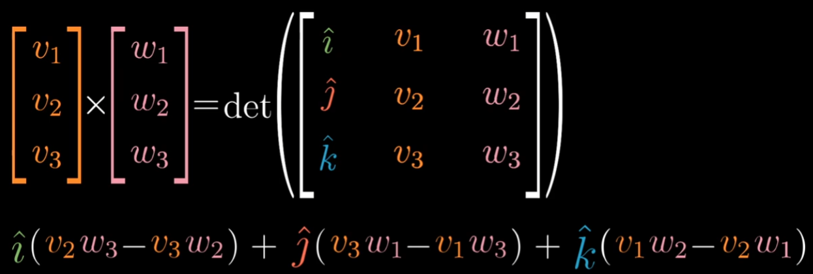
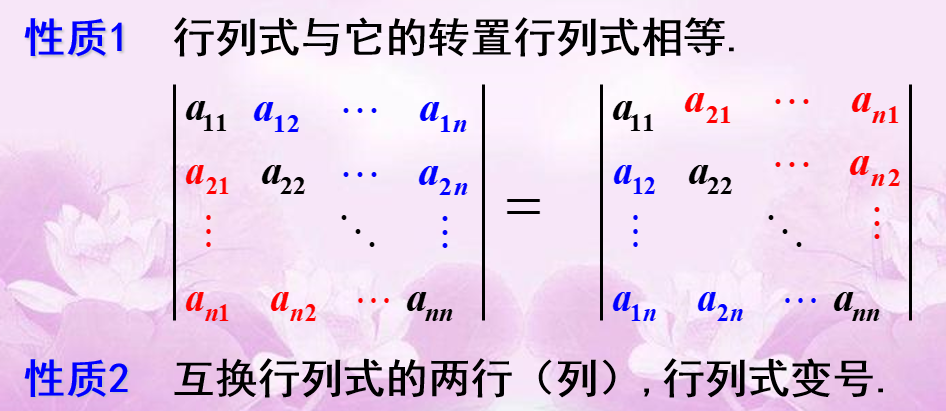

- 几何层面上的理解能让你知道要用什么工具, 以及为什么会有用, 以及结果为什么会这样; 数值层面上的理解能让你顺利使用这些工具
- 线性代数围绕两种基本运算: 向量加法（vector addition）和标量数乘（scalar multiplication） 

# 向量&矩阵

## 线性

- 严格的线性性质:

  

  - L() 应该代表线性变换
  - 比如等距分布的点经过线性变换后仍保持等距分布

### 线性组合

> linear combination

- 为什么叫线性呢？如果你固定其中一个标量，让另一个标量自由变化，这两个向量合起来指向的终点会描出一条直线；如果让两个标量同时自由变化，就能够得到所有可能的向量。
- 为什么要定义基向量呢？随便找两个向量不就能表达任何向量了吗？因为如果这两个向量刚好共线或者是零向量就不妙了。

- 给定向量线性组合的向量集合称为给定向量张成的空间(span)
- 张成空间（span）：如果共线，span就是一条线
- span其实就是仅通过vector addition和scalar multiplication这两种基础运算能获得的所有向量集合

### 线性相关

> linearly dependent

如果有3个**随机的**向量，这么这3个向量的组合能包含3维空间内的所有向量。

如果一个向量可以表示为其他向量的线性组合，因为这个向量已经落在向量张成空间中，那么它们**线性相关**

如果所有向量都给张成空间添加了新的维度，那么这些向量**线性无关**。

### 线性变换

> linear transformation

线性变换需要具有以下两条性质：

1. all lines must remain lines, without getting curved. 保持坐标网格线平行且等距分布 (parallel and evenly spaced)
2. the origin must remain fixed in place. 原点保持不动

比如旋转坐标，剪切（Shear，就是将网格倾斜），拉伸或挤压坐标轴等

- 需要满足那两个性质的原因是: 向量v是基向量i, j的特定线性组合, 变换后v也是i, j同样的线性组合. 已知变换前v和i, j的关系, 根据变换后的i, j就可以推断变换后的v

- 例子: i从(1,0)变到(1, -2); j从(0, 1)变到(3, 0). 二维线性变换仅由4个数字完全确定

  

- 把图中绿色部分看作是第一个基向量变化后的样子, 红色部分看作是第二个基向量变化后的样子. 
- 没有变换的情况, 也就是 $\begin{bmatrix} x \\ y \end{bmatrix}$ 表示在普通直角坐标系中（基向量是$\begin{bmatrix} 1 \\ 0 \end{bmatrix}$，$\begin{bmatrix} 0 \\ 1 \end{bmatrix}$）$x\cdot \begin{bmatrix} 1 \\ 0 \end{bmatrix} + y \cdot \begin{bmatrix} 0 \\ 1 \end{bmatrix}$ 后的向量

- 更多例子

  

  - $\begin{bmatrix} 1 \\ 0 \end{bmatrix}$是新坐标的一个基向量，$\begin{bmatrix} 1 \\ 1 \end{bmatrix}$ 是另一个基向量，$\begin{bmatrix} x \\ y \end{bmatrix}$ 要从原来的普通直角坐标转成这个新的坐标，就只要乘以$\begin{bmatrix} 1&1 \\ 0&1 \end{bmatrix}$就可以了。

  - $\begin{bmatrix} 1&0 \\ 0&1 \end{bmatrix}\begin{bmatrix} x \\ y \end{bmatrix} = \begin{bmatrix} x \\ y\end{bmatrix}$ 知道为什么结果是这样了吧？因为$\begin{bmatrix} 1&0 \\ 0&1 \end{bmatrix}$是普通的直角坐标系。
  - 矩阵（如$\begin{bmatrix} 1&1 \\ 0&1 \end{bmatrix}$ ）可以看作是对空间的一种特定变换（transformation of space），而由于新坐标的网格线具有平行且等距分布，原点不动的性质，要想得到向量$\begin{bmatrix} x \\ y \end{bmatrix}$变换后的结果，只要让$x，y$乘以变换后的新的基向量（如$\begin{bmatrix} 1&1 \\ 0&1 \end{bmatrix}$ ）

图中绿橙两个基向量是线性无关的，如果是线性相关，那就成一条直线了，如下面所示

矩阵向量乘法就是计算**线性变换作用于给定向量**的一种途径。可以把矩阵解读为对空间的一种特定变换

#### 复合变换

> 旋转和剪切（Shear）两种线性变换同时使用，就是“复合变换”

$\begin{bmatrix} x \\ y \end{bmatrix}$乘以一个旋转后的新坐标，再乘以一个剪切后的新坐标，效果等同于直接乘以一个已经旋转剪切过的新坐标。

- 可以看出，两个矩阵相乘相当于对原坐标做了两次线性变换。建议每次计算矩阵乘法的时候可以想想这个。

- BTW：$\begin{bmatrix} 0&-1 \\ 1&0 \end{bmatrix}$ 是旋转矩阵，原来的两个基坐标是(1, 0) (0, 1) ，变成了(0, 1) (-1, 0)，画下图就知道旋转了90°

##### 性质

有了几何层面的理解, 有时候一些证明不需要矩阵的运算就能得证, 比如: 

1. **矩阵相乘的时候，顺序会影响结果**, 证明如下

    

   将这两个动作叠加，顺序不同，结果不同

   

2. **(AB)C=A(BC)​ 证明矩阵乘法符合结合律**

   等式左边可以看作先执行$C$变换，再执行$AB$两个迭加变换；等式右边可以看作先执行C变换，再B变换，最后A变换。整个的顺序没有变，所以就应该相等。

#### 三维空间

这种3个基向量互相垂直的坐标可以用$\begin{bmatrix} 1&0&0 \\ 0&1&0\\0&0&1\end{bmatrix}$表示，3个基向量的坐标分别是(1,0,0)、(0,1,0)、(0,0,1)

一个例子

绕y轴旋转90° (红色的保持不变)

向量和矩阵的乘法和二维空间的同理

矩阵和矩阵的乘法也和二维空间的类似

相当于两次坐标变换的复合

## 逆矩阵

- 相当于逆变换

- 行列式为0时, 说明变换后空间被降维, 被压缩到更低的维度上, 就没有逆变换, 因为有的信息已经丢失, 无法将一条线“解压缩”成一个平面

- 先来看看这个

  

  要计算这个二元一次方程，可以想象成是某个向量x经过矩阵A的变换后得到了向量v

  这里的A要分成两种情况，一种是行列式为0，一种是不为0

  - det(A) != 0

    - $A^{-1}A = \begin{bmatrix} 1&0 \\ 0&1 \end{bmatrix}$, $A^{-1}$是$A$的逆操作(inverse transformation)，x通过A变换得到v，那么v通过A的逆变换$A^{-1}$就得到x，方程得解：$\vec{x} = A^{-1}\vec{v}$

  - det(A) == 0

    - 如果A的行列式为0的话，执行A变换后就降维了，也就没有逆变换，因为信息已经丢失，你无法将一个低维的东西解压缩为高维的。或者说这不是一个函数能做的（函数只有一个输入，一个输出，映射才能多个输出）

    - 一个函数不能将转成这个

    - 解

      

      

## 列空间

> column space / span of column
>
> 矩阵的列向量张成的空间

- 零向量一定能会被包含在列空间中 (因为线性变换必须保持原点位置不变)

## 秩

> rank
>
> 代表变换后列空间的维数

- 2*2的矩阵, 秩最大是2; 3\*3的矩阵, 秩为2意味着空间被压缩了

### 满秩 

> full rank
>
> 矩阵的秩和矩阵的列向量的个数相等

- 对于满秩变换来说, 唯一能在变换后落在原点的就是零向量自身; 

- 对于非满秩变换来说 (把空间压缩到一个更低的维度上) , 可能会有一系列向量在变换后变成零向量

  
  
  (上图是蓝绿色的线条被压缩到一条直线的过程, 同时黄色线上的向量最后都变成零向量)

## 零空间

> null space / kernel 核
>
> 变换后落在原点(零向量)的向量的集合称为矩阵的“零空间”或“核”

- 零空间一定包含零向量, 因为不管是满秩变换还是很非满秩变换, 零向量始终在原点
  - 一个二维线性变换将空间压缩到一条直线上, 那么沿某个不同方向直线上的所有向量就被squished到原点(如上图)
  - 一个三维线性变换将空间压缩到一个平面上, 会有一整条线上的向量在变换后落在原点
  - 一个三维线性变换将空间压缩到一条线上, 会有一整个平面上的向量在变换后落在原点 [link](https://www.bilibili.com/video/BV1ys411472E?p=8)
- 解 $A \overrightarrow{x}=\overrightarrow{v}$ 的时候, 如果 $\overrightarrow{v}$ 是零向量, 零空间给出的就是这个向量方程所有可能的解

## 非方阵

- 和之前矩阵代表的意思一样, 两列分别表示原来平面上的两个二维基向量变换后的位置. 
- 几何意义: 将二维空间映射到三维空间上, 因为矩阵有两列表明输入空间有两个基向量; 有三行表明每个基向量在变换后需要用三个独立的坐标描述
- 这个矩阵的列空间是一个三维空间中过原点的二维平面. 秩还是2. 
- 这个矩阵是满秩的, 因为秩 (变换后列空间的维数) 和矩阵的列向量的个数相等. 

- 几何意义: 矩阵有三列表明原始空间有三个基向量, 原始空间是三维的, 两行表明这三个基向量在变换后仅需两个坐标描述, 这三个基向量都落在一个二维平面上

## 条件数

>  
>
> 是一个矩阵（或者它所描述的线性系统）的稳定性或者敏感度的度量
>
> 如果一个矩阵的 condition number 在1附近，那么它就是well-conditioned的，如果远大于1，那么它就是 ill-conditioned 的，如果一个系统是 ill-conditioned 的，它的输出结果就不要太相信了（因为这个系统对输入太过敏感了，有时甚至计算机的存储误差对结果都会有显著的影响）
> [link](https://blog.csdn.net/qq_32742009/article/details/81638588)

[【数学基础】L2范数之解救矩阵病态](https://blog.csdn.net/qq_32742009/article/details/81638588)

### 病态

- 由来
  - 个人的看法：

    线性系统 Ax = b 为什么会病态？归根到底是由于 **A 矩阵列向量（行向量相关性大应该也有关系）线性相关性过大**，表示的特征太过于相似以至于容易混淆所产生的。举个例子, 现有一个两个十分相似的列向量组成的矩阵 A：

    

  - 在二维空间上，这两个列向量(列向量就是空间中所谓的基向量)夹角非常小。假设第一次检测得到数据 b = [1000, 0]^T, 这个点正好在第一个列向量所在的直线上，解集是 [1, 0]^T。现在再次检测，由于有轻微的误差，得到的检测数据是 b = [1000, 0.001]， 这个点正好在第二个列向量所在的直线上，解集是 [0, 1]^T。两次求得到了差别迥异的的解集。

- 病态矩阵缺点
  1. 系统太过敏感，无论是略微对A矩阵进行一点改动还是对b矩阵进行一点改动，都会对解x产生较大的影响。此时系统得出的结果通常不可信。
  2. 如果矩阵是病态矩阵，则在迭代法中，解的收敛非常缓慢。

## 运算

### 点积

> Dot product

- 结果为[标量](https://zh.wikipedia.org/wiki/标量)

- 如果两个向量的夹角小于90°，结果为正，夹角等于90°，结果为零，否则结果为负

#### 几何层面理解

- 为什么对应坐标相乘并将结果相加和投影有所联系? 

  - 总结: 两个向量点乘, 就是将其中一个向量转化为线性变换. 向量和线性变换是对偶的

  1. 

     首先用1*2的矩阵做变换和点乘的运算有点相似 (1\*2的矩阵就像一个倾倒的向量). 

     向量被压缩到一根数轴上, 只有一个值

  2. 思路: 寻找 将向量转化为数的线性变换 和 这个向量本身 的联系, 在几何层面上

  3. 要将向量投影到图中黄色向量($\hat{u}$)所在的数轴上, 需要找一个变换矩阵(投影矩阵), 将空间线性变换, 压缩到那条数轴上

     

  4. 根据对称性, x轴的基向量i投影到数轴上的数值刚好就是$\hat{u}$投影到x周的数值, 也就是$\hat{u}$的横坐标. y轴同理. 

     

     所以最终投影矩阵就是

     

     空间中的任意向量和这个投影矩阵相乘就得到投影到数轴上的数值. 

     由于这个矩阵刚好就是$\hat{u}$的坐标, 所以**单位向量的点积可以解读为将向量投影到单位向量所在的直线上所得到的长度**

     

  5. 如果是投影到非单位向量所在直线, 矩阵会变为比如

     

     基向量也都变为原来的3倍. 向量与给定非单位向量的点积可以解读为先朝给定向量上投影, 然后将投影的值与给定向量长度相乘

- 一个启发:

  

  如果看到一个线性变换 (右边) 输出空间是一维数轴, 空间中会存在唯一的向量v与之相关, 使得应用线性变换和与向量v做点积的结果一样

- 对偶性: 一个向量的对偶是<u>由它定义的线性变换</u> (投影到那个向量所在的数轴); 一个多维空间到一维空间的线性变换的对偶是<u>多维空间中的某个特定向量</u>. 

### 叉积

- 计算

  - 二维向量的叉积

    

    - 两个二维向量的叉积的绝对值等于这两个向量围成的四边形的面积
    - 结果是一个数

  - 三维向量的叉积

    

    - i, j, k是三个轴对齐的单位向量, 是三个相互垂直的向量。它们刚好可以构成一个坐标系
    - 结果不是一个数, 是一个向量, 
      - 长度是向量v和w构成的四边形的面积
      - 方向是与向量v和w垂直(右手法则)

#### 几何层面理解

> 理解叉积的计算过程和几何含义之间的关系

1. 已知向量v和向量w, 根据v和w定义一个三维到一维(数轴)的线性变换

   

   函数得到这三个向量构成的平行六面体的体积, 然后根据方向确定正负号. 且这个函数是线性的 (向量v, w确定六面体的底面积, 变量确定高, 所以高会和体积等比例变化). 

2. 找到它的对偶向量: 这个变换会与三维空间的一个向量关联

   因为它是线性的, 所以可以通过矩阵乘法来描述这个函数. 

   

   由于对偶性, 多维空间到一维空间的线性变换矩阵可以看作与这个特定向量的点积. 要找的就是这个向量, 称为p. 

   向量p与其他任一向量(x, y, z)的点积等于一个3*3矩阵的行列式. 

   

3. 说明这个对偶向量就是v×w

   

   可以看出p就是v×w的结果. 现在要求p

4. 求p

   

   右边行列式的结果是(x, y, z)和v和w确定的平行六面体的有向体积

   p点乘(x, y, z)的几何意义是<u>将(x, y, z)投影到p上的长度</u>乘以<u>p的长度</u>. <u>将(x, y, z)投影到p上的长度</u>相当于六面体的高, <u>p的长度</u>就应该是六面体底面积的大小, 也就是v和w构成的平行四边形的面积. p点乘(x, y, z)得到的也就是六面体的体积了! 

   

## 特征值&特征向量

> 几乎所有的向量在乘以矩阵A后都会改变方向，某些特殊的向量x和Ax位于同一个方向，它们称之为特征向量
>
> Ax=λx
>
> 数字λ称为特征值. 它告诉我们在乘以A后, 向量是怎么被拉伸, 缩小, 反转或者不变的. 

- λ=0意味着特征向量存在于矩阵的零空间中. 
- 任意向量都是单位矩阵的特征向量. 因为Ix=x, 其特征值为1x

$||x||=\sqrt[0]{\sum\limits_1^nx_i^0}，x=(x_1,x_2,\cdots,x_n)$

## 范数

[几种范数的简单介绍](https://blog.csdn.net/shijing_0214/article/details/51757564)

- 距离的定义是一个宽泛的概念，只要满足非负、自反、三角不等式就可以称之为距离。
- 范数是一种强化了的距离概念，它在定义上比距离多了一条数乘的运算法则。有时候为了便于理解，我们可以把范数当作距离来理解

- 在数学上，范数包括向量范数和矩阵范数
  - 向量范数表征向量空间中向量的大小
  - 矩阵范数表征矩阵引起变化的大小
  - 一种非严密的解释
    - 对应向量范数，向量空间中的向量都是有大小的，这个大小如何度量，就是用范数来度量的，不同的范数都可以来度量这个大小，就好比米和尺都可以来度量远近一样
    - 对于矩阵范数，我们知道，通过运算AX=B，可以将向量X变化为B，矩阵范数就是来度量这个变化大小的

### L-P

与闵可夫斯基距离的定义一样，L-P范数不是一个范数，而是一组范数，其定义如下：
$$
Lp=\sqrt[p]{\sum\limits_{1}^n x_i^p}，x=(x_1,x_2,\cdots,x_n)
$$
根据P 的变化，范数也有着不同的变化，一个经典的有关P范数的变化图如下： 

上图表示了p从无穷到0变化时，三维空间中到原点的距离（范数）为1的点构成的图形的变化情况。以常见的L-2范数（p=2）为例，此时的范数也即欧氏距离，空间中到原点的欧氏距离为1的点构成了一个球面。

### L0

当P=0时，也就是L0范数，由上面可知，L0范数并不是一个真正的范数，它主要被用来度量向量中非零元素的个数。用上面的L-P定义可以得到的L-0的定义为：
$$
||x||=\sqrt[0]{\sum\limits_1^nx_i^0}，x=(x_1,x_2,\cdots,x_n)
$$
这里就有点问题了，我们知道非零元素的零次方为1，但零的零次方，非零数开零次方都是什么鬼，很不好说明L0的意义，所以在通常情况下，大家都用的是：
$$
||x||_0=(i|x_i\neq 0)
$$
表示向量$x$中非零元素的个数。

对于L0范数，其优化问题为：
$$
min||x||_0\;\;s.t. Ax=b
$$
在实际应用中，由于L0范数本身不容易有一个好的数学表示形式，给出上面问题的形式化表示是一个很难的问题，故被人认为是一个NP难问题。所以在实际情况中，L0的最优问题会被放宽到L1或L2下的最优化。

### L1

L1范数是我们经常见到的一种范数，它的定义如下：
$$
||x||_1=\sum_i|x_i|
$$
表示向量$x$中非零元素的绝对值之和。

L1范数有很多的名字，例如我们熟悉的曼哈顿距离、最小绝对误差等。使用L1范数可以度量两个向量间的差异，如绝对误差和（Sum of Absolute Difference）：
$$
SAD(x_1,x_2)=\sum_i|x_{1i}-x_{2i}|
$$
对于L1范数，它的优化问题如下：
$$
min ||x||_1 \;\;s.t. Ax=b
$$
由于L1范数的天然性质，对L1优化的解是一个稀疏解，因此L1范数也被叫做稀疏规则算子。

**通过L1可以实现特征的稀疏，去掉一些没有信息的特征**，例如在对用户的电影爱好做分类的时候，用户有100个特征，可能只有十几个特征是对分类有用的，大部分特征如身高体重等可能都是无用的，利用L1范数就可以过滤掉。

### L2

L2范数是我们最常见最常用的范数了，我们用的最多的度量距离欧氏距离就是一种L2范数，它的定义如下：
$$
||x||_2=\sqrt{\sum_ix_i^2}
$$
表示向量元素的平方和再开平方。 像L1范数一样，L2也可以度量两个向量间的差异，如平方差和（Sum of Squared Difference）:
$$
SSD(x_1,x_2)=\sum_i(x_{1i}-x_{2i})^2
$$
对于L2范数，它的优化问题如下：
$$
min ||x||_2\;\;s.t. Ax=b
$$
L2范数通常会被用来做优化目标函数的正则化项，防止模型为了迎合训练集而过于复杂造成过拟合的情况，从而提高模型的泛化能力

### L-∞

当P=∞ 时，也就是L-∞ 范数，它主要被用来度量向量元素的最大值。用上面的L-P定义可以得到的L∞的定义为：
$$
||x||_\infty=\sqrt[\infty]{\sum\limits_1^nx_i^\infty}，x=(x_1,x_2,\cdots,x_n)
$$
与L0一样，在通常情况下，大家都用的是：
$$
||x||_\infty=max(|x_i|)
$$
来表示$L\infty$

# 行列式

> 

- n阶行列式是n!项的代数和
- n阶行列式的每项都是位于不同行, 不同列n个元素的乘积
- $a_{1p_1}a_{2p_2}...a_{np_n}$的符号为$(-1)^t$. $t$是$p_1p_2...p_n$的[逆序数](https://baike.baidu.com/item/%E9%80%86%E5%BA%8F%E6%95%B0#:~:text=%E4%B8%80%E4%B8%AA%E6%8E%92%E5%88%97%E4%B8%AD%E9%80%86%E5%BA%8F%E7%9A%84,%E8%BF%99%E4%B8%AA%E6%8E%92%E5%88%97%E7%9A%84%E9%80%86%E5%BA%8F%E6%95%B0%E3%80%82)
  - eg. $a_{13}a_{21}a_{32}$中$t(312)=2$, 偶排列, 是正号
- n阶行列式可简记为$D_n$或$det(a_{ij})$

## 几何层面解释

### 二维空间

**行列式的绝对值能表示变换对空间拉伸或挤压了多少**

一个1*1的矩形在坐标发生变换后($\begin{bmatrix} 3&0 \\ 0&2 \end{bmatrix}$, 表示x轴拉伸3倍，y轴拉伸2倍)，就变成了下面这样。

这个矩形的面积被拉伸了6倍，行列式算出来就是6

如果两个基坐标线性相关，那么这个平面就被压扁了, 行列式算出来就是0

如果算出来是负的，那就要把坐标翻转，橙色向量跑到了绿色向量的右边

#### 计算

推导过程

### 三维空间

得到平行六面体的面积

被压扁的情况

行列式是正的时候, 基向量构成右手定则的坐标系, 负的时候是左手定则

#### 计算

### 性质

- $det(M_1M_2) = det(M_1)det(M_2)$: 根据行列式的含义顺理成章就得证

## 定理

- 定理1 一个排列中的任意两个元素对换,排列改变奇偶性
  - 推论: 奇排列变成标准排列的次数为奇数，偶排列变成标准排列的次数为偶数

## 性质

- 说明: 行列式中行与列具有同等的地位,因此行列式的性质凡是对行成立的对列也同样成立

- 推论: 如果行列式有两行（列）完全相同，则此行列式为零

  

## 计算

## 余子式

> 

