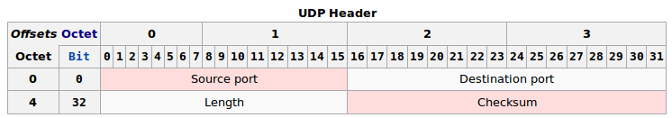
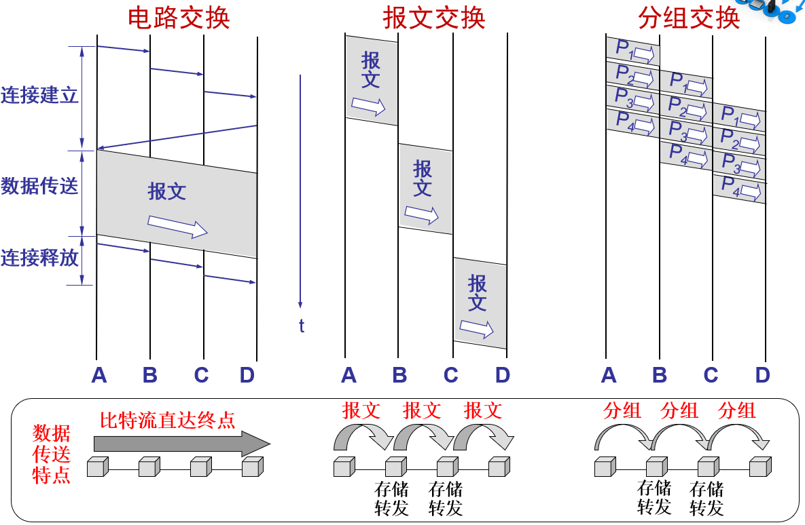
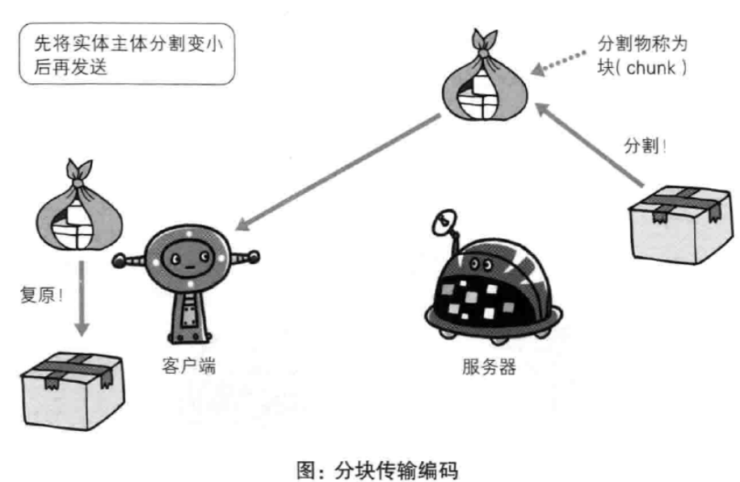

# 总

## 和OSI对应


## 通信传输流


# 应用层

> 决定了向用户提供应用服务时通信的活动

- HTTP协议也在这一层
- 文件传输，电子邮件，文件服务，虚拟终端 TFTP，HTTP，SNMP，FTP，SMTP，DNS，Telnet

# 传输层

- **网络层**的IP数据包只负责将数据传到正确的目标主机去, 但数据包有没有被接受, 被正确的接受那就是**传输层**的任务了
- 运输层处于面向通信部分的最高层，同时也是用户功能中的最低层，向它上面的应用层提供服务
- 运输层为**应用进程之间提供端到端的逻辑通信**，但网络层是为主机之间提供逻辑通信（面向主机，承担路由功能，即主机寻址及有效的分组交换）。
- 各种应用进程之间通信需要“可靠或尽力而为”的两类服务质量，必须由运输层以复用和分用的形式加载到网络层。
- TCP，UDP

## TCP

> Transmission Control Protocol 传输控制协议
>
> 面向连接的, 可靠的, 基于字节流的传输层通信协议

- 将应用层的数据流分割成报文段并发送给目标节点的TCP层
- 数据包都有序号, 对方收到则发送ACK确认, 未收到则重传
- 使用校验和来检验数据在传输过程中是否有误
- **UDP是面向报文的，而TCP是面向字节流的**

### 可靠传输的工作原理

理想的传输条件有以下两个特点：
(1) 传输信道不产生差错。
(2) 不管发送方以多快的速度发送数据，接收方总是来得及处理收到的数据。

在这样的理想传输条件下，不需要采取任何措施就能够实现可靠传输。
然而实际的网络都不具备以上两个理想条件。必须使用一些可靠传输协议，在不可靠的传输信道实现可靠传输

#### 停止等待协议

- “停止等待”就是每发送完一个分组就停止发送，等待对方的确认。在收到确认后再发送下一个分组。
- 全双工通信的双方既是发送方也是接收方。

##### 分析

为了讨论问题的方便，我们仅考虑 A 发送数据而 B 接收数据并发送确认。因此 A 叫做发送方，而 B 叫做接收方。

###### 无差错情况

A 发送分组 M1，发完就暂停发送，等待 B 的确认 (ACK)。B 收到了 M1 向 A 发送  ACK。A 在收到了对 M1 的确认后，就再发送下一个分组  M2。


###### 出现差错

在接收方 B 会出现两种情况：

1. B 接收 M1 时检测出了差错，就丢弃 M1，其他什么也不做（不通知 A 收到有差错的分组）

2. M1 在传输过程中丢失了，这时 B 当然什么都不知道，也什么都不做。

   

在这两种情况下，B 都不会发送任何信息。

解决方法：超时重传
A 为每一个已发送的分组都设置了一个**超时计时器**。A 只要在超时计时器到期之前收到了相应的确认，就撤销该超时计时器，继续发送下一个分组 M2 。

###### 确认丢失


若 B 所发送的对 M1 的确认丢失了，那么 A 在设定的超时重传时间内不能收到确认，但 A 并无法知道：是自己发送的分组出错、丢失了，或者 是 B 发送的确认丢失了。因此 A 在超时计时器到期后就要重传 M1。
假定 B 又收到了重传的分组 M1。这时 B 应采取两个行动：

1. 丢弃这个重复的分组 M1，不向上层交付。
2. 向 A 发送确认。**不能认为已经发送过确认就不再发送，因为 A 之所以重传 M1 就表示 A 没有收到对 M1 的确认**

###### 确认迟到


传输过程中没有出现差错，但 B 对分组 M1 的确认迟到了。
A 会收到重复的确认。对重复的确认的处理很简单：收下后就丢弃。
B 仍然会收到重复的 M1，并且同样要丢弃重复的 M1，并**重传确认分组**。

##### 注意事项

- 在发送完一个分组后，必须暂时保留已发送的分组的副本，以备重发。
- 分组和确认分组都必须进行**编号**，才能明确哪个分组得到了确认
- 超时计时器的重传时间应当比数据在分组传输的平均往返时间更长一些。 

##### 自动重传请求 ARQ

- 通常 A 最终总是可以收到对所有发出的分组的确认。如果 A 不断重传分组但总是收不到确认，就说明通信线路太差，不能进行通信。
- 使用上述的确认和重传机制，我们就可以在不可靠的传输网络上实现可靠的通信。
- 像这种可靠传输协议常称为**自动重传请求 ARQ**  (Automatic Repeat reQuest)。意思是**重传的请求是自动进行的，接收方不需要请求发送方重传某个出错的分组**

##### 流水线传输

- 停止等待协议的优点是简单，缺点是信道利用率太低

  

- 信道利用率: 

- 当往返时间 RTT 远大于分组发送时间 TD 时，信道的利用率就会非常低。若出现重传，则对传送有用的数据信息来说，信道的利用率就还要降低

- 为了提高传输效率，发送方可以不使用低效率的停止等待协议，而是采用流水线传输。

- 流水线传输就是发送方可连续发送多个分组，不必每发完一个分组就停顿下来等待对方的确认。这样可使信道上一直有数据不间断地传送。由于信道上一直有数据不间断地传送，这种传输方式可获得很高的信道利用率。 

  

#### 连续 ARQ 协议

- 滑动窗口协议比较复杂，是 TCP 协议的精髓所在。
- 发送方维持的发送窗口，它的意义是：**位于发送窗口内的分组都可连续发送出去，而不需要等待对方的确认**。这样，信道利用率就提高了。
  连续 ARQ 协议规定，**发送方每收到一个确认，就把发送窗口向前滑动一个分组的位置**。

##### 工作原理


##### **累积确认** 

- 接收方一般采用累积确认的方式。即不必对收到的分组逐个发送确认，而是**对按序到达的最后一个分组发送确认**，这样就表示：到这个分组为止的所有分组都已正确收到了。
- 优点：容易实现，即使确认丢失也不必重传。
- 缺点：不能向发送方反映出接收方已经正确收到的所有分组的信息。

##### 回退 N

> Go-back-N

- 如果发送方发送了前 5 个分组，而中间的第 3 个分组丢失了。这时接收方只能对前两个分组发出确认。发送方无法知道后面三个分组的下落，而<u>只好把后面的三个分组都再重传一次</u>。
  这就叫做 Go-back-N（回退 N），表示需要再退回来重传已发送过的 N 个分组。
  可见当通信线路质量不好时，连续 ARQ 协议会带来负面的影响。 


- TCP 连接的每一端都必须设有两个窗口——一个发送窗口和一个接收窗口。
- TCP 的可靠传输机制用字节的序号进行控制。TCP 所有的确认都是**基于序号**而不是基于报文段。
- TCP 两端的四个窗口经常处于动态变化之中。
- TCP连接的往返时间 RTT 也不是固定不变的。需要使用特定的算法估算较为合理的重传时间。  

### 可靠传输的实现

#### 以字节为单位的滑动窗口

- TCP 的滑动窗口是以字节为单位的。
- 现假定 A 收到了 B 发来的确认报文段，其中窗口是 20 字节，而确认号是 31（这表明 B 期望收到的下一个序号是 31，而序号 30 为止的数据已经收到了）。
- 根据这两个数据，A 就构造出自己的发送窗口，
- 发送窗口表示：在没有收到 B 的确认的情况下，A 可以连续把窗口内的数据都发送出去。 
- 发送窗口里面的序号表示允许发送的序号。
- **窗口越大，发送方就可以在收到对方确认之前连续发送更多的数据**，因而可能获得更高的传输效率。


第一，A 的发送窗口并不总是和 B 的接收窗口一样大（因为有一定的时间滞后）。
第二，TCP 标准**没有规定**对不按序到达的数据应如何处理。通常是先临时存放在接收窗口中，等到字节流中所缺少的字节收到后，再按序交付上层的应用进程。
第三，TCP 要求接收方必须有累积确认的功能，这样可以减小传输开销。  

接收方可以在合适的时候发送确认，也可以**在自己有数据要发送时把确认信息顺便捎带上**。但请注意两点：
第一，接收方不应过分推迟发送确认，否则会导致发送方不必要的重传，这反而浪费了网络的资源。
第二，捎带确认实际上并不经常发生，因为大多数应用程序很少同时在两个方向上发送数据。

##### 缓存

发送缓存

- 发送方的应用进程把字节流写入 TCP 的发送缓存。
- 用来暂时存放：
  发送应用程序传送给发送方 TCP 准备发送的数据；
  TCP 已发送出但尚未收到确认的数据。
- 

接收缓存

- 接收方的应用进程从 TCP 的接收缓存中读取字节流。

- 用来暂时存放：
  按序到达的、但尚未被接收应用程序读取的数据；
  不按序到达的数据。 

  

#### 超时重传时间的选择  

- 重传机制是 TCP 中最重要和最复杂的问题之一。
- TCP 每发送一个报文段，就对这个报文段设置一次计时器。
- 只要计时器设置的重传时间到但还没有收到确认，就要重传这一报文段。

- 往返时延的方差很大: 由于 TCP 的下层是一个互联网环境，IP 数据报所选择的路由变化很大。因而运输层的往返时间 (RTT) 的方差也很大。


#### 选择确认 SACK


### 运输连接管理

#### 连接建立

- TCP 是面向连接的协议。运输连接有三个阶段：

  1. 连接建立
  2. 数据传送
  3. 连接释放

- 运输连接的管理就是使运输连接的建立和释放都能正常地进行。

- 作用

  (1) 使每一方能够确知对方的存在。
  (2) 允许双方协商一些参数（如最大窗口值、是否使用窗口扩大选项和时间戳选项以及服务质量等）。
  (3) 能够对运输实体资源（如缓存大小、连接表中的项目等）进行分配。

- TCP连接的建立采用客户服务器方式。主动发起连接建立的应用进程叫做客户(client)，被动等待连接建立的应用进程叫做服务器(server)。
- TCP 建立连接的过程叫做握手。
- 握手需要在客户和服务器之间交换三个 TCP 报文段。称之为三报文握手。
- **采用三报文握手主要是为了<u>防止已失效的连接请求报文段突然又传送到了，因而产生错误</u>**. 如果没有三次, 那么当那个失效的迟到的连接报文传到server之后, server误认为client再次发送新的的连接请求, 于是server发出确认, 连接就建立了, 就出错了, 由于现在client并没有发出建立连接的请求，因此不会理睬server的确认，也不会向server发送数据。但server却以为新的运输连接已经建立，并一直等待client发来数据。这样，server的很多资源就白白浪费掉了。采用“三次握手”的办法可以防止上述现象发生。例如刚才那种情况，client不会向server的确认发出确认。server由于收不到确认，就知道client并没有要求建立连接。主要目的防止server端一直等待，浪费资源。


1. A 的 TCP 向 B 发出连接请求报文段，其首部中的同步位 SYN = 1，并选择序号 seq = x，表明传送数据时的第一个数据字节的序号是 x。
2. B 的 TCP 收到连接请求报文段后，如同意，则发回确认。B 在确认报文段中应使 SYN = 1，使 ACK = 1，其确认号ack = x + 1，自己选择的序号 seq = y
3. A 收到此报文段后向 B 给出确认，其 ACK = 1，确认号 ack = y + 1。 A 的 TCP 通知上层应用进程，连接已经建立。  


#### 连接释放

- TCP 连接释放过程比较复杂。
- 数据传输结束后，通信的双方都可释放连接。
- TCP 连接释放过程是四报文握手。


数据传输结束后，通信的双方都可释放连接。

1. 现在 A 的应用进程先向其 TCP 发出连接释放报文段，并停止再发送数据，主动关闭 TCP 连接。
   A 把连接释放报文段首部的 FIN = 1，其序号seq = u，等待 B 的确认。

2. B 发出确认，确认号 ack = u + 1，而这个报文段自己的序号 seq = v。

   TCP 服务器进程通知高层应用进程。

   从 A 到 B 这个方向的连接就释放了，TCP 连接处于半关闭状态。B 若发送数据，A 仍要接收。

3. 若 B 已经没有要向 A 发送的数据，其应用进程就通知 TCP 释放连接。
4. A 收到连接释放报文段后，必须发出确认。在确认报文段中 ACK = 1，确认号 ack = w + 1，自己的序号 seq = u + 1。 
5. **TCP 连接必须经过时间 2MSL 后才真正释放掉**
   - 第一，为了保证 A 发送的最后一个 ACK 报文段能够到达 B。
   - 第二，防止 “已失效的连接请求报文段”出现在本连接中。A 在发送完最后一个 ACK 报文段后，再经过时间 2MSL，就可以使本连接持续的时间内所产生的所有报文段，都从网络中消失。这样就可以使下一个新的连接中不会出现这种旧的连接请求报文段。


为什么连接建立要3次握手, 断开要4次?

因为连接建立的时候把 确认收到发送方连接请求 和 自己的发送请求 合并到一起了(ACK是和SYN一起发送), 连接释放的时候不能合并, 因为tcp是全双工模式，接收到FIN时意味将没有数据再发来，但是还是可以继续发送数据, 对方断开连接没有数据要传输了并不能说明自己也没有数据要传输了, 如果等到自己也要断开连接的时候再捎带确认对方的断开请求, 有对方有可能会因为迟迟收不到确认而重传FIN报文, 浪费网络资源

#### 有限状态机

[link](https://blog.csdn.net/xifeijian/article/details/12777187#:~:text=%E4%B8%BA%E4%BB%80%E4%B9%88%E9%9C%80%E8%A6%81%E2%80%9C%E4%B8%89%E6%AC%A1%E6%8F%A1%E6%89%8B%E2%80%9D,%E7%AB%AF%EF%BC%8C%E5%9B%A0%E8%80%8C%E4%BA%A7%E7%94%9F%E9%94%99%E8%AF%AF%E2%80%9D%E3%80%82)


##### 3次握手过程状态


- LISTEN: 表示服务器端的某个SOCKET处于监听状态，可以接受连接了。
- SYN_SENT: 当客户端SOCKET执行CONNECT连接时，它首先发送SYN报文，因此也随即它会进入到了SYN_SENT状态，并等待服务端的发送三次握手中的第2个报文。SYN_SENT状态表示客户端已发送SYN报文。（发送端）
- SYN_RCVD: 这个状态与SYN_SENT遥相呼应这个状态表示接受到了SYN报文，在正常情况下，这个状态是服务器端的SOCKET在建立TCP连接时的三次握手会话过程中的一个中间状态，很短暂，基本上用netstat你是很难看到这种状态的，除非你特意写了一个客户端测试程序，故意将三次TCP握手过程中最后一个 ACK报文不予发送。因此这种状态时，当收到客户端的ACK报文后，它会进入到ESTABLISHED状态。（服务器端）
- ESTABLISHED：表示连接已经建立了。

##### 4次挥手过程状态


- FIN_WAIT_1: 其实FIN_WAIT_1和FIN_WAIT_2状态的真正含义都是表示等待对方的FIN报文。而这两种状态的区别是：FIN_WAIT_1状态实际上是当SOCKET在ESTABLISHED状态时，它想主动关闭连接，向对方发送了FIN报文，此时该SOCKET即进入到FIN_WAIT_1状态。而**当对方回应ACK报文后，则进入到FIN_WAIT_2状态**，当然在实际的正常情况下，无论对方何种情况下，都应该马上回应ACK报文，所以FIN_WAIT_1状态一般是比较难见到的，而FIN_WAIT_2状态还有时常常可以用netstat看到。（主动方）
- FIN_WAIT_2：上面已经详细解释了这种状态，实际上FIN_WAIT_2状态下的SOCKET，表示**半连接**，也即有一方要求close连接，但另外还告诉对方，我暂时还有点数据需要传送给你(ACK信息)，稍后再关闭连接。（主动方）
- TIME_WAIT: 表示收到了对方的FIN报文，并发送出了ACK报文，就**等2MSL后即可回到CLOSED可用状态了**。如果FIN_WAIT_1状态下，收到了对方同时带FIN标志和ACK标志的报文时，可以直接进入到TIME_WAIT状态，而无须经过FIN_WAIT_2状态。（主动方）
- CLOSING（比较少见）: 这种状态比较特殊，实际情况中应该是很少见，属于一种比较罕见的例外状态。正常情况下，当你发送FIN报文后，按理来说是应该先收到（或同时收到）对方的 ACK报文，再收到对方的FIN报文。但是CLOSING状态表示你发送FIN报文后，并没有收到对方的ACK报文，反而却也收到了对方的FIN报文。什么情况下会出现此种情况呢？其实细想一下，也不难得出结论：那就是如果双方几乎在同时close一个SOCKET的话，那么就出现了双方同时发送FIN报文的情况，也即会出现CLOSING状态，表示双方都正在关闭SOCKET连接。
- CLOSE_WAIT: 这种状态的含义其实是表示在等待关闭。怎么理解呢？当对方close一个SOCKET后发送FIN报文给自己，你系统毫无疑问地会回应一个ACK报文给对方，此时则进入到CLOSE_WAIT状态。接下来呢，实际上你真正需要考虑的事情是察看你是否还有数据发送给对方，如果没有的话，那么你也就可以 close这个SOCKET，发送FIN报文给对方，也即关闭连接。所以你在CLOSE_WAIT状态下，需要完成的事情是等待你去关闭连接。（被动方）
- LAST_ACK: 这个状态还是比较容易好理解的，它是被动关闭一方在发送FIN报文后，最后等待对方的ACK报文。当收到ACK报文后，也即可以进入到CLOSED可用状态了。（被动方）

CLOSED: 表示连接中断。
#### 三次握手

[TCP](https://www.bilibili.com/video/av34043448/?p=25)


在建立连接之前必须要通过三次确认的动作

1. 数据包发起(客户端->服务器)

   > 客户端向想要连接的服务器端发送一个数据包, 客户端必须随机取用一个大于1024的端口来作为程序沟通的接口.
   >
   > 在TCP的报头中SYN=1, 并记下发送出连接数据包的服务器端的序号(Seq)

   1. 设置连接状态: SYN_SENT 同步已发送
   2. 设置可接受的最大窗口值为字节
   3. 添加"MSS"选项到TCP SYN的首部
   4. 设备发送TCP SYN报文段(Seq为随机值, SYN=1, ACK=0(但存在于这里其实没有意义, 因为本报文段不是确认报文段), 数据长度=24B(20B的固定部分+3B的MSS+1B的Padding))

2. 数据包接收与确认数据包传送(服务器->客户端)

   > 服务器端也必须要 **确认客户端确实可以接收我们的数据包** 才行, 所以会发送一个Seq(随机的)给客户端, 并开始等待客户端的回应

   1. 设备在服务器端口80上接收到一个TCP SYN报文段
   2. TCP从TCP报文段首部中的最大报文段选项中获取MSS值
   3. 连接请求被接受
   4. 设备设置连接状态为SYN_RECEIVED(同步已接收)
   5. 当服务器端接到这个数据包, 并且确定要接收这个数据包的时候, 就会制作一个SYN=1, ACK=1的数据包. 比1. 中的Sequence号码多一号(ack=10002)

3. 回送确认数据包(客户端->服务器)

   > 如果客户端也同意与服务器端建立连接, 就发送一个确认数据包(ACK=1)给服务器, 亦即ack=20001+1 = 20002

   1. 设备接收一个TCP SYN+ACK报文段
   2. TCP报文段具有所期望的对等序号
   3. TCP连接成功
   4. 设备设置连接状态为ESTABLISHED
   5. 设备发送一个TCP ACK报文段(序号:为之前客户端发给服务器的序号+1, ACK=1, 数据长度=20) 客户端收到服务器端的ack(10002), 客户端便知道服务器端  已经正确地接收了数据包.

4. 取得最后的确认(服务器收到了)

   > **网络是双向的**, 无论是服务器端还是客户端, 都要通过一次SYN与ACK来建立连接

   1. 设备接收一个TCP SYN+ACK报文段
   2. TCP报文段具有所期望的对等序号
   3. TCP连接成功
   4. 设备设置连接状态为ESTABLISHED 顺利的话, 服务器收到ACK=1, 且ack=20002序号的数据包, 就能够建立这次的连接了

### 报头数据

报头长度: 20字节的固定部分和最长40字节的可选部分


- Source Port & Destination Port 源端口 & 目标端口, 各16bits

  为什么在TCP首部中要把TCP端口号放入最开始的4个字节？
  答：在ICMP的差错报文中要包含IP首部后面的8个字节的内容，而这里面有TCP首部中的源端口和目的端口。当TCP收到ICMP差错报文时需要用这两个端口来确定是哪条连接出了差错。

  

- Sqeuence Number (Seq) 数据包序号, 用于将TCP的数据组合起来, TCP 连接中传送的数据流中的每一个字节都编上一个序号。序号字段的值则指的是本报文段所发送的数据的第一个字节的序号

  例: 在TCP的序号不重复使用的条件下，一个文件的长队最大是2^32 = 4GB

- Acknowledge Number (ack) **确认号**字段, 是期望收到对方的下一个报文段的数据的第一个字节的序号。 

- Data Offset 数据偏移（即首部长度）——占 4 位，它指出 TCP 报文段的数据起始处距离 TCP 报文段的起始处有多远。
  
  - “数据偏移”的单位是 32 位字（以 4 字节为计算单位）。  
  - 说明整个数据包字段的起始位置
  
- Reserved 保留

- Code(Control Flag) 控制标识码
  有6个bits, 分别代表6个句柄
  状态 为1时表示启动
  - URG(Urgent) 紧急数据包, 当 URG = 1 时，表明紧急指针字段有效。它告诉系统此报文段中有紧急数据，应尽快传送(相当于高优先级的数据)。 
  - **ACK**(Acknowledge) 确认标志位 只有当 ACK = 1 时确认号字段才有效。当 ACK = 0 时，确认号无效。 
  - PSH(Push function) 推送, 接收 TCP 收到 PSH = 1 的报文段，就尽快地交付接收应用进程，而**不再等到整个缓存都填满了后再向上交付**。  
  - RST(Reset) 复位, 当 RST = 1 时，表明 TCP 连接中出现严重差错（如由于主机崩溃或其他原因），必须释放连接，然后再重新建立运输连接。 
  - **SYN**(Synchronous)同步标志位 表示发送端希望双方建立同步处理, 就是要求建立连接. 通常带有SYN标志的数据包表示"主动"要连接到对方的意思. 同步 SYN = 1 表示这是一个连接请求或连接接受报文。 
  - FIN(Finish) 终止标志位, 用来释放一个连接。FIN = 1 表明此报文段的发送端的数据已发送完毕，并要求释放运输连接。 
  
- Window 滑动窗口
  
  用来控制数据包的流量
  
  用来让对方设置发送窗口的依据，单位为字节。
  
- Checksum 确认校验码, 检验数据包有没有被损毁
  
  检验和字段检验的范围包括首部和数据这两部分。在计算检验和时，要在 TCP 报文段的前面加上 12 字节的伪首部。
  
- Urgent Pointer 紧急数据, 指出在本报文段中紧急数据共有多少个字节（紧急数据放在本报文段数据的最前面）。
  
  URG = 1时产生作用
  
- Options 任意数据

- Padding 补足字段, 为了使整个首部长度是 4 字节的整数倍

- Maximum Segment Size(MSS, 可选, 图中的"选项")最大报文段长度
  
  MSS 是 TCP 报文段中的**数据字段**的最大长度。数据字段加上 TCP 首部才等于整个的 TCP 报文段。所以，**MSS是“TCP 报文段长度减去 TCP 首部长度”**
  
  - MSS 与接收窗口值没有关系。
  - 若选择较小的 MSS 长度，网络的利用率就降低。
  - 当 TCP 报文段只含有 1 字节的数据时，在 IP 层传输的数据报的开销至少有 40 字节(包括 TCP 报文段的首部和 IP 数据报的首部)。这样，对网络的利用率就不会超过 1/41。到了数据链路层还要加上一些开销。
  - 若 TCP 报文段非常长，那么在 IP 层传输时就有可能要分解成多个短数据报片。在终点要把收到的各个短数据报片装配成原来的 TCP 报文段。当传输出错时还要进行重传。这些也都会使开销增大。
  - 因此，MSS 应尽可能大些，只要在 IP 层传输时不需要再分片就行。
    由于 IP 数据报所经历的路径是动态变化的，因此在这条路径上确定的不需要分片的 MSS，如果改走另一条路径就可能需要进行分片。
    因此最佳的 MSS 是很难确定的。
  - TCP报文段的数据部分最多为65495字节，此数据部分加上TCP首部的20字节，再加上IP首部的20字节，正好是IP数据报的最大长度65535.（当然，若IP首部包含了选择，则IP首部长度超过    20字节，这时TCP报文段的数据部分的长度将小于65495字节。）
    数据的字节长度超过TCP报文段中的序号字段可能编出的最大序号，通过循环使用序号，仍能用TCP来传送。

### Socket Pair

> 网络是双向的, 达成连接的服务端与客户端提供的IP与端口, 这两对数据就是Socket Pair

- Source Address + Source Port
- Destination Address + Destination Port


### 同步速度

### 拥塞控制

#### 原理

- 在某段时间，若对网络中某资源的需求超过了该资源所能提供的可用部分，网络的性能就要变坏。这种现象称为拥塞 (congestion)。

- 若网络中有许多资源同时产生拥塞，网络的性能就要明显变坏，整个网络的吞吐量将随输入负荷的增大而下降。

- 增大资源也不一定能解决拥塞, 网络拥塞是一个非常复杂的问题。简单地采用上述做法，在许多情况下，不但不能解决拥塞问题，而且还可能使网络的性能更坏。

  - 网络拥塞往往是由许多因素引起的。例如：
    - 增大缓存，但未提高输出链路的容量和处理机的速度，排队等待时间将会大大增加，引起大量超时重传，解决不了网络拥塞；
    - 提高处理机处理的速率会会将瓶颈转移到其他地方

- 拥塞引起的重传并不会缓解网络的拥塞，反而会加剧网络的拥塞。

- 拥塞控制就是防止过多的数据注入到网络中，使网络中的路由器或链路不致过载。

- 拥塞控制所要做的都有一个前提，就是网络能够承受现有的网络负荷。

- 拥塞控制是一个全局性的过程，涉及到所有的主机、所有的路由器，以及与降低网络传输性能有关的所有因素。 

  

开环控制和闭环控制 

- 开环控制方法就是在设计网络时事先将有关发生拥塞的因素考虑周到，力求网络在工作时不产生拥塞。 
- 闭环控制方法是基于反馈环路的概念。属于闭环控制的有以下几种措施： 
  (1) 监测网络系统以便检测到拥塞在何时、何处发生。
  (2) 将拥塞发生的信息传送到可采取行动的地方。
  (3) 调整网络系统的运行以解决出现的问题。


监测网络的拥塞的指标

- 主要指标有：
  - 由于缺少缓存空间而被丢弃的分组的百分数；
  - 平均队列长度；
  - 超时重传的分组数；
  - 平均分组时延；
  - 分组时延的标准差，等等。
- 上述这些指标的上升都标志着拥塞的增长。

#### 控制方法

- TCP 采用基于窗口的方法进行拥塞控制。该方法属于闭环控制方法。
- TCP发送方维持一个**拥塞窗口** CWND (Congestion Window)
  - 拥塞窗口的大小取决于网络的拥塞程度，并且动态地在变化。
  - 发送端利用拥塞窗口根据网络的拥塞情况调整发送的数据量。
  - 所以，发送窗口大小不仅取决于接收方公告的接收窗口，还取决于网络的拥塞状况，所以真正的发送窗口值为：Min(公告窗口值，拥塞窗口值)

拥塞的判断

- 重传定时器超时: 现在通信线路的传输质量一般都很好，因传输出差错而丢弃分组的概率是很小的（远小于 1 %）。只要出现了超时，就可以猜想网络可能出现了拥塞。
- 收到三个相同（重复）的 ACK: 个别报文段会在网络中丢失，预示可能会出现拥塞（实际未发生拥塞），因此可以尽快采取控制措施，避免拥塞。

#### 主动队列管理

> AQM

#### 控制算法


- 发送方的发送窗口的上限值应当取为接收方窗口 rwnd 和拥塞窗口 cwnd 这两个变量中较小的一个，即应按以下公式确定：发送窗口的上限值 = Min [rwnd, cwnd]                

当 rwnd < cwnd 时，是接收方的接收能力限制发送窗口的最大值。
当 cwnd < rwnd 时，则是网络的拥塞限制发送窗口的最大值。 

也就是说，rwnd 和 cwnd 中数值较小的一个，控制了发送方发送数据的速率。

##### 慢开始 

> slow-start
>
> 由小到大逐渐增大拥塞窗口数值, 用来确定网络的负载能力。
>
> 在主机刚刚开始发送报文段时可先将拥塞窗口cwnd设置为一个最大报文段MSS的数值。在每收到一个对新的报文段的确认后，将拥塞窗口增加至多一个MSS的数值。用这样的方法逐步增大发送端的拥塞窗口cwnd，可以分组注入到网络的速率更加合理。
>

- 初始拥塞窗口 cwnd 设置：
  - 旧的规定：在刚刚开始发送报文段时，先把初始拥塞窗口cwnd 设置为 1 至 2 个发送方的最大报文段 SMSS (Sender Maximum Segment Size) 的数值。
  - 新的 RFC 5681 把初始拥塞窗口 cwnd 设置为不超过2至4个SMSS 的数值。
- **慢开始门限 ssthresh（状态变量）**：防止拥塞窗口cwnd 增长过大引起网络拥塞。
- 拥塞窗口 cwnd  控制方法：**在每收到一个对新的报文段的确认后，可以把拥塞窗口增加最多一个 SMSS 的数值。**
- 拥塞窗口 cwnd 每次的增加量 = min (N, SMSS)       
  - 其中 N 是原先未被确认的、但现在被刚收到的确认报文段所确认的字节数。
  - 当 N < SMSS 时，拥塞窗口每次的增加量要小于 SMSS。
- 用这样的方法逐步增大发送方的拥塞窗口 cwnd，可以使分组注入到网络的速率更加合理。


###### 传输轮次

> 一个传输轮次所经历的时间其实就是往返时间 RTT

- 使用慢开始算法后，每经过一个传输轮次 (transmission round)，拥塞窗口 cwnd 就加倍。 

- “传输轮次”更加强调：把拥塞窗口 cwnd 所允许发送的报文段都连续发送出去，并收到了对已发送的最后一个字节的确认。
  例如，拥塞窗口 cwnd = 4，这时的往返时间 RTT 就是发送方连续发送 4 个报文段，并收到这 4 个报文段的确认，总共经历的时间。 

###### 用法

慢开始门限 ssthresh 的用法如下：
当 cwnd < ssthresh 时，使用慢开始算法。
当 cwnd > ssthresh 时，停止使用慢开始算法而改用拥塞避免算法。
当 cwnd = ssthresh 时，既可使用慢开始算法，也可使用拥塞避免算法。

##### 拥塞避免 

> congestion avoidance
>
> 当拥塞窗口值大于慢开始门限时，停止使用慢开始算法而改用拥塞避免算法。拥塞避免算法使发送的拥塞窗口每经过一个往返时延RTT就增加一个MSS的大小。

- 思路：让拥塞窗口 cwnd 缓慢地增大，即每经过一个往返时间 RTT 就把发送方的拥塞窗口 cwnd 加 1，而不是加倍，使拥塞窗口 cwnd **按线性规律缓慢增长**。
- 因此在拥塞避免阶段就有“加法增大”  (Additive Increase) 的特点。这表明在拥塞避免阶段，拥塞窗口 cwnd 按线性规律缓慢增长，比慢开始算法的拥塞窗口增长速率缓慢得多。

当网络出现拥塞时

- 无论在慢开始阶段还是在拥塞避免阶段，只要发送方判断网络出现拥塞（重传定时器超时）：
  - ssthresh = max(cwnd/2，2)
  - cwnd = 1
  - 执行慢开始算法
- 这样做的目的就是要迅速减少主机发送到网络中的分组数，使得发生拥塞的路由器有足够时间把队列中积压的分组处理完毕。 

###### 例子


- 当 TCP 连接进行初始化时，将拥塞窗口置为 1。图中的窗口单位不使用字节而使用报文段。
- 慢开始门限的初始值设置为 16 个报文段，即 ssthresh = 16。
- 发送端的发送窗口不能超过拥塞窗口 cwnd 和接收端窗口 rwnd 中的最小值。我们假定接收端窗口足够大，因此现在发送窗口的数值等于拥塞窗口的数值。

1. 在执行慢开始算法时，拥塞窗口 cwnd=1，发送第一个报文段。
2. 发送方每收到一个对新报文段的确认 ACK，就把拥塞窗口值加 1，然后开始下一轮的传输（请注意，横坐标是传输轮次，不是时间）。因此拥塞窗口 cwnd 随着传输轮次按指数规律增长。
3. 当拥塞窗口 cwnd 增长到慢开始门限值ssthresh 时（图中的点1，此时拥塞窗口cwnd = 16），就改为执行**拥塞避免算法**，**拥塞窗口按线性规律增长**。
4. 当拥塞窗口 cwnd = 24 时，网络出现了超时（图中的点2），发送方判断为网络拥塞。于是调整门限值 ssthresh = cwnd / 2 = 12，同时设置拥塞窗口 cwnd = 1，进入慢开始阶段。
5. 按照慢开始算法，发送方每收到一个对新报文段的确认ACK，就把拥塞窗口值加1。当拥塞窗口cwnd = ssthresh = 12时（图中的点3，这是新的ssthresh值），改为执行拥塞避免算法，拥塞窗口按线性规律增大。
6. 当拥塞窗口cwnd = 16时（图中的点4），出现了一个新的情况，就是发送方一连收到 3 个对同一个报文段的重复确认（图中记为3-ACK）。发送方改为执行快重传和快恢复算法。

##### 快重传

> fast retransmit
>
> 发送端只要一连收到三个重复的ACK即可断定有分组丢失了，就应该立即重传丢手的报文段而不必继续等待为该报文段设置的重传计时器的超时。


- 采用快重传FR (Fast Retransmission) 算法可以让发送方尽早知道发生了个别报文段的丢失。
- 快重传 算法首先要求接收方不要等待自己发送数据时才进行捎带确认，而是要**立即发送确认**，即使收到了失序的报文段也要立即发出对已收到的报文段的重复确认。
- 发送方只要一连收到三个重复确认，就知道接收方确实没有收到报文段，因而应当立即进行重传（即“快重传”），这样就不会出现超时，发送方也不就会误认为出现了网络拥塞。
  使用快重传可以使整个网络的吞吐量提高约20%。 
- 快重传并非取消重传计时器，而是在某些情况下可更早地重传丢失的报文段。 

##### 快恢复 

> fast recovery
>
> 当发送端收到连续三个重复的ACK时，就重新设置慢开始门限 ssthresh 
> 与慢开始不同之处是拥塞窗口 cwnd 不是设置为 1，而是设置为ssthresh
> 若收到的重复的AVK为n个（n>3），则将cwnd设置为ssthresh
> 若发送窗口值还容许发送报文段，就按拥塞避免算法继续发送报文段。
> 若收到了确认新的报文段的ACK，就将cwnd缩小到ssthresh

- 当发送端收到连续三个重复的确认时，由于发送方现在认为网络很可能没有发生拥塞，因此现在不执行慢开始算法，而是执行快恢复算法 FR (Fast Recovery) 算法：
  (1) 慢开始门限 ssthresh = 当前拥塞窗口 cwnd / 2
  (2) 新拥塞窗口 cwnd = 慢开始门限 ssthresh 
  (3) 开始执行拥塞避免算法，使拥塞窗口缓慢地线性增大


因此，在图的点4，发送方知道现在只是丢失了个别的报文段。于是不启动慢开始，而是执行快恢复算法。这时，发送方调整门限值ssthresh = cwnd / 2 = 8，同时设置拥塞窗口cwnd = ssthresh = 8（见图中的点），并开始执行拥塞避免算法。

[例题](https://www.nowcoder.com/questionTerminal/628b6dcb9fe44e1995bf6ec67d94adfd)

###### 加法增大

> 执行拥塞避免算法后，在收到对所有报文段的确认后（即经过一个往返时间），就把拥塞窗口 cwnd增加一个 MSS 大小，使拥塞窗口缓慢增大，以防止网络过早出现拥塞。

- 可以看出，在拥塞避免阶段，拥塞窗口是按照线性规律增大的。这常称为“加法增大” AI (Additive Increase)。

###### 乘法减小

> 不论在慢开始阶段还是拥塞避免阶段，只要出现一次超时（即出现一次网络拥塞），就把慢开始门限值 ssthresh 设置为当前的拥塞窗口值乘以 0.5。
> 当网络频繁出现拥塞时，ssthresh 值就下降得很快，以大大减少注入到网络中的分组数。

- 当出现超时或3个重复的确认时，就要把门限值设置为当前拥塞窗口值的一半，并大大减小拥塞窗口的数值。这常称为“乘法减小”MD (Multiplicative Decrease)。二者合在一起就是所谓的 AIMD 算法。


1. 1. 

## UDP

> User Datagram Protocol 用户数据报协议
>
> 无连接 无状态



- TCP慢, 但可靠
- UDP适合需要实时反应的一些数据流: 影像实时传输软件
  UDP协议是IP协议在传输层的"傀儡", 只为IP传输起到了桥梁的作用
- UDP协议不可靠, 那么为什么不直接使用IP协议呢?
  - IP协议没有端口(port)的概念. IP协议用于两台计算机之间的对话, 但每台计算机需要有多个通信通道, 并将对各通信通道分配给不同的进程使用 (一个端口代表一个通信通道), IP负责找到主机, UDP找到进程
    - 端口的作用是对TCP/IP体系的应用进程进行统一的标志，使运行不同操作系统的计算机的应用进程能够互相通信。
      熟知端口，数值一般为0~1023.标记常规的服务进程；
      登记端口号，数值为1024~49151，标记没有熟知端口号的非常规的服务进程；
- **UDP是面向报文的，而TCP是面向字节流的**: 发送方 UDP 对应用程序交下来的报文，在**添加首部**后就向下交付 IP 层。UDP 对应用层交下来的报文，**既不合并，也不拆分**，而是保留这些报文的边界。接收方 UDP 对 IP 层交上来的 UDP 用户数据报，在**去除首部后就原封不动地交付上层的应用进程**，一次交付一个完整的报文。发送方TCP对应用程序交下来的报文数据块，视为无结构的字节流（无边界约束，课分拆/合并），但维持各字节

### 特点

**(1) UDP** **是无连接的**，发送数据之前不需要建立连接，因此减少了开销和发送数据之前的时延

**(2) UDP** 使用尽最大努力交付，即不保证可靠交付，因此主机不需要维持复杂的连接状态表。

**(3) UDP** **是面向报文的。**UDP 对应用层交下来的报文，既不合并，也不拆分，而是保留这些报文的边界。UDP 一次交付一个完整的报文。

**(4) UDP** 没有拥塞控制，因此网络出现的拥塞不会使源主机的发送速率降低。这对某些实时应用是很重要的。很适合多媒体通信的要求。

## 防火墙

最基本的防火墙原理: 对数据包报头的分析, 设定分析规则, 当发现某些特定的IP, 特定的端口或者是特定的数据包信息(SYN/ACK等), 那么就将该数据包丢弃

对OSI七层协议来说, 每一次可阻挡的数据有:

- 第二层: 针对来源与目标的MAC进行阻挡
- 第三层: 针对来源的IP, 以及ICMP的类别(type)进行阻挡
- 第四层: 针对TCP/UDP端口进行阻挡, 针对TCP的状态(code)来处理

# 网络层

> 网络互连层

- 处理网络上流动的数据包
  - 数据包是网络传输最小的数据单位
- 该层规定了通过怎样的路径到达对方计算机, 并把数据包传送给对方
  - 选择一条传输路径
- 为数据包选择路由 IP，ICMP，RIP，OSPF，BGP，IGMP

## IP

- 

### 结构

datagram

IP数据包简称IP包

头部一般固定20字节


- **IHL**(internet header length in IPv4): 用来记录头部的长度, 由于IPv6头部固定总长度位40Bytes, 所以不需要IHL. 一行为1

- **source address**: 发出IP地址

- **destionation address**: 目的地IP地址

- **time to live**(**Hop limit** in IPv6)存活时间: IP包每经过一个路由器, time to live--, 为零时IP包作废

- **type of service**(traffic class in IPv6)服务类型
  
  - 最初是用来给IP包分优先级，比如语音通话需要实时性，所以它的IP包应该比Web服务的IP包有更高的优先级, 被分为两部分
    - **Differentiated Service Field**(DS, 前6位) 用来区分服务类型
    - **Explicit Congestion Notification**(ECN, 后2位) 用来表明IP包途径路径的交通状况(但是实际上交通状况的控制往往由更高层的如TCP协议实现)
  
- **protocol**(next header in IPv6)协议: 说明IP包封装的是怎样的高层协议包(TCP or UDP)

- **Total Length**: 整个IP包的长度

- **Payload Length**(in IPv6): 

  - 数据部分的长度

  - 整个包长度位40Bytes + Payload Length
  
- **Header Checksum**

  - 校验IP包的头部信息
  - IPv6则没有checksum区域。IPv6包的校验依赖高层的协议来完成，这样的好处是免去了执行checksum校验所需要的时间，减小了网络延迟 (latency)
  
- Identification, flags, fragment offset: 为碎片化(fragmentation)服务的.

- flags: 占3位, 目前只有前两位有意义,  标志字段的最低位是 MF (More Fragment)。 MF = 1 表示后面“还有分片”。MF = 0 表示最后一个分片。标志字段中间的一位是 DF (Don't Fragment) 。只有当 DF = 0 时才允许分片。 

- fragment offset: 片偏移, 占13 位，指出：较长的分组在分片后某片在原分组中的相对位置。片偏移**以 8 个字节为偏移单位**。

  - 例子

    

    1480字节 / 8 = 185, 所以第二个数据报片偏移185

    (1480 + 1480) 字节 / 8 = 370, 所以第三个数据报片偏移370


- IP的袋子必须要放在MAC袋子当中
  操作系统会提供网络层的socket, 从而允许用户直接操作IP包

- IP的分配
  - ICANN (the Internet Corporation for Assigned Names and Numbers)是Internet的中心管理机构.
  -  ICANN 的 IANA (Internet Assined Numbers Authourity)部门负责将IP地址分配给5个区域性的互联网注册机构(RIR，Reginal Internet Registry), 比如APNIC, 它负责亚太地区的IP分配. 
  - RIR将地址进一步分配给当地的ISP(Internet Service Provider), 比如中国电信. 
  - ISP再根据自己的情况, 将IP地址分配给机构或者直接分配给用户

  

- IPv4协议的地址为32位, 可提供$2^{32}$个地址.
  IPv6协议的地址为128位, 可提供$2^{128}$个地址.

### 种类

ABCDE 5类

- 分三级, 网络号 + 子网号 + 主机号

- 各类地址的网络号字段net-id分别为1，2，3，0，0字节；主机号字段host-id分别为3字节、2字节、1字节、4字节、4字节。

|                          分类                          | 前缀码 | 开始地址  |    结束地址     | 对应[CIDR](https://zh.wikipedia.org/wiki/CIDR)修饰 | 默认[子网掩码](https://zh.wikipedia.org/wiki/子网掩码) |
| :----------------------------------------------------: | :----: | :-------: | :-------------: | :------------------------------------------------: | :----------------------------------------------------: |
|                        A类地址                         |   0    |  0.0.0.0  | 127.255.255.255 |                         /8                         |                       255.0.0.0                        |
|                        B类地址                         |   10   | 128.0.0.0 | 191.255.255.255 |                        /16                         |                      255.255.0.0                       |
|                        C类地址                         |  110   | 192.0.0.0 | 223.255.255.255 |                        /24                         |                     255.255.255.0                      |
| D类地址 （[群播](https://zh.wikipedia.org/wiki/群播)） |  1110  | 224.0.0.0 | 239.255.255.255 |                         /4                         |                         未定义                         |
|                    E类地址 （保留）                    |  1111  | 240.0.0.0 | 255.255.255.255 |                         /4                         |                         未定义                         |


### NAT

> Network Address Transfer
> 通过IP伪装, 使私有IP也能连上Internet

### 子网划分

- 同一个网段太多的计算机会影响效率, 因为你会接到其他很多计算机的广播(CSMA/CD的原因), 所以要进行子网划分

- 划分方法: Host_ID拿来当做Net_ID
  例如拿一位Host_ID来做Net_ID, Netmask就变成 255.255.255.128(11111111.11111111.11111111.10000000)
- 每个子网有不同Broadcast IP(广播地址), Network IP(网段地址)
- 掩码和IP做 AND(两个都是1才是1) 运算得到Net_ID

### CIDR

> 无类别域间路由
>
> Classless Interdomain Routing

事实上, 由于网络细分的情况太严重, 为了担心路由信息过大而导致网络效率不佳, 某些特殊情况下, 反而是将Net_ID借用来作为Host_ID, 这样就能将多个网络写成一个了.
但是如果借用的过程可能会打破原本IP代表等级的方式, 这就叫CIDR
通常Network/Netmask的写法就是CIDR的写法

## 路由

- 每台主机都有自己的"路由表"(routing table, 端口号对应网络号的表)
- Internet上面的路由不是静态的, routing table会变
  

### AD

> Administrative Distance (AD) is a value that routers use in order to **select the best path** when there are two or more different routes to the same destination from two different routing protocols. 

- AD counts the reliability of a routing protocol. 

- AD is a numeric value which can range from 0 to 255. 
- A smaller AD is more trusted by a router, therefore the best Administrative Distance (AD) being 0 and the worst, 255.

### Metric Value

If the router has more than one route found by two different routing protocols, for the same destination network, the router chooses **Administrative Distance** to choose the best one.
But in some cases, there will be two paths found by the same protocol, to the same destination network. Here the Routing Protocol will use **Route Metric value** to find the best path.

- RIP (Routing Information Protocol) uses hop count as the metric.
- OSPF (Open Shortest Path First) Metric value is also known as OSPF Cost Value. OSPF cost value for a particular route (path) is the accumulated cost to send packets from source network to destination network using that route.

### 路由协议

| 主要特点     | RIP                                                      | OSPF                                     | BGP                      |
| ------------ | -------------------------------------------------------- | ---------------------------------------- | ------------------------ |
| 网关协议     | 内部                                                     | 内部                                     | 外部                     |
| 路由表内容   | 目的网，下一站，距离                                     | 目的网，下一站，距离                     | 目的网，完整路径         |
| 最优通路依据 | 跳数                                                     | 费用                                     | 多种策略                 |
| 算法         | 距离矢量                                                 | 链路状态                                 | 距离矢量                 |
| 传送方式     | 运输层UDP                                                | IP数据报                                 | 建立TCP连接              |
| 其他         | 简单、效率低、跳数为16不可达、好消息传的快，坏消息传的慢 | 效率高、路由器频繁交换信息，难维持一致性 | 规模大、统一度量为可达性 |

RIP只和邻站交换信息，使用UDP无可靠保障，但开销小，可以满足RIP要求；
 OSPF使用可靠的洪泛法，直接使用IP，灵活、开销小；
 BGP需要交换整个路由表和更新信息，TCP提供可靠交付以减少带宽消耗；
 RIP使用不保证可靠交付的UDP，因此必须不断地（周期性地）和邻站交换信息才能使路由信息及时得到更新。但BGP使用保证可靠交付的TCP因此不需要这样做。

#### OSPF协议

[视频](https://www.bilibili.com/video/av38578744)

#### RIP协议

> Routing Information Protocol
> 一种用来生成routing table的协议

它通过距离(从出发点到目的地途径的 **路由器数目(hop number)**来决定routing table, 所以属于distance-vector protocol.


不在同一个网络的通信过程:(**routing**, IP包的接力, 也适用于IPv6)(在已经了解局域网的IP地址和MAC地址的对应关系的情况)

1. 查询IP数据包的目标IP地址
2. 查询是否位于本机所在的网络路由表中
   如果发现目标IP和本机IP的Net_ID相同时, 通过局域网传送数据
3. 查询默认路由(Default Gateway)
   如果不在同一网络, 本机会分析路由表当中是否有其他相符合的路由设置, 如果没有的话, 就直接将该IP数据包从到默认路由器(Default Gateway)去.
4. 送出数据包至 Default Gateway 后, 不理会数据包流向
   本机不理会接下来的工作, 作为默认路由的服务器会分析路由信息, .....
   收到RIP包的路由器和主机根据RIP包和自己到发送RIP包的距离, 算出自己前往各个IP的距离. 在各个点不断重复RIP广播/计算距离/更新routing table的过程, 最终所有的主机和路由器都能生成最合理的路径(merge)

- routing的整个过程中, IP包不断被主机和路由封装(encapsulation)入帧并拆开, 然后借助连接层, 在局域网的各个NIC之间传送帧.
- RIP技术上不能到达距离超过15(15个路由器)的IP. 所以RIP更多用于互联网的一部分(比如整个中国电信的网络)。这样一个互联网的部分往往属于同一个ISP或者有同一个管理机构，所以叫做自治系统(AS,autonomous system). 
  - 自治系统内部的主机和路由根据通向外部的边界路由器来和其他的自治系统通信
  - 各个边界路由器之间通过BGP(Border Gateway Protocol)来生成自己前往其他AS的routing table, 而自治系统内部则参照边界路由器, 使用RIP来据欸的那个routing table. BGP的基本工作过程与RIP类似，但在考虑距离的同时，也权衡比如政策、连接性能等其他因素，再决定交通的走向(routing table)

### 路由器

- 功能就是负责不同网络之间的数据包传递(IP Forwarding), 由于路由器具有IP Forwarding的功能, 并且具有管理路由的能力, 所以可以将来自不同网络之间的数据包进行传递.
- 输入端口中的查找和转发功能在路由器的交换功能中是最重要的。
- **主机与主机配置的Gateway一定要在同一网段内**
- 路由器处理分组的过程是：
  1. 把收到的分组先放入缓存（暂时存储）；
  2. 查找转发表，找出到某个目的地址应从哪个端口转发；
  3. 把分组送到适当的端口转发出去。 

#### 分组转发

- 报文“等分”分组，并且加首部。（如果是不等分分组，则是报文交换）

- 要从路由器储存转发。注意，要陈述为“基于存储转发的分组交换技术”，这是因为，**“存储转发”是分组交换的必要条件**，如果仅仅把报文分组了，但是路由器并不提供“存储转发”功能，分组交换的优势也就荡然无存。

- 分组交换是网络层的概念，很多同学认为分组交换是数据链路层概念，这是错误的。数据链路层的数据单位是帧（frame），此时用于形成一个有明显边界的数据段，还没有分组。

#### 报文交换

- 在 20 世纪 40 年代，电报通信也采用了基于存储转发原理的报文交换 (message switching)。 
- 报文交换的时延较长，从几分钟到几小时不等。现在报文交换已经很少有人使用了。 



时延


（1）电路交换：端对端通信质量因约定了通信资源获得可靠保障，对连续传送大量数据效率高。
  （2）报文交换：无须预约传输带宽，动态逐段利用传输带宽对突发式数据通信效率高，通信迅速。
  （3）分组交换：具有报文交换之高效、迅速的要点，且各分组小，路由灵活，网络生存性能好。
 注意：电路交换，分组交换，面向连接服务，虚电路服务之间的区别和联系。简单的说，电路交换和分组交换是两种交换技术，面向连接服务和虚电路服务是两种服务。面向连接服务和虚电路服务都是基于分组交换技术的。

### 网卡

适配器（即网卡）来实现数据链路层和物理层这两层的协议的硬件和软件

网络适配器工作在TCP/IP协议中的网络接口层（OSI中的数据链里层和物理层）

## MAC

IP和MAC有着一定的关联性: 因为Internet上用的是IP, 而到了局域网, 传递数据的是以太网, 以太网主要是用网卡卡号(MAC)

### ARP

> Address Resolution Protocol(网络地址解析) 协议. 只用于IPv4. (IPv6使用的是Neighbor Discovery Protocol)

ARP介于连接层和网络层之间

要知道IP配置于哪张以太网卡上, 要主机对整个局域网发送出ARP数据包, 对方收到ARP数据包后, 会返回它的MAC地址给主机(仅仅给主机. 通过数据帧上的Sender MAC Address来送回去), 主机知道了对方的网卡就能够开始传递数据了. 送回来的MAC地址会存在 **ARP cache** 中, 记录IP地址和MAC地址如何对应

#### ARP(数据)包

包裹在帧中, 有自己的IP地址和MAC地址, 目标地址的MAC是广播MAC, 请求某个IP地址的MAC地址, 拥有该IP地址的主机会回复发出请求的主机, 不符合的也会趁机更新自己的ARP cache

### RARP

> Revers Address Resolution Protocol(反向网络地址解析) 协议

## ICMP

> Internet Control Message Protocal 因特网信息控制协议

- ICMP数据包是一个**错误检测与报告**的机制, 最大的功能就是可以确保我们网络的连接状态与连接的正确性, 但不能减少错误, 那是上层来做的
- ICMP数据包也是 **网络层** 的重要数据包之一

- ICMP是通过IP数据包来进行数据传送的. 因为在Internet上面有传输能力的就是IP数据包了

- IP协议的工作方式是“Best Effort”，如果IP包没有被传送到目的地，或者IP包发生错误，IP协议本身不会做进一步的努力。但上游发送IP包的主机和接力的路由器并不知道下游发生了错误和故障，它们可能继续发送IP包。**通过ICMP包，下游的路由器和主机可以将错误信息汇报给上游，从而让上游的路由器和主机进行调整**

- `ping` and `traceroute` are ICMP

### 常见ICMP包

- 回音(echo)
- 源头冷却(source quench)
- 目的地无法到达(destination unreachable)
- 超时(time exceeded)
  - IPv4中的Time to Live(TTL)和IPv6中的Hop Limit会随着经过的路由器而递减，当这个区域值减为0时，就认为该IP包超时
  - Time Exceeded就是TTL减为0时的路由器发给出发主机的ICMP包，通知它发生了超时错误。
- 重新定向(redirect): 重新定向(redirect)属于错误信息。当一个路由器收到一个IP包，对照其routing table，发现自己不应该收到该IP包，它会向出发主机发送重新定向类型的ICMP，提醒出发主机修改自己的routing table

## NAT

NAT主要优点是节约了IP抵制。主要缺点是外部网络的计算机不能主动向NAT网络的计算机发送请求。比如，NAT网络中的主机不能用作服务器。


# 链路层

> 数据链路层, 网络接口层

- 硬件上的范畴均在链路层的作用范围: 包括控制操作系统, 硬件的设备驱动, NIC(Network Interface Card, 网络适配器, 网卡), 光纤等物理可见部分
- 有的书把链路层再分成两层, 一层数据链路层, 一层物理层
- 适配器（即网卡）来实现**数据链路层和物理层**这两层的协议的硬件和软件, 网络适配器工作在TCP/IP协议中的**网络接口层**（OSI中的数据链里层和物理层）

## 数据链路层

> Data link layer

三个基本问题

1. 封装成帧

   

   

   - MTU(Maximum Transmission unit) 最大传输单位
   - 帧定界是分组交换的必然要求, 没有帧定界, 将无法区分分组与分组, 无法确定分组的控制域和数据域, 无法将差错更正的范围限定在确切的局部

2. 透明传输
   - 透明: 某一个实际存在的事物看起来却像不存在一样
   - 
   - 避免消息符号与帧定界符号相混淆

3. 检错纠错


- 传输有地址的帧以及错误检测功能 SLIP，CSLIP，PPP，ARP，RARP，MTU


### PPP

> Point-to-Point Protocol


协议要点

- 简单: 不可靠, best effort, 对数据链路层的帧, 不纠错, 包没有序号(次序), 没流量控制
- 封装成帧: 帧定界符
- 透明性
- 多种网络层协议: 在同一物理链路上同时支持多种物理层协议(IP, IPX etc.). 当点对点链路所连接的是局域网或路由器时, PPP必须同时支持在链路所连接的局域网或路由器上运行的各种网络层协议
- 多种类型链路: 串行或并行的, 同步或异步的, 高速或低速的, 电或光的...
- 差错检测: 有错的帧丢弃, **检错不纠错**
- 检查连接状态: 自动检测链路是否正常工作, 及时发现故障恢复的链路
- 最大传送单元: 数据部分默认最大1500字节
- 网络层地址协商: 能够使通信的两个网络层知道彼此的地址
- 数据压缩协商: 


- 只有两个结点
- 只接受字节(面向字节)
- 适合用于网络环境好的, 如光纤
- 不使用序号
- 没有确认机制

组成

- 一个将IP数据报封装到串行链路的方法
- 一个用来简历, 配置和测试数据链路连接的链路控制协议LCP(Link Control Protocol)
- 一套网络控制协议NCP(Network Control Protocol)

帧格式

- 
- 7E: 帧的开始或结束
- FF, 03: 没有意义
- 协议字段
  - 0x0021: IP 数据报
  - 0xC021: PPP链路控制协议 LCP 的数据
  - FCS: CRC序列

工作状态

- 

- 链路终止
- 链路静止
- 链路建立
- 链路打开

### CSMA/CD

> 以太网络的传输协议
>
> Carrier Sense Multiple Access with Collision Detection
>
> 为IEEE802.3的标准
>
> - 监听介质使用情况(Carrier Sense)
> - 多点传输(Multiple Access):
>   通信公开, 数据会在某些情况下会被发给不是目标主机的主机
> - 冲突检测(Collision Detection)
>   不允许多路同时通信

- 特征
  - 无连接, 尽最大努力的交付, 不可靠交付
  - 曼彻斯特编码
  
- 半双工: 一个站不可能同时发送和接收

- 帧间最小间隔: 为了使刚刚收到数据帧的站的接收缓存来得及清理, 做好接收下一帧的准备

- 低负荷时信道利用率高，但控制复杂，高负荷时信道冲突大

- 要点

  

#### 退避算法


- 最短争用期为51.2us, 512比特(时间), 64字节


#### 强化碰撞


帧间最小间隔: 9.6us

### 以太网

两种主要标准: DIX Ethernet V2 标准与 IEEE 的 802.3 标准

#### MAC

- MAC数据帧 = 以太帧

- CSMA/CD发送出去的数据帧, 就是MAC

- MAC可以比作一个在网线上传递的包裹, 将数据(payload)包裹起来, 而这个包裹是网络硬件上面传输数据的最小单

- 数据帧上面有两个很重要的数据: **目标与来源的网卡卡号**, 因此网卡卡号又简称**MAC地址**

- 帧格式

  

  - 前导码, 序言(Preamble) 7 Bytes
    每个Bytes都是0xAA(10101010), 两台电脑可能会以不同的频率接受发送. 序言就是为了让接收设备调整接受频率, 以使接受发送设备的频率一致, 这个过程叫做时钟复原(recover the clock)
  - 起始信号(SFD, Start of Frame Delimiter) 1 Byte
    固定值是 0x AB
  - MAC目标地址(DST, MAC destination) 6 Bytes
  - MAC源地址(SRC, MAC source) 6 Bytes
  - 长度指示(Ethertype/Length) 2 Bytes
  - LLC数据(Payload) 46-1500 Bytes
  - 帧效验序列(FCS, Frame check sequence)
    一个32位循环冗余校验码，以便验证帧数据是否被损坏
    CRC算法

在这个MAC的传送中, 仅在局域网内生效, 如果跨过不同的子网, 那么来源与目的的硬件地址就会跟着变, 因为已经变成了不同网卡之间的交流

#### 信道利用率
$$
a = \frac{τ}{T_0}
$$

$τ:$  以太网单程端到端时延

$T_0: $ 发送时间


- $a$ 越小越好, a小才能有效地检测冲突
- 

#### 吉比特以太网

特点

- 1Gbit/s下可以全双工或半双工
- 使用IEEE802.3的帧格式
- 半双工下使用CSMA/CD, 全双工不使用
- 与10BAST-T和10BAST-T技术向后兼容

配置举例

- 

##### 载波延伸

> carrier extension
>
> 最短帧长仍为64字节, 同时争用期增大为512字节
>
> 如果发送的MAC帧长不足512字节, 就用一些特殊字符填充在帧的后面, 使帧的发送长度增大到512字节

- 对有效载荷无影响
  - 有效载荷: 在一个分组中, 去掉首部(和尾部)的控制字段后, 剩下的有用的数据部分
  - 不用网络层次, 有效值所表示的内容不一样, 例如数据链路层一个帧的有效载荷包含了网络层IP数据报的首部和数据部分, 而从网络层看, 只有IP数据报中的数据部分, 才是网络层IP数据报的有效载荷, 如果IP数据报中的数据是运输层的TCP报文段, 那么从运输层看, 有效载荷只是运输层TCP报文段中的数据部分
- 多填充了448字节, 开销变大

##### 分组突发

> packet bursting


## 物理层

> Physical layer

- 以**二进制数据**形式在物理媒体上传输数据 ISO2110，IEEE802，IEEE802.2
- 物理层还要完成**对传输方式的转换**, 因为: 
  - 数据在通信线路上是**串行传输**(逐个比特按时间顺序传输), 出于经济考虑
  - 计算机内部多采用**并行传输**方式

### 概念

- 码元
  - 在使用时(间)域的波形表示数字信号时, 代表不同离散数值的基本波形就称为码元
  - 一个码元所携带的信息量是不固定的, 是由调制方式和编码方式决定的

#### 调制

- 带通调制

  - 使用载波的调制
  - 带通信号: 经载波调制后的信号, 仅在一段频率范围内能够通过信道

- 基带调制, 编码

  - 基带信号: 基本频带信号, 来自信源的信号

  - 对基带信号的波形进行变换, 使它能够与信道特征相适应

  - 变换后仍是基带信号

  - 把数字信号转换为另一种形式的数字信号

  - 编码方式

    

    

    自同步能力

- 调制方法

  - 调幅, 调频, 调相

    

    

#### 信道

- 单向通信, 单工通信
- 双向交替通信, 半双工通信, Half-duplex
  - can only communicate in one direction at a time
  - like: walkie-talkies work对讲机, 单向单车道
    need a "traffic cop"(CSMA/CD) to avoid collision
  - HUB only uses half-duplex
- 双向同时通信, 全双工通信, Full-duplex
  - communicates in both directions at the same time
  - more wideband
  - like: telephone communication, 双向双车道
  - SWITCH used in full-duplex network

#### 奈氏准则

> Nyquist
>
> 在任何信道中, **码元传输**的速率是有上限的, 传输速率超过此上限, 就会出现严重的码间串扰的问题, 使接收端对码元的识别成为不可能

- 码间串扰: 接收端收到的信号波形失去了码元之间的清晰界限

#### 香农公式

> Shannon

- 信道的极限信息传输速率 $C = W$ $log_2(1+S/N)$
  - $W$ 信道宽度, 单位Hz
  - $C$ 单位 bit/s
  - 信噪比 
    - 记作 S/N
    - S: 信道内所传信号的平均功率
    - N: 信道内部的高斯噪音功率
    - 信噪比(dB) = $10 log_{10}(S/N)$ (dB)
- 信道的 带宽 或 信道中的信噪比 越大, 信息的极限传输速率就越高
- 如果信噪比, 带宽都不能再提高了, 可以用编码的方法让每个码元携带更多比特的信息量

### 信道复用技术

#### 频分复用

> Frequency Division Multiplexing
>
> 

将整个带宽分为多份，用户在分配到一定的频带后，在通信过程中自始至终都占用这个频带。
频分复用的所有用户在**同样的时间占用不同的带宽资源**（请注意，这里的“带宽”是**频率带宽**而不是数据的发送速率）。 

#### 时分复用

> Time Division Multiplexing
>
> 

时分复用则是将时间划分为一段段等长的时分复用帧（TDM 帧）。每一个时分复用的用户在每一个 TDM 帧中占用固定序号的时隙。
每一个用户所占用的时隙是周期性地出现（其周期就是 TDM  帧的长度）。
TDM 信号也称为等时(isochronous)信号。
时分复用的所有用户是在不同的时间占用同样的频带宽度。

使用时分复用系统传送计算机数据时，由于计算机数据的突发性质，用户对分配到的子信道的利用率一般是不高的。

当某用户暂时无数据发送时，在时分复用帧中分配给该用户的时隙只能处于空闲状态。


#### 统计时分复用

> Statistic TDM
>
> 

STDM 帧不是固定分配时隙，而是按需动态地分配时隙。因此统计时分复用可以提高线路的利用率。


#### 波分复用

> Wavelength Division Multiplexing
>
> 

- 波分复用就是光的频分复用。使用一根光纤来同时传输多个光载波信号


#### 码分复用

> Code Division Multiplexing
>
> Code Division Multiple Access, CDMA

- 各用户使用经过特殊挑选的不同码型，因此彼此不会造成干扰。
- 这种系统发送的信号有很强的抗干扰能力，其频谱类似于白噪声，不易被他人发现。 

##### 码片

> 每一个比特时间划分为 m 个短的间隔，称为码片 (chip)。

- 每个站被指派一个唯一的 m bit 码片序列。
  如发送比特 1，则发送自己的 m bit 码片序列。
  如发送比特 0，则发送该码片序列的二进制**反码**。 
  例如，S 站的 8 bit 码片序列是 00011011。
  发送比特 1 时，就发送序列 00011011，
  发送比特 0 时，就发送序列 11100100。
  S 站的码片序列：(–1 –1 –1 +1 +1 –1 +1 +1)     
- 假定S站要发送信息的数据率为 b bit/s。由于每一个比特要转换成 m 个比特的码片，因此 S 站实际上发送的数据率提高到 mb bit/s，同时 S 站所占用的频带宽度也提高到原来数值的 m 倍。
- 这种通信方式是扩频(spread spectrum)通信中的一种。
  扩频通信通常有两大类：
  - 一种是直接序列扩频DSSS (Direct Sequence Spread Spectrum)，如上面讲的使用码片序列就是这一类。
  - 另一种是跳频扩频FHSS (Frequency Hopping Spread Spectrum)。

##### 工作原理

- 每个站分配的码片序列不仅必须各不相同，并且还必须互相正交 (orthogonal)。
- 在实用的系统中是使用伪随机码序列。 
- 令向量 S 表示站 S 的码片向量，令 T 表示其他任何站的码片向量。 
  两个不同站的码片序列正交，就是向量 S 和T 的规格化内积 (inner product) 等于 0： 
- 任何一个码片向量和该码片向量自己的规格化内积都是 1 
- 一个码片向量和该码片反码的向量的规格化内积值是 –1。 


## 集线器

> hub 集线器是一种网络共享介质设备

- 网络 **共享** 介质总在单一时间内, 仅能被一台主机所使用 (比喻:十字路口)
- 不同于交换器, 交换器是不共享的
- 不进行碰撞检测
- 标准的数据帧在网卡与其他以太网媒体一次只能传输1500bytes, 如果大于这个的文件会被拆分成多个小数据包
- 每个站到集线器的距离不超过100m
- 10BASE-T
  - 10: 10Mbit/s
  - BASE: 连接线上的信号是基带信号
  - T: 双绞线
- 工作在**物理层**

## 交换器 网桥

- 集线器(Hub)与交换器(Switch)最大的差异在于交换器内有一个特别的内存, 记录每个 **Switch Port** 与其连接的PC的MAC地址(记录在MAC Address Table里, **将Port和MAC对应起来**), 所以当来自Switch两端的PC要互传数据时, 每个数据帧将直接通过交换机的内存数据而传送到目标主机上(集线器是多点传输)
- **不是共享设备**, 每个端口(port)都有独立的带宽
- 允许多路同时通信
- 交换器基本上取代了集线器
- 一般全双工
- 工作在数据**链路层**
- 交换机实质上是一个多接口的网桥
  - 网桥: 对收到的帧的目的地址进行转发和过滤, 有一张MAC地址与接口对应的地址表
  - 网桥能够利用广播把数据帧正确转发到目的地址


# http协议

- 无状态协议: 不保留之前一切的请求或响应报文的信息, 这样可以更快地处理大量事务, 确保协议的可伸缩性
  - 后用Cookie保持状态
- 原来每进行一次HTTP通信就要断开一次TCP连接, 但开销大, 后来用了**持久连接** (HTTP Persistent Connections, HTTP keep-alive, HTTP connection reuse)
- 原来发送请求后得收到相应才能继续发请求, 但得等, 后来用了**管线化(pepelining)**方法, 请求数据多的时候比持久连接快

## Req & Res

- 请求报文的构成

  

  - 如果不是访问特定资源而是对服务器本身发出请求

    ```
    GET * HTTP/1.1
    Host: hackr.jp
    ```

    

- 相应报文的构成

  

## http方法

### GET

### POST

### PUT

> 用来传输文件, 上传文件

- 像FTP协议的文件上传: 要求在请求报文的主体中包含文件内容, 然后保存到请求URI指定的位置
- 不带验证机制, 一般不用


### HEAD

> 用于确认URI的有效性及资源更新的日期时间

- 和GET方法一样, 只是不返回报文主体部分


### DELETE

> 用来删除文件, 与PUT相反


### OPTIONS

> 用来查询针对请求URI指定的资源支持的方法


### TRACE

> 让Web服务器端将之前的请求通信环回给客户端

### CONNECT

> 要求用隧道协议连接代理, 用TCP

- 主要使用SSL和TLS协议把通信内容加密后经网络隧道传输
  - SSL Secure Sockets Layer
  - TLS Transport Layer Security


## Cookie

1. 请求

   

2. 响应, 服务器端生成Cookie信息

   

   - Set-Cookie 用来通知客户端保存Cookie, 下次请求的时候加Cookie再发送

3. 请求

   

## 报文

> message

- HTTP通信中的基本单位
- 由8位组字节流(octet sequence)组成, 通过HTTP通信传输

### 结构


- 不一定要有主体

### 报文实体 & 实体实体

- 实体(entity)分为实体首部和实体主体
- 实体作为请求或响应的有效载荷数据(补充项)被传输
- 报文主体用于传输实体主体, 通常报文主体等于实体主体, 只有当传输中进行**编码**操作时, 实体主体的内容发生变化, 才导致它和报文主体产生差异
  - 编码可以提升传输速率, 但需要消耗CPU等资源

### 首部字段


### 分块传输编码

> chunked transfer coding



- 每一块(chunk)都会用16进制来标记块的大小, 最后一个块用"0(CR+LF)"标记

### MIME

> Multipurpose Internet Mail Extensions 多用途互联网邮件扩展

- 使用多部份对象集合(Multipart)的方法, 来容纳多份不同类型的数据
- 要在

### 范围请求

> Range Request
>
> 指定下载的实体范围


- 响应返回206 Partial Content 响应报文, 如果无法响应范围请求, 则返回状态吗200 OK和完整的实体内容

### 内容协商

> Content Negotiation

- 内容协商机制是指客户端和服务端就响应的资源内容进行交涉, 然后提供给客户端最为合适的资源
- 以响应资源的语言, 字符集, 编码方式作为判断的基准


## 状态码


| code | desc                            | content                                                      |
| ---- | ------------------------------- | ------------------------------------------------------------ |
| 200  | OK                              |                                                              |
| 204  | No Content                      | 处理成功, 但返回的响应报文不含实体的主体部分; 用于客户端往服务器发消息, 服务器不用对客户端发消息的情况 |
| 206  | Partial Content                 | 范围请求; GET; 响应报文包含Content-Range指定范围的实体内容   |
| 301  | Moved Permanently 永久性重定向  | 请求的资源被分配了新的URI; 如 `http://example.com/sample`没有`/`就会产生301 |
| 302  | Found 临时性重定向              |                                                              |
| 303  | See Other                       | 与302功能相同, 不同的是一定要用GET;                          |
| 304  | Not Modified                    | 未满足客户端发送的附带条件的请求(If-Match, If-Modified-Since, If-None-Match, If-Range, If-Unmodified-Since) |
| 307  | Temporary Redirect 临时性重定向 | 不会从POST变成GET                                            |
| 400  | Bad Request                     | 请求报文存在语法错误                                         |
| 401  | Unauthorized                    | 需要有通过HTTP认证(BASIC, DIGEST认证)的认证信息; 若之前已请求过1次, 则表示用户认证失败 |
| 403  | Forbidden                       |                                                              |
| 404  | Not Found                       | 被GFW拦下来了                                                |
| 500  | Internal Server Error           |                                                              |
| 503  | Service Unavailable             |                                                              |


- 状态码和状态不一致也是很常见的

## 通信数据转发

### 代理

> 转发


- 不改变URI
- 用途
  - 通过设置组织内部的proxy可以做到针对特定URI访问的控制
  - 利用缓存技术减少网络带宽的流量
- 种类
  - 缓存代理(Caching Proxy): 会预先将资源的副本缓存到proxy上
  - 透明代理(Transparent Proxy): 不对报文做任何加工的代理
  - 非透明代理

### 网关

> 转发其他服务器通信数据的服务器


- 利用网关能提高通信的安全性

### 隧道

> 相隔甚远的客户端和服务器两者之间进行中转, 并保持双方通信连接的程序

