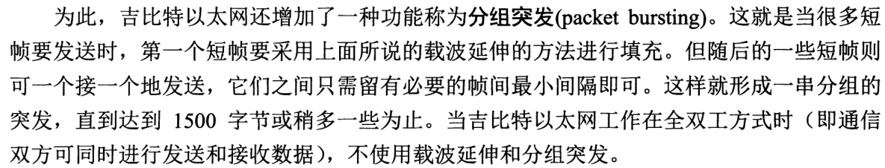
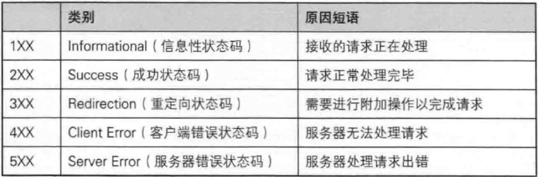

# 总

## 和OSI对应


## 通信传输流


# 应用层

> 决定了向用户提供应用服务时通信的活动

- HTTP协议也在这一层
- 文件传输，电子邮件，文件服务，虚拟终端 TFTP，HTTP，SNMP，FTP，SMTP，DNS，Telnet

# 传输层

- **网络层**的IP数据包只负责将数据传到正确的目标主机去, 但数据包有没有被接受, 被正确的接受那就是**传输层**的任务了
- TCP，UDP

## TCP

> Transmission Control Protocol 传输控制协议
>
> 面向连接的, 可靠的, 基于字节流的传输层通信协议

- 将应用层的数据流分割成报文段并发送给目标节点的TCP层
- 数据包都有序号, 对方收到则发送ACK确认, 未收到则重传
- 使用校验和来检验数据在传输过程中是否有误

### 报头数据

- Source Port & Destination Port 源端口 & 目标端口
  各16bits
- Sqeuence Number (Seq) 数据包序号
  用于将TCP的数据组合起来
- Acknowledge Number (ack)回应序号
  以知道数据包被接受
- Data Offset 数据补偿
  说明整个数据包字段的起始位置
- Reserved 保留
- Code(Control Flag) 控制标识码
  有6个bits, 分别代表6个句柄
  状态 为1时表示启动
  - URG(Urgent) 紧急数据包
  - **ACK**(Acknowledge) 确认标志位 响应数据包 与Acknowledge Number有关
  - PSH(Push function)
  - RST(Reset)
  - **SYN**(Synchronous)同步标志位 表示发送端希望双方建立同步处理, 就是要求建立连接. 通常带有SYN标志的数据包表示"主动"要连接到对方的意思
  - FIN(Finish) 终止标志位
- Window 滑动窗口
  用来控制数据包的流量
- Checksum 确认校验码
  检验数据包有没有被损毁
- Urgent Pointer 紧急数据
  URG = 1时产生作用
- Options 任意数据
- Padding 补足字段
- Maximum Segment Size(MSS, 可选)最大报文段容量
  报头长度: 20字节的固定部分和最长40字节的可选部分

### 通信端口

### 特权端口

小于1024的端口

### Socket Pair

> 网络是双向的, 达成连接的服务端与客户端提供的IP与端口, 这两对数据就是Socket Pair

- Source Address + Source Port
- Destination Address + Destination Port

### 三次握手

[TCP](https://www.bilibili.com/video/av34043448/?p=25)


在建立连接之前必须要通过三次确认的动作

1. 数据包发起(客户端->服务器)

   > 客户端向想要连接的服务器端发送一个数据包, 客户端必须随机取用一个大于1024的端口来作为程序沟通的接口.
   >
   > 在TCP的报头中SYN=1, 并记下发送出连接数据包的服务器端的序号(Seq)

   1. 设置连接状态: SYN_SENT 同步已发送
   2. 设置可接受的最大窗口值为字节
   3. 添加"MSS"选项到TCP SYN的首部
   4. 设备发送TCP SYN报文段(Seq为随机值, SYN=1, ACK=0(但存在于这里其实没有意义, 因为本报文段不是确认报文段), 数据长度=24B(20B的固定部分+3B的MSS+1B的Padding))

2. 数据包接收与确认数据包传送(服务器->客户端)

   > 服务器端也必须要 **确认客户端确实可以接收我们的数据包** 才行, 所以会发送一个Seq(随机的)给客户端, 并开始等待客户端的回应

   1. 设备在服务器端口80上接收到一个TCP SYN报文段
   2. TCP从TCP报文段首部中的最大报文段选项中获取MSS值
   3. 连接请求被接受
   4. 设备设置连接状态为SYN_RECEIVED(同步已接收)
   5. 当服务器端接到这个数据包, 并且确定要接收这个数据包的时候, 就会制作一个SYN=1, ACK=1的数据包. 比1. 中的Sequence号码多一号(ack=10002)

3. 回送确认数据包(客户端->服务器)

   > 如果客户端也同意与服务器端建立连接, 就发送一个确认数据包(ACK=1)给服务器, 亦即ack=20001+1 = 20002

   1. 设备接收一个TCP SYN+ACK报文段
   2. TCP报文段具有所期望的对等序号
   3. TCP连接成功
   4. 设备设置连接状态为ESTABLISHED
   5. 设备发送一个TCP ACK报文段(序号:为之前客户端发给服务器的序号+1, ACK=1, 数据长度=20)
      客户端收到服务器端的ack(10002), 客户端便知道服务器端  已经正确地接收了数据包.

4. 取得最后的确认(服务器收到了)

   > **网络是双向的**, 无论是服务器端还是客户端, 都要通过一次SYN与ACK来建立连接

   1. 设备接收一个TCP SYN+ACK报文段
   2. TCP报文段具有所期望的对等序号
   3. TCP连接成功
   4. 设备设置连接状态为ESTABLISHED
      顺利的话, 服务器收到ACK=1, 且ack=20002序号的数据包, 就能够建立这次的连接了

## UDP

> User Datagram Protocol 用户数据报协议
>
> 无连接 无状态


- TCP慢, 但可靠
- UDP适合需要实时反应的一些数据流: 影像实时传输软件
  UDP协议是IP协议在传输层的"傀儡", 只为IP传输起到了桥梁的作用

- UDP协议不可靠, 那么为什么不直接使用IP协议呢?
  - IP协议没有端口(port)的概念. IP协议用于两台计算机之间的对话, 但每台计算机需要有多个通信通道, 并将对各通信通道分配给不同的进程使用 (一个端口代表一个通信通道)

## 防火墙

最基本的防火墙原理: 对数据包报头的分析, 设定分析规则, 当发现某些特定的IP, 特定的端口或者是特定的数据包信息(SYN/ACK等), 那么就将该数据包丢弃

对OSI七层协议来说, 每一次可阻挡的数据有:

- 第二层: 针对来源与目标的MAC进行阻挡
- 第三层: 针对来源的IP, 以及ICMP的类别(type)进行阻挡
- 第四层: 针对TCP/UDP端口进行阻挡, 针对TCP的状态(code)来处理

# 网络层

> 网络互连层

- 处理网络上流动的数据包
  - 数据包是网络传输最小的数据单位
- 该层规定了通过怎样的路径到达对方计算机, 并把数据包传送给对方
  - 选择一条传输路径
- 为数据包选择路由 IP，ICMP，RIP，OSPF，BGP，IGMP

## IP

- 

### 结构

datagram

IP数据包简称IP包


- **IHL**(internet header length in IPv4): 用来记录头部的长度, 由于IPv6头部固定总长度位40Bytes, 所以不需要IHL. 一行为1
- **source address**: 发出IP地址
- **destionation address**: 目的地IP地址
- **time to live**(**Hop limit** in IPv6)存活时间: IP包每经过一个路由器, time to live--, 为零时IP包作废
- **type of service**(traffic class in IPv6)服务类型
  
  - 最初是用来给IP包分优先级，比如语音通话需要实时性，所以它的IP包应该比Web服务的IP包有更高的优先级, 被分为两部分
    - **Differentiated Service Field**(DS, 前6位) 用来区分服务类型
    - **Explicit Congestion Notification**(ECN, 后2位) 用来表明IP包途径路径的交通状况(但是实际上交通状况的控制往往由更高层的如TCP协议实现)
- **protocol**(next header in IPv6)协议: 说明IP包封装的是怎样的高层协议包(TCP or UDP)
- **Total Length**: 整个IP包的长度
- **Payload Length**(in IPv6): 

  - 数据部分的长度

  - 整个包长度位40Bytes + Payload Length
- **Header Checksum**

  - 校验IP包的头部信息
  - IPv6则没有checksum区域。IPv6包的校验依赖高层的协议来完成，这样的好处是免去了执行checksum校验所需要的时间，减小了网络延迟 (latency)
- Identification, flags, fragment offset: 为碎片化(fragmentation)服务的.


- IP的袋子必须要放在MAC袋子当中
  操作系统会提供网络层的socket, 从而允许用户直接操作IP包

- IP的分配
  - ICANN (the Internet Corporation for Assigned Names and Numbers)是Internet的中心管理机构.
  -  ICANN 的 IANA (Internet Assined Numbers Authourity)部门负责将IP地址分配给5个区域性的互联网注册机构(RIR，Reginal Internet Registry), 比如APNIC, 它负责亚太地区的IP分配. 
  - RIR将地址进一步分配给当地的ISP(Internet Service Provider), 比如中国电信. 
  - ISP再根据自己的情况, 将IP地址分配给机构或者直接分配给用户

  

- IPv4协议的地址为32位, 可提供$2^{32}$个地址.
  IPv6协议的地址为128位, 可提供$2^{128}$个地址.

### 种类

- Public IP
- Private IP
  - 私有IP的路由信息不能对外散播(只能存在内部网络)
  - 使用私有IP作为来源或目的地址的数据包, 不能通过Internet来传送
  - 关于私有IP的参考纪录(如DNS), 只能限于内部网络使用

### NAT

> Network Address Transfer
> 通过IP伪装, 使私有IP也能连上Internet

### 子网划分

- 同一个网段太多的计算机会影响效率, 因为你会接到其他很多计算机的广播(CSMA/CD的原因), 所以要进行子网划分

- 划分方法: Host_ID拿来当做Net_ID
  例如拿一位Host_ID来做Net_ID, Netmask就变成 255.255.255.128(11111111.11111111.11111111.10000000)
- 每个子网有不同Broadcast IP(广播地址), Network IP(网段地址)
- 掩码和IP做 AND(两个都是1才是1) 运算得到Net_ID

### CIDR

> 无类别域间路由
>
> Classless Interdomain Routing

事实上, 由于网络细分的情况太严重, 为了担心路由信息过大而导致网络效率不佳, 某些特殊情况下, 反而是将Net_ID借用来作为Host_ID, 这样就能将多个网络写成一个了.
但是如果借用的过程可能会打破原本IP代表等级的方式, 这就叫CIDR
通常Network/Netmask的写法就是CIDR的写法

## 路由

- 每台主机都有自己的"路由表"(routing table, 端口号对应网络号的表)
- Internet上面的路由不是静态的, routing table会变
  

### AD

> Administrative Distance (AD) is a value that routers use in order to **select the best path** when there are two or more different routes to the same destination from two different routing protocols. 

- AD counts the reliability of a routing protocol. 

- AD is a numeric value which can range from 0 to 255. 
- A smaller AD is more trusted by a router, therefore the best Administrative Distance (AD) being 0 and the worst, 255.

### Metric Value

If the router has more than one route found by two different routing protocols, for the same destination network, the router chooses **Administrative Distance** to choose the best one.
But in some cases, there will be two paths found by the same protocol, to the same destination network. Here the Routing Protocol will use **Route Metric value** to find the best path.

- RIP (Routing Information Protocol) uses hop count as the metric.
- OSPF (Open Shortest Path First) Metric value is also known as OSPF Cost Value. OSPF cost value for a particular route (path) is the accumulated cost to send packets from source network to destination network using that route.

### OSPF协议

[视频](https://www.bilibili.com/video/av38578744)

### RIP协议

> Routing Information Protocol
> 一种用来生成routing table的协议

它通过距离(从出发点到目的地途径的 **路由器数目(hop number)**来决定routing table, 所以属于distance-vector protocol.


不在同一个网络的通信过程:(**routing**, IP包的接力, 也适用于IPv6)(在已经了解局域网的IP地址和MAC地址的对应关系的情况)

1. 查询IP数据包的目标IP地址
2. 查询是否位于本机所在的网络路由表中
   如果发现目标IP和本机IP的Net_ID相同时, 通过局域网传送数据
3. 查询默认路由(Default Gateway)
   如果不在同一网络, 本机会分析路由表当中是否有其他相符合的路由设置, 如果没有的话, 就直接将该IP数据包从到默认路由器(Default Gateway)去.
4. 送出数据包至 Default Gateway 后, 不理会数据包流向
   本机不理会接下来的工作, 作为默认路由的服务器会分析路由信息, .....
   收到RIP包的路由器和主机根据RIP包和自己到发送RIP包的距离, 算出自己前往各个IP的距离. 在各个点不断重复RIP广播/计算距离/更新routing table的过程, 最终所有的主机和路由器都能生成最合理的路径(merge)

- routing的整个过程中, IP包不断被主机和路由封装(encapsulation)入帧并拆开, 然后借助连接层, 在局域网的各个NIC之间传送帧.
- RIP技术上不能到达距离超过15(15个路由器)的IP. 所以RIP更多用于互联网的一部分(比如整个中国电信的网络)。这样一个互联网的部分往往属于同一个ISP或者有同一个管理机构，所以叫做自治系统(AS,autonomous system). 
  - 自治系统内部的主机和路由根据通向外部的边界路由器来和其他的自治系统通信
  - 各个边界路由器之间通过BGP(Border Gateway Protocol)来生成自己前往其他AS的routing table, 而自治系统内部则参照边界路由器, 使用RIP来据欸的那个routing table. BGP的基本工作过程与RIP类似，但在考虑距离的同时，也权衡比如政策、连接性能等其他因素，再决定交通的走向(routing table)

### 路由器

功能就是负责不同网络之间的数据包传递(IP Forwarding), 由于路由器具有IP Forwarding的功能, 并且具有管理路由的能力, 所以可以将来自不同网络之间的数据包进行传递.
**主机与主机配置的Gateway一定要在同一网段内**

## MAC

IP和MAC有着一定的关联性: 因为Internet上用的是IP, 而到了局域网, 传递数据的是以太网, 以太网主要是用网卡卡号(MAC)

### ARP

> Address Resolution Protocol(网络地址解析) 协议. 只用于IPv4. (IPv6使用的是Neighbor Discovery Protocol)

ARP介于连接层和网络层之间

要知道IP配置于哪张以太网卡上, 要主机对整个局域网发送出ARP数据包, 对方收到ARP数据包后, 会返回它的MAC地址给主机(仅仅给主机. 通过数据帧上的Sender MAC Address来送回去), 主机知道了对方的网卡就能够开始传递数据了. 送回来的MAC地址会存在 **ARP cache** 中, 记录IP地址和MAC地址如何对应

#### ARP(数据)包

包裹在帧中, 有自己的IP地址和MAC地址, 目标地址的MAC是广播MAC, 请求某个IP地址的MAC地址, 拥有该IP地址的主机会回复发出请求的主机, 不符合的也会趁机更新自己的ARP cache

### RARP

> Revers Address Resolution Protocol(反向网络地址解析) 协议

## ICMP

> Internet Control Message Protocal 因特网信息控制协议

- ICMP数据包是一个错误检测与报告的机制, 最大的功能就是可以确保我们网络的连接状态与连接的正确性
- ICMP数据包也是 **网络层** 的重要数据包之一

- ICMP是通过IP数据包来进行数据传送的. 因为在Internet上面有传输能力的就是IP数据包了

- IP协议的工作方式是“Best Effort”，如果IP包没有被传送到目的地，或者IP包发生错误，IP协议本身不会做进一步的努力。但上游发送IP包的主机和接力的路由器并不知道下游发生了错误和故障，它们可能继续发送IP包。**通过ICMP包，下游的路由器和主机可以将错误信息汇报给上游，从而让上游的路由器和主机进行调整**

- `ping` and `traceroute` are ICMP

### 常见ICMP包

- 回音(echo)
- 源头冷却(source quench)
- 目的地无法到达(destination unreachable)
- 超时(time exceeded)
  - IPv4中的Time to Live(TTL)和IPv6中的Hop Limit会随着经过的路由器而递减，当这个区域值减为0时，就认为该IP包超时
  - Time Exceeded就是TTL减为0时的路由器发给出发主机的ICMP包，通知它发生了超时错误。
- 重新定向(redirect): 重新定向(redirect)属于错误信息。当一个路由器收到一个IP包，对照其routing table，发现自己不应该收到该IP包，它会向出发主机发送重新定向类型的ICMP，提醒出发主机修改自己的routing table

# 链路层

> 数据链路层, 网络接口层

- 硬件上的范畴均在链路层的作用范围: 包括控制操作系统, 硬件的设备驱动, NIC(Network Interface Card, 网络适配器, 网卡), 光纤等物理可见部分
- 有的书把链路层再分成两层, 一层数据链路层, 一层物理层
- 适配器（即网卡）来实现**数据链路层和物理层**这两层的协议的硬件和软件, 网络适配器工作在TCP/IP协议中的**网络接口层**（OSI中的数据链里层和物理层）

## 数据链路层

> Data link layer

三个基本问题

- 封装成帧

  - 

    

  - MTU(Maximum Transmission unit) 最大传输单位

- 透明传输

  - 透明: 某一个实际存在的事物看起来却像不存在一样
  - 
  - 避免消息符号与帧定界符号相混淆

- 检错纠错


- 传输有地址的帧以及错误检测功能 SLIP，CSLIP，PPP，ARP，RARP，MTU

### PPP

> Point-to-Point Protocol


协议要点

- 简单: 不可靠, best effort, 对数据链路层的帧, 不纠错, 包没有序号(次序), 没流量控制
- 封装成帧: 帧定界符
- 透明性
- 多种网络层协议: 在同一物理链路上同时支持多种物理层协议(IP, IPX etc.). 当点对点链路所连接的是局域网或路由器时, PPP必须同时支持在链路所连接的局域网或路由器上运行的各种网络层协议
- 多种类型链路: 串行或并行的, 同步或异步的, 高速或低速的, 电或光的...
- 差错检测: 有错的帧丢弃, **检错不纠错**
- 检查连接状态: 自动检测链路是否正常工作, 及时发现故障恢复的链路
- 最大传送单元: 数据部分默认最大1500字节
- 网络层地址协商: 能够使通信的两个网络层知道彼此的地址
- 数据压缩协商: 


- 只有两个结点
- 只接受字节(面向字节)
- 适合用于网络环境好的, 如光纤
- 不使用序号
- 没有确认机制

组成

- 一个将IP数据报封装到串行链路的方法
- 一个用来简历, 配置和测试数据链路连接的链路控制协议LCP(Link Control Protocol)
- 一套网络控制协议NCP(Network Control Protocol)

帧格式

- 
- 7E: 帧的开始或结束
- FF, 03: 没有意义
- 协议字段
  - 0x0021: IP 数据报
  - 0xC021: PPP链路控制协议 LCP 的数据
  - FCS: CRC序列

工作状态

- 

- 链路终止
- 链路静止
- 链路建立
- 链路打开

### CSMA/CD

> 以太网络的传输协议
>
> Carrier Sense Multiple Access with Collision Detection
>
> 为IEEE802.3的标准
>
> - 监听介质使用情况(Carrier Sense)
> - 多点传输(Multiple Access):
>   通信公开, 数据会在某些情况下会被发给不是目标主机的主机
> - 冲突检测(Collision Detection)
>   不允许多路同时通信

- 特征
  - 无连接, 尽最大努力的交付, 不可靠交付
  - 曼彻斯特编码
  
- 半双工: 一个站不可能同时发送和接收

- 帧间最小间隔: 为了使刚刚收到数据帧的站的接收缓存来得及清理, 做好接收下一帧的准备

- 低负荷时信道利用率高，但控制复杂，高负荷时信道冲突大

- 要点

  

#### 退避算法


- 最短争用期为51.2us, 512比特(时间), 64字节


#### 强化碰撞


帧间最小间隔: 9.6us

### 以太网

两种主要标准: DIX Ethernet V2 标准与 IEEE 的 802.3 标准

#### MAC

- MAC数据帧 = 以太帧

- CSMA/CD发送出去的数据帧, 就是MAC

- MAC可以比作一个在网线上传递的包裹, 将数据(payload)包裹起来, 而这个包裹是网络硬件上面传输数据的最小单

- 数据帧上面有两个很重要的数据: **目标与来源的网卡卡号**, 因此网卡卡号又简称**MAC地址**

- 帧格式

  

  - 前导码, 序言(Preamble) 7 Bytes
    每个Bytes都是0xAA(10101010), 两台电脑可能会以不同的频率接受发送. 序言就是为了让接收设备调整接受频率, 以使接受发送设备的频率一致, 这个过程叫做时钟复原(recover the clock)
  - 起始信号(SFD, Start of Frame Delimiter) 1 Byte
    固定值是 0x AB
  - MAC目标地址(DST, MAC destination) 6 Bytes
  - MAC源地址(SRC, MAC source) 6 Bytes
  - 长度指示(Ethertype/Length) 2 Bytes
  - LLC数据(Payload) 46-1500 Bytes
  - 帧效验序列(FCS, Frame check sequence)
    一个32位循环冗余校验码，以便验证帧数据是否被损坏
    CRC算法

在这个MAC的传送中, 仅在局域网内生效, 如果跨过不同的子网, 那么来源与目的的硬件地址就会跟着变, 因为已经变成了不同网卡之间的交流

#### 信道利用率
$$
a = \frac{τ}{T_0}
$$

$τ:$  以太网单程端到端时延

$T_0: $ 发送时间


- $a$ 越小越好, a小才能有效地检测冲突
- 

#### 吉比特以太网

特点

- 1Gbit/s下可以全双工或半双工
- 使用IEEE802.3的帧格式
- 半双工下使用CSMA/CD, 全双工不使用
- 与10BAST-T和10BAST-T技术向后兼容

配置举例

- 

##### 载波延伸

> carrier extension
>
> 最短帧长仍为64字节, 同时争用期增大为512字节
>
> 如果发送的MAC帧长不足512字节, 就用一些特殊字符填充在帧的后面, 使帧的发送长度增大到512字节

- 对有效载荷无影响
  - 有效载荷: 在一个分组中, 去掉首部(和尾部)的控制字段后, 剩下的有用的数据部分
  - 不用网络层次, 有效值所表示的内容不一样, 例如数据链路层一个帧的有效载荷包含了网络层IP数据报的首部和数据部分, 而从网络层看, 只有IP数据报中的数据部分, 才是网络层IP数据报的有效载荷, 如果IP数据报中的数据是运输层的TCP报文段, 那么从运输层看, 有效载荷只是运输层TCP报文段中的数据部分
- 多填充了448字节, 开销变大

##### 分组突发

> packet bursting



## 物理层

> Physical layer

- 以**二进制数据**形式在物理媒体上传输数据 ISO2110，IEEE802，IEEE802.2
- 物理层还要完成**对传输方式的转换**, 因为: 
  - 数据在通信线路上是**串行传输**(逐个比特按时间顺序传输), 出于经济考虑
  - 计算机内部多采用**并行传输**方式

### 概念

- 码元
  - 在使用时(间)域的波形表示数字信号时, 代表不同离散数值的基本波形就称为码元
  - 一个码元所携带的信息量是不固定的, 是由调制方式和编码方式决定的

#### 调制

- 带通调制

  - 使用载波的调制
  - 带通信号: 经载波调制后的信号, 仅在一段频率范围内能够通过信道

- 基带调制, 编码

  - 基带信号: 基本频带信号, 来自信源的信号

  - 对基带信号的波形进行变换, 使它能够与信道特征相适应

  - 变换后仍是基带信号

  - 把数字信号转换为另一种形式的数字信号

  - 编码方式

    

    

    自同步能力

- 调制方法

  - 调幅, 调配, 调相

    

    

#### 信道

- 单向通信, 单工通信
- 双向交替通信, 半双工通信, Half-duplex
  - can only communicate in one direction at a time
  - like: walkie-talkies work对讲机, 单向单车道
    need a "traffic cop"(CSMA/CD) to avoid collision
  - HUB only uses half-duplex
- 双向同时通信, 全双工通信, Full-duplex
  - communicates in both directions at the same time
  - more wideband
  - like: telephone communication, 双向双车道
  - SWITCH used in full-duplex network

#### 奈氏准则

> Nyquist
>
> 在任何信道中, **码元传输**的速率是有上限的, 传输速率超过此上限, 就会出现严重的码间串扰的问题, 使接收端对码元的识别成为不可能

- 码间串扰: 接收端收到的信号波形失去了码元之间的清晰界限

#### 香农公式

> Shannon

- 信道的极限信息传输速率 $C = W$ $log_2(1+S/N)$
  - $W$ 信道宽度, 单位Hz
  - $C$ 单位 bit/s
  - 信噪比 
    - 记作 S/N
    - S: 信道内所传信号的平均功率
    - N: 信道内部的高斯噪音功率
    - 信噪比(dB) = $10 log_{10}(S/N)$ (dB)
- 信道的 带宽 或 信道中的信噪比 越大, 信息的极限传输速率就越高
- 如果信噪比, 带宽都不能再提高了, 可以用编码的方法让每个码元携带更多比特的信息量

- 

## 集线器

> hub 集线器是一种网络共享介质设备

- 网络 **共享** 介质总在单一时间内, 仅能被一台主机所使用 (比喻:十字路口)
- 不同于交换器, 交换器是不共享的
- 不进行碰撞检测
- 标准的数据帧在网卡与其他以太网媒体一次只能传输1500bytes, 如果大于这个的文件会被拆分成多个小数据包
- 每个站到集线器的距离不超过100m
- 10BASE-T
  - 10: 10Mbit/s
  - BASE: 连接线上的信号是基带信号
  - T: 双绞线
- 工作在**物理层**

## 交换器 网桥

- 集线器(Hub)与交换器(Switch)最大的差异在于交换器内有一个特别的内存, 记录每个 **Switch Port** 与其连接的PC的MAC地址(记录在MAC Address Table里, **将Port和MAC对应起来**), 所以当来自Switch两端的PC要互传数据时, 每个数据帧将直接通过交换机的内存数据而传送到目标主机上(集线器是多点传输)
- **不是共享设备**, 每个端口(port)都有独立的带宽
- 允许多路同时通信
- 交换器基本上取代了集线器
- 一般全双工
- 工作在数据**链路层**
- 交换机实质上是一个多接口的网桥
  - 网桥: 对收到的帧的目的地址进行转发和过滤, 有一张MAC地址与接口对应的地址表


# http协议

- 无状态协议: 不保留之前一切的请求或响应报文的信息, 这样可以更快地处理大量事务, 确保协议的可伸缩性
  - 后用Cookie保持状态
- 原来每进行一次HTTP通信就要断开一次TCP连接, 但开销大, 后来用了**持久连接** (HTTP Persistent Connections, HTTP keep-alive, HTTP connection reuse)
- 原来发送请求后得收到相应才能继续发请求, 但得等, 后来用了**管线化(pepelining)**方法, 请求数据多的时候比持久连接快

## Req & Res

- 请求报文的构成

  

  - 如果不是访问特定资源而是对服务器本身发出请求

    ```
    GET * HTTP/1.1
    Host: hackr.jp
    ```

    

- 相应报文的构成

  

## http方法

### GET

### POST

### PUT

> 用来传输文件, 上传文件

- 像FTP协议的文件上传: 要求在请求报文的主体中包含文件内容, 然后保存到请求URI指定的位置
- 不带验证机制, 一般不用


### HEAD

> 用于确认URI的有效性及资源更新的日期时间

- 和GET方法一样, 只是不返回报文主体部分


### DELETE

> 用来删除文件, 与PUT相反


### OPTIONS

> 用来查询针对请求URI指定的资源支持的方法


### TRACE

> 让Web服务器端将之前的请求通信环回给客户端

### CONNECT

> 要求用隧道协议连接代理, 用TCP

- 主要使用SSL和TLS协议把通信内容加密后经网络隧道传输
  - SSL Secure Sockets Layer
  - TLS Transport Layer Security


## Cookie

1. 请求

   

2. 响应, 服务器端生成Cookie信息

   

   - Set-Cookie 用来通知客户端保存Cookie, 下次请求的时候加Cookie再发送

3. 请求

   

## 报文

> message

- HTTP通信中的基本单位
- 由8位组字节流(octet sequence)组成, 通过HTTP通信传输

### 结构


- 不一定要有主体

### 报文实体 & 实体实体

- 实体(entity)分为实体首部和实体主体
- 实体作为请求或响应的有效载荷数据(补充项)被传输
- 报文主体用于传输实体主体, 通常报文主体等于实体主体, 只有当传输中进行**编码**操作时, 实体主体的内容发生变化, 才导致它和报文主体产生差异
  - 编码可以提升传输速率, 但需要消耗CPU等资源

### 首部字段


### 分块传输编码

> chunked transfer coding


- 每一块(chunk)都会用16进制来标记块的大小, 最后一个块用"0(CR+LF)"标记

### MIME

> Multipurpose Internet Mail Extensions 多用途互联网邮件扩展

- 使用多部份对象集合(Multipart)的方法, 来容纳多份不同类型的数据
- 要在

### 范围请求

> Range Request
>
> 指定下载的实体范围


- 响应返回206 Partial Content 响应报文, 如果无法响应范围请求, 则返回状态吗200 OK和完整的实体内容

### 内容协商

> Content Negotiation

- 内容协商机制是指客户端和服务端就响应的资源内容进行交涉, 然后提供给客户端最为合适的资源
- 以响应资源的语言, 字符集, 编码方式作为判断的基准


## 状态码



| code | desc                            | content                                                      |
| ---- | ------------------------------- | ------------------------------------------------------------ |
| 200  | OK                              |                                                              |
| 204  | No Content                      | 处理成功, 但返回的响应报文不含实体的主体部分; 用于客户端往服务器发消息, 服务器不用对客户端发消息的情况 |
| 206  | Partial Content                 | 范围请求; GET; 响应报文包含Content-Range指定范围的实体内容   |
| 301  | Moved Permanently 永久性重定向  | 请求的资源被分配了新的URI; 如 `http://example.com/sample`没有`/`就会产生301 |
| 302  | Found 临时性重定向              |                                                              |
| 303  | See Other                       | 与302功能相同, 不同的是一定要用GET;                          |
| 304  | Not Modified                    | 未满足客户端发送的附带条件的请求(If-Match, If-Modified-Since, If-None-Match, If-Range, If-Unmodified-Since) |
| 307  | Temporary Redirect 临时性重定向 | 不会从POST变成GET                                            |
| 400  | Bad Request                     | 请求报文存在语法错误                                         |
| 401  | Unauthorized                    | 需要有通过HTTP认证(BASIC, DIGEST认证)的认证信息; 若之前已请求过1次, 则表示用户认证失败 |
| 403  | Forbidden                       |                                                              |
| 404  | Not Found                       | 被GFW拦下来了                                                |
| 500  | Internal Server Error           |                                                              |
| 503  | Service Unavailable             |                                                              |


- 状态码和状态不一致也是很常见的

## 通信数据转发

### 代理

> 转发


- 不改变URI
- 用途
  - 通过设置组织内部的proxy可以做到针对特定URI访问的控制
  - 利用缓存技术减少网络带宽的流量
- 种类
  - 缓存代理(Caching Proxy): 会预先将资源的副本缓存到proxy上
  - 透明代理(Transparent Proxy): 不对报文做任何加工的代理
  - 非透明代理

### 网关

> 转发其他服务器通信数据的服务器


- 利用网关能提高通信的安全性

### 隧道

> 相隔甚远的客户端和服务器两者之间进行中转, 并保持双方通信连接的程序

