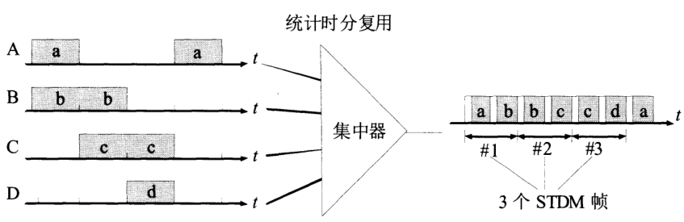
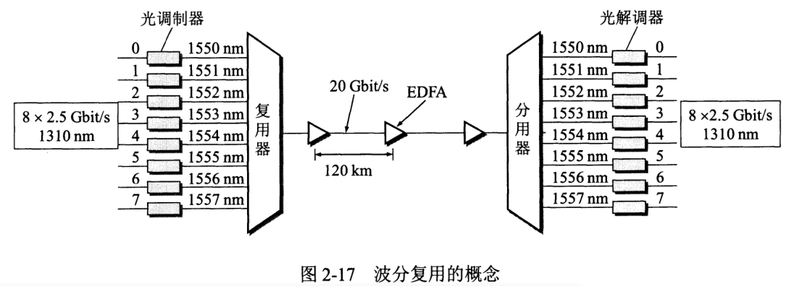
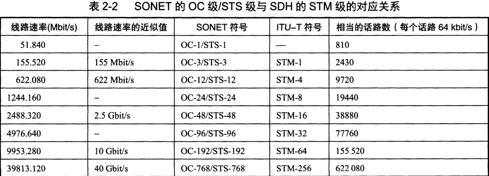
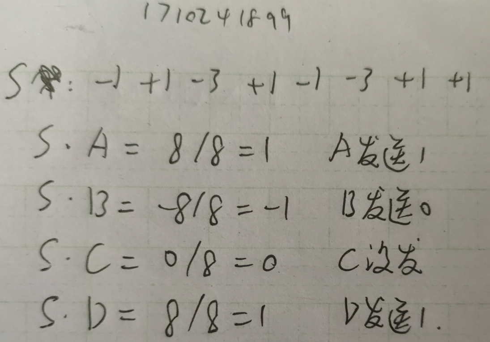
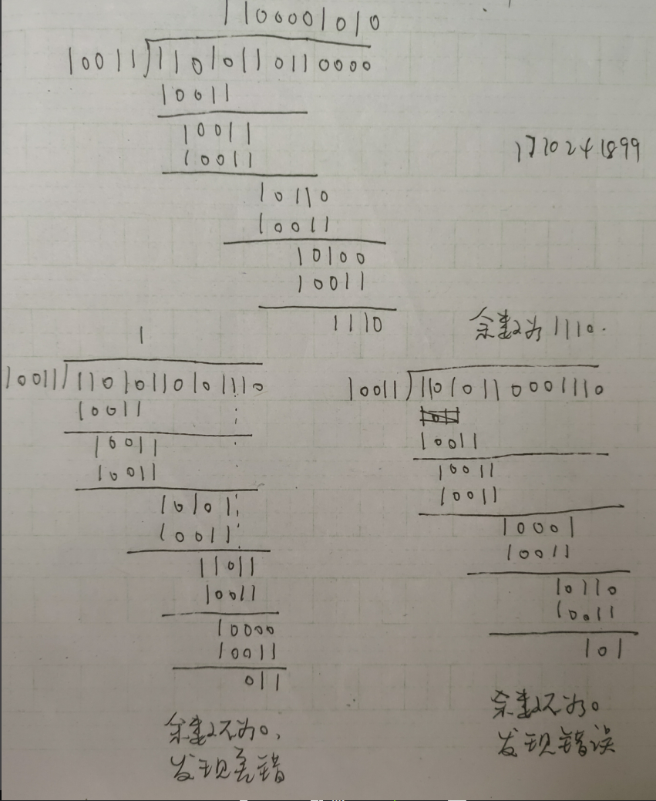
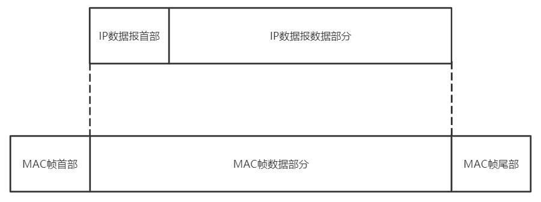
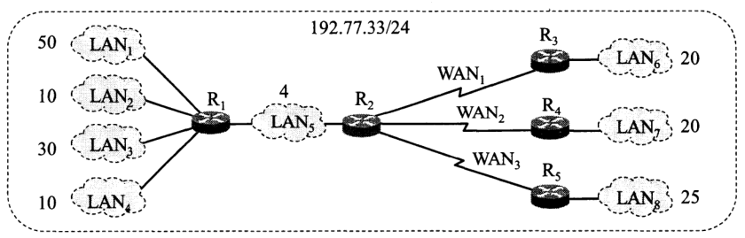

# 物理层

数据在信道中的传输速率受哪些因素的限制? 信噪比能否任意提高? **香农公式**在数据通信中的意义是什么? "比特/秒" 和 "码元/秒" 有何区别? 

- 限制因素
  - 码元传输速率受奈氏准则的限制
  - 信息传输速率受香农公式的限制, 如信道宽度, 信噪比
- 信噪比不能任意提高
- 香农公式的意义: 只要信息传输速率低于信道的极限信息传输速率, 就一定存在某种办法来实现无差错的传输

---

假定某信道受**奈氏准则**限制的最高码元速率为 20000码元/秒. 如果采用振幅调制, 把码元的振幅划分为 16 个不同等级来传送, 那么可以获得多高的数据率(bit/s)?

- 16个不同等级需要 $log_216 = 4$ 个比特表示, 原来需要4个码元的信号就转换为由1个新的码元组成的信号, 即由原来的每4个比特构成一个新的码元

  所以信息传输速率 $C = 20000 * 4 = 80000 $bit/s

---

假定要用 3 kHz 带宽的电话信道传送 64 k bit/s 的数据(无差错传输), 试问这个信道应具有多高的**信噪比** (分别用比值和分贝表示) ? 这个结果说明什么问题? 

- 由香农公式可知 $S/N = 2^{\frac{C}{W}}-1$, $C = $ 64000, $W=$ 3000, 得信噪比为 2642245, 64.2 dB
- 说明这个信源的信噪比要求高

---

用**香农公式**计算一下, 假定信道带宽为 3100 Hz, 最大信息传输速率为 35 k bit/s, 那么若想使最大信息传输速率增加 60%, 问信噪比 S/N 应增大到多少倍? 如果在刚才计算出的基础上将信噪比 S/N 再增大到 10倍, 问最大信息速率能否再增加 20%?

- $S/N1 = 2^{\frac{35000}{3100}}-1$

  $S/N2 = 2^{\frac{1.6*35000}{3100}}-1$

  得 $\frac{S/N2}{S/N1} = 100$, 所以应增大100倍

- $C3= 3100* log_2(1+10*S/N2)$

  $C2 = 3100* log_2(1+S/N2)$

  $\frac{C3}{C2} = 1.184$, 增加了18.4%, 所以不能

---

1. 二叉树有 $2^n-1$ 个结点可知这是一棵满二叉树

2. 第 $k$ 层的结点数是 $2^{k-1}$

3. 总结点数是 $2^n-1$

4. 所有结点到根结点的距离之和是 $2^1*1 + 2^2 * 2 + ... + 2^{n-1}*(n-1)$

5. 平均下来每个节点到根结点的距离是$\frac{2^1*1 + 2^2 * 2 + ... + 2^{(n-1)}*(n-1)}{2^n-1}$

6. $i$到根节点, 根节点到 $j$, 一来一去的距离就是 $\frac{2^1*1 + 2^2 * 2 + ... + 2^{(n-1)}*(n-1)}{2^n-1} * 2$

7. 接下来化简$2^1*1 + 2^2 * 2 + ... + 2^{n-1}*(n-1)$, 用错位相减法

  $S_n = 2^1*1 + 2^2 * 2 + ... + 2^n*n$ 
  $2S_n = 2^2*1 + 2^3 * 2 + ... + 2^n*(n-1) + 2^{n+1}*n$
  $S_n - 2S_n = -S_n = 2^1 + 2^2 + 2^3 + ... + 2^n- 2^{n+1}*n$
  $S_n = (n-1)*2^{n+1} + 2$
  原式中式 $S_{n-1}  = (n-2)*2^{n} + 2$

8. 所以总距离是 $\frac{(n-2)*2^{n} + 2}{2^n-1} * 2$

9. 当 $n$ 趋向于无穷大的时候, $\frac{(n-2)*2^{n} + 2}{2^n-1} * 2 \approx \frac{(n-2)*2^{n}}{2^n} * 2 = 2n-4$

---

1. 没有主机使用信道的概率 $P=(1-p)^n$
2. 只有一个主机使用信道的概率 $P=C_n^1p*(1-p)^{n-1}$
3. 有两个或以上的主机使用信道的概率 $P= 1-np(1-p)^{n-1}-(1-p)^n$

---

不算吧, OSI是层层封装, 再层层拆封, 封装时高层把信息给了低层后就不管了, 但这里是"工程师和啤酒公司讨论技术问题", "两位总裁讨论问题", 信息可以在任何相邻的两层之间, 或者同层之间交流, 而OSI是在最底层才可以交流. 

---

1. 头大小 = $n*h$
2. 头大小比总大小 = $\frac{n*h}{n*h+M}$

---

- 为什么使用信道复用技术? 常用的信道复用技术有哪些

  - 如果使用信道复用技术的话, 每个通信都需要使用单独的信道, 通信的代价会很高, 信道复用可以通过共享信道, 提高信道利用率
  - 频分复用, 时分复用, 统计时分复用, 码分复用, 波分复用

- 试写出下列英文缩写的全文, 并进行简单的解释

  - FDM

    > Frequency Division Multiplexing
    >
    > 频分复用

    - 用户在分配到一定的频带后, 在通信过程中始终占用这个频带
    - 频分复用的所有用户在同样的时间占用不同的带宽资源(频率带宽而不是数据的发送速率)

  - TDM

    > Time Division Multiplexing
    >
    > 时分复用

    - 将时间划分为一段段等长的时分复用帧, 每一个时分复用的用户在每一个TDM帧中占用固定序列的时隙
    - TDM信号也称为等时(isochronous)信号
    - 时分复用的所有用户在不同的时间占用同样的频带宽度, 更有利于数字信号的传输

  - STDM

    > Statistic Time Division Multiplexing
    >
    > 统计时分复用

    

    - STDM使用STDM帧来传送复用的数据. 每一个STDM帧中的时隙数小于连接在集中器上的用户数
    - 图中的短时隙用于放入用户的地址信息
    - STDM帧不是固定分配时隙, 而是按需动态地分配时隙. 各用户有了数据就随时发往集中器的输入缓存, 然后集中器按顺序依次扫描输入缓存, 把缓存中的输入数据放入STDM帧中. 对没有数据的缓存就跳过去, 当一个帧的数据放满了, 就发送出去
    - 统计时分复用也叫异步时分复用, 因为用户所占用的时隙并不是周期性出现的

  - WDM

    > Wavelength Divison Multiplexing
    >
    > 波分复用, 光的频分复用

    - 在一根光纤上复用两路光载波信号
    - 常用波长而不是频率来表示所使用的光载波, 所以叫波分复用

  - DWDM

    > Dense Wavelength Division Multiplexing
    >
    > 密集波分复用

    

    - 在一根光纤上复用几十路或更多路数的光载波信号
    - 光传输一段距离后会衰减, 需要EDFA(Erbium Doped Fiber Amplifier 掺铒光纤放大器)进行放大

  - CDMA

    > Code Division Multiple Access
    >
    > 码分多址

    - 每一个用户使用不同的码型, 在同样的时间使用同样的频带进行通信

  - SONET

    > Synchronous Optical Network
    >
    > 同步光纤网

    - 整个同步的网络的各级时钟都来自同一个非常精确的主时钟
    - SONET为光纤传输系统定义了同步传输的线路速率等级结构

  - SDH

    > Synchronous Digital Hierarchy
    >
    > 同步数字系列

    - SONET是美国标准, SDH是国际标准

  - STM-1

    > Synchronous Transfer Module
    >
    > 第1级同步传递模块

    

    - STM-1相当于SONET体系中的OC-3速率
    - SDH/SONET标准的制定实现了数字传输体制上的世界性标准

  - OC-48

    > Optical Carrier
    >
    > 第48级光载波

    - OC-48相当于STM-16速率

- 码分多址CDMA为什么可以使所有用户在同样的时间使用同样的频带进行通信而不会互相干扰? 码分复用有什么优缺点

  - 因为每个用户所分到的码片序列互相正交
  - 缺点: 是一种扩频技术, 占用的带宽更大
  - 优点: 抗干扰能力强, 安全性高

- 共有四个站进行码分多址CDMA通信, 四个站的码片序列为:

  A:(-1 -1 -1 +1 +1 -1 +1 +1)

  B:(-1 -1 +1 -1 +1 +1 +1 -1)

  C:(-1 +1 -1 +1 +1 +1 -1 -1)

  D:(-1 +1 -1 -1 -1 -1 +1 -1), 现收到码片序列: (-1 +1 -3 +1 -1 -3 +1 +1), 问是哪个站发的数据? 发的是?

  

# 数据链路层

假定1km长的CSMA/CD网络的数据率为1Gbit/s, 设信号在网络上的传播速度为200 000km/s, 求能够使用此协议的最短帧长

**解:**

$\frac{1km*2}{200000km/s}*1Gbit/s = 10000bit$

---

假定在使用CSMA/CD协议的10Mbit/s以太网中某个站在发送数据时检测到碰撞, 执行退避算法时选择了随机数r=100. 试问这个站需要等待多长时间后才能再次发送数据? 如果是100Mbit/s的以太网呢 ?

**解:**

以太网最小帧长512bit

10Mbit/s: $\frac{512bit}{10*10^6bit/s}*100 = 5120us = 5.12ms$

100Mbit/s: $\frac{512bit}{100*10^6bit/s}*100 = 512us$

---

公式($S_{max} = \frac{T_0}{T_0+\tau}=\frac{1}{1+a}, T_0:发送帧需要的时间, \tau: 单程端到端时延$ )表示, 以太网的极限信道利用率与连接在以太网上的站点数无关. 能否由此推论出: 以太网的利用率也与连接在以太网上的站点数无关? 请说明你的理由

**解:**

不能, 极限信道利用率是在理想化的情况下算出来的, 实际中以太网的站点发送数据的时间不确定, 也有可能会碰撞, 站点数越多可能碰撞的几率越大

---

**数据率为10Mb/s的以太网在物理媒体上的码元传输速率是多少码元/秒？** 

答：(参见P80)码元传输速率即为波特率，以太网使用曼彻斯特编码，这就意味着发送的每一位都有两个信号周期。标准以太网的数据速率是10MB/s，因此波特率是数据率的两倍，即20M波特

---

假定站点A和B在同一个**10Mb/s**以太网网段上。这两个站点之间的传播时延为225比特时间。

 现假定A开始发送一帧，并且在A发送结束之前B也发送一帧。如果A发送的是以太网所容许的最短的帧，那么A在检测到和B发生碰撞之前能否把自己的数据发送完毕？换言之，如果A在发送完毕之前并没有检测到碰撞，那么能否肯定A所发送的帧不会和B发送的帧发生碰撞？（提示：在计算时应当考虑到每一个以太网帧在发送到信道上时，在MAC帧前面还要增加若干字节的前同步码和帧定界符）

**解:**

答：设在t=0时A开始发送，在t=（64+8）*8=576比特时间(64是最小帧长, 8是MAC帧的头部, 8字节)，A应当发送完毕。t=225比特时间，B就检测出A的信号。只要B在t=224比特时间之前发送数据，A在发送完毕之前就一定检测到碰撞，就能够肯定以后也不会再发送碰撞了如果A在发送完毕之前并没有检测到碰撞，那么就能够肯定A所发送的帧不会和B发送的帧发生碰撞（当然也不会和其他站点发生碰撞）。

---

在上题中的站点A和B在t=0时同时发送了数据帧。当t=225比特时间，A和B同时检测到发生了碰撞，并且在t=225+48=273比特时间完成了干扰信号的传输。A和B在CSMA/CD算法中选择不同的r值退避。假定A和B选择的随机数分别是 rA=0 和 rB=1。试问

A和B各在什么时间开始重传其数据帧？

A重传的数据帧在什么时间到达B？

A重传的数据会不会和B重传的数据再次发生碰撞？B会不会在预定的重传时间停止发送数据？

**解:**

争用期是512不是225*2, 因为是在10Mb/s的网络

- t=0时，A和B开始发送数据

- T1=225比特时间, A和B都检测到碰撞 τ

- T2=273比特时间, A和B结束干扰信号的传输T1+48

- T3=594比特时间, A在 T2+τ+rA*争用期+ 96(T2+干扰信号传满整个信道(225) + 退避时间 + 帧间间隔时间) 开始发送

- T4=785比特时间，B再次检测信道。T2+rB*争用期 这里不加τ是因为rB已经是不0了, 不用担心干扰信号没有传到
  - 如空闲，则B在 T5=881比特时间 发送数据
  - 否则再退避 T5=T4+96

A重传的数据在819比特时间到达B，B先检测到信道忙，因此B在预定的881比特时间停止发送

---

!

以太网只有两个站，它们同时发送数据，产生了碰撞。于是按截断二进制指数退避算法进行重传。重传次数记为I, i=1,2,3,、、、。那么第三次重传失败的几率是多少？（ ）

- 第一次重传从{0,1}中选择，概率为0.5再次碰撞
- 第二次重传从{0,1,2,3}中选择，概率为0.25再次碰撞
- 第三次重传从{0,1,2,3,4,5,6,7}中选择，概率为0.125再次碰撞

---

**10Mb/s以太网升级到100Mb/s、1Gb/S和10Gb/s时，都需要解决哪些技术问题？为什么以太网能够在发展的过程中淘汰掉自己的竞争对手，并使自己的应用范围从局域网一直扩展到城域网和广域网？
** 答：技术问题：使参数a保持为较小的数值，可通过减小最大电缆长度或增大帧的最小长度
 在100mb/s的以太网中采用的方法是保持最短帧长不变，但将一个网段的最大电缆的度减小到100m，帧间时间间隔从原来9.6微秒改为现在的0.96微秒
 吉比特以太网仍保持一个网段的最大长度为100m，但采用了“载波延伸”的方法，使最短帧长仍为64字节（这样可以保持兼容性）、同时将争用时间增大为512字节。并使用“分组突发”减小开销
 10吉比特以太网的帧格式与10mb/s，100mb/s和1Gb/s以太网的帧格式完全相同
 吉比特以太网还保留标准规定的以太网最小和最大帧长，这就使用户在将其已有的以太网进行升级时，仍能和较低速率的以太网很方便地通信。
 由于数据率很高，吉比特以太网不再使用铜线而只使用光纤作为传输媒体，它使用长距离（超过km）的光收发器与单模光纤接口，以便能够工作在广

---

- 数据链路(逻辑链路)与链路(物理链路)有何区别? "电路连通了"与"数据链路连通了"的区别何在

  - 链路(link)是一条无源的点到点的物理线路段, 中间没有任何其他的交换结点
  - 数据链路(data link)包括物理线路和通信协议, 来控制这些数据的传输. 实现这些协议的硬件和软件加链路就构成了数据链路
  - "电路连通了"指链路两端有物理连接, 可以传输比特流, 但是数据传输并不可靠
  - "数据链路连通了"是在电路连通的基础上建立的, 数据链路有检测, 确认和重传等功能, 可以进行可靠的数据传输

- 要发送的数据为 1101011011, 采用CRC的生成多项式是 $P(X) = X^4+X+1$, 试求余数, 如果传输过程中最后一个1变成了0, 接收端能否发现? 若最后两个一个1变成了0, 接收端能否发现? 采用CRC检验后, 数据链路层的传输是否就成了可靠的传输? 

  - 
  - CRC不是可靠传输

  

# 网络层

试说明IP地址与硬件地址的区别，为什么要使用这两种不同的地址？

**解:**

区别:

- **IP地址**放在IP数据报的首部; **硬件地址**放在MAC帧的首部. 
- 在网络层及以上使用的是**IP地址**; 在链路层及以下使用的是**硬件地址**
- **IP地址**使给每个连在因特网上的主机(或路由器)分配一个全球唯一的32位标识符, 从而把整个因特网变成一个单一的, 抽象的网络; 在实际网络的链路中, 还是使用**硬件地址**来传送数据帧

原因

- 在互联网上, 我们看到的只是IP数据报, 路由器根据目的站的IP地址进行选路; 在具体的物理网络的链路层, 我们看到的是MAC帧, IP数据报被封装在MAC帧里
- MAC帧在不同的网络中传送时, 其首部时变化的, 但在上面的IP层是看不到这种变化的. 使用IP地址和硬件地址, 尽管连接在一起的网络的硬件地址体系各不相同, 但IP层抽象的互联网却能将下层这些很复杂的细节屏蔽, 使我们能够使用统一的, 抽象的IP地址进行通信
- MAC地址在一定程度上与硬件一致, 基于物理, 能够标识具体的链路通信对象, IP地址划分逻辑域, 不受硬件限制

---

试辨认以下IP地址的网络类别。
（1）128.36.199.3  

（2）21.12.240.17  

（3）183.194.76.253   

（4）192.12.69.248  

（5）89.3.0.1  

（6）200.3.6.2

**解:**

A类: 2, 5

B类: 1, 3

C类: 4, 6

---

一个大公司有一个总部和三个下属部门。公司分配到的网络前缀是192.77.33/24.公司的网络布局如图示。总部共有五个局域网，其中的LAN1-LAN4都连接到路由器R1上，R1再通过LAN5与路由器R5相连。R5和远地的三个部门的局域网LAN6～LAN8通过广域网相连。每一个局域网旁边标明的数字是局域网上的主机数。试给每一个局域网分配一个合适的网络的前缀。

**解:**

先分配地址数较多的前缀

LAN1: 192.77.33.0/26	(192.77.33.0~192.77.33.63, 共62个可用)

LAN3: 192.77.33.64/27	(192.77.33.64~192.77.33.95, 共30个可用)

LAN6: 192.77.33.96/27	(192.77.33.96~192.77.33.127, 共30个可用)

LAN7: 192.77.33.128/27	(192.77.33.128~192.77.33.159, 共30个可用)

LAN8: 192.77.33.160/27	(192.77.33.160~192.77.33.191, 共30个可用)

LAN2: 192.77.33.192/28	(192.77.33.96~192.77.33.207, 共14个可用)

LAN4: 192.77.33.208/28	(192.77.33.208~192.77.33.223, 共14个可用)

LAN5: 192.77.33.224/29	(192.77.33.224~192.77.33.231, 共6个可用)

因为以太网可能会连接其他主机, 所以把剩下的地址分给三个WAN

WAN1: 192.77.33.232/30	(192.77.33.232~192.77.33.235, 共2个可用)

WAN2: 192.77.33.236/29	(192.77.33.236~192.77.33.239, 共2个可用)

WAN3: 192.77.33.240/29	(192.77.33.240~192.77.33.243, 共2个可用)

---

以下地址中的哪一个和86.32/12匹配：请说明理由。

（1）86.33.224.123（2）86.79.65.216
（3）86.58.119.74（4）86.68.206.154

**解:**

从左到右5个数0~8位都一样, 是86, 要匹配的9~12位是0010B

(1)的9~12位0010B, 与0010B匹配

(2)的9~12位0100B, 与0010B不匹配

(3)的9~12位0011B, 与0010B不匹配

(4)的9~12位0100B, 与0010B不匹配

---

以下地址中的哪一个地址2.52.90.140匹配？请说明理由

（1）0/4（2）32/4（3）4/6（4）80/4

**解:**

2.52.90.140 -> 0000 0010. 0011 0100. 0101 1010. 1000 1100

(1) 0/4 是 0000 与 0000 匹配

(2) 32/4 是 0010 与 0000 不匹配

(3) 4/6 是 0000 01 与 0000 00 不匹配

(4) 80/4是 0101 与 0000 不匹配

---

下面的前缀中的哪一个和地址152.7.77.159及152.31.47.252都匹配？请说明理由。

（1）152.40/13；（2）153.40/9；（3）152.64/12；（4）152.0/11

**解:**

152.7 -> 1001 1000. 0000 0111 

152.31 -> 1001 1000. 0001 1111

(1)152.40/13 是 1001 1000. 0010 1, 两个都不匹配

(2)153.40/9 是 1001 1001. 0, 两个都不匹配

(3)152.64/12 是 1001 1000. 0100 两个都不匹配

(4)152.0/11 是 1001 1000. 000 两个都匹配

---

与下列掩码相对应的网络前缀各有多少位？
（1）192.0.0.0；（2）240.0.0.0；（3）255.254.0.0；（4）255.255.255.252。

**解:**

(1)192 -> 1100 0000, 2位

(2)240 -> 1111 0000, 4位

(3)255.224 -> 1111 1111. 1110 0000, 11位

(4)255.255.255.252 -> 1111 1111. 1111 1111. 1111 1111. 1111 1100, 30位

---

已知地址块中的一个地址是140.120.84.24/20。试求这个地址块中的最小地址和最大地址。地址掩码是什么？地址块中共有多少个地址？相当于多少个C类地址？

**解:**

140.120.84.24 -> <u>140.120.0101</u> 0100B.24

最小地址是 <u>140.120.0101</u> 0000B.0, 即 140.120.80.0

最大地址是 <u>140.120.0101</u> 1111B.255, 即 140.120.95.255

地址掩码是 255.255.240.0

地址块中共有 16*256 = 4096 个地址

相当于 16 个C类地址

---

已知地址块中的一个地址是190.87.140.202/29。重新计算上题。

**解:**

190.87.140.202-> <u>190.87.140.1100 1</u>010B

最小地址是 <u>190.87.140.1100 1</u>000B, 即 190.87.140.200

最大地址是 <u>190.87.140.1100 1</u>010B, 即 190.87.140.207

地址掩码是 255.255.255.248

地址块中共有 8 个地址

相当于 1/32 个C类地址

---

某单位分配到一个地址块136.23.12.64/26。现在需要进一步划分为4个一样大的子网。试问:
 （1）每一个子网的网络前缀有多长？
 （2）每一个子网中有多少个地址？
 （3）每一个子网的地址是什么？
 （4）每一个子网可分配给主机使用的最小地址和最大地址是什么？

**解:**

136.23.12.64 -> <u>136.23.12.01</u>00 0000B

(1)分成4个子网, 4 = 2^2, 所以需要用两位来表示网络号, 所以每一个子网的前缀是 26+2=**28**位

(2)32-28=4位, 所以每个子网有2^4=16个地址

(3)(4)

- 第一个地址块 136.23.12.64/28, 其中可分配给主机使用的
  最小地址：<u>136.23.12.0100</u> 0001B＝136.23.12.65/28
  最大地址：<u>136.23.12.0100</u> 1110B＝136.23.12.78/28

- 第二个地址块 136.23.12.80/28, 其中可分配给主机使用的
  最小地址：<u>136.23.12.0101</u> 0001B＝136.23.12.81/28
  最大地址：<u>136.23.12.0101</u> 1110B＝136.23.12.94/28
  
- 第三个地址块136.23.12.96/28, 其中可分配给主机使用的
  最小地址：<u>136.23.12.0110</u> 0001B＝136.23.12.97/28
  最大地址：<u>136.23.12.0110</u> 1110B＝136.23.12.110/28
  
- 第四个地址块136.23.12.112/28, 其中可分配给主机使用的
  最小地址：<u>136.23.12.0111</u> 0001B＝136.23.12.113/28
  最大地址：<u>136.23.12.0111</u> 1110B＝136.23.12.126/28

