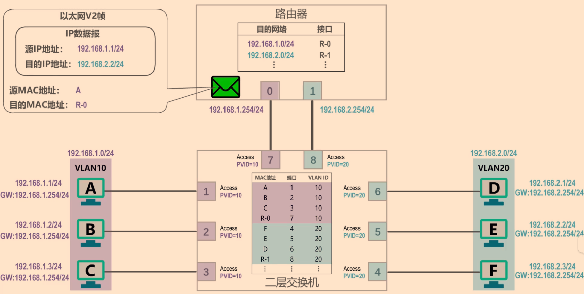
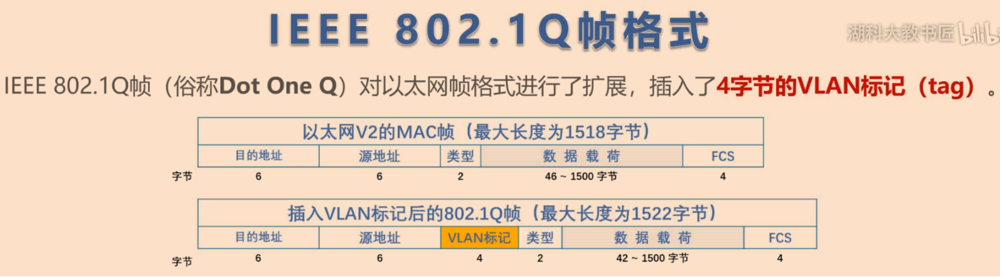
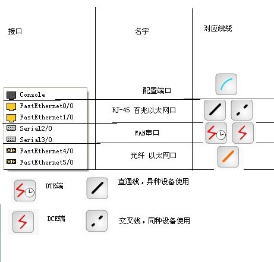

# `ping`
#  `tracert`

## PDU
> Protocol Data unit协议数据单元

# vlan划分
vlan实现在二层交换机上的, 二层交换机没有网段的概念, 只有路由器才有网段的概念[2]
通过子网划分的网络，不同网段并没有真正意义上实现隔绝广播，广播数据包还是会发送到其他的网段，只是会直接拒绝。而使用了vlan以后广播数据包只会在该vlan中传播，不会发送到其他vlan中，真正意义的隔绝广播。

## 接口类型[1]
1. Trunk链路类型
> trunk是在网络设备之间承载多于一种VLAN的端到端的连接, 将VLAN延伸到整个网络.

VLAN trunk允许VLAN数据流在交换机间传输, 所以设备在同一个VLAN, 但连接到不同交换机, 能够不用过路由器来进行通信
一个VLAN trunk不属于某一特定VLAN, 而是交换机和路由器间多个VLAN的通道.
Trunk类型端口可以允许多个VLAN通过, 可以接受和发送多个VLAN报文, 一般用于交换机之间的连接
2. Access链路类型
只能属于1个VLAN
3. Hybrid类型端口(思科交换机没有)可以允许多个VLAN通过, 可以接收和发送多个VLAN报文, 可以用于交换机间的连接也可以用于连接用户计算机
- Hybrid端口和Trunk端口在接收数据时处理思路方法是一样的，唯一区别的处在于发送数据时:Hybrid端口可以允许多个VLAN报文发送时不打标签，而Trunk端口只允许缺省VLAN报文发送时不打标签

vlan间的通信仅靠数据链路层(2层交换机)是做不到的, 必须依靠网络层, 可以用:
- 单臂路由
- 多臂路由[视频详解](https://www.bilibili.com/video/av51315788)

- 三层交换机

泛洪（Flooding）是交换机和网桥使用的一种数据流传递技术，将从某个接口收到的数据流向除该接口之外的所有接口发送出去

## IEEE 802.1Q

[802.1Q ](https://www.bilibili.com/video/av34491171)

## 一些命令
### 交换机
```bash
enable # 特权模式
config -t # 全局配置模式
vlan 10 # 创建vlan10, 切换到vlan10
name VLAN10 # 命名vlan10为VLAN10
show vlan brief # 查看vlan和接口信息(特权模式下)
interface range f0/1-3,f0/8 # 配置端口f0/1, f0/2, f0/3, f0/8
switchport mode access # 设置接口类型为access类型
switchport access vlan 10 # 将接口划分到vlan 10

switchport trunk  native  vlan  vlan-id # 给trunk接口划分vlan-id

switchport allowed vlan add 10,20
```
[vlan相关命令](https://blog.51cto.com/ganbing/1212922)
### 路由器
```bash
interface g0/0
no shutdown # 开启g0/0接口, 其下的子接口也会开启
interface g0/0.1 # 创建逻辑子接口g0/0.1
encapsulation dot1q 10 # 设置该逻辑子接口可以接收vlan id为10的802.1Q帧, 并且可将数据报封装成vlan id为10的802.1Q帧
```

## 连线

宗旨：
- 同种设备之间使用交叉线
- 异种设备之间使用直连线

但是什么情况都是有例外的：
- PC机和Router之间使用 交叉线；
- hubs和switches之间使用直连线；

## 清理
host: `arp -d`
switch `enable` ->  `clear mac-a(ddress)`(mac地址对应的端口)
router: `enable` -> `clear arp`

## routing table
类型
- C(onnected): 直接连接的 网络号对应接口 (自动生成)
- L(ocal): 自己各个接口的IP (32?) (自动生成)
- S(tatic): 静态路由
- R(IP): 通过RIP协议学习来的 下一跳是经过路由最少的
- D(ynamic):

example:
- 0.0.0.0 0.0.0.0 10.0.0.1 (10.0.0.1是默认路由)

</br></br><b>Reference List</b>:
- [细说VLAN与Trunk](https://blog.csdn.net/chenyulancn/article/details/78996858)
- [PkTc连线](https://my.oschina.net/lsgx/blog/468242)
- [1][交换机接口的access与trunk](https://blog.csdn.net/qq_36326947/article/details/72900842)
- [2][VLAN是二层技术还是三层技术？](https://www.zhihu.com/question/52278720/answer/140914508)
