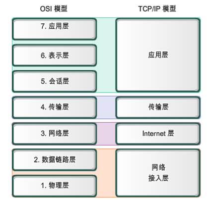
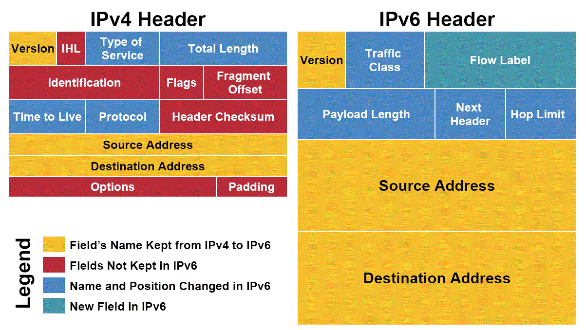
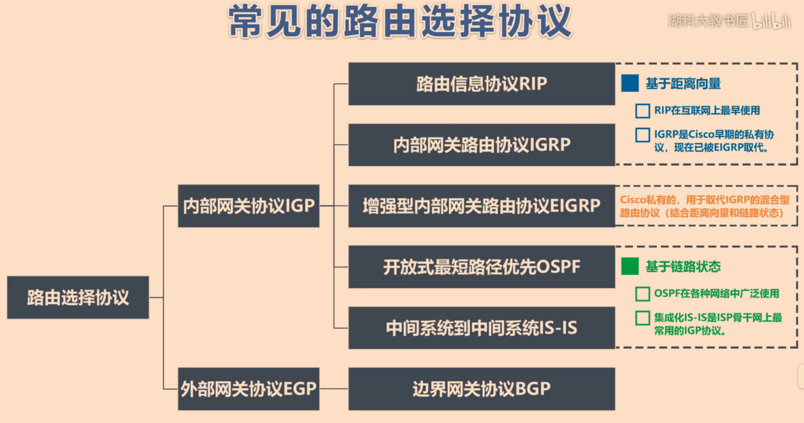
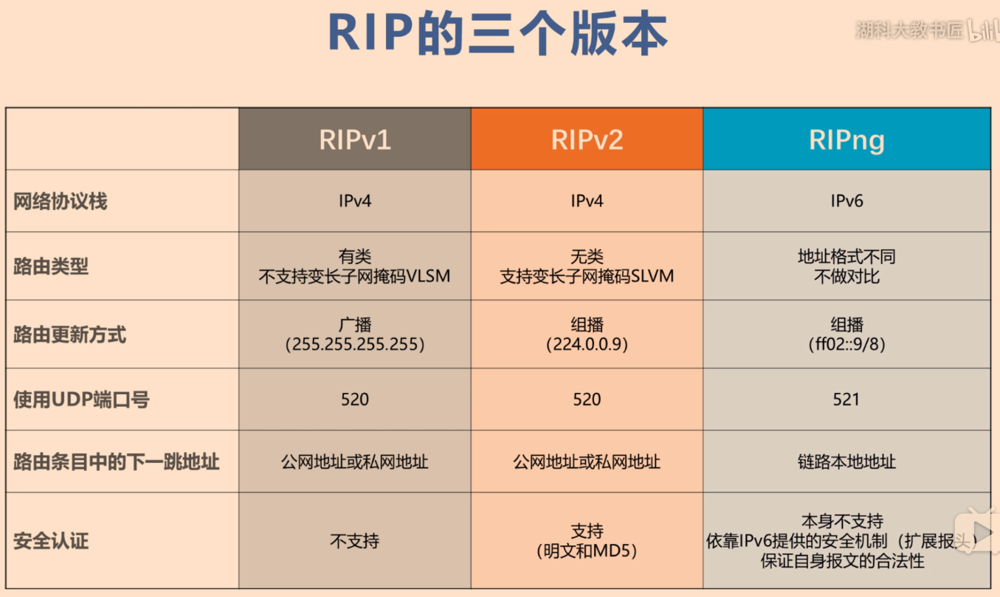
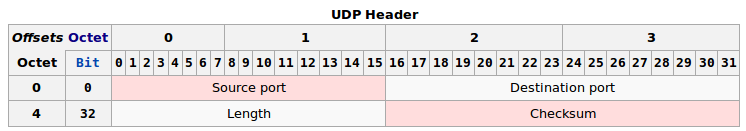

# 1. 网络
## 什么是网络
### IEEE标准规范
> Institute of Electrical and Electronic Engineers
> 802.3

## 计算机网络组成组件
- 节点(node): 节点主要是具有网络地址(IP)的设备的统称.
- 服务器主机(server)
- 工作站(workstation)或客户端(client)
- 网卡(Network Interface Card, NIC):主要用于提供网络连接, 目前大都使用具有RJ-45接口的以太网卡. 一般节点上具有一个以上的网卡, 以实现网络连接的功能
- 网络接口: loopback(lo)
- 网络形态或拓扑(topology)
- 网关(gateway):具有两个以上的网络接口, 可以连接两个以上不同的网段的设备, 例如IP路由器.

## 计算机网络协议: OSI七层协议
### OSI(Open System Interconnection)
每一层次只认识对方的同一层次的数据
打包包裹和拆包裹的过程

1. **应用层(Application Layer)**:
不同行业的人说各自的行话, 如果是间谍还要用暗号来加密信息
某个类型的应用可以使用某个应用层协议, 进一步规范用语
应用层的协议包括用于Web的HTTP协议，用于传输文件的FTP协议，用于Email的IMAP等等。这些协议可以帮助计算机应用更稳定也更完善的通信，从而让计算机更好的服务
图像, 声音, 视频
端对端连接
2. **表示层(Presentation Layer)**: 主要操作是将本地端应用程序的数据格式转换(或重新编码)称为网络的标准格式, 然后交给下面的传输层等的协议来进行处理
3. **会话层(Session Layer)**:
是确定网络服务器建立连接的确认
提供组织对话和管理交换的服务
break into 1.5MB Segments
包(Segment): data
4. **传输层(Transport Layer)**:
TCP UDP 判断数据包是否可以正确的到达目标
将信送到具体某个人
为终端设备之间的每个通信定义了数据分段, 传输和重组服务
传输层协议, 比如TCP和UDP, 使用端口号(port number)来识别收信人
端口: 一台主机上唯一的标识一个应用程序
数据段: TCP header|data
5. **网络层(Network Layer)**:
IP(Internet Protocol) 目的地路由(route)
让不同的"社区"之间通信
路由器(router)相当于一个社区之间的中间人, 作为中间人必须: 1. 能从物理层上在两个网络的接收和发送0/1序列; 2. 能同时理解两种网络的帧格式
一个路由器有多个网卡(NIC)
IP数据包(datagram): IP header|TCP header|data
6. **数据链路层(Data-Link Layer)** 连接层
0/1序列和帧(被分割的0/1序列)的转换
连接层协议不关心数据中到底包含什么。帧就像是一个信封，把数据包裹起来
帧的"收信"地址只能是本地局域网内. 连接层就像是一个社区的邮差
帧(frame): Frame Header|IP header|TCP header|data|Frame Tailer

  - 偏软件介质部分: 有逻辑链接层(Logical Link Control, LLC)所控制. 主要在多任务处理来自上层的数据包数据(packet)并转成MAC的格式, 负责的工作包括信息交换, 流量控制, 失误问题的处理等
  - 偏硬件介质部分: 负责MAC(Madia Access Control), 称这个数据包裹为 **MAC数据帧(frame)**, MAC是网络接口设备所能处理的主要数据包裹, 这也是最终被物理层编码称比特流的数据. 使用IEEE802.3以太网络协议
7. **物理层(Physical Layer)**: 光纤, 电缆或电磁波等真实存在的物理媒介 二进制码
位

### 计算机网络协议: TCP/IP
> Transmission Control Protocol/Internet Protocol 传输控制协议, 网际协议

1. 应用层(Application)
向用户提数据加上编码和对话控制
2. 传输层(Transport)
支持不同设备之间通过不同网络通信
3. 网络层(Internet layer)
确定通过该网络的最佳路径
4. 网络接口层(Network Access)
控制组成网络的硬件设备和介质
IP会依据**CSMA/CD**的标准, 封装到**MAC数据帧**中, 并基于MAC帧头, 再转成比特流后, 利用传输介质发送到远程主机上

# 2. TCP/IP 的网络接口层的相关协议
## 以太网络的传输协议: **CSMA/CD**
### CSMA/CD(Carrier Sense Multiple Access with Collision Detection)
> 为IEEE802.3的标准

### 集线器(hub)
> 集线器是一种网络共享介质设备

网络 **共享** 介质总在单一时间内, 仅能被一台主机所使用 (比喻:十字路口)
不同于交换器, 交换器是不共享的

传输会有以下流程:
1. 监听介质使用情况(Carrier Sense)
2. 多点传输(Multiple Access):
通信公开, 数据会在某些情况下会被发给不是目标主机的主机
3. 冲突检测(Collision Detection)
不允许多路同时通信

标准的数据帧在网卡与其他以太网媒体一次只能传输1500bytes, 如果大于这个的文件会被拆分成多个小数据包

即使只有一台主机在使用网络媒体时, 这部主机每发送一个数据包前也需要等待一段时间(96 bit time).

## MAC的封装格式
CSMA/CD发送出去的数据帧, 就是MAC. **MAC可以比作一个在网线上传递的包裹, 将数据(payload)包裹起来, 而这个包裹是网络硬件上面传输数据的最小单位**
数据帧上面有两个很重要的数据: **目标与来源的网卡卡号**, 因此网卡卡号又简称**MAC地址**

### MAC数据帧(以太帧)结构:
1. 前导码, 序言(Preamble) 7 Bytes
每个Bytes都是0xAA(10101010), 两台电脑可能会以不同的频率接受发送. 序言就是为了让接收设备调整接受频率, 以使接受发送设备的频率一致, 这个过程叫做时钟复原(recover the clock)
2. 起始信号(SFD, Start of Frame Delimiter) 1 Byte
固定值是0xAB
3. MAC目标地址(DST, MAC destination) 6 Bytes

4. MAC源地址(SRC, MAC source) 6 Bytes
5. 长度指示(Ethertype/Length) 2 Bytes
6. LLC数据(Payload) 46-1500 Bytes
7. 帧效验序列(FCS, Frame check sequence)
一个32位循环冗余校验码，以便验证帧数据是否被损坏
CRC(Cyclic Redundancy Check)算法

在这个MAC的传送中, 尽在局域网内生效, 如果跨过不同的子网, 那么来源与目的的硬件地址就会跟着变, 因为已经变成了不同网卡之间的交流

## MTU(最大传输单位)
> Maximum Transmission unit

## 集线器,交换器与相关机制
集线器(Hub)与交换器(Switch)最大的差异在于交换器内有一个特别的内存, 记录每个 **Switch Port** 与其连接的PC的MAC地址(记录在MAC Address Table里, 将Port和MAC对应起来), 所以当来自Switch两端的PC要互传数据时, 每个数据帧将直接通过交换机的内存数据而传送到目标主机上(集线器是多点传输)

### 交换器
> **不是共享设备**, 每个端口(port)都有独立的带宽

允许多路同时通信
交换器基本上取代了集线器

### 全双工/半双工(full-duplex/half-duplex)
- Half-duplex: can only communicate in one direction at a time
  - like: walkie-talkies work对讲机, 单向单车道
  need a "traffic cop"(CSMA/CD) to avoid collision
  - HUB only uses half-duplex
- Full-duplex: communicates in both directions at the same time
more wideband
  - like: telephone communication, 双向双车道
  - SWITCH used in full-duplex network

# 3. TCP/IP的网络层相关数据包与数据
## IP数据包(datagram)的封装
> IP数据包简称IP包

- **source address**: 发出IP地址
- **destionation address**: 目的地IP地址
- **time to live**(**Hop limit** in IPv6)存活时间: IP包每经过一个路由器, time to live--, 为零时IP包作废
- **type of service**(**traffic class** in IPv6)服务类型: Type of Service最初是用来给IP包分优先级，比如语音通话需要实时性，所以它的IP包应该比Web服务的IP包有更高的优先级
被分为两部分: **Differentiated Service Field**(DS, 前6位)和 **Explicit Congestion Notification**(ECN, 后2位). 前者用来区分服务类型, 后者用来表明IP包途径路径的交通状况(但是实际上交通状况的控制往往由更高层的如TCP协议实现)
- **protocol**(**next header** in IPv6)协议: 说明IP包封装的是怎样的高层协议包(TCP or UDP)
- **Total Length**: 整个IP包的长度
- **IHL**(internet header length in IPv4): 用来记录头部的长度, 由于IPv6头部固定总长度位40Bytes, 所以不需要IHL. 一行为1
- **Payload Length**(in IPv6): 数据部分的长度. 整个包长度位40Bytes + Payload Length
- **Header Checksum**: 校验IP包的头部信息. IPv6则没有checksum区域。IPv6包的校验依赖高层的协议来完成，这样的好处是免去了执行checksum校验所需要的时间，减小了网络延迟 (latency)
- Identification, flags, fragment offset: 为碎片化(fragmentation)服务的.

IP的袋子必须要放在MAC袋子当中
操作系统会提供网络层的socket, 从而允许用户直接操作IP包

ICANN(the Internet Corporation for Assigned Names and Numbers)是Internet的中心管理机构. ICANN的IANA(Internet Assined Numbers Authourity)部门负责将IP地址分配给5个区域性的互联网注册机构(RIR，Reginal Internet Registry), 比如APNIC, 它负责亚太地区的IP分配. 然后RIR将地址进一步分配给当地的ISP(Internet Service Provider), 比如中国电信. ISP再根据自己的情况, 将IP地址分配给机构或者直接分配给用户
IPv4协议的地址为32位, 可提供$2^{32}$个地址.
IPv6协议的地址为128位, 可提供$2^{128}$个地址.

## IP的种类与取得方式
- Public IP:公共IP
- Private IP:私有IP
  - 私有IP的路由信息不能对外散播(只能存在内部网络)
  - 使用私有IP作为来源或目的地址的数据包, 不能通过Internet来传送
  - 关于私有IP的参考纪录(如DNS), 只能限于内部网络使用

### NAT
> Network Address Transfer
> 通过IP伪装, 使私有IP也能连上Internet

### 子网划分
同一个网段太多的计算机会影响效率, 因为你会接到其他很多计算机的广播(CSMA/CD的原因), 所以要进行子网划分

划分方法:
Host_ID可以拿来当做Net_ID
例如拿一位Host_ID来做Net_ID, Netmask就变成 255.255.255.128(11111111.11111111.11111111.10000000)
每个子网有不同Broadcast IP(广播地址), Network IP(网段地址)

掩码和IP做 AND(两个都是1才是1) 运算得到Net_ID

### 无类别域间路由(CIDR)
> Classless Interdomain Routing

事实上, 由于网络细分的情况太严重, 为了担心路由信息过大而导致网络效率不佳, 某些特殊情况下, 反而是将Net_ID借用来作为Host_ID, 这样就能将多个网络写成一个了.
但是如果借用的过程可能会打破原本IP代表等级的方式, 这就叫CIDR
通常Network/Netmask的写法就是CIDR的写法

## 路由概念
每台主机都有自己的"路由表"(routing table, 端口号对应网络号的表)
Internet上面的路由不是静态的, routing table会变

#### OSPF协议(常用)
#### RIP协议(常用)
> Routing Information Protocol
> 一种用来生成routing table的协议.
> 它通过距离(从出发点到目的地途径的 **路由器数目(hop number)** )来决定routing table, 所以属于distance-vector protocol.

不在同一个网络的通信过程:(**routing**, IP包的接力, 也适用于IPv6)(已经了解局域网的IP地址和MAC地址的对应关系的情况)
1. 查询IP数据包的目标IP地址
2. 查询是否位于本机所在的网络路由表中
如果发现目标IP和本机IP的Net_ID相同时, 通过局域网传送数据
3. 查询默认路由(Default Gateway)
如果不在同一网络, 本机会分析路由表当中是否有其他相符合的路由设置, 如果没有的话, 就直接将该IP数据包从到默认路由器(Default Gateway)去.
4. 送出数据包至 Default Gateway 后, 不理会数据包流向
本机不理会接下来的工作, 作为默认路由的服务器会分析路由信息, .....
收到RIP包的路由器和主机根据RIP包和自己到发送RIP包的距离, 算出自己前往各个IP的距离. 在各个点不断重复RIP广播/计算距离/更新routing table的过程, 最终所有的主机和路由器都能生成最合理的路径(merge)

routing的整个过程中, IP包不断被主机和路由封装(encapsulation)入帧并拆开, 然后借助连接层, 在局域网的各个NIC之间传送帧.

RIP技术上不能到达距离超过15(15个路由器)的IP. 所以RIP更多用于互联网的一部分(比如整个中国电信的网络)。这样一个互联网的部分往往属于同一个ISP或者有同一个管理机构，所以叫做自治系统(AS,autonomous system). 自治系统内部的主机和路由根据通向外部的边界路由器来和其他的自治系统通信. 各个边界路由器之间通过BGP(Border Gateway Protocol)来生成自己前往其他AS的routing table, 而自治系统内部则参照边界路由器, 使用RIP来据欸的那个routing table. BGP的基本工作过程与RIP类似，但在考虑距离的同时，也权衡比如政策、连接性能等其他因素，再决定交通的走向(routing table)

### 网关/路由器
功能就是负责不同网络之间的数据包传递(IP Forwarding), 由于路由器具有IP Forwarding的功能, 并且具有管理路由的能力, 所以可以将来自不同网络之间的数据包进行传递.
**主机与主机配置的Gateway一定要在同一网段内**

## 观察主机路由 Route
命令`route [-n]`
- 要传送的数据包在路由规则里面: 就会直接以路由规则上写的那个网络接口(Use Iface)来传送出去, 而不通过Gateway
- 要传送的数据包不在路由规则里面: 会通过几乎每一台主机都会有的一个**Default Gateway**来传递

## IP与MAC: **网络接口层**?的ARP与RARP协议
IP和MAC有着一定的关联性: 因为Internet上用的是IP, 而到了局域网, 传递数据的是以太网, 以太网主要是用网卡卡号(MAC)

### ARP协议
> Address Resolution Protocol(网络地址解析) 协议. 只用于IPv4. (IPv6使用的是Neighbor Discovery Protocol)

ARP介于连接层和网络层之间

要知道IP配置于哪张以太网卡上, 要主机对整个局域网发送出ARP数据包, 对方收到ARP数据包后, 会返回它的MAC地址给主机(仅仅给主机. 通过数据帧上的Sender MAC Address来送回去), 主机知道了对方的网卡就能够开始传递数据了. 送回来的MAC地址会存在 **ARP cache** 中, 记录IP地址和MAC地址如何对应

#### ARP(数据)包
包裹在帧中, 有自己的IP地址和MAC地址, 目标地址的MAC是广播MAC, 请求某个IP地址的MAC地址, 拥有该IP地址的主机会回复发出请求的主机, 不符合的也会趁机更新自己的ARP cache

### RARP
> Revers Address Resolution Protocol(反向网络地址解析) 协议

## ICMP协议
> Internet Control Message Protocal 因特网信息控制协议

ICMP数据包是一个错误检测与报告的机制, 最大的功能就是可以确保我们网络的连接状态与连接的正确性
ICMP数据包也是 **网络层** 的重要数据包之一

ICMP是通过IP数据包来进行数据传送的. 因为在Internet上面有传输能力的就是IP数据包了

IP协议的工作方式是“Best Effort”，如果IP包没有被传送到目的地，或者IP包发生错误，IP协议本身不会做进一步的努力。但上游发送IP包的主机和接力的路由器并不知道下游发生了错误和故障，它们可能继续发送IP包。通过ICMP包，下游的路由器和主机可以将错误信息汇报给上游，从而让上游的路由器和主机进行调整

`ping` and `traceroute` are ICMP

## 常见的ICMP包类型
- 回音(echo)
- 源头冷却(source quench)
- 目的地无法到达(destination unreachable)
- 超时(time exceeded): IPv4中的Time to Live(TTL)和IPv6中的Hop Limit会随着经过的路由器而递减，当这个区域值减为0时，就认为该IP包超时. Time Exceeded就是TTL减为0时的路由器发给出发主机的ICMP包，通知它发生了超时错误。
traceroute就利用了这种类型的ICMP包。traceroute命令用来发现IP接力路径(route)上的各个路由器。它向目的地发送IP包，第一次的时候，将TTL设置为1，引发第一个路由器的Time Exceeded错误。这样，第一个路由器回复ICMP包，从而让出发主机知道途径的第一个路由器的信息。随后TTL被设置为2、3、4，...，直到到达目的主机。这样，沿途的每个路由器都会向出发主机发送ICMP包来汇报错误。traceroute将ICMP包的信息打印在屏幕上，就是接力路径的信息了。
- 重新定向(redirect): 重新定向(redirect)属于错误信息。当一个路由器收到一个IP包，对照其routing table，发现自己不应该收到该IP包，它会向出发主机发送重新定向类型的ICMP，提醒出发主机修改自己的routing table

# TCP/IP的传输层相关数据包与数据
网络层的IP数据包只负责将数据总到正确的目标主机去, 但数据包有没有被接受, 被正确的接受那就是传输层的任务了.
传输层: 面向连接的TCP(Transmission )数据包, 无连接的UDP数据包
## TCP协议
### TCP报头数据
- Source Port & Destination Port 源端口 & 目标端口
各16bits
- Sqeuence Number (Seq) 数据包序号
用于将TCP的数据组合起来
- Acknowledge Number (ack)回应序号
以知道数据包被接受
- Data Offset 数据补偿
说明整个数据包字段的起始位置
- Reserved 保留
- Code(Control Flag) 控制标识码
有6个bits, 分别代表6个句柄
状态 为1时表示启动
  - URG(Urgent) 紧急数据包
  - **ACK**(Acknowledge) 确认标志位 响应数据包 与Acknowledge Number有关
  - PSH(Push function)
  - RST(Reset)
  - **SYN**(Synchronous)同步标志位 表示发送端希望双方建立同步处理, 就是要求建立连接. 通常带有SYN标志的数据包表示"主动"要连接到对方的意思
  - FIN(Finish) 终止标志位
- Window 滑动窗口
用来控制数据包的流量
- Checksum 确认校验码
检验数据包有没有被损毁
- Urgent Pointer 紧急数据
URG = 1时产生作用
- Options 任意数据
- Padding 补足字段
- Maximum Segment Size(MSS, 可选)最大报文段容量
报头长度: 20字节的固定部分和最长40字节的可选部分

### 通信端口
### 特权端口
小于1024的端口
### Socket Pair
网络是双向的, 达成连接的服务端与客户端提供的IP与端口, 这两对数据就是Socket Pair
- Source Address + Source Port
- Destination Address + Destination Port

## TCP的三次握手[TCP](https://www.bilibili.com/video/av34043448/?p=25)
在建立连接之前必须要通过三次确认的动作, 也叫三次握手
1. 数据包发起(客户端->服务器):
1.1 设置连接状态: SYN_SENT 同步已发送
1.2 设置可接受的最大窗口值为..字节
1.3添加"MSS"选项到TCP SYN的首部
1.4 设备发送TCP SYN报文段(Seq为随机值, SYN=1, ACK=0(但存在于这里其实没有意义, 因为本报文段不是确认报文段), 数据长度=24B(20B的固定部分+3B的MSS+1B的Padding))

客户端向想要连接的服务器端发送一个数据包, 客户端必须随机取用一个大于1024的端口来作为程序沟通的接口.
在TCP的报头中SYN=1, 并记下发送出连接数据包的服务器端的序号(Seq)
2. 数据包接收与确认数据包传送(服务器->客户端):
2.1 设备在服务器端口80上接收到一个TCP SYN报文段
2.2 TCP从TCP报文段首部中的最大报文段选项中获取MSS值
2.3 连接请求被接受
2.4 设备设置连接状态为SYN_RECEIVED(同步已接收)
2.5 当服务器端接到这个数据包, 并且确定要接收这个数据包的时候, 就会制作一个SYN=1, ACK=1的数据包. 比1. 中的Sequence号码多一号(ack=10002).
服务器端也必须要 **确认客户端确实可以接收我们的数据包** 才行, 所以会发送一个Seq(随机的)给客户端, 并开始等待客户端的回应
3. 回送确认数据包(客户端->服务器):
3.1 设备接收一个TCP SYN+ACK报文段
3.2 TCP报文段具有所期望的对等序号
3.3 TCP连接成功
3.4 设备设置连接状态为ESTABLISHED
3.5 设备发送一个TCP ACK报文段(序号:为之前客户端发给服务器的序号+1, ACK=1, 数据长度=20)
客户端收到服务器端的ack(10002), 客户端便知道服务器端  已经正确地接收了数据包.

如果客户端也同意与服务器端建立连接, 就发送一个确认数据包(ACK=1)给服务器, 亦即ack=20001+1 = 20002
4. 取得最后的确认(服务器收到了):
4.1 设备接收一个TCP SYN+ACK报文段
4.2 TCP报文段具有所期望的对等序号
4.3 TCP连接成功
4.4 设备设置连接状态为ESTABLISHED
顺利的话, 服务器收到ACK=1, 且ack=20002序号的数据包, 就能够建立这次的连接了

**网络是双向的**, 无论是服务器端还是客户端, 都要通过一次SYN与ACK来建立连接

## 无连接的UDP协议
> User Datagram Protocol 用户数据报协议

TCP慢, 但可靠
UDP适合需要实时反应的一些数据流: 影像实时传输软件
UDP协议是IP协议在传输层的"傀儡", 只为IP传输起到了桥梁的作用. 不能用IP协议代替UDP协议的一个重要原因是IP没有端口信息
UDP无连接 无状态

### UDP协议不可靠, 那么为什么不直接使用IP协议呢?
IP协议没有端口(port)的概念. IP协议用于两台计算机之间的对话, 但每台计算机需要有多个通信通道, 并将对各通信通道分配给不同的进程使用, 一个端口代表一个通信通道.

## 网络防火墙与OSI七层协议
最基本的防火墙原理: 对数据包报头的分析, 设定分析规则, 当发现某些特定的IP, 特定的端口或者是特定的数据包信息(SYN/ACK等), 那么就将该数据包丢弃

对OSI七层协议来说, 每一次可阻挡的数据有:
- 第二层: 针对来源与目标的MAC进行阻挡
- 第三层: 针对来源的IP, 以及ICMP的类别(type)进行阻挡
- 第四层: 针对TCP/UDP端口进行阻挡, 针对TCP的状态(code)来处理

# 连Internet的准备事项
## IP地址, 主机名, DNS系统

## 连上Internet的必要网络参数
- IP
- Netmask
- Network
- Broadcast
- Gateway
- DNS

  reference list:
- [鸟哥的Linux私房菜-服务器架设篇](#)
- [Vamei 协议森林](http://www.cnblogs.com/vamei/archive/2012/12/05/2802811.html)
- [MAC Frame Structure](http://120.105.184.250/peiyuli/network-3/packet/MAC.htm)
