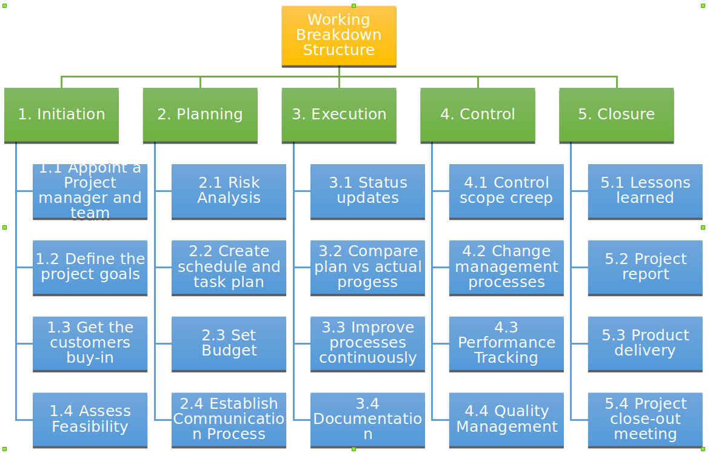
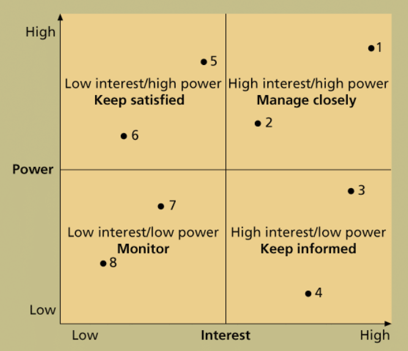
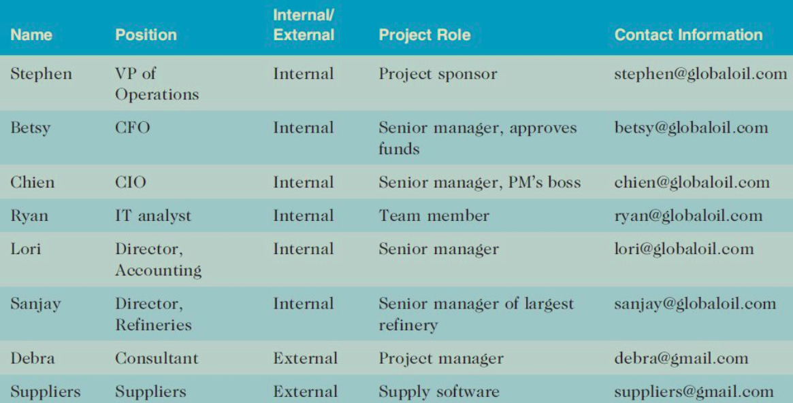

# *INTRODUCTION TO PROJECT MANGEMENTCHAPTER
## "Why IT projects fail"
- ­changing objective during project
-­ Unrealistic time or resource estimate
­‐ Lack executive support and user involvement
­‐ Inappropriate skills

## what makes project work different from normal day to day work of business? (project attributes)
- has a **unique** purpose
- **temporary**
- **budget**
- is developed using progressive elaboration
- requires resources, often from various areas

## how the triple constraint of Scope, Time and Cost can effect project completion.
­‐ Project scope management involves defining and managing all work required to complete project.
-­ Project time management includes estimating project duration developing schedules and ensuring timely completion of project,
- ­And project cost management of preparing and managing the project budget; includes resource planning, cost estimating, and cost budgeting

## the project management knowledge areas.
­‐ Scope management
-­ Time management
-­ Cost management
-­ Quality management
-­ Human resource management
-­ Communications management
-­ Risk management
-­ Procurement management
-­ Project integration management

## List and briefly explain what constitutes project success.
-­ The project met scope, time and cost goals
-­ The project satisfied the customer/sponsor
-­ The results of the project met its main objective, suchas making or saving a certain amount of money, providing a good return on investment, or simply making the sponsors happy.

## List 6 attributes that a successful Project manager should have.
-­ Leadership Skills
-­ Integrity, ethical behavior, consistent
-­ Strong at building trust, team
-­ Verbal communication
-­ Conflict resolution, conflict management
-­ Critical thinking, problem solving

# *Organizational Structures
## functional organizational structure
> hierarchy
> **functional managers** or **vice presidents** in specialties, and their staffs have specialized skills in their respective disciplines

## project organizational structure
> everything is a project

## matrix organizational structure

#
## methodology/framework
### SDLC(waterfall model)
1. analysis
    - 对应 initiation
    - what is the problem
    - business case: document that outlines the benefits and costs of the project cost/benefit analysis
    - preliminary cost estimate:
2. design
    - 对应 development
    - new database
3. implementation
    - 对应 execution
4. maintenance
    - 对应 control

### agile
planning
execution

1. stakeholder register
    - who has an interest in the project
2. kick-off meetings
    - review the goals of the project, and discuss future plans
3. project planning
4. gantt chart
5. list of prioritized risks

### other methodology/frameworks:
- SDLC(waterfall model)
- six sigma
- PMBOK
- PRINCE 2
- agile

## *project life cycle
> a project life cycle is a collection of project phases that defines
> - what work will be performed in each phase
> - what deliverables will be produced and when
> - who is involved in each phase, and
> - how

a **deliverable** is a product or service produced or provided as part of a project

### *Phases (5 process)
1. initiation phase
  - project definition
  - project constraints
  - problem statement
  - define initial scope
  - estimate the cost
  -
2. planning phase
  - detailed planning
  - estimations & schedualing
  - what to do
  - how to do
  - how to know it is done
3. execution phase
  - code
4. control phase
  - report performance
5. project closure
  - ensure project acceptance
  - release resources

# terms
- outsource: have part of the work done by another company
- offshoring: outsource to other country
- virtual team: a group of individuals who work across time and space using communicaton techniligies
- SDLC(system development life cycle)

# fragement: kill point=phase exit

# *business case
- Introduction
- Proposal
- Justification
> why spend the money on this project
- preliminary project requirements
  - analysis of current system
  - define the problem
- current situation and problem
  - software out of datetime
  - high maintenance costs
- critical assumption and constraints
  - easy to install
  - compatible with current software and hardware
  - easy to use
  - not to costly
- analysis of options and recommendation
  -
- budget estimate and financial analysis
  - buy in software from outside vendor cost $...
  - program inhouse cost $...
- schedule estimate
  - purchase
- risk
> dont have to be specific
  - scope
  - time
  - cost
  - viruses

# Case Study:
1. Business Case
2. HR Stakeholder Plan
    - Planning HR management
    - Acquiring
    - Developingaffiliative
    - Manageing
3. RAM -> Responsibilities Assignment Matrix
   Who does that?
   RACI - chart
4. WBS
    
5. Gantt Chart
6. Project Control Chart

# Maslow hierachy needs
1. Physiological

# McClelland's Acquired Needs Theory
- Achievement
- Affiliation
- Power

# Leadership
- visionary: see through the furture, bold
- coaching:
- affiliative
- democratic

# RAM
> Responsibility Assignment Matrix

department
a ~ maps the work of a project as descirbed in the WBS to the people responsible for performing the work

# RACI
> Responsibility, Accountability, Consultation, Informed

responsibility: the people who do the jobs
accountability: the person check the work, the person that take blames. only one person that is accountable per task
a kid broke the neighboor's windows, the kid's father is accoutable, the kid is responsible
nooed
Consultation: consult before a decision
Informed: need to be Informed

no blank cell?

# Resource Histogram

tell how many people are needed
people like: managers, business analysts, programmers, technical writers

overallocated

# team
- forming
  - define goals
  - define Responsibilities
  -
- storming
  - maintain focus
  - guide decision
  -
- norming
  -
- performing
  - one goal
  - work together
- adjouring

- traning
  - physical execise (a little unsafe? activity can help bind them together)
-

# *project stakeholder management process
1. **identifying** stakeholders
outputs: **Stakeholder Register**(table of stakeholder's name, job, email(assessment), position, internal/external...)
software: excel,

internal stakeholder: staff, sponsor
external stakeholder: customer, supplier

## challenges a stakeholder may present
- change the mind
- disagree with the project plan
- hard to contact
- does not understand the project

## ways to handle the challenges
- be clear from the start
- always have a plan B(contingency plan)
- explain the consequences
- take a stand

Power/Interest Grid

interest: the responsibility of doing the job

2. **planning** stakeholder management
outputs:
3. **managing** stakeholder engagement3.
outputs:
4. **controlling** stakeholder engagement  3. 4.
outputs:

# critical path method & pert(CPM)
> the critical path method is the sequence of scheduled activities that determines the duration of the project
> program evaluation review technique(PERT)

must follow the sequence one after another
CPM descirbes the **longest** sequence of tasks in the project

**CPM diagram**

the CPM is the path that takes longest
if we want to shorten the project, the task that on the critical path and takes more time will usually be shortened
:warning: tasks on the lines, numbers in the nodes
