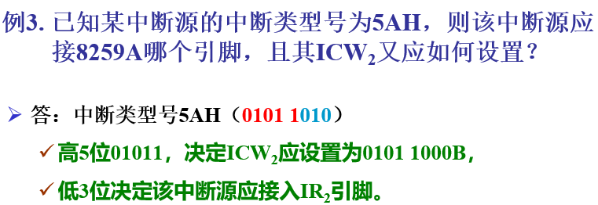

# 环境

汇编源程序  --汇编器(执行伪指令)--> 

目标文件(.obj, .coff, .elf) + 列表文件(.lst) + 交叉引用文件(.crf) --链接器--> 

目标程序和库函数(.lib)链接到一起 -->

可执行文件(.exe)

- 目标文件是我们要的, 其他两个只是中间结果, 可以不要

## 8086

- EU (Execution Unit)
- BIU (Bus Interface Unit)

# 模式

逻辑地址

段号:偏移

在实地址方式下, 上述段号是段值; 在保护方式下, 上述段号是段选择子

通过段号可以得到段起始地址, 加上偏移得到(物理地址)

## 实地址模式

- 缺陷: 每一个指针都是指向一个实在的物理地址, 很容易如果误修改, 可能会系统崩溃
- 实地址方式下, 每个段的长度不超过64 KB
- 32位兼容16位的做法

## 保护模式

## 8086

- 最小模式
- 最大模式

# 寻址方式

- 偏移地址: 偏移

- 有效地址: 同偏移地址

  - 有效地址应为16位, 多于16位应按64K取模

    如: (bx)=100H, bx+0ffffh 的有效地址 EA = 0ffffh + 100h = 100ffh(mod 64k) = 0ffh

- 物理地址: 在8086系统中, 主存储器的物理地址是唯一能够区分1M主存空间中每个存储单元的地址编号

- 逻辑地址: `段基址:偏移地址` 如3000:0100

## 立即数寻址

> 操作数本身就包含再指令中, 直接作为指令的一部分给出

`mov eax,12345678H`

## 寄存器寻址

> 操作数再CPU内部的寄存器中, 指令中指定寄存器

`mov ebp,esp`

- 专用寄存器不能用 IP, FLAG

## 直接寻址

> **操作数在存储器中**
>
> 指令直接包含操作数所在的存储单元的有效地址

- `mov [8547CH],dx`

- `mov ecx, [82632H]`

- `mov ax, x`; 符号地址x必须事先定义  = `mov ax, [x]`
  
  - x dw 100h
  
- 在汇编中最好**把变量理解成数据存储的地址** 
  
    比如, x的地址是4010h, 4010h处存的值是100h, mov ax, x其实就是 mov ax, [x] , 所以ax存的是x的值 100h
  
  - 同理 mov x, ax = mov [x], ax
  
- `mov ax, es:[100H]` ; **段超越前缀**的方式来改变默认段寄存器

## 寄存器间接寻址

> **操作数在存储器中**
>
> 由8个32位的通用寄存器之一给出操作数所在存储单元有效地址
>
> 
>
> 通过存储器给出存储单元有效地址的

```assembly
mov eax,[esi]

mov [edi], ci
```

物理地址PA = (DS)*16 + (**BX**/**SI**/**DI**)

物理地址PA = (SS)*16 + (**BP**)

## 寄存器相对寻址

> 操作数在存储器中, 操作数的有效地址是一个基址寄存器(BX, BP) 或变址寄存器(SI, DI) 内容加上指令中给定的8位或16位位移偏移量

- mov ax, 100H[bx]

- mov ax, [bx] [100H]

- mov ax, [bx+100H]

- mov bx, [bp-4]

  引用的段寄存器是ss

- mov ax, [di+1223h]

  引用的段寄存器是ds

## 基址变址寻址

> 基址寄存器+变址寄存器
>
> 必须一个基址寄存器和一个变址寄存器

mov ax, [bx+di]

如果是bx, 没说的话用的是ds段


mov ax, [bp+di]

如果是bp, 没说的话用的是ss段


mov ax, [bx] [si]

## 相对基址变址寻址

- mov ax, [bx+di-2]

- mov ax, [bx+di+1234h] =  mov ax, 1234h[bx + di]

## 取有效地址

### LEA

> load effective address

`mov ebx,edi+4`是把对应存储单元的内容传送到寄存器ebx

`lea ebx,[edi+4]`是把对应存储单元的有效地址传送到存储器ebx, `edi+4`被当作地址, 加上`[]`变成值

# 堆栈

入栈: ESP先**减**, 数据入栈

出栈: 数据出栈, ESP再加

栈底在高地址处

## 作用

- 保存寄存器内容或保护现场
- 保存返回地址
- 传递参数
- 安排局部变量或临时变量

# 程序设计

## 过程

> procedure

C语言中的子程序就是汇编中的过程                                                                                       

子程序与无条件转移的区别是调用子程序要考虑返回

## 过程调用

主程序 -> 子程序

步骤:

1. 保存返回的地址: 把返回地址压入堆栈
2. 转移到子程序的入口地址: 使EIP等于子程序开始处的地址偏移

## 参数传递

```assembly
cf34 PROC
	push ebp ; ebp入栈
	mov ebp, esp ; 建立堆栈框架
	...
	pop ebp
	ret ; 弹出返回地址偏移
cf34 ENDP

_main PROC
	push 23 ; 入口参数入栈
	push 456 ; 入口参数入栈
	call cf34 ; 调用子程序, 把返回地址偏移入栈
	add esp, 8 ; 平衡堆栈
_main ENDP
```

通过堆栈传递入口参数步骤:

1. 主程序先**把入口参数压入堆栈**, 
2. 然后利用call指令调用子程序
   1. 调用指令call**把返回地址偏移压入堆栈**
   2. 进入子程序
      1. 先把寄存器EBP压入堆栈
      2. 把堆栈指针寄存器ESP的值送入到EBP, 现在就可以方便地取出参数了 (建立堆栈框架)
   3. 返回主程序之前从堆栈弹出刚才保存的EBP值, 恢复EBP (撤销堆栈框架)
3. ret, 返回到主程序main, 从堆栈弹出返回地址偏移
4. 调整堆栈指针寄存器ESP的值, 达到平衡堆栈的目的

**_cdecl**被称为 C 调用约定。缺省调用约定。参数按照从右至左的顺序入堆栈，函数本身不清理堆栈。
**_stdcall**被称为 pascal 调用约定。参数按照从右至左的顺序入堆栈，函数自身清理堆栈。
**_fastcal**l 是快速调用约定。通过 寄存器传递参数。前两个参数由 ECX 和 EDX 传送，其他参数按照从右至左的顺序入堆栈，函数自身清理堆栈。

# 操作符

## 关系运算符

- EQ
  
  > 等于
  
- NE
  
  > 不等于
  
- LT

  > 小于

  ```assembly
  mov ax, 120 lt 100H ; (ax)=0ffffH
  mov al, 21 eq 21H ; (al)=0
  ```

- GT

  > 大于

- LE
  
  > 小于等于
  
- GE
  
  > 大于等于

## 属性操作符

### offset

[link](http://www5.zzu.edu.cn/qwfw/info/1032/1789.htm)

> 偏移量属性操作符
>
> 返回标识符的段内偏移地址

offset后面只能跟变量

```assembly
string db 'abcd$'
arr db 'a', 'b', 'c'

mov eax, offset string ; 错误!!!
lea eax, string ; 可

mov ebx, offset arr ; 可
```


与lea的区别

- lea bx, buffer 执行的时候才会将buffer的地址给bx
- mov bx, offset buffer 编译的时候就计算好buffer的地址(假设为4300), 然后语句变为 mov bx, 4300
- 所以lea可以进行复杂的计算, 如 lea eax, [esi+ebx*4], 但是mov不行, 如mov bx, offset [bx+200]是错误的
  - OFFSET只能取得用 ”数据定义伪指令” 定义的变量的有效地址,不能取得一般操作数的有效地址(摘自80x86汇编语言程序设计教程)
  - mov ax, [4300H + 200] 可以运行, 地址加偏移, 所以不能说因为在汇编的时候将变量的值计算出来, 而导致 mov bx, offset [buffer + 200] 错误

### seg

> 段属性操作符
>
> 返回标识符所在段的段地址

mov ax, seg var

### lengthof

> 返回变量所定义的数据个数

- 只能应用于变量

```assembly
array dw 2 dup(0, 1), 1
; array = 0, 1, 0, 1, 1

mov al, lengthof array
; (al)=5
```

### type

> 类型属性操作符

`type 变量名`: 分离出其后变量或标号的类型的值

- DB(字节) 为1
- DW(字) 为2
- DD(双字) 为4
- DF(六字节的字) 为6
- DQ(四字) 为8
- DT(10字节) 为10
- **NEAR(近标号) -1**
- **FAR(远标号) -2**

```assembly
x1 dw 12H, 100H
mov ax, type x1 ; (ax)=0002H
```

### sizeof

> 返回变量所占内存单元的数目

- 只能应用于变量

```assembly
array dw 2dup(0, 1), 1

mov al, sizeof array
; (al) = 0AH
```

### ptr

> 将标识符的类型属性临时性地强制为指定的类型
>
> 该强制只在本条指令内有效

- 当只有一个存储器操作数时, 这个操作数的类型是不明确的, 必须使用类型说明

  ```assembly
  x1 dw 12H, 100H
  x2 dd 1234H
  x3 db 10,'A'
  
  mov ax, x1 ; ax=0012H
  mov ax, word ptr x2 ; ax=1234H
  mov ax, word ptr x3 ; ax=410AH
  ```

## $

当前地址

# 指令

## 伪指令

> 包括**数据定义**语句和**存储单元定义**语句
>
> 
>
> 数据定义语句: 定义初始化的数据项
>
> 存储单元定义语句: 定义初始化的数据项

- 没有目标代码

### end

程序结束

### ends

> 可以解释为 end segment

```assembly
;16位
DATA SEGMENT
	...
DATA ENDS

CODE SEGMENT
	ASSUME DS:DATA, CS:CODE ; 指明逻辑段和段寄存器的对应关系, 并不会为段寄存器赋值, 需要指令完成赋值
START:
	MOV AX, DATA
	MOV DS, AX
	...
	...
	MOV AX, 4C00H ; 返回DOS
	INT 21H
CODE ENDS
END START

; 子程序
zcx PROC
	...
	RET
zcx ENDP
```

### org

数据段

起始地址，源

在汇编语言源程序的开始通常都用一条 *ORG* 伪指令来实现规定程序的起始地址

- **偏移地址**
- 如果是8086的话, 范围 0~65535的非负整数

### dup

```assembly
var dw 5 dup(?) ; 预留5个字长度的空间, (赋为0)

bvar1 byte 5 dup(10) ; 0A 0A 0A 0A 0A 
bvar1 byte 5 dup('10') ; 31 30 31 30 31 30 31 30 31 30
bvar2 byte 10, 10, 10, 10, 10 ; 0A 0A 0A 0A 0A 
```

### equ

- 在同一程序中, EQU语句对一个符号名只能定义一次
- 定义常量(数值, 不是地址, 变量标号子程序名才是地址), 在代码段不能被修改

```assembly
x db 12h
y equ 12h
; x, y的值一样, 但y没有被分配空间
```

### =

> <标识符> = <表达式>
>
> 定义标识符, 代替表达式的值

- 定义常量, 在代码段不能被修改
- 与equ的区别
  - 只能定义数值
  - 在同一程序中可对一个符号名**重复定义**

### dw db dd

```assembly
str1 db 'A', 'B'
str2 dw 'AB' ; 因为是word, 所以把AB看成一个整体, 所以A在高地址, B在低地址
str3 dd 'BA' ; 00BA
str4 db 'ABCD' ; 因为是byte, 所以A在低地址, D在高地址
; 内存空间
    |41|....str1
    |42|
    |42|....str2
    |41|
    |41|....str3
    |42|
    |00|
    |00|
    |41|....str4
    |42|
    |43|
    |44|
```


## 逻辑指令

| 指令         | 效果                 | 标志位                                   | 应用场景                                                     |
| ------------ | -------------------- | ---------------------------------------- | ------------------------------------------------------------ |
| **NOT** 否   | 取反                 | 不影响标志位                             |                                                              |
| **AND** 与   | 同时为1, 则为1       | **CF=0**, **OF=0**, 其他按情况变(AF除外) | 用在使一个操作数的若干位保持不变, 另外若干位清零 (保持不变的设置1, 清零的设置0); 自己和自己与, **使进位标志清零** |
| **OR** 或    | 同时为0, 才为0       | **CF=0**, **OF=0**, 其他按情况变(AF除外) | 自己和自己或, **使进位标志清零**;                            |
| **XOR** 异或 | 不同设为1, 相同设为0 | **CF=0**, **OF=0**, 其他按情况变(AF除外) | **清零寄存器**; 取反 (要取反的位设置1, 不变的设置0)          |

### test

- 把两个操作数进行按位"与", 但结果不送到目的操作数

- 仅仅影响状态标志, **CF,OF清零**, ZF, PF, SF也会变

```assembly
test eax, eax
jne SHORT LL3cf320
.......
test eax, eax
jle SHORT anotherplase ; eax<=0跳转
; jle跳转的条件: ZF=1或者SF!=OF
; 如果eax是负数: ZF=0, OF=0, CF=0, SF=1(eax的第一位是1) 
```

## 移位指令

- 16位: 循环次数只能为1或**cl**, 不能是cx或其他

### 一般移位指令

- 对标志位的影响
  - 移位次数**不为1时**, 移位指令对OF无定义

  - 移位次数为1时, 当移位操作改变了操作数的最高位(符号位)时, OF=1, 否则OF=0

#### SAL

#### SHL

> SHift Arithmetic Left
>
> SHift logic Left

> SHL ax, **1** (记得写上移动多少位)

操作数左移, 右边用0补足, 移出的**最高位**进入标志位CF

#### SAR

>  Shift Arithmetic Right

操作数右移, 左边的符号位保持不变, 移出的**最低位**进入CF

即如果符号位是1, 用1补, 符号位是0, 用0补, 达到不管是正还是负, 都表示**除n个2**

#### SHR

> SHift logic Right

用0补足, 最低位进入CF

### 循环移位指令

- 对标志位的影响
  - 移位次数不为1时, 移位指令对OF无定义
  - 移位次数为1时, 当移位操作改变了操作数的最高位(符号位)时, OF=1, 否则OF=0

#### ROL

> ROtate Left
>
> 左循环移位指令
>
> ROL *OPRD*, count

- 循环左移count位, 最高位进入CF

#### ROR

- 循环右移count位, 最低位进入CF

  ```assembly
  (cl)=02H
  (ah)=89H ; 1000 1001
  ror ah, cl ; (ah) = 0110 0010 CF=0 看成是移动两次
  ```

#### RCL

> Rotate through CF Left
>
> 带进位循环移位指令

- 包括CF一起左移

#### RCR

## 字符串指令

> 串操作指令

- 操作数地址由**es**:[di], **es**[si] 提供

### LODSB

### LODSW

### LODSD

不影响状态标志

相当于:

```assembly
mov al, [esi]
inc esi 

mov ax, [esi]
add esi,2

mov eax, [esi]
add esi, 4
```

### STOSB

mov [edi], al

inc edi

### STOSD

mov [edi], eax

add edi, 4

### MOVSB

lodsb

stosb

### MOVSW

### MOVSD

修改DF

DF为零: 从低到高, 每次**加**1, 或2, 或4

DF为一: 从高到低, 每次**减**1, 或2, 或4

## 转移指令

### 段间转移

> 修改IP, CS

#### 段间直接转移

- jmp codeB:step
  - codeB 是转移目标段
  - step 是目标端内偏移

- jmp far step
  - far 可省略
- jmp far prt DONE
  - DONE是指针, 即地址

#### 段间间接转移

- ptnext dw step ; step的偏移

  ​			 dw code ; step 所在段的段值

  **jmp far [ptnext]**

- mov bx, ptnext ; 

  **jmp far [bx]**

  - 实方式下, ptnext是双字存储单元, 低16位给IP, 作偏移, 高16位给CS, 作段值; bx应为ebx 

### 段内转移

- 16位: 转移范围$2^{16}$个存储单元

#### 段内直接转移

- jmp step

#### 段内间接转移

- lea edx step

  jmp edx

- lea eax step

  mov intVar, eax

  jmp intVar

### 条件转移

jz = je

#### 无符号

above, below

- ja,  jna, jae, jnae
- jb,  jnb, jbe, jnbe

#### 有符号

greater, less

- jg, jng, jge, jnge
- jl,  jnl,  jle,  jnle
- jge/jnl的转移条件: SF=OF

#### JNC

CF=0

---

## 加减乘除

### add

### adc

和add类似, 完成两个操作数的相加, 但同时还要把**进位标志CF的当前值**加上

### inc

不影响进位标志(**CF**), 但会影响其他状态标志 (因为**该指令主要用于指针进行增加, 不存在进位问题**)

### sub

> sub dest, src
>
> ; dest = dest - src

两操作数的尺寸必须一致

### sbb

> 带借位的减法指令
>
> sbb dst, src
>
> ; dst = dst-src-CF

### dec

不影响进位标志(**CF**), 原来是多少还是多少!

但会影响其他状态标志

### neg

> **取补**指令, 取负数指令

- 对操作数取补, 即取反加一
- 相当于 0 - 操作数

- CF
  - **如果操作数为0, 那么使得CF=0, 否则CF=1**!
  - [解释](https://zhidao.baidu.com/question/440027442.html)
- OF
  - **如果操作数为负的最小值, OF=1; 否则OF=0** !
  - 负的最小值: 80H, 8000H, 8000 0000H
  - [解释](https://zhidao.baidu.com/question/982852247279544859.html)

### cmp

减法

### mul

> 无符号数

- 乘积尺寸翻倍
- **操作数不能是立即数**  ×`mul 10H`×

- 仅对CF, OF有影响, 当高半部分不为0或符号扩展时, CF = OF = 1, 否则CF = OF = 0


`mul OPRD`

- 如果OPRD是字节:` AL × OPRD = AX`
- 如果OPRD是字: `AX × OPRD = DX:AX`(32位的结果的高16存放于DX, 低16位存放于AX)
- 如果OPRD是双字: `EDX:EAX × OPRD = EDX:EAX` (64位的结果的高32位存放在EDX)

### imul

> 有符号数 (sIgned)
>
> IMUL DEST * SRC

DEST只能是16位或32位通用寄存器

SRC可以是通用寄存器, 存储单元, 立即数

- CF OF=0 0 乘积的高一半为低一半的符号扩展.
- CF OF=1 1 其他情况

### div

> 无符号数

- **操作数不能是立即数**


`div esi`: eax = eax / esi ……edx

`div OPRD`

- 如果OPRD是字节: `AX ÷ OPRD = AL ...... AH`
- 如果OPRD是字: `DX:AX ÷ OPRD = AX ...... DX` (被除数的高16存放于DX, 低16位存放于AX)
- 如果OPRD是双字: `EDX:EAX ÷ OPRD = EAX ...... EDX` (被除数的高32位存放在EDX)

### idiv

> 有符号数
>
> idiv OPRD

- OPRD 可以是变量

- `idiv cl` ; 被除数在ax中, 商在al, 余数在ah

- `idiv bx` ; 被除数在ax中, 商在ax, 余数在dx

- **余数与被除数符号相同**

  ```assembly
  mov ax, 0fbffH ; 当成有符号数
  mov bl, 08H
  idid bl
  
  ; (al) = 80H
  ; (ah) = ffH
  ```

### cbw

> byte -> word

```assembly
; 计算(C-120+A*B)/C, 商放X, 余数放Y
mov ax, A
imul B ; (dx:ax)=A*B
mov cx, ax
mov bx, dx ; (bx:cx)=A*B
mov ax, C
cwd ; (dx:ax)=C
add ax, cx
adc dx, bx ; (dx:ax)=A*B+C
sub ax, 120
sbb dx, 0 ; (dx:ax)=A*B+C-120
idiv C
mov X, ax
mov Y, dx
```


### cwd

### cdq

> convert doubleword to quadword

把寄存器eax中的符号扩展到寄存器edx, 

即若eax的最高位有效位为0, 则edx=0; 若eax的最高位有效位为1, 则edx = 0ffffffffh(0的反码)

## 循环指令

### loopz

> 1. 先cx-1
>
> 2. 判断cx是否为0, zf是否为0
>
>    如果cx, zf不为0则继续
>
>    否则退出

### loopnz

> cx=0或zf=1退出


## 其他指令

### mov

#### mov

> MOV DEST, SRC

非法指令情况

[link](http://www5.zzu.edu.cn/qwfw/info/1030/1750.htm)

#### 错误指令

- 两操作数的类型不一致, 如 `mov al, 059AH`

- mov bx, offset [bx+200], 详见offset

- ```assembly
  .Data 
  	WordVar dw 2 dup(?)
  	ByteVar db  ?
  .Code
  	mov al, ByteVar - WordVar
  ```

  **内存地址不能相加, 只能相减**

  (相减代表两段内存的相位差, 相加结果没意义, 还可能回造成溢出)

- mov [bx], 2000H

  缺少修饰符, 如word ptr, 改为:

  mov word ptr[bx], 2000H

- 两个操作数同时位存储器的情况也不可以

- 段寄存器

  - mov ds, 100H

    段寄存器属于专用寄存器, 操作能力有限不能用立即数传值

  - mov cs, [si]

    不能显式地改变cs的值, 见cs

  - mov ds, es

    不允许段寄存器之间传送
  
- mov ax, bx+3 :warning:错误

- 间址寄存器

#### movsx

> move with sign-extension

符号扩展传送指令, 最高位1则f

#### movzx

零扩展传送指令

源操作数可以是8, 16位, 目的操作数只能是16, 32位

### push

- 32位
  - 至少入栈一个字
- **16位**
  - **指令操作数不能是立即数**
  - 不能对8位数据入栈
- DST 隐含, SS:SP指定

### xchg

> 将指定的两个操作数的值交换

- 两操作数的尺寸必须一致

- **操作数不能是段寄存器**

### even

使下一个变量或指令开始存储于偶数字节地址

### ret

ret count 返回, 顺便平衡堆栈

### rep

先判断ecx是否为0, 如果为0就结束重复, 否则ecx减一, 再重复后面的操作

不影响状态标志

### aaa

> ASCII adjust after addition
>
> 是BCD指令集中的一个指令, 用于在两个未打包的BCD值相加后, 调整al和ah寄存器的内容

### BCD

> Binary-cod decimal
>
> 2进制码的十进制数, 占一个字节的低4位, 只有0-9是有效值

### LDS/LES

> 将源操作数指定的单元中低字数据送到指定的目的寄存器中, 高字数据送到DS/ES寄存器

```assembly
data dd 12345678H
lds ax, data
; (ax)=5678H, (ds)=1234H
```


### IN

```assembly
mov dx, 304H
in al, dx
```

### OUT

[link](https://zhidao.baidu.com/question/99261945.html)

OUT指令中直接用数字寻址，端口号只能是0到FFH

```assembly
mov dx,03f8h ;只能放在DX，这是规定
out dx,al

out 0d0H, al ;可以

OUT 0FAH,AX（AX是一个字为什么也能输出到0FAH所指的8位端口中呢？）
这条指令将AL中的数据放在0FAH,将AH中的数据放在0FBH
```

# 寄存器

## 通用寄存器

- 32位: EAX EBX ECX EDX ESI EDI EBP 没有ESP
- 16位: 
  - AX BX CX DX (暂存数据和地址)
  - SI DI (变址寄存器: 暂存地址, 特定场合可自动更改其值)
  - BP? SP (堆栈指针: 暂存地址, 访问堆栈段中的单元)
- 8位: AL AH BL BH CL CH DL DH 没了

### 间址寄存器

- 只有间址寄存器可以出现在方括号里 !
  - mov bx, [ax] 错误
- []里不能两个都是基址或变址寄存器

#### 基址寄存器

- BX, BP (BL, BH不行)

#### 变址寄存器

- SI, DI

## 段寄存器

> 存放逻辑段地址

16位

不能把立即数直接传送到段寄存器

在保护模式下, 应用程序不宜改变段寄存器的值

两个操作数不能同时为段寄存器

- cs 指定当前代码段 
  - **不能作为目标, 不能显式地改变段寄存器cs**
- ss 指定当前堆栈段
- ds 指定当前数据段
- es, fs, gs 附加段寄存器, 指定数据段

## 指令指针寄存器

实地址方式下, 段的最大范围是64K, 所以EIP的高16位为0, 只有低16位的IP起作用

条件转移的目的地仅限于同一段代码段内 **段内转移**

## 标志寄存器

> FLAGS Resigter
>
> 有些机器将其称为**状态条件寄存器**
>
> > program status word
> >
> > PSW寄存器

- 控制标志主要是控制串操作指令的操作方向

| 状态标志位 (条件状态位) |                                                              |
| ----------------------- | ------------------------------------------------------------ |
| CF Carry Flag           | 运算结果的最高位产生进位或借位, 置1, 否置0<br/><u>**无符号数**</u>可以把CF作为溢出标志 |
| ZF Zero Flag            | 运算结果**为0, 置1**, 否置0                                  |
| SF Sign Flag            | 与**运算结果**的最高位相同 (无论有无符号数)                  |
| OF Overflow Flag        | **有符号数**加减溢出 <br/>正正得负, 或者负负得正置1, 其他情况置0 |
| PF Parity Flag          | 最低字节中含有的"1"的位数, 偶数个置1, 否置0                  |
| AF Auxiliary Carry Flag | 最低的4位是否有进位或借位, 有置1, 否置0                      |

默认是当成无符号数

| 控制标志位        |                          |
| ----------------- | ------------------------ |
| DF Direction Flag | 0: 由低到高, 1: 由高到低 |
| IF                |                          |
| TF                |                          |

- CLC (Clear Carry Flag)：CF <- 0
- STC (SeT Carry Flag)：CF <- 1 


- CLD: DF <- 0
- STD: DF <- 1


- CMC: CF 取反

### 溢出和进位的区别

- 无论CF位何值, 无符号数的运算结果均正确, 因为使用CF, 变成了9位
- OF=1, 有符号数的运算结果不正确

## 堆栈

- ebp寄存器 栈底指针, 通过 ebp+偏移量 可以访问call里边的局部变量. 低16位叫bp
- esp寄存器 栈顶指针, 与ebp构成一段空间的大小, 一般就是call局部变量的空间大小总和. 
- 每个call会分配一个独立的栈段空间, 供局部变量使用
- call栈平衡, 进call前和出call后, esp, ebp的值不变

# 中断

- 中断向量是指中断服务程序的入口**地址**
- 8086/8088系统的中断类型号范围 0~255
- **中断类型号 * 4 = 存放中断向量的有效地址**

## 外部中断

> 硬件中断

- 非可屏蔽中断
  - NMI引脚
  - 优先级高于可屏蔽中断
  - 用来处理重大故障, 紧急情况

- 可屏蔽中断
  - 中断请求信号从CPU的**INTR**端引入, 高电平有效??
    - 接口通过INTA和CPU的INTR联络
  - **IF=1**时, CPU才会响应可屏蔽中断
  - IF=0时, 即使又中断请求, CPU也不会响应

## 内部中断

> 软件中断

- 除法错误中断
  - 软件故障中断
  - **中断类型号**为0
  - 不可预期
- 调试中断
  - 中断类型号为1
- 单步中断
  - CPU每执行一条指令, 会查看IF状态, 如果IF=1, CPU会自动产生**中断类型号**为1的中断
- 断点中断
  - 中断类型号为3
- 溢出中断
  - 若在算术运算指令后加入INTO指令, INTO指令将测试溢出标志OF, OF=1时, 立即产生一个**中断类型号**为4的中断
- 指令中断
  - int n
  - 类型号 5<=n<=255
  - 预先安排好的
  - 可预期, 不可屏蔽

## int 16

[link](https://blog.csdn.net/qingkongyeyue/article/details/68490194)

| AH   | 功能                                                 | 入口参数 | 出口参数                                                     |
| ---- | ---------------------------------------------------- | -------- | ------------------------------------------------------------ |
| 0    | 从键盘读入字符送**AL**寄存器                         | 键盘输入 | 一旦输入，字符的ASCII码放入**AL**中。若AL＝0，则AH为输入的扩展码 |
| 1    | 用来查询键盘缓冲区，对键盘扫描但不等待，并设置ZF标志 | 无       | 若有按键操作（即键盘缓冲区不空），则ZF＝0，AL中存放的是输入的ASCII码，AH中存放输入字符的扩展码。若无键按下，则标志位ZF＝1 |
| 2    | 检查键盘上各特殊功能键的状态                         |          |                                                              |

## int 21

[link](https://blog.csdn.net/richievoe/article/details/8235873) [link2](https://blog.csdn.net/wongson/article/details/3679884)

| AH      | 功能                                  | 入口参数                                          | 出口参数       |
| ------- | ------------------------------------- | ------------------------------------------------- | -------------- |
| **4CH** | 返回DOS                               | 无                                                | 无             |
| **01H** | 键盘**输入**一个字符到**AL**中        | 无                                                | AL=字符        |
| **02H** | **输出DL**寄存器的字符到显示器        | DL（存放一个字符）                                | 无             |
| **09H** | **输出**一个以“$”结尾的字符串到显示器 | DS:字符串所在的段地址DX:字符串首地址              | 无             |
| **0AH** | 从键盘**输入**一个字符串到指定缓冲区  | **DS**:缓冲区所在的段地址<br/>**DX**:缓冲区首地址 | 缓冲区相应位置 |
| 25H     | 设置中断向量                          | DS:DX=中断向量 AL=中断类型号                      |                |

```assembly
; 09H
string db "ABCD$"
mov ax, seg string
mov ds, ax
lea dx, string
mov ah, 09h
int 21h

; 0AH
BUF DB n, ?, n DUP(?)
; n: 缓冲区可接收的最大字符串数为n-1, 因为回车结束符也会被保存(如果最终是要输出的话, 也可以将其初始化为$, 以使输出的字符串能够正常结束)
; ?: 实际接收的字符串数
; n DUP(?): 接受的字符串

; 输入字符串, 并换行回显
data segment
	buf db 10, ?, 10 DUP("$")
data ends
code segment
	assume cs:code, ds:data
start:
	mov ax, data
	mov ds, ax
	lea dx, buf
	mov ah, 0AH ; 输入
	int 21H
	
	mov ah, 2
	mov dl, 10; 换行
	int 21H
	mov dl, 13
	int 21H ; 回车
	
	lea dx, buf+2
	mov ah, 09H
	int 21H ; 回显
	
	mov ax, 4c00H
	int 21H
code ends
end start
```

## int 25

> 将新中断向量写入向量表

## int 35

> 获取原中断向量, 并保存

# 宏

```assembly
; 16位
宏指令名 macro [形参1, 形参2, ..., 形参n]
	...(宏体)
	endm


; 32位
%marco 宏指令名 参数个数
	...
%endmacro
```

## 宏和子程序的区别

- 通过宏名引用宏; 用过CALL**调用**子程序
- 宏引用多少次, 程序就得扩展多少次; 子程序在目标程序中只出现一次, 调用子程序执行同一程序段
  - 存储**空间**是关键因素时, 应采用子程序
- 子程序的调用和返回需要**时间**

# 输入输出

## 数据传送方式

- 无条件传送
  - 不需要查询外设的状态, 直接使用IN, OUT进行数据传送
  - 要求外设工作速度与CPU同步, 否则可能出错
- 查询方式
  - 输入前, 查询外设数据是否准备好, 准备好则输入, 否则继续查询
  - 输出前, 查询外设是否忙碌, 不忙碌就输出, 否则继续查询
  - 接口电路中必须要有**状态端口**
- 中断方式
  - 外设准备好后, 向CPU发送中断请求, CPU转入中断处理程序
  - 优点
    - 提高了CPU的工作效率，具备实时性，可并行工作，不用反复查询外设的工作状态。
  - 缺点
    - 不能使用循环传送数据，每次进行数据传输，都要保存现场，应用CPU
- 直接存储器传送(DMA)方式
  - 高速I/O设备(如磁盘驱动器)与内存储器直接交换数据
  - 过程
    1. 数据在高速外设中存放的起始地址, 数据在内存储器存放的起始地址, 传送数据长度等参数传送到连接高速外设的接口
    2. 启动高速外设, 准备开始传送
    3. 高速外设向处理器发送直接传送请求, 处理器批准后让出总线控制权
    4. 高速外设在其控制器控制下交换数据
    5. 交换后, 高速外设发出"完成中断请求", 交会总线控制权
    6. 中断返回, 原程序继续执行
  - 优点
    
    -  按数据块传输，不经过CPU，不需要保护现场
  - 缺点
    
    - 硬件更复杂（DMA控制器）
    
    

---

---

---


# 接口

- 作用
  - 连接CPU与外设
  - 数据缓冲
  - 返回外设状态
  - 在系统总线和I/O设备之间传输信号
  
- I/O端口的寻址方式

  - 直接寻址

    - 在指令中直接给出IO端口地址
    - 端口地址为8位 (0~FFH)

  - 间接寻址

    - 将IO端口的地址放在DX中

    - 地址可以是8位 16位

      ```assembly
      mov dx, 256H
      out dx, al
      ```

      

## 8255

[link](https://wenku.baidu.com/view/1f7ce2d0b14e852458fb57b6.html)

### 组成

- 数据总线缓冲器: 传送命令字, 状态字
- 读/写控制逻辑
- A组和B组控制部件
  - A组: 控制A口(8位)和C口的高4位
  - B组: 控制B口(8位)和C口的低4位
- 并行接口: 把一个字符的各数位用几条线同时进行传输

### 端口

- 8位端口, 无对外引脚可用来和外设传送信息
- 4个端口
  - A口
    - 具有输出锁存器/缓冲器和输入缓冲器
    - 在方式2下输入/输出均锁存
  - B口
    - 具有输出锁存器/缓冲器和输入缓冲器
  - C口
    - 具有输出锁存器/缓冲器和输入缓冲器
    - 可作为控制端口
    - 高4位(PC4~PC7)配合A口, 低四位(PC0~PC3)配合B口, 分别用于控制输出控制信号和输入状态信号
  - 控制寄存器端口


- 字母上面的**横杠表示低电平有效**
- CS: 片选信号, 当CS有效时, 8255才能与CPU交换信息
- WR: 写控制信号, 当有效时8255才能接收写入的数据或控制字
- RD: 读控制信号, 有效时才能读取信息
- A0 A1表示4个端口 (A, B, C, 控制), **4个端口地址通常是连续的**

### 控制字

#### 方式选中控制字

> 用于定义各端口的工作方式


#### 置位或复位控制字

> 用于对**PC口**的任一位进行置位或复位操作

- 写入控制端口(命令端口)

### 工作方式

- **方式 0**
  - 基本I/O方式
    - 不需要应答信号的简单输入/输出
    - 无条件方式, 或查询方式
  - 任何一个端口都可以做I/O

- **方式 1**
  - 单向选通I/O方式
    - PA口和PB口作为数据口, 都能I/O, 都能锁存
    - PA口和PB口需要在联络信号控制下才能I/O 需要使用3个PC位作为其固定的输入输出联络信号?
    - 要改变I/O状态, 必须重写工作方式控制字
- 数据都能锁存
  - 用查询或中断的方式传送数据
  
- **方式 2**
  - 双向总线I/O方式
  - 既能发送也能接收数据
  - **只限A组使用**
- PA口工作方式没有限制
- PB口只能工作于方式0或1
- PC口被分成两个4位的端口, 除了作为一般的I/O口, 还可为PA口和PB口提供联络信号


## 8253

[百度文库](https://wenku.baidu.com/view/d87ef5c12cc58bd63186bd19.html)  [CSDN](https://blog.csdn.net/u013007900/article/details/50408903)

- 4个端口, 3个定时器各占1个, 控制端口占1个

- 6个模块 = 3个16位计数器 + 1个控制寄存器 + 1个读/写逻辑 + 1个数据总线缓冲器

  - 1个计数器 = 1个8位控制寄存器 + 1个16位**计数初值寄存器**CR + 1个16位的**计数执行部件** 或称**减一计数器**CE + 1个16位**输出锁存器**OL

    1. 向CR写入计数初值  (在整个计数过程中不变)
    2. 从CR送入CE  (在输入时钟CLK和门控信号GATE的控制下开始减一计数)
    3. OL锁存CE的内容, CPU读OL

    - CPU如果要读取计数初值, 从CR读

- 最大计数值0, 因为计数器计数时先减1后判断

  - 二进制: 00000~0FFFFH
  - 十进制: 00000~9999

### 引脚

- 8位数据线: 与CPU相连

- WR, RD, CS, A0, A1的用途与8255一样

- 外部引脚

  - D7～D0：双向数据线，与系统数据总线相连，供CPU 对8253 进行读/写操作，进行信息交换

  - A1～A0：地址输入信号，用于选择8253 内部寄存器

    

  - CLK: 输入脉冲信号

    外部脉冲信号输入端CLK0、CLK1、CLK2，分别为计数器0、计数器1、计数器2的脉冲信号输入端。**计数器对该引脚输入的脉冲信号进行计数**，CLK 脉冲信号可以由系统时钟、系统时钟分频或者其他脉冲源提供。CLK 输入脉冲可以是均匀的、连续的或周期精确的信号，也可以是不均匀的、不连续的或非周期的信号

    如果输入脉冲是精确的时钟信号，则8253起定时作用

    如果输入脉冲是非周期的信号，则8253起计数作用

  - OUT: 输出信号

    **定时时间到**或**计数减为零**的向外输出信号端OUT0、OUT1、OUT2，分别为计数器0、计数器1、计数器2 的脉冲信号输出端。无论8253 的计数器工作在什么方式，当计数器减到0 时，信号输出端OUT 必定有一个电平或脉冲信号输出，用以指示定时时间到或者计数结束。该信号可供CPU 检测，也可以作为中断请求信号

  - GATE: 输入门控信号

    是一根外部控制计数器工作的输入信号线，**用作控制<u>启动</u>或<u>中止</u>定时/计数**。对于8253 这6 种不同的工作方式，GATE 信号的有效方式也不同，可以是上升沿信号有效或是电平信号有效。

### 内部逻辑


### 编程

- 控制寄存器格式

  


### 端口地址

- 共占用4个I/O端口地址, 如40H~43H, 40H~42H分别是a, b, c口地址, 43H是控制口地址

### 练习

1. 计数初值计算

   输入时钟频率$f_{CLK}=2 MHz$ 

   - 定时2ms

   $$
   n = \frac{t}{T_{CLK}} = t*f_{CLK} \\
     = 20*10^{-3}*2*10^6
     = 40000
   $$

   ​	2ms内震动40000次, 计数值为40000, 	每40000表示一个2ms 

   - 产生1KHz的方波
   $$
   n = \frac {f_{CLK}}{f_{OUT}}\\
   = \frac{2*10^6}{1*10^3} = 2000
   $$
	​	每2000次震动, 产生1个方波 

2. 			

### 计数过程中读计数值

#### 锁存

> 把信号暂存以维持某种电平状态

#### 锁存器

> 输出端的状态不会随输入端状态变化而变化
>
> 
>
> 只有在有锁存信号时, 输入的状态被保存到输出, 然后直到下一个锁存信号到来时才改变

#### 读取当前计数值

1. 先向控制寄存器写锁存命令 (即D5D4 = 00), 把当前计数值所存到锁存器
2. 执行读相应端口的数据

#### 读取装入的计数值

1. **直接读取相应的端口** 

2. 分两次读出: 先低字节, 后高字节

   ```assembly
   ; 例子
   mov dx, 307h
   mov al, 0 ;对计数通道0的锁存命令 00h
   out dx, al
   
   mov dx, 304h
   in al, dx ; 从A口读低8位数据
   
   mov ah, al
   in al, dx ; 从A口读高8位数据
   
   xchg al, ah
   ```

   

### 工作方式

[link](https://wenku.baidu.com/view/d87ef5c12cc58bd63186bd19.html)

#### 方式0

> **计数**结束产生中断
>
> - out低电平工作
> - gate高, 为1, 开始工作
>
> 软件触发

- 向计数器写完计数值时, 开始计数, OUT变为0

- 计数到0时, OUT输出为1

- GATE为高电平时(上升沿), 计数器工作, 为低电平时停止计数

- 在计数时, 若重新写入新的计数值, 则按新的值重新工作

- 使用计数结束的上升沿脉冲作为请求信号使用

  

#### 方式1

> 计时
>
> 硬件可重复触发的单脉冲发生器
>
> 可编程单脉冲输出
>
> - out低电平工作
> - gate高, 为1, 开始工作

- 仅能采用硬件触发

- 设置方法后, out即为高电平

- 写入计数值后, 并不计数, 只有gate的上升沿才开始工作, out变为低, 计数到0, out变高

- 计数过程中若gate又出现0-1脉冲, 则重新装入原始计数值, 重新开始计数

- 若计数中改变计数值, 则要下次才会以新数计数

- **主要作定时器使用**

  

#### 方式2

> 分频器
>
> 软硬件触发
>
> 频率发生器
>
> - out为1工作

- 用于产生周期性负脉冲
  - 动态存储器的定时刷新信号

#### 方式3

> 软硬件触发
>
> 方波发生器

- 输出方波或基本对称的矩形波, 常作为某些慢速外设的时钟输入信号
  - 系统时钟更新中断信号
  - 发声系统音频信号

#### 方式4

> 软件触发选通的单脉冲发生器

#### 方式5

> 硬件触发选通的单脉冲发生器

### 练习

两级计数: 利用8253设计一个定时器, 每5秒输出一个负脉冲, 设外部时钟频率为2.5MHz

$n=\frac{5}{T_{CLK}}=5*2.5*10^6=12.5*10^6 > 65535$

所以采用两级计数器

- 计数通道0: 方式3, 产生频率低于外部时钟频率的方波

- 计数通道1: 方式2, 产生最终的负脉冲信号

  

  


## 8254

> 有3个独立的16位通用定时计数器

与8253的引脚和功能完全相同, 只是最高工作频率比8253高, 有读回命令(可以读取当前值)

## 8259

https://blog.csdn.net/longintchar/article/details/79439466

> PIC (Programmable Interrupt Controller)
>
> 可编程中断控制器
>
> 微机系统中管理设备中断请求的管理者

### 工作原理

在总线控制器控制下，8259A芯片可以处于**编程状态**和**操作状态**。

- 编程状态是CPU使用IN或OUT指令对8259A芯片进行初始化编程的状态。

- 一旦完成了初始化编程，芯片即进入操作状态，此时芯片即可随时响应外部设备提出的中断请求（IRQ0 -IRQ15），同时<u>系统还可以使用操作命令字随时修改其中断处理方式</u>。

通过**中断判优选择**，芯片将选中当前最高优先级的中断请求作为中断服务对象，并通过CPU引脚INT通知CPU中断请求的到来，CPU响应后，芯片从数据总线D7-D0将编程设定的当前服务对象的中断号送出，CPU由此获取对应的中断向量值，并执行中断服务程序。


逻辑框图如下：


#### 中断请求寄存器 

> IRR (Interrupt Request Register) 

- 用来保存中断请求输入引脚上所有请求

- 寄存器的8个比特位（D7—D0）**分别对应引脚IR7—IR0**

#### 中断屏蔽寄存器 

> IMR (Interrup Mask Register)

- 用于保存被屏蔽的中断请求线对应的比特位
- 哪个比特位被置1就屏蔽哪一级中断请求
- IMR对IRR进行处理，其每个比特位对应IRR的每个请求比特位。对高优先级输入线的屏蔽并不会影响低优先级中断请求线的输入。

#### 优先级解析器

> PR (Priority Resolver)

- 用于确定 IRR 中所设置比特位的优先级，选通最高优先级的中断请求到 正在服务寄存器**ISR (In-Service Register)**中

#### 正在服务寄存器

> ISR (In-Service Register)

- ISR中保存着**正在接受服务的中断请求**

### 工作流程

1. 当中断请求输入线IR0~IR7中有一条或多条变高时, 则中断请求寄存器IRR的相应位置 置"1"
2. 若中断请求线中至少有一条是中断允许的, 则**PIC**向**处理器** 1(CPU) 的INT引脚发出一个**中断信号**
3. **处理器**立刻停下当时所做的事情并询问PIC需要执行哪个中断服务请求
4. **PIC**通过向**数据总线**发出与中断请求对应的**中断号**来告知处理器要执行哪个中断服务过程
5. **处理器**根据读取的中断号查询**中断向量表**（在32位保护模式下是中断描述符表）取得相关设备的**中断向量**（即中断服务程序的地址）并开始执行中断服务程序
6. 中断服务程序执行结束，处理器继续执行被中断信号打断的程序

---

#### 级联

- 每个8259A可以管理8个中断源, 通过级联最多管理64个

- 主片端口地址20H, 21H, 从片端口地址0A0H, 0A1H

  

  


### 中断优先级

#### 固定优先级

- 优先级由高到低的顺序是：IR0, IR1, IR2, …, IR7
- **IR0的优先级最高**，IR7的优先级最低

#### 自动循环优先级

- 在自动循环优先权方式中，IR7～IR0的优先级别是可以改变的，而且是自动改变。

- 其变化规律是：当某一个中断请求`IRi`服务结束后，该中断的优先级自动降为最低，而紧跟其后的中断请求`IR(i＋1)`的优先级自动升为最高。

##### 普通自动循环

IR0～IR7中的初始最低优先级由系统指定，即指定IR7的优先级最低

##### 特殊自动循环

IR0～IR7中的初始最低优先级由用户指定（通过OCW2）


### 中断嵌套方式

#### 普通嵌套

在CPU中断服务期间，若有新的中断请求到来，只允许比当前服务的优先级更**高**的中断请求进入，对于“同级”或“低级”的中断请求则禁止响应。

#### 特殊完全嵌套

- 除了允许高级别中断请求进入外，还允许**同级中断**请求进入，从而实现了对同级中断请求的特殊嵌套

- 在多片8259A**级联**的情况下，
  - **主片通常设置为特殊完全嵌套方式**
  - **从片设置为普通嵌套方式**
  - 当主片响应某一个从片的中断请求时，从片中的 IR7～IR0 的请求都是通过主片中的某个`IRi`请求引入的。因此从片的 IR7～IR0 对于主片`IRi`来说，它们属于同级，只有主片工作于特殊完全嵌套方式时，从片才能实现完全嵌套

### 中断屏蔽方式

#### 普通屏蔽

写入操作命令字 OCW1，将中断屏蔽寄存器(IMR)中的`Di`位置1，以达到对`IRi`（`i＝0～7`）中断请求的屏蔽


- 若 `Mi`=1，则屏蔽对应中断请求级`IRi`

- 若 `Mi`=0，则允许`IRi`
- 另外，屏蔽高优先级并不会影响其他低优先级的中断请求

#### 特殊屏蔽


### 中断结束方式

#### 普通EOI

- 通过在中断服务子程序中编程写入操作命令字OCW2，向8259A传送一个普通中断结束（EOI，end of interrupt）命令（命令中**不指定要复位的中断级**）来清除ISR中优先级别最高的置位
- 适用于8259单片工作, 一般全嵌套

#### 特殊EOI

- 特殊结束方式是通过在中断服务子程序中编程写入操作命令字OCW2，向8259A传送一个特殊EOI命令（命令中**指定出要复位的中断级**）来清除ISR中的指定位
- 适用于8259级联工作, 优先权循环的系统

#### 自动EOI

- 不需要在中断服务程序中发EOI命令
- 对ISR的复位操作自动完成
- 适用于8259单片工作, 且没有中断嵌套的场合

### 中断触发方式

8259A中断请求输入端 IR7～IR0 的触发方式有电平触发和边沿触发两种，由初始化命令字ICW1中的LTIM位来设定

#### 电平触发

- 当 LTIM=1 时，为电平触发方式
- 当8259A检测到 `IRi`（`i＝0～7`）端有高电平时产生中断。在这种触发方式中，要求触发电平必须保持到中断响应信号INTA有效为止
- 在CPU响应中断后，应及时撤销该请求信号，以防止CPU再次响应，出现重复中断现象

#### 边沿触发

当 LTIM=0 时，为边沿触发方式。当8259A检测到`IRi`端有由低到高的跳变（上升沿）信号时产生中断


### 编程

#### 初始化命令字

> Initialization Command Words

- **在8259A可以正常工作之前，必须首先设置初始化命令字 ICW 寄存器组的内容**
- 8259只有两个地址(A0=1奇地址, A0=0偶地址), 但却有多个命令字, 所以各命令字的设置要按一定的顺序进行
- 根据写入端口, 写入顺序, 命令字中的标志位来区分不同的控制字
- 初始化编程需设置ICW1, ICW2, ICW4
- 

##### ICW1

> 初始化字

- 必须写到**偶地址**端口 A0=0


##### ICW2

> 中断向量字

- 必须写在**奇地址**端口 A0=1


110000B = 30H




##### ICW3

> 级联控制字

- 必须写在**奇地址**端口


##### ICW4

> 方式控制字的初始化命令字
>
> 特殊设置时的命令字

- **奇地址**端口
- 不一定要写入, 看ICW1的IC4位, 如果是1就要写入
- 是单片的M/S#就随便写为0就好了


#### 操作命令字

> Operation Command Words

- **在工作过程中，则可以使用写入操作命令字 OCW 寄存器组来随时设置和管理8259A的工作方式**

##### OCW1

> 中断屏蔽字

- 用于对 8259A 中中断屏蔽寄存器 IMR 进行读/写操作

- 地址线**A0**需为1, 奇地址

  

- 若 `Mi`=1，则屏蔽对应中断请求级`IRi`

- 若 `Mi`=0，则允许`IRi`

- 

  先读取原来的中断屏蔽设置, 然后单独加上IR3的中断

##### OCW2

> 中断结束和优先级循环控制字

- A0=0, 写入偶地址                                                                                                                                                                                                                                                                                                                                                                                                                                                                                                                                                                                                                                                                                                                                                                                                                                                                                                                                                                                                                                                                                                                                                                                                                                                                                                                                                                                                                                                                                                                                                                                                                                                                                                                                                                                                                                                                                                                                                                                                                                                                                                                                                                                                                                                                                                                                                                                                                                                                                                                                                                                                                  
- 作用
  - **对8259A发出中断结束命令** (普通结束EOI和特殊结束SEOI)
  - **控制中断优先级的循环**
- 
- 命令字

| 位   | 名称  | 含义                                                         |
| ---- | ----- | ------------------------------------------------------------ |
| 7    | R     | 中断优先级是否按循环方式设置。R＝1表示采用循环方式，R＝0表示采用非循环方式 |
| 6    | SL    | **OCW2中的L2~L0是否有效**。SL＝1表示有效，SL＝0表示无效      |
| 5    | EOI   | 中断结束命令位。**EOI＝1使当前ISR寄存器的相应位清0**。当ICW4中的AEOI为0时，ISR中的相应置位就要由该命令位来清除 |
| 4-3  | –     | 必须为00，00是OCW2的标识位                                   |
| 2-0  | L2-L0 | 在SL=1时配合R、SL、EOI的设置，用来确定一个中断优先级的编码。L2、L1、L0 的8种编码000～111分别与IR0～IR7相对应 |

| R    | SL    | EOI   | 优先级管理方式                      | 中断结束方式                     |
| ---- | ----- | ----- | ----------------------------------- | -------------------------------- |
| 0    | 0     | **1** | 固定优先级                          | **一般EOI**                      |
| 0    | **1** | **1** | 固定优先级                          | **特殊EOI** ，`ISR(L2~L0)`复位。 |
| 1    | 0     | 1     | 自动循环                            | 一般EOI                          |
| 1    | 0     | 0     | 设置自动循环方式（在AEOI模式下）    | —                                |
| 0    | 0     | 0     | 清除自动循环方式（在AEOI模式下）    | —                                |
| 1    | 1     | 0     | 设置优先级命令                      | —                                |
| 1    | 1     | 1     | 特殊循环，置`IR(L2~L0)`优先级为最低 | 特殊EOI ，`ISR(L2~L0)`复位。     |
| 0    | 1     | 0     | —                                   | —                                |


##### OCW3

> 屏蔽和读状态控制字


- 用于设置或清除**特殊屏蔽方式**和**读取寄存器状态**（IRR 和 ISR）和**中断查询方式**
- 当 D4D3 = 01，且地址线 A0=0 时，表示对OCW3进行编程

| 位    | 名称    | 含义                                                         |
| ----- | ------- | ------------------------------------------------------------ |
| D7    | —       | 恒为0                                                        |
| D6    | ESMM    | SMM使能位。 ESMM=0，SMM的值不起用；ESMM=1，由SMM位决定是否工作在特殊屏蔽方式。 |
| D5    | SMM     | ESMM=1，SMM=0时，复位特殊屏蔽（表示8259A不是工作在特殊屏蔽方式）；ESMM=SMM=1，设置特殊屏蔽。 |
| D4-D3 | —       | **恒为01**，是OCW3的特征位                                   |
| D2    | P       | 查询命令(Poll Command)标识位。P=1，查询；P=0，不查询。       |
| D1-D0 | RR，RIS | RR（read register command）=1，表示读ISR或IRR。RR＝1，RIS＝0时，读取IRR；RR＝1，RIS＝1时，读取ISR。 |

- 使用

  

  

#### 端口地址

- ICW必须顺序输入, ICW1,ICW2, (ICW3, ICW4)

- A0=0 为偶地址, A0=1 为奇地址

- OCW2和OCW3共用一个端口地址, 但特征位不同, 以此区分

  


# 练习

```assembly
; 将dx:ax中的双字转换成其相反数
; 1
not ax
not dx
add ax, 1
adc dx, 1

; 2
neg dx
neg ax
sbb dx, 0


; 将dx:ax中的双子数据逻辑左移4位
; dx:ax 0ABCDH:1234H
mov cl, 4
shl dx, cl ; (dx)=0BCD0H
mov bl, ah ; (bl)=12H
shl ax, cl ; (ax)=2340H
shr bl, cl ; (bl)=01H
or dl, bl ; (dx)=0BCD1H

; 将cl的第5位置为al的第0位
and cl, 1101 1111B
mov ch, cl
and al, 0000 0001B
mov cl, 5
shl al, cl
or ch, al
mov cl, ch
```

---


```assembly
不完整, 见ppt微型机接口
data segment
	mess db 'A 8259A interrupt!', 10, 13, '$'
data ends
code segment
	assume cs:code, ds:data
INT_PRO proc near
	; 寄存器保护
	push ds
	push dx
	push ax
	; 显示字符串
	mov ax, data
	mov ds, ax
	mov dx, offset mess
	mov ah, 09H
	int 21
	; 记录中断次数
	dec cx
	; 普通EOI命令
	mov al, 20H
	out 20H, al
	; 寄存器恢复
	pop ax
	pop dx
	pop ds
	; 开中断
	sti
	iret
INT_PRO endp

start:
	cli
	; 设置中断向量
	mov ax, seg INT_PRO
	mov ds, ax
	mov dx, offset INT_PRO ; 中断向量置于ds:dx中
	mov ah, 25H ; 设置中断向量
	mov al, 0AH ; 中断类型号
	int 21H

	; 8259初始化
	mov al, 00010011B
	out 20H, al ; ICW1
	mov al, 08H
	out 21H, al ; ICW2
	mov al, 01H
	out 21H, al ; ICW4
	mov al, 1111 1011B
	out 21H, al ; OCW1
	
	mov cx, 10
	sti
	
ll: ; 等待中断的同时判断中断次数
	nop
	jcxz exit
	jmp ll
	
exit: ; 屏蔽IR2
	mov al, 0ffH
	out 21H, al
	; 返回DOS
	mov ax, 4c00H
	int 21H
code ends
end start
```


# 问题

- 地址 bx+90H 错误, 应为[bx+90H]
- 地址si[100H]错误, 应为100H[si]
- axcii码