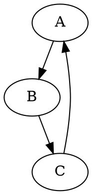

# install package
- apm install <package_name>

# image

&emsp;&emsp;&emsp;&emsp;:smile::smile::man::woman::car::apple::cry::angry::sa::taxi:

# math formular

- $\sqrt{3x-1}+(1+x)^2$
- $\land$
- [function]("https://katex.org/docs/supported.html")

references:
- [install package](https://www.jianshu.com/p/c24703adbebe)
- [pdf, 公式. 图片..](https://www.cnblogs.com/fanzhidongyzby/p/6637084.html)
- [公式,](https://mazhuang.org/2017/09/01/markdown-odd-skills/)

- [特殊符号](https://blog.csdn.net/vola9527/article/details/69948411)

# 宏定义
[1]:http://www.baidu.com
[百度][1]
[2]:resource

[][zhihu]

| 行为                     | 指令       | 举例       |
| ------------------------ | ---------- | ---------- |
| 再某物理地址设置断点     | b addr     | b 0x7c00   |
| 显示当前所有断点信息     | info break | info break |
| 继续执行, 直到遇上断点   | c          | c          |
| 单步执行                 | s          | s          |
| 单步执行(遇到函数则跳过) | n          | n          |
|                          |            |            |
|                          |            |            |
|                          |            |            |
|                          |            |            |

$$
\begin{equation}
\begin{split}
x&=a+b+c\\
&=d+e\\
&=f+g
\end{split}
\end{equation}
$$

