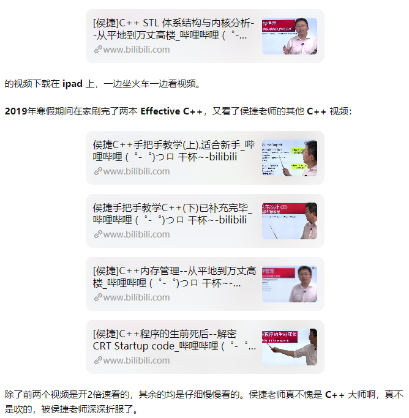

# 文献阅读

- [研究生如何做文献阅读笔记？](http://image.sciencenet.cn/olddata/kexue.com.cn/upload/blog/file/2009/10/20091019174812440381.pdf)
- [存量阅读+增量阅读](https://mp.weixin.qq.com/s/zuDzvzTYrRMMqcWEq9YR-w)
- [干货：论文读不懂怎么办？ - 华为云 (huaweicloud.com)](https://www.huaweicloud.com/articles/bda8b3b6f754f38045227ea22665a1ae.html) 不断涌现的论文，其实就是学术界的升级安装包。
  - 搜一搜presentation
  - 在Medium上搜一搜有没有相关博客
  - 视频, 特别是大学老师讲的
  - 代码
  - 最好的方式，当然是与专家甚至是作者本人，做面对面的高效沟通反馈。当然，这样的机会很稀缺。如果你遇到，一定要抓住。
- [如何快速梳理领域文献 (qq.com)](https://mp.weixin.qq.com/s/s0D4bNctjzilyGNqrQ4Kyg)
- [如何高效做文献回顾？（工具篇） (qq.com)](https://mp.weixin.qq.com/s/k-G0TzfnYbLA0dYXfDpMdg)
- [论文太多看不过来？快让人工智能帮你阅读分析 (qq.com)](https://mp.weixin.qq.com/s/zEco97zBRYb215bU0CypOQ)
- [如何高效读论文？ - 知乎 (zhihu.com)](https://zhuanlan.zhihu.com/p/35170379) !!!
- [How to Read a Paper Efficiently (By Prof. Pete Carr) - YouTube](https://www.youtube.com/watch?v=IeaD0ZaUJ3Y&ab_channel=SurvivingandThrivinginHigherEducation)
  - 首先是<u>题目</u>, <u>关键词</u>, <u>摘要</u>, 然后是<u>结论</u> (确定自己是否感兴趣, 可以随时停止阅读一篇文章, 不要试图去打捞沉没成本，在已经不看好、或者不感兴趣的论文上投入更多时间)
  - 千万不要一字一句，从头到尾线性阅读
  - 先看<u>图表</u>（如果有）, 最后读<u>引言(</u>introduction 因为引言的主要作用是强调论文研究主题的价值和必要性，会尝试与更为宏大的图景、更重要的问题相联系。有的甚至会有“吹嘘”的成分。), 最最后看核心部分(研究结果和讨论, 不是实验)
  - 实验需要慢慢看

## 选题

- [如何有效选毕业论文题目？ - 少数派 (sspai.com)](https://sspai.com/post/63684)
  - 熟悉, 要跟别人的优秀文献有关联
  - 能够给别人带来认知差
  - 得有证据
- [如何做一份合格的毕业论文选题报告？（王树义） - International Research Collaboration Information P (ircip.cn)](http://www.ircip.cn/web/993897-1259818.html?id=26645&newsid=2349235)

# 分布式

- <数据密集型应用系统设计>

# CG

- [手把手的教你用c++实现了一个没有带光源的光线追踪器](https://raytracing.github.io/books/RayTracingInOneWeekend.html)

- [物理渲染 roadmap](https://www.zhihu.com/question/309420057)

- [cmu462/Scotty3D: 3D graphics software for mesh editing, path tracing, and animation](https://github.com/cmu462/Scotty3D)  

  [Loop曲面细分算法](https://blog.csdn.net/suian0424/article/details/86371383)

- [Shadertoy](https://www.shadertoy.com/)

- The Art of Code 在shadertoy

- Inigo Quilez shadertoy

# iOS

- 2etime (GE 游戏引擎, swift, iOS)
- coding train(js, 可视化算法)
- Design Code (swift ui)

# 几何建模

- GAMES102

【1】 课程资料

本课程的主页及相关课程资料将永久分享：
http://staff.ustc.edu.cn/~lgliu/Courses/GAMES102_2020/default.html
在主页上可方便查找到所有的课程资料、课件PPT、作业及参考代码/报告、B站视频链接等

【2】继续学习

这门课包含了两门课程的主要内容《计算机辅助几何设计》与《数字几何处理》，前者是关于连续几何的，后者是关于离散几何的。特别是前者，涉及的数学概念和内容较多，通过在线方式与不同背景的学员来授课对我来说是个很大的挑战。每次课的课前我都要思考、酝酿很久才来做课件，尽量用通俗易懂的方式来进行讲解各部分的知识点。虽然还有一些学员未能完全理解，但是很高兴还是有不少学员能跟上课程，并很好地完成了作业！无论是在校学生、还是企业员工，你们能在学业和工作繁忙的同时，还能抽出时间来完成本课程的作业，就值得尊重和鼓励！上天一定会奖励努力的人！

由于所有资料都在线可获取，各位学员在未来可以反复进行学习。对于暂时未能跟上的学员，你们可以在未来随时抽空继续进行学习，同时也建议也跟着作业来练习，这样才能真正掌握其中的知识和技能。知识未必能转化为生产力，而只有知识支撑的技术才能转化为生产力。

课程的10个作业我都精心做过设计，通过这10个作业能基本掌握几何建模与处理的大部分知识和技术。

如果C/C++编程比较弱，想提高编程能力，建议可以按照我给本科生讲授的《计算机图形学》的作业来练习，其中的作业也是我花了很多时间来精心设计的，从最初的面向对象的编程思想、到图像编程、使用现成的类库、到图形编程等都能得到渐进式的训练，如能跟着作业来完成，你的面向对象C++编程一定会有快速提高：
http://staff.ustc.edu.cn/~lgliu/Courses/ComputerGraphics_2020_spring-summer/default.htm
同样地，主页上有所有的课件、作业及参考代码、课程视频等。

【3】进阶课程

如果对几何建模及处理想继续进阶学习的，可以参考中国科技大学的其他课程内容：
陈仁杰：《计算机辅助几何设计》
http://staff.ustc.edu.cn/~renjiec/CAGD_2020S1/default.htm
傅孝明：《数字几何处理》
http://staff.ustc.edu.cn/~fuxm/course/2020_Spring_DGP/index.html

特别是傅老师的《数字几何处理》课程的视频也可分享到了B站：
https://www.bilibili.com/video/BV1B54y1B7Uc
【4】 后续GAMES在线课程

GAMES在线交流平台将继续为各位同仁提供其他优质课程。在今年还规划了2门课程：
GAMES 202: 高质量实时渲染（闫令琪）（预期：2021年3月-5月）
GAMES 203: 三维视觉和理解（黄其兴）（预期：2021年6月-8月）
请感兴趣的同仁关注GAMES群的信息！相信大家能有更多收获！
【5】结语

兴趣是最好的老师！只要你对计算机图形学、对几何建模与处理有兴趣，通过正确的方法和自己的努力，一定能学好、做好的！

近几年，计算机图形学相关的应用逐渐落地开花，产业界对相关人才的需求量突增。另外，由于卡脖子工程等紧迫需求，国家对工业设计软件的研发的投入每年都在增加。几何建模与处理方面仍有许多挑战，也需要更多年轻人共同投入到这个行业。让我们一起努力，在百年未有之大变局的时代中乘风破浪！

在对三维几何模型的构建过程中，还会涉及到很多需要处理的几何问题，比如数据去噪(denoising or smoothing)、补洞(repairing)、简化(simplification)、层次细节(level of detail)、参数化(parameterization)、变形(deformation or editing)、分割(segmentation)、形状分析及检索(shape analysis and retrieval)等。这些问题构成“数字几何处理”的主要研究内容。笔者自2005年起开设了多年的《数字几何处理》的研究生课程：

http://staff.ustc.edu.cn/~lgliu/Courses/DGP_2012_spring-summer/default.htm

## B站

这是十几年前我一个人用stereo vision 搭建的demo https://m.bilibili.com/space/327617676

各位cv学生们好。我最近更新了一下3D几何 CV的讲义。包括几何数学基础和一些这两年在CVPR文章的运用综述。课题包括：相机模型，内部和外部参数估计，对极几何，三维重建，图像深度估计。最新研究survey 包括，单图像到相机模型的估计，基于多视图的多人3D姿势估计，基于GAN的3D姿势估计，基于运动的深度结构，基于深度学习的深度估计。讲义可在这里下载 https://github.com/roboticcam/machine-learning-notes

# 技术书单

## 必看

- [ ] C++ Primer
- [ ] 编程之美
- [ ] 编程珠玑
- [ ] 算法设计手册
- [ ] 算法4
- [ ] effective c++
- [ ] more effective c++

## 刘未鹏

我所认为的，你面试微软前必须要读的十本书：

1. Code: The Hidden Language of Computer Hardware and Software （《编码的奥秘》）
2. Computer System: A Programmer’s Perspective （《深入理解计算机系统》） / Windows via C/C++ （《Windows核心编程》 / 《程序员的自我修养》
3. **Code Complete 2（《代码大全》）/ The Pragmatic Programmer （《程序员修炼之道》，我也把这本书称为《代码小全》）**
4. Programming Pearls （《编程珠玑》） / Algorithms / Algorithm Design / 《编程之美》
5. The C Programming Language
6. The C++ Programming Language / Programming: Principles and Practice Using C++ / Accelerated C++
7. The Structure and Interpretation of Computer Programs （《计算机程序的构造和解释》）
8. Clean Code / Implementation Patterns
9. **Design Patterns （《设计模式》） / Agile Software Development, Principles, Patterns, and Practices**
10. Refactoring （《重构》）

（注：1. 以上同一条目下用“/”隔开的表示任选，当然你也可以都读了，相信我，时间是足够的。2. 读这些书并不意味着逐字逐句从第一页读到最后一页——当然你也可以这么做。怎么是聪明高效的读法，可以参考我之前写的关于如何[阅读和查找/鉴别书籍/资料的博文](http://mindhacks.cn/2008/09/17/learning-habits-part3/)）

[怎样花两年时间去面试一个人 – 刘未鹏 | Mind Hacks](http://mindhacks.cn/2011/11/04/how-to-interview-a-person-for-two-years/)

关于答案&做法到底是怎么来的，从问题到答案之间经历了怎样的思维过程。却鲜有书能够很好的阐释。就我有限的阅（算法）书经验，除了波利亚的《怎样解题》还算合格之外（也并非最理想），其它的（包括有名的《算法导论》、《如何解题：现代启发式方法》、《Algorithms》、《编程珠玑》[(14条消息) 知其所以然地学习（以算法学习为例）_刘未鹏|C++的罗浮宫-CSDN博客](https://blog.csdn.net/pongba/article/details/2622713)

# 学习路线

## C++

- [(18 封私信 / 1 条消息) 研究生生涯还剩两年，学C++（达到可以找工作的标准）时间够用吗? - 知乎 (zhihu.com)](https://www.zhihu.com/question/437730620/answer/1662402460)

- [能拿BAT、TMD等国内互联网大厂的C++学习过程分享~ - 知乎 (zhihu.com)](https://zhuanlan.zhihu.com/p/337872292)

  1. C++ Primer
  2. 看到 C++ Primer 前8章, 开始刷题
  3. 看 effective, more effective
  4. PAT?
  5. 看侯捷老师的视频

  

## 算法

1. 算法4
2. 看完要自己实现一边, 包括各种数据结构, 各种查找算法, 排序算法... 如果有问题再回头去看
3. 算法设计手册(时间够可以看, 时间不够直接刷题)

# BLOG

- [万维钢](https://www.geekonomics10000.com/) 

# 招聘

## 图形学

- http://games-cn.org/jobs/
- https://chinagraph2020.xmu.edu.cn/sponsors.html
- http://cs.dlut.edu.cn/CADCG2021/CADCG2021zzqy.htm