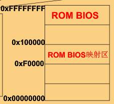

# OS介绍

## OS的故事

[link](https://www.icourse163.org/learn/HIT-1002531008?tid=1450346461#/learn/content?type=detail&id=1214728532&cid=1218670720)

### 开机

1. x86 PC刚开机时CPU处于实模式 (实模式寻址 CS*4+IP
2. 开机时, CS = 0xFFFF; IP = 0x0000
3. 寻址 0xFFFF0 (ROM BIOS映射区)



4. 检查RAM, 键盘, 显示器, 软硬磁盘

5. 将 磁盘0磁道0扇区(主引导扇区) 读入 0x7c00, 共512字节

   主引导扇区代码 `bootsect.s`

   ```assembly
   .globl begtext,begdata,begbss,endtext,enddata,endbss
   ; .text等是伪操作符，告诉编译器产生文本段，.text用于标识文本段的开始位置。此处的.text、.data、.bss表明这3个段重叠，不分段!
   .text ;文本段
   begtext:
   .data ;数据段
   begdata:
   BOOTSEG 0x07c0 ; 不知道是不是放这里
   INITSEG 0x9000
   SETUPSEG 0x9020
   .bss ;未初始化数据段
   begbss:
   entry start ;关键字entry告诉链接器“程序入口”
   start:
       mov ax, BOOTSEG
       mov ds, ax ; ds = 0x07c0
   
       mov ax, INITSEG 
       mov es, ax ; es = 0x9000
   
       mov cx, 256
       sub si, si 
       sub di,di
       rep movw ; 将0x07c0:0x0000处的256个字移动到0x9000:0x0000处, 为了腾出空间来...
       jmpi go, INITSEG ; (jump intersegment段间跳转): cs=INITSEG, ip=go
       
   ......
   ```

   

6. 设置CS = 0x07c0, IP = 0x0000

   1. 

## 批处理系统

### 单道批处理系统

- 特征
  - 自动性: 有监控程序控制
  - 顺序性: 不能超车
  - 单道性

### 多道批处理系统

- 特征
  - 多道性
  - 无序性: 由调度性来解决
  - 调度性: 
- 优点
  - 资源利用率高
  - 系统吞吐量大
- 缺点
  - 平均周转时间长
  - 无交互能力

## OS基本特征

- 并行
  - 两个或以上事件在同一时刻发生
  - 程序被分配到多个处理机(核)
- 并发
  - 两个或以上事件在同一时间间隔内发生
  - 宏观上有多个程序同时运行, 微观上这些程序只是分时交替执行
- 共享
  - 互斥共享
    - 一段时间内只允许一个进程访问该资源
    - 独占资源
    - 如栈, 变量, 表格
  - 同时访问方式
  - 并发与共享互为存在的条件: 没有并发就没有共享, 没有共享就没有并发
- 虚拟: 虚拟处理机, 虚拟内存, 虚拟外部设备(打印机)
- 异步: 与同步处理相对，异步处理不用阻塞当前[线程](https://baike.baidu.com/item/线程/103101)来等待处理完成，而是允许后续操作，直至其它线程将处理完成，并回调通知此线程

## OS主要功能

- 进程控制
  - 主要功能
    - 为作业创建进程
    - 撤销已结束的进程
    - 控制进程在运行过程种的状态转换
    - 为进程创建若干个线程的功能和撤销已完成任务的线程

- 进程同步
  - 主要任务: 为多个进程(含线程)的运行进行协调
    - 进程互斥方式
      - 进程(线程)对独占资源(临界资源)进行访问时
      - 用锁:lock:
    - 进程同步方式: 合作完成共同任务

- 进程通信
  - 进程(线程)之间需要交换信息
  - 方式
    - 直接通信方式: 互相合作的进程(线程)之间, 源进程利用发送命令将消息(message)挂到目标进程的消息队列上