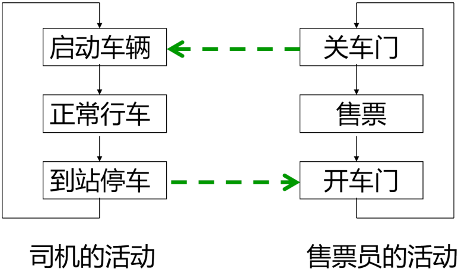
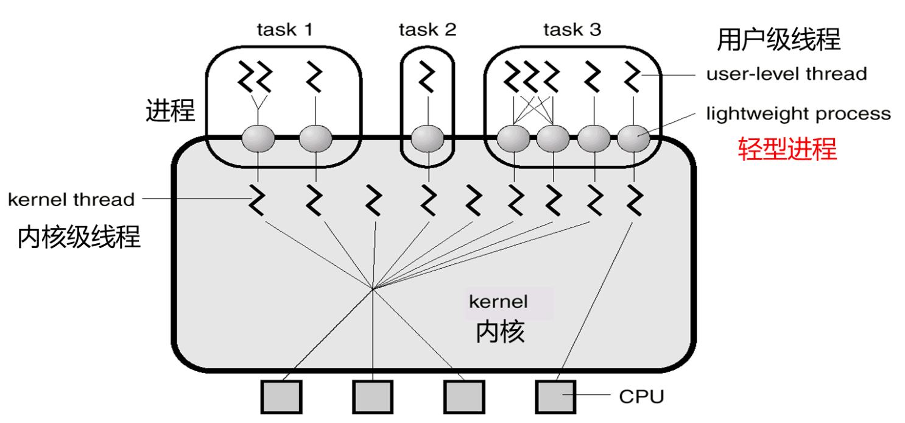
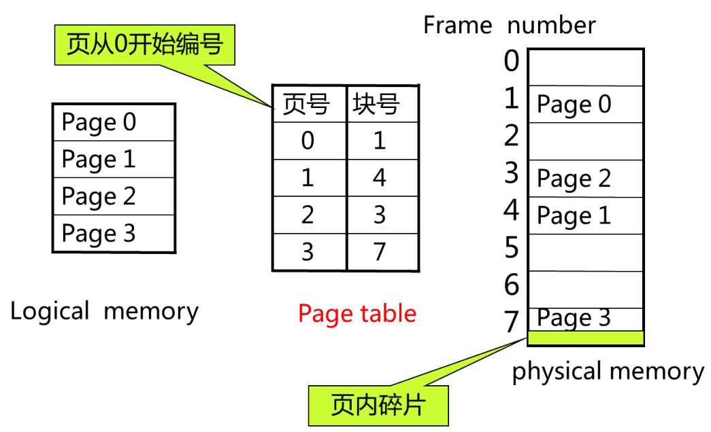
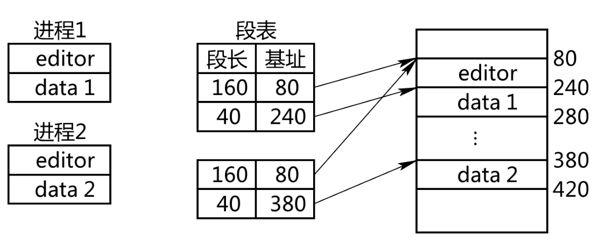
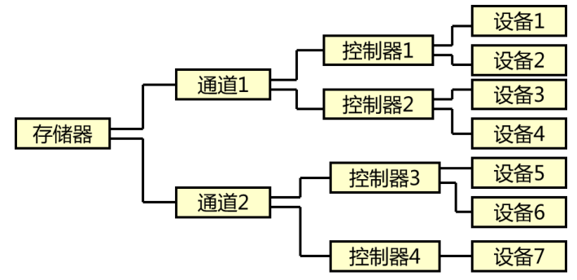
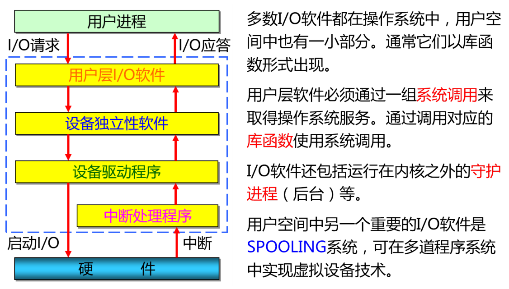
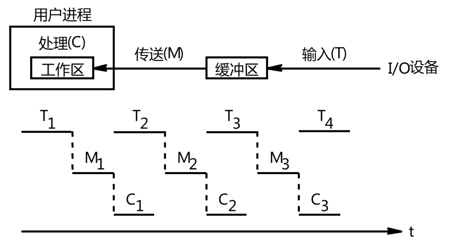
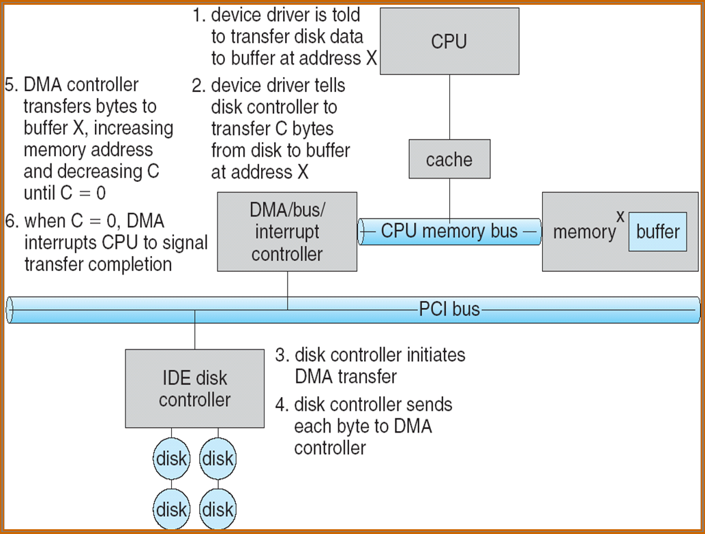
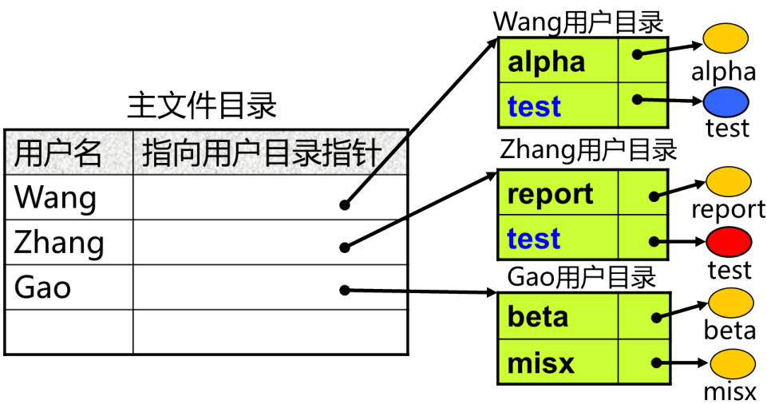

# 总介

## 总类

### 单道批处理系统

- 特点
  - 自动性
  - 顺序性
  - 单道性
- 优点
  - 减少了人工操作的时间, 提高机器的利用率和系统吞吐量
- 缺点
  - 有I/O请求时, CPU必须等待I/O的完成

### 多道批处理系统

- 多个作业在外存"后备队列"中排队, 经作业调度选若干调入内存, 使它们**共享**CPU和系统中的各种资源
- 增加四大管理(处理机, 内存, I/O设备, 文件管理), 接口, 就形成了OS
- 特点
  - 调度性
  - 无序性: 因为存在超车
  - 多道性: 不用等待I/O, 可以超车
- 优点
  - 资源利用率高
  - 系统吞吐量大
- 缺点
  - 平均周转周期长
  - 无交互能力

### 分时系统

- 特点
  - 多路性: 宏观上多个用户同时工作, 微观上轮流运行
  - 独立性: 用户独立操作, 互不干扰
  - 及时性
  - 交互性
- 时间到就中断
  - 操作系统是由中断来驱动的

### 实时系统

- 及时(即时)响应外部事件的请求, 控制所有实时任务协调一致运行
- 特点
  - 可靠性
  - 多路性
  - 独立性
  - 交互性

### 通用OS

> 如果一个操作系统兼有批处理、分时和实时系统三者或二者的功能，则称该操作系统为通用操作系统

- 通用操作系统包括**微机操作系统**和**网络操作系统**
  - 配置在微型机上操作系统称为微机操作系统
    - window, Linux, Unix, MS-DOS(单用户单任务)
  - 网络操作系统(NOS)对整个计算机网络实施管理, 并为用户提供统一的, 方便的网络接口
    - windows server, Unix, Linux, NetWare

### 多处理机OS

- 类型
  - 紧密耦合型
    - 共享RAM和I/O
    - 多核
  - 松散耦合型
    - 独立RAM和I/O
    - 通道和通信线路连接
    - eg. 超级计算机

## 特征

### 并发性

> Concurrence

- 最重要的, 前提
- 一段时间内同时存在多道运行的程序, 任一时刻只有一道程序在执行
- 并行(Parallel)指多道程序在同一时刻执行, 通常需要多个硬件支持
- 操作系统必须对并发活动进行控制和管理（引入进程和线程）
- 程序并发执行时的特征
  - 间断性(异步性): 互斥, 同步, 执行顺序不确定
  - 失去封闭性: 因为共享资源失去封闭性
  - 不可再现性: 因为失去封闭性

### 共享性

> sharing

- 并发性和共享性是操作系统的两个最基本的特征, 两者互为条件

### 虚拟性

> Virtual

- 把一个物理实体映射为若干个对应的逻辑实体
  - 时分复用, 把事件分开重复利用, 即分时使用方式, 切时间片. eg. 虚拟处理机, 虚拟设备
  - 空分复用, 不够用时用于提高存储空间的利用率. eg. 虚拟磁盘, 虚拟存储器

### 异步性

> Asynchronism

- 进程在执行中，其执行时间、顺序、向前推进的速度和完成的时间等是不可预知的

## 结构设计

- 传统的操作系统结构
  - 无结构操作系统
  - 模块化操作系统结构
  - 分层式操作系统结构
- 现代操作系统结构
  - 微内核的操作系统结构

### 微内核OS

- 在单处理机环境下，采用基于客户/服务器(C/S)模式的微内核结构，将操作统划分为两大部分：**微内核**和**多个服务器**

  

#### 微内核

- 能实现现代OS核心功能的小型内核, 运行在核心态下
- 开机后常驻内存, 不会因为内存紧张而换出
  - 实现与硬件紧密相关的处理
  - 实现一些较基本的功能 eg. 地址变换
  - 负责客户和服务器之间的通信
- 微内核不是一个完整的OS, 只是OS中最基本的部分

#### 结构设计

##### C/S模式

- 组成: 客户机, 服务器, 网络系统
- 客户和服务器之间的通信: 消息传递机制
- 为了提高OS的灵活性和可扩充性而将OS分为 **微内核** 和 **用于提供各种服务的一组服务器**(服务器以进程的形式存在)
- **将OS中最基本的部分放入内核中**, 而把操作系统的绝大部分功能都放在内核外面的一组服务器(进程)
- 优点
  - 数据的分布处理和存储
  - 集中管理
  - 灵活性和可扩充性. 客户机和服务器的数量不受限制, 可以配置多种类型的客户机和服务器
  - 易于修改应用软件

##### OO技术

- 将计算机中的实体作为对象来处理。如进程对象、存储器对象、文件对象等
- 通过**重用**以前项目中的对象来构建新的系统，可降低开发成本，而且能获得更好的系统质量
- 在创建一个新对象类时，通过利用**继承**特性，可显著地减少开发的时空开销
- 通过**封装**可隐蔽对象中的变量和方法，当改变对象中的变量和方法时不会影响到其它部分。此外，封装对对象类中的信息进行了隐蔽，可防止用户不正确的使用

##### 机制与策略分离

- **机制**(Mechanism): 指实现某一功能的具体执行机构 (计算机学院的老师和教学楼)
- **策略**(Policy): 在机制的基础上, 借助某些参数和算法来实现该功能的方法  (办学内容, 专业)
- 软件是策略, 硬件是机制  命令是策略, 实施是机制
- 把策略从内核中分离, 只有机制在内核中, 所以微内核

#### 处理机状态

- 核心态
  - 系统态, 管态
  - 操作系统运行时所处的状态
  - 处理机处于核心态时可以执行硬件所提供的全部指令, 包括特权指令和非特权指令
  - 只有微内核工作的时候才工作在核心态
- 用户态
  - 目态
  - 一般用户程序运行时所处的状态
  - 处理机只能执行非特权指令
  - 用户态下程序不能将其运行状态改为核心态

#### 基本功能 

- 低级存储器管理
  - **页表机制**和**地址变换机制**放入微内核
  - 内存分配和回收策略等放入服务器 (机制放内核, 策略丢出去) 
- 中断和陷入处理
  - 中断: CPU对外部某个事件做出的一种响应
    - **操作系统是由中断来驱动的**
    - 中断可以解决
      - 主机与外设的并行工作问题
      - 提高可靠性
      - 实现实时控制
      - 中断是实现多道程序的必要条件
  - 陷入(内中断): **由CPU内部事件引起的中断**
    - eg. 非法指令, 地址越界等
    - 在内部发生, 且知道怎么处理
- 时钟管理(时间片)
- 原语操作
- 资源管理
  - 进程管理
    - 进程调度管理 (采用机制与策略分离原理)
    - 进程**通信**管理
  - 存储器管理
  - 设备管理

#### 优缺点

- 优点
  - 提高了系统的可扩展性 (添加, 删除服务器, 内核不变)
  - 提高了系统的可靠性
    - 内核和服务器的正确性容易保证
    - 某个服务器的出错不会影响内核和其他服务器
  - 可移植性好 (服务器均与硬件平台无关)
  - 适用于分布式系统
    - 消息传递通讯机制 + 进程和服务器唯一标识 + 系统映射表
    - 把消息发往目标, 无论目标驻留在哪台服务器 (逻辑上是一起的)
- 缺点
  - 运行效率低
  - 
    - 频繁**上下文切换** (Context Switching 就是中断, 陷入内核, "打电话", CPU的控制权由运行任务转移到另一个就绪任务时所发生的事情)
    - 每一次消息传递都需要上下文切换
    - 每次中断总是要保留**任务上下文** (Task Context 程序计数器, 堆栈指针, 通用寄存器的内容)

# 处理机管理

## 任务功能

- 任务
  - 对处理机进行分配
  - 对处理机运行进行有效的控制和管理
  - 处理机的分配和运行以**进程**为基本单位，因此对处理机的管理可归结为对**进程的管理**
- 功能
  - 进程控制（创建、撤销、状态转换）
  - 进程同步（互斥、同步）
  - 进程通信
  - 进程调度（作业调度、进程调度）

## 内核

### 中断


### 原语

> Primitive
>
> 由若干条指令组成的，用于完成一定功能的一个过程。它与一般过程的区别在于：它们是“原子操作 (Atomic Operation)”

- 原语在**核心态**下执行，常驻内存
- 例如：Suspend 挂起原语；Active 激活原语
- 原语的作用是实现进程的控制和通信，在进程控制中如果不使用原语，会造成进程状态的不确定性

### 执行状态

- “置程序状态字(PSW)” 为特权指令
  - 核心态下可以改变机器状态(由核心态转换为用户态)
  - 用户态程序不能将其运行状态改为核心态
- 处理机状态由用户态转为核心态的唯一途径是**中断**
- **访管指令**
  - 在用户态下执行的指令, 本身不是特权指令
  - 当处理器执行到访管指令时就产生一个中断，暂停用户程序的执行，而让操作系统来为用户服务

## 进程

- 进程是**资源分配和调度的基本单位**, 每一进程都完成一个特定任务
- 把OS看成是由若干进程和一个可对这些进程进行协调控制的核心(内核)组成
- 进程的实质是程序在处理机上的一次执行过程
  - 进程与程序不一一对应。同一个程序的多次运行，将形成多个不同的进程；同一个程序的一次执行也可以产生多个进程；一个进程在其生命期的不同时候也可以执行不同的程序
- 进程是一个程序及其数据在处理机上顺序执行时所发生的活动
- 进程 = 程序段 + 数据段 + **进程控制块(PCB)**
- 程序是静态的, 永久的, 进程是动态的, 有生命周期的, 它们不是一一对应的
- 
- 特征
  - 动态性
    - 动态性是进程最基本的特征
    - 生命周期: 因创建而产生, 因调度而执行, 因得不到资源而暂停, 因撤销而消亡
  - 并发性
    - 多个进程实体同时存在于内存中, 能在同一段时间内同时运行
    - 引入进程的目的就是为了并发
  - 独立性: ...基本单位
  - 异步性: 进程以各自独立的、不可预知的速度向前推进

### 结构

#### 数据段

#### 代码段

#### PCB

- 有的部分常驻内存 PCB区, 有的非常驻内存 
- 数据结构
- 创建, 撤销进程实际上指创建, 撤销进程实体的PCB

##### 作用

- 作为独立运行基本单位的标志: 是进程存在的唯一标志
- 能实现间断性运行方式: 保存和恢复现场
- 提供进程管理所需要的信息: 找到程序和数据
- 提供进程控制所需要的信息: PCB中有现行状态和优先级
- 实现与其他进程的同步和通信

##### 包含的信息

- 进程标识符
  - 内部标识符: 系统分配给进程的唯一标志号
  - 外部标识符: 用户号. 设置父子进程的标识. 
- 处理机状态(断点信息)
  - 通用寄存器: 用户程序可以访问, 用于暂存信息
  - 指令计数器: 程序计数器PC, 存放要访问的下一条指令的地址
  - PSW: 程序状态字, 其中含有状态信息，如条件码、
    执行方式、中断屏蔽标志等
    - 条件码：指令执行完毕后设置状态标志，包括进位标志、溢出标志、符号标志、零标志、奇偶标志等，用于后续指令的控制条件。
    - 执行方式：用户态、核心态
  - 用户栈指针，用于存放系统调用参数及调用地址
- 进程调度信息
  - 进程状态：进程的当前状态（执行、就绪、阻塞）
  - 优先级
  - 进程调度所需的信息：如等待时间、已执行时间等
  - 事件：状态转换的原因
- 进程控制信息
  - 程序和数据的地址
  - 同步和通信机制：消息队列指针、信号量等。
  - 资源清单：除 CPU 以，所需资源及已分配资源的清单
  - 链接指针：下一个进程的 PCB 的首地址

##### 组织方式

- 链接方式: 队列

  

- 索引方式: 索引表

  

### 状态


#### 就绪

> Ready

- 只差处理机

#### 执行

> Running

- 所有资源包括处理机都有了

#### 阻塞

> Waiting 等待

- 请求I/O
- 睡着了

#### 挂起

- 可由自己, 父进程, OS挂起
- 一般情况下, 挂起状态的进程将**从内存移到外存**
- 挂起状态使进程置于**静止状态**
- 原因
  - 终端用户的需要: 程序运行中发现问题, 要求进程暂停, 拷到外存, 修改
  - 父进程的需要: 为了考查和修改某个子进程, 或者协调各子进程间的活动
  - 操作系统的需要
  - 对换的需要: 所有进程都阻塞了, 处理机闲着, 将内存中的进程换到外存
  - 负荷调节的需要: 负荷重时把不重要的进程挂起(实时操作系统)

### 层次结构

- 在每个进程的 PCB 中都设置家族关系的表项，以表明自己的父进程和所有的子进程

- 进程家族关系
  - 子进程可继承父进程的所有资源
  - 子进程撤销时要把资源归还给父进程
  - 父进程撤销时也必须撤销所有子进程
- 一个进程可以创建若干个新进程，新创建的进程又可以创建子进程

### 进程控制

> 进程控制是进程管理中最基本的功能，即对系统中所有的进程实施有效的管理，其功能包括 **进程的创建、撤消、阻塞与唤醒** 等，这些功能一般是由 **操作系统的内核** 通过 **原语** 来完成

#### 创建

> 新建

- 进程正在创建中的状态

- 通过父进程, OS, 操作员创建

- 导致创建的事件

  - 用户登录：为该终端用户创建一个进程
  - 作业调度：为被调度的作业创建进程
  - 提供服务：如要打印时建立打印进程
  - 应用请求：由应用程序建立多个进程（并发）

- 调用进程 **创建原语 Create**, 按下面流程创建进程

  

#### 撤销

> Terminated 终止 退出

- 调用 **撤消原语 Kill** 去撤消进程

- 导致进程终止的事件

  - 进程正常结束（Holt 、Logoff 等）
  - 进程异常结束（越界、超时、非法指令、I/O 故障等）
  - 外界干预（操作员、OS 、父进程）

- 过程

  

#### 阻塞和唤醒

- 调用**阻塞原语Block**（由执行状态转为阻塞状态）把自己阻塞起来
- 进程从执行态到阻塞态是 **主动** 的
- 进程从阻塞态到就绪态是 **被动** 的

- 处于阻塞状态的进程，当期待的事件出现时，由其它相关进程调用**唤醒原语 Wakeup** （由阻塞状态变为就绪状态）把阻塞的进程唤醒，使其进入就绪状态

- 导致进程阻塞和唤醒的事件

  - 向系统请求共享资源失败
  - 等待某种操作的完成
  - 新数据尚未到达
  - 无新工作可做

- 过程

  

#### 挂起和激活

- **挂起原语 Suspend ** 由自己或父进程完成挂起

- **激活原语 Active** 由父进程或用户进程请求, 系统完成激活

- 挂起过程

  

- 激活过程

  

#### 系统调用

> 内核提供的功能十分强大的一系列的函数，是**应用程序和操作系统内核之间的功能接口**

- **用户进程通过系统调用访问内核**
- 系统调用是由操作系统内部调用的, 是操作系统提供给应用程序使用内核功能的接口, 它只能**通过用户程序间接调用**
- 原理是进程先用适当的值填充寄存器，然后调用一个特殊的指令，这个指令会跳到一个事先定义的内核中的一个位置（由中断实现）
- 对于通常的进程，无论是系统进程还是用户进程，进程的创建、撤消以及要求由系统设备完成的 I/O 操作，都是**利用系统调用而进入 OS 内核**，再由内核中的相应处理程序予以完成
- 系统调用和普通的函数调用的区别
  - 系统调用由操作系统核心提供，运行于核心态
  - 普通函数调用由函数库或用户自己提供，运行于用户态

##### Fork()

- 创建子进程: 精确复制父进程

- 父进程的数据空间、堆栈空间都会给子进程一个**拷贝，而不是共享**这些内存

- 一次调用, 两次返回, 三种可能返回值

- 返回值

  - \> 0 系统将执行父进程的程序段 子进程的 pid (这个进程是父进程)
  - = 0 系统将执行**子进程**的有关程序段 (这个进程是子进程)
  - -1  子进程未创建成功

- 程序运行顺序取决于调度算法

- 例子

  - 

  - 

    比较可能出现的结果是 bca, bac, 因为fork比较耗时, 一个时间片可能完不成, 然后又到队尾去排队了, 但是打印b就很快

##### Exec()

- 改变进程的原有代码
- 通过一个系统调用 exec，子进程可以拥有自己的可执行代码, 而不是执行父进程原来给的那些, 不然fork() 出来的都是一模一样的进程, 莫得意思
- exec 根据指定的文件名找到可执行文件，并用它来取代调用进程的内容，用一个新进程覆盖调用进程。换句话说，将一个可执行的二进制文件覆盖在新进程的用户级上下文的存储空间上，以更新新进程的用户级上下文
- 参数包括新进程对应的文件和命令行参数。成功调用时，不再返回；否则，返回出错原因
- 在大多数程序中，**系统调用 fork 和 exec 是结合在一起使用的**。父进程生成一个子进程，然后通过调用 exec覆盖该子进程
  - 意思就是先创建一个, 再拿他来改, 这样比直接创建一个不同的要**快**
- 调用 exec 时可采用" 写时拷贝（copy-on-write）" 技术，使得 fork 结束后并不立刻复制父进程的内容，而是到了真正使用的时候才复制

##### COW

> Copy on Write

[link](https://juejin.im/post/5bd96bcaf265da396b72f855)

- 很多时候复制给子进程的数据是无效的，于是就有了Copy On Write这项技术了
- 在fork之后exec之前两个进程**用的是相同的物理空间**（内存区），子进程的代码段、数据段、堆栈都是指向父进程的物理空间，也就是说，两者的虚拟空间不同，但其对应的**物理空间是同一个**。
- 当父子进程中**有更改相应段的行为发生时**，再**为子进程相应的段分配物理空间**
  - 如果不是因为exec，内核会给子进程的数据段、堆栈段分配相应的物理空间（至此两者有各自的进程空间，互不影响），而代码段继续共享父进程的物理空间（两者的代码完全相同）
  - 如果是因为exec，由于两者执行的代码不同，子进程的代码段也会分配单独的物理空间

##### Exit()

- 只要执行到 exit 系统调用，进程就会停止剩下的所有操作，清除包括 PCB 在内的各种数据结构，并终止本进程的运行
- exit 系统调用带有一个整数类型的参数 status，可以利用这个参数传递进程结束时的状态。0 表示正常结束。其他的数值表示出现了错误，进程非正常结束

- 杀死进程, 使进程变成zombie进程
  - 僵尸进程中保存着对程序员和系统管理员非常重要的信息，如进程死亡原因、占用的 CPU 时间等
  - 僵尸进程对其他进程几乎没有什么影响，不占用 CPU时间，消耗的内存也几乎可以忽略不计，如果存在太多的僵尸进程，也会影响到新进程的产生

##### Wait()

- 挂起进程，等待子进程终止
- 进程一旦调用了 wait，就立即阻塞自己，由 wait 自动分析是否当前进程的某个子进程已经退出
  - 如果让它找到了一个已经变成僵尸的子进程，wait 就会收集这个子进程的信息，并把它彻底销毁后返回
  - 如果没有找到这样一个子进程，wait 就会一直阻塞在这
    里，直到有一个出现为止

- 抓僵尸

- 可以解决**同步问题**

- 例子

  

  

##### Waitpid()

- 指名抓某个僵尸

##### Getpid()

- 获取进程标识符

##### Nice()

- 改变进程的优先级

##### Pipe()

- 建立同步通信管道
- pipe 是进程间共享的。由系统调用生成的两个文件符也是进程间共享的。其中规定 fd[0] 文件符只能进行读操作，fd[1] 文件符只能进行写操作

##### Write()

- 发送进程利用系统调用 write(fd[1],buf,size)，把 buf 中长度为 size 字符的消息送入管道入口 fd[1]。

##### Read()

- 接收进程则使用系统调用 read(fd[0],buf,size)从管道出口 fd[0] 读出 size 字符的消息置入 buf 中

##### BTW

[link](https://www.cnblogs.com/anker/p/3271773.html) [实验](https://www.cnblogs.com/anker/p/3271773.html)

- 孤儿进程：一个父进程退出，而它的一个或多个子进程还在运行，那么那些子进程将成为孤儿进程。孤儿进程将被init进程(进程号为1)所收养，并由init进程对它们完成状态收集工作。
- 僵尸进程：一个进程使用fork创建子进程，如果子进程退出，而父进程并没有调用wait或waitpid获取子进程的状态信息，那么子进程的进程描述符仍然保存在系统中
- 如果进程不调用wait / waitpid的话， 那么保留的那段信息就不会释放，其进程号就会一直被占用，但是系统所能使用的进程号是有限的，如果大量的产生僵死进程，将因为没有可用的进程号而导致系统不能产生新的进程. 此即为僵尸进程的危害，应当避免
- 任何一个子进程(init除外)在exit()之后，并非马上就消失掉，而是留下一个称为僵尸进程(Zombie)的数据结构，等待父进程处理

### 进程同步

> 指对多个相关进程在执行次序上进行协调
>
> 目的是使系统中诸进程之间能有效地共享资源和相互合作，从而使程序的执行具有可再现性

#### 基本概念

- 临界资源(Critical Resource) 

  > 是一次只允许一个进程使用的资源，如打印机、绘图机、变量、数据等

  - 进程之间采取 互斥方式 实现对临界资源的共享，从而实现并行程序的封闭性
  - 在每个进程中，访问临界资源的那一段代码称为临界区（Critical Section ），简称 CS 区

- 临界区

  - 进入区 ：增加在临界区前面的一段代码，用于检查欲访问的临界资源此刻是否被访问。
  - 临界区 ：进程访问临界资源的那段代码。
  - 退出区 ：增加在临界区后面的一段代码，用于将临界资源的访问标志恢复为未被访问标志。
  - 剩余区 ：进程中除了进入区、临界区及退出区之外的其余代码

- 同步机制应遵循的规则

  - 空闲让进 ：当无进程处于临界区时，表明临界资源处于空闲状态，应允许一个请求进入临界区的进程立即进入自己的临界区，以有效地利用临界资源。
  - 忙则等待 ：当已有进程进入临界区时，表明临界资源正在被访问，因而其他试图进入临界区的进程必须等待，以保证对临界资源的互斥访问。
  - 有限等待 ：对要求访问临界资源的进程，应保证在有限时间内能进入自己的临界区，以免陷入 死等 状态。
  - 让权等待 ：当进程不能进入自己的临界区时，应立即释放处理机，以免进程陷入 忙等。

#### 方法

##### Dekker 算法

[link](https://blog.csdn.net/JYL1159131237/article/details/80316388)

- flag[0] 或 flag[1] = ture：表示 P0 或 P1 想用 CS
-  turn=0：P0 可以进入 CS；如果 turn=1：P1 可以进入 CS

```cpp
bool flag[2];//提供所有进程的状态
int turn;//表示哪个进程应坚持进入
void p0(){
	while(true){
		flag[0]=true;//P0想使用临界区
		while(flag[1])//P1也想使用
			if(turn==1){//确实轮到了P1使用
				flag[0]=false;//P0取消请求
				while(turn==1)
					/*什么也不做*/
				flag[0]=true;//P1用完后，P0继续发出请求
			}
        临界区
        flag[0]=false;//p0用完了
        turn=1;//将权限移交给P1
        其余部分
	}
}
void p1(){
	while(true){
		flag[1]=true;
		while(flag[0])
			if(turn==0){
				flag[1]=false;
				while(turn==0)
					/*什么也不做*/
				flag[1]=true;	
			}
		临界区
		flag[1]=fasle;
		turn=0;
	}
}
void main()
{
	turn=0;
	flag[0]=false;
	flag[1]=false;
	perbegin(p0(),p1());
}
```

##### Peterson 算法

- 设两个全局共享变量：flag[0]、flag[1]，表示临界区状
  态及哪个进程正在占用 CS。
- 设一个全局共享变量 turn：表示能进入 CS 的进程序
  号。

```cpp
boolean flag[2]={false,true};
int turn;
void p0()
{
	while(true)
	{
		flag[0]=true;
		turn=1;
		while(flag[1]&&turn==1)//1号想使用且拥有使用权
			/*什么也不做*/
        临界区
        flag[0]=false;
        /*其余部分*/
	}
}
void p1()
{
	while(true)
	{
		flag[1]=true;
		turn=0;
		while(flag[0]&&turn==0)
			/*什么也不做*/
		临界区
        flag[1]=false;
        /*其余部分*/	
	}
}
```

##### 硬件指令

- 关中断指令
  - 方法: 使用关中断、开中断原语。
  - 过程
    1. 关中断
    2. 临界区
    3. 开中断
    4. 剩余区
  - 存在问题
    - 代价高：限制了处理器交替执行各进程的能力。
    - 不能用于多处理器结构：关中断不能保证互斥。
- TestAndSet 指令
- SWAP 指令

##### P-V操作

> 信号量机制

- 信号量只能通过初始化和两个标准的原语（P，V 操作）来访问。
- 初始化：指定一个整数值，表示空闲资源总数。
- **P 操作也称为 wait 操作，V 操作也称为 signal 操作**
- 信号量是比锁更高级的资源抽象方式。
- 注意：P、V 操作应作为一个整体实施，不允许分割
- **如果两个 wait 操作相邻，那么它们的顺序至关重要**
  - 一个同步 wait 操作与一个互斥 wait 操作在一起时，同步 wait 操作在互斥 wait 操作前。

###### 整型信号量

> 非负整数，用于表示资源数目。除了初始化外，只能通过两个原子操作 wait 和signal（P，V）来访问

```
wait (S)：
	while S≤0 
		do no−op / / 测试有无可用资源
	S:=S−1; / / 可用资源数减一
	
signal (S) :
	S:=S+1;
```

- 主要问题：只要 S≤0，wait 操作就不断地测试(忙等), 没有做到"让权等待"

###### 记录型信号量

- 引入**阻塞队列**，信号量值可以取负值

- 

```
wait (S)：
	S. value:=S.value − 1;
	if S.value<0 then block (S.L) ; / / 让权等待
signal (S):
  	S. value :=S. value + 1;
	if S. value≤0 then wakeup(S.L) ;
```

  

- 执行一次 P(s) 操作，意味着进程请求分配该类资源一个单位的资源。

- 执行一次 V(s) 操作意味着进程释放相应资源一个单位的资源。当值小于等于 0 时，表明有进程被阻塞，需要唤醒。

- 在记录型信号量机制中：

  - S.value>0：表示系统中某类资源当前可用的数目。
  - S.value≤0: 表示该类资源已分配完。若有进程请求该类资源，则被阻塞，其绝对值表示该信号量链表中因申请该资源而被阻塞进程的数目。

###### AND 信号量集

- 为避免死锁，可以采用AND 型信号量
- AND 型信号量的基本思想
  - 将进程在整个运行过程中所需要的所有临界资源，一次性全部分配给进程，待进程使用完后再一起释放。
  - 只要有一个资源未能分配给进程，其它所有可能分配的
    资源也不分配给该进程。从而可避免死锁发生。
- AND 型信号量集 P 原语为 Swait(Simultaneous Wait)，V 原语为Ssignal(Simultaneous Signal)。
  - 在 Swait 时，各个信号量的次序并不重要，虽然会影响进程归入哪个阻塞队列，但是因为是对资源全部分配或不分配，所以总有进程获得全部资源并在推进之后释放资源，因此不会死锁。

###### 一般信号量集

- 一般信号量集是同时需要**多种资源**、每种占用的**数目不同**、且可分配资源还存在一个临界值时的信号量处理。
- —般信号量集的基本思路就是在 AND 型信号量集的基础上扩充，在一次原语操作中完成所有的资源申请。
- 进程对信号量 Si 的测试值为 ti （表示信号量的判断条件，要求当资源数量低于 ti 时，便不予分配），占用值为 di（表示资源的申请量，即 Si = Si - di 和 Si = Si +di）。
- 一般信号集的特点
  - 一次可分配多个某种临界资源，不需执行多次 P 操作。
  - 每次分配前都测试该种资源数目是否大于测试值。
- 一般信号量集可以用于各种情况的资源分配和释放。下面是几种特殊的情况：
  - Swait(S，d，d)：表示每次申请d个资源，当资源数量少于d个时，便不予分配。
  - Swait(S，1，1)：蜕化为一般的记录型信号量（S>1 时）或互斥信号量（S=1）。
  - Swait(S，1，0)：可作为一个**可控开关**(S≥1 时，允许多个进程进入某特定区；S=0 时禁止任何进程进入)。

```python
Swait (S1, t1 , d1; … , Sn, tn , dn)
if S1≥t1 and … and Sn≥tn then
	for i :=1 to n do
		Si :=Si−di ;
	endfor
else
	Place the executing process in the waiting queue.
endif

Ssignal (S1, d1; … , Sn, dn)
for i :=1 to n do
	Si := Si+di ;
	Remove the process waiting in the queue associated with Si .
endfor ;
```

##### 管程

> Monitors
>
> 一个数据结构和在该数据结构上能被并发进程所执行的一组操作，这组操作能使进程同步和改变管程中的数据


- 本为了避免凡要使用临界资源的进程都自备同步操作wait(s) 和 signal(s)，将同步操作的机制和临界资源结合到一起，形成管程。
- 管程相当于围墙，把共享变量和对它进行操作的若干个过程围了起来，所有进程要访问临界资源时，都必须经过管程才能进入。
- 防止进程有意或无意的违法同步操作。
- 便于用高级语言来书写程序，也便于程序正确性验证。
- **基本思想**: 把访问某种临界资源的所有进程的同步操作都集中起来，构成一个所谓的“秘书”进程（管程），凡是访问临界资源的进程，都需要报告“秘书”，由秘书来实现诸进程的同步。
- 管程的组成
  - 管程的名称
  - 局部于管程内部的共享数据结构说明, 不公开
  - 对该数据结构进行操作的一组过程
  - 对局部于管程内部的共享数据设置初始值的语句
- 管程中的**共享变量在管程外部是不可见的**，不能被任何外部过程访问。管程相当于围墙，把共享变量和对它进行操作的若干过程围了起来。
- 外部只能通过调用管程中所说明的外部过程（函数）来间接地访问管程中的共享变量。一个进程通过调用管程内的一个过程而进入管程。
- 管程通常是用来管理资源的，因而在管程中设有**进程等待队列**以及相应的**等待及唤醒操作**。
- 管程每次只允许一个进程执行，从而实现了进程的互斥。
- 管程不能与其调用者并发。
- 解决问题
  - 互斥：管程规定**每次只准许一个进程执行**，从而实现了进程互斥，保证了管程共享变量的数据完整性。任一时刻管程中只能有一个活跃进程，其它想进入管程的进程阻塞。进入管程的互斥由编译器负责，写管程的人无需关心。
  - 同步：通过条件变量及两个相关操作 wait 和 signal 实
    现。
    - 条件变量 x：表示等待原因。
    - x.wait：执行该操作的进程阻塞，直至被其它进程唤醒。将执行进程挂到与条件变量 x 相应的等待队列上。
    - x.signal：唤醒 x 等待队列中的一个进程。如果 x 等待队列中无进程阻塞，该操作不产生任何作用。唤醒与条件变量 x 相应的等待队列上的一个进程。
      - Hansan 规定 signal 操作为过程体的最后一个操作，P **执行 signal 操作后马上退出管程**，这样被唤
        醒的进程 Q 可以立即恢复执行。P 进入Urgent 队列，下次优先进入管程

- 应用 生产者消费者问题

```
Type PC=monitor
	Var in, out, count: integer;
	buffer: array[0,...,n-1] of item;
	......
```


#### 经典问题

##### 生产者-消费者


- 两个资源信号量及一个互斥信号量
- semaphore full=0;  表示满缓冲区的数目
- semaphore empty=n;  表示空缓冲区的数目
- semaphore mutex=1;  表示对缓冲区进程操作的**互斥信号量** 

##### 哲学家进餐

> 有五个哲学家，他们的生活方式是交替地进行思考和进餐。他们共用一张圆桌，分别坐在五张椅子上。在圆桌上有五个碗和五支筷子，平时一个哲学家进行思考，饥饿时便试图取用其左、右最靠近他的筷子，只有在他拿到两支筷子时才能进餐。进餐完毕，放下筷子又继续思考。
>
> 
>
> 哲学家进餐问题可看作是并发进程并发执行时处理共享资源的一个有代表性的问题。


###### 方法一

> 至多只允许四位哲学家同时去拿左筷子，最终能保证至少有一位哲学家能进餐，并在用完后释放两只筷子供他人使用。

- 操作: 设置一个初值为 4 的信号量 r，只允许 4 个哲学家同时去拿左筷子，这样就能保证至少有一个哲学家可以就餐，不会出现饿死和死锁的现象。

- 原理：至多只允许四个哲学家同时进餐，以保证至少有一个哲学家能够进餐，最终总会释放出他所使用过的两支筷子，从而可使更多的哲学家进餐。


最坏的情况: 一个在吃, 两个拿一只筷子, 一个两手空空

###### 方法二

> 仅当哲学家的左右手筷子都拿起时才允许进餐。

- 解法 1：利用 AND 型信号量机制实现。
- 原理：多个临界资源，要么全部分配，要么一个都不分配，因此不会出现死锁的情形。(全分配, 全释放)


​					可以有两个哲学家同时吃

- 解法 2：利用信号量的保护机制实现。
- 原理：通过互斥信号量 mutex 对 eat() 之前取左侧和右侧筷子的操作进行保护，可以防止死锁的出现。**取筷子作为原子操作**


​					如果一个哲学家在吃, 他旁边的两个哲学家都抢到筷子, 那就阻塞, 不如AND

###### 方法三

> 规定奇数号哲学家先拿左筷子再拿右筷子，而偶数号哲学家相反。
>
> 

- 原理：按照上i,  吧图，将是 2,3 号哲学家竞争 3 号筷子，4,5 号哲学家竞争 5 号筷子。1 号哲学家不需要竞争。最后总会有一个哲学家能获得两支筷子而进餐。


##### 读者-写者

- 问题描述：一个数据对象（数据文件或记录）可被多个进程共享。其中，reader 进程要求读，writer 进程要求写或修改。
- 允许多个 reader 进程同时读共享数据，但不允许一个writer 进程与其它的 reader 进程或 writer 进程同时访问，即 writer 进程必须与其它进程互斥访问共享对象。

##### 例题

###### 售票厅

若有一售票厅只能容纳 300 人，当少于 300 人时可以进入；否则，需在外等候。若将每一个购票者作为一个进程，请用 P、V 操作编程，并写出信号量的初值。

```
购票者进程 Pi（i=1，2，3，…）
设信号量 S，初值 =300
	P（S）;
	进入售票厅;
	购票;
	退出售票厅;
	V（S）;
```

###### 阅览室

有一阅览室，读者进入时必须先在一张表上进行登记。该表为每一座位列出一个表目（包括座号、姓名、阅览时间），读者离开时要撤消登记信息。阅览室有 100 个座位。x为描述读者的动作，应编写几个程序，应设置几个进程？程序和进程之间的对应关系如何？y试用 P、V 操作描述这些进程间的同步关系。

```
信号量S1, 初值为100, 代表座位数目
信号量S2, 初值为1, 控制对登记表的互斥访问
读者进程Pi (i=0, 1, 2, ...)
	P(S1)
	P(S2)
	登记
	V(S2)
	阅览
	P(S2)
	撤销登记
	V(S2)
	V(S1)
```

###### 公交车

设公共汽车上，司机和售票员的活动如下，在汽车不断地到站、停车、行驶过程中，这两个活动有什么同步关系？用信号量和 P、V 操作实现它们的同步。



```
设置两个信号量：S1、S2
S1 表示是否允许司机启动汽车（由“售票员关门”来控制），其初值为 0；
S2 表示是否允许售票员开门（由“司机停车”来控制），其初值为 0。
Semaphore S1=0;
Semaphore S2=0;
Main(){
	parbegin
		Driver();
		Conductor();
	parend
}

Driver(){
	P(S1);
	启动车辆;
	正常行车;
	到站停车;
	V(S2);
}

Conductor(){
	关车门;
	V(S1);
	售票;
	P(S2);
	开车门;
	上下乘客;
}
```

###### 铁笼子

有一只铁笼子，每次只能放入一只动物。猎手向笼中放入老虎，农民向笼中放入猪，动物园等待取笼中的老虎，饭店等待取笼中的猪，试用 P、V 操作写出能同步执行的程序。


###### 水果

桌上有一空盘，允许存放一个水果。爸爸可向盘中放苹果，也可向盘中放桔子。儿子专等吃盘中的桔子，女儿专等吃盘中的苹果。规定盘空时一次只能放一只水果供吃者取用，请用 P、V 原语实现爸爸、儿子、女儿三个并发进程的同步。

```
信号量 S 表示盘子是否为空，初值为 1。
信号量 So 表示盘中是否是桔子，初值为 0。
信号量 Sa 表示盘中是否是苹果，初值为 0。
main(){
	cobegin
		father();
		son();
		daughter();
	coend
}

father(){
	P(S);
	将水果放入盘中;
	if(桔子)	V(So);
	else	V(Sa);
}

son(){
	P(So);
	从盘中取出桔子;
	V(S);
	吃;
}

daughter(){
	P(Sa);
	从盘中取出苹果;
	V(S);
	吃;
}
```

### 进程通信

- 低级通信: 效率低，交换信息量少, 通信对用户不透明
  - 信号量机制
- 高级通信: 效率高通信实现细节对用户透明
  - 共享存储器系统 (Shared Memory System)
  - 消息传递系统 (Message Passing System)
  - 管道 (Pipe) 通信：又称为共享文件通信
  - 客户机-服务器系统 (Client-Server System)

#### 共享存储器系统

> Shared Memory System

- 基于共享数据结构的通信方式
  - 系统提供了一种共享数据结构，适用于少量通信。
  - 低效，不透明（数据结构的设置以及对进程间同步的处理，都必须由程序员来处理）。
  - 例如 producer-consumer 中的缓冲区
- 基于共享存储区的通信方式
  - 系统提供共享存储区。
  - 通信过程：
    1. 向系统申请一个或多个分区。
    2. 对获得的分区进行读写。
  - 特点：高效，速度快。

#### 消息传递系统

> Message Passing System


- 信息单位：消息（报文）
- 实现：一组通信命令（原语）, 具有透明性
- 需要内核支持
- 

##### 直接通信方式

> 消息缓冲通信

- 要求两个人同时在线

- 原语

  - send ( Receiver，message ) 如接收者阻塞，则唤醒。

    

  - receive ( Sender，message ) 无消息则阻塞。

  

##### 间接通信方式

> 信箱通信方式

- 写进程 ⇒ 信箱（中间实体）⇒ 读进程

- 两个进程可不同时在线

- 原语

  

  - Send (mailbox,message)
  - Receive (mailbox,message)

- 信箱的分类：私用信箱、公用信箱、共享信箱

- 发送—接收进程之间的关系:

  - 一对一关系
  - 多对一关系
  - 一对多关系
  - 多对多关系：公用信箱。

#### 管道通信

> Pipe
>
> 共享文件通信
>
> 连接读进程和写进程间通信的共享文件

- 功能: 大量的数据发收。

- 管道通信必须提供三方面的协调能力：

  - 确定对方是否存在。
  - 互斥：互斥访问管道。
  - 同步：写满或读空管道后，进程睡眠等待，直到其它进程唤醒。

- 例子

  

#### 客户机-服务器系统

> Client-Server System

##### 套接字

- 套接字（Socket）是对网络中进程之间进行双向通信的端点的抽象。插头和插座
- 一个套接字就是网络中进程通信的一端。
- 套接字是一个通信标识类型的数据结构，包含许多选项，由操作系统内核管理。
- 套接字可以通过网络应用程序的编程接口 API 实现。
- 套接字的优点：
  - 不仅适用于一台计算机内部的通信，也适用于网络通信。
  - 确保了通信链路的唯一性，有利于数据的并发传输。
  - 隐藏了通信的细节。
- 套接字是为客户机 -服务器模型而设计的，通常套接字包括两类。
  - 基于文件型。通信进程运行于同一台机器中，套接字关联到一个特殊文件，通信双方通过读写这个文件进行通信，类似于管道。
  - 基于网络型。通信双方运行于不同主机的网络环境下。


- 三次握手用来确认两边的插头是对应上的, 电压也是一样的

##### 远程过程调用

> Remote Procedure Call,RPC
>
> 一个计算机通信协议

- 允许运行于一台计算机的程序调用另一台计算机的子程序，而程序员无需额外地为这个交互作用编程。
- 如果涉及的软件采用面向对象编程，那么远程过程调用亦可称作远程方法调用。
- 为了能以相同的方式完成本地过程调用和远程过程调用，在客户/服务器上各增设一个客户存根(stub, 代理商) 和服务器存根。
- 
  1. 当客户机上的某进程需要调用服务器上的一个过程时，发出一条RPC 命令给客户存根 (stub)，委托它作为自己的代理。
  2. 客户存根收到 RPC 命令后，执行 send 原语请求内核把消息发送到服务器去，在发送消息执行后，客户存根调用 receive 原语阻塞自己直到服务器发来应答。
  3. 消息到达服务器后，内核把消息传送给服务器存根。
  4. 服务器存根拆包从消息中取出参数，然后以一般方式调用服务器进程，该进程执行相应的过程调用并返回结果。
  5. 过程调用完毕后，服务器存根调用 send 原语请求内核把消息发回给调用者，服务器存根回到 receive 状态，等待下一条消息。
  6. 内核把消息送给客户存根，客户存根检查并拆开消息包，把取出的结果返回给调用进程。

## 线程

- 进程切换要开销, 所以引入线程
- 线程是系统独立调度和分派的基本单位
- 基本上不拥有系统资源, 只需要少量资源(指令指针IP, 寄存器, 栈), 但可以共享其所属进程所拥有的全部资源
- 特征
  - 调度单位
    - 引入线程后，线程是处理机调度的基本单位，进程是资源分配的基本单位，而不再是一个可执行的实体
  - 并发性
    - 进程之间可以并发执行，在一个进程中的多个线程之间也可以并发执行
    - 线程也有生命周期
  - 资源分配: 同一进程中的所有线程都具有相同的地址空间
  - 独立性: 多个线程共享进程的内存地址空间和资源
  - 系统开销
    - 创建, 撤销, 切换线程开销小
    - 在一些 OS 中，同一进程内的线程之间切换、同步、相互通信无须内核干预
  - 支持多处理机系统
    - 同进程的不同线程可以分配到多个处理机上执行

### 状态

#### 执行

- 线程正获得处理机而运行

#### 就绪

- 具备了除 CPU 外的所有资源

#### 阻塞

- 线程处于暂停执行时的状态

#### 挂起

- 挂起是进程级的概念
- 挂起是为了腾出内存空间, 线程本身没资源, 没占多少空间, 所以腾不出什么空间
- 没有单独挂起某个线程的

### TCB

### 种类


#### 内核支持线程

> KST

- 由操作系统直接支持，在内核空间中执行线程的创建、调度和管理
- 内核级线程切换**类似于进程切换**，但速度比进程快
- 内核级线程以线程为单位平均分配时间
- 优点
  - 支持多处理器
  - 支持用户进程中的多线程
  - 某个线程阻塞，其他的线程还可继续执行
  - 内核线程间切换速度比较快
- 实现
  - 直接利用系统调用进行线程控制
  - 内核支持线程的创建、撤消调度和切换调度和切换与进程类似。（开销比进程小得多）

#### 用户级线程

> ULT
>
> 用户线程指不需要内核支持而在用户空间中实现的线程

- 一个人系统调用, 全家阻塞(系统以为他们家是独生子女, 一个线程阻了, 就全阻了, 但其实不是)

- 内核并不知道用户级的线程，所有线程的创建和调度都是在用户空间内进行的，而**无需内核的干预**

- 对于用户级线程其调度仍是以进程为单位

- 用户级线程**以进程为单位平均分配时间**，对线程间并发执行并不有利

- 优点
  - 同一进程内的线程切换不需要转换到内核空间
  - 调度算法是进程专用的，与操作系统平台无关
  
- 缺点
  - 系统调度阻塞问题：当线程执行一个系统调用时，不仅该线程被阻塞，而且进程内的所有线程都会被
    阻塞不能充分利用多处理器
  
- 实现
  
  - 运行时系统
  
    - 运行时系统是用于管理和控制线程的函数（过程）的集合，其中包括用于创建和撤消线程的函数、线程同步和通信的函数以及实现线程调度的函数等。
    - 运行时系统使用户级线程与内核无关。
    - 运行时系统中的所有函数都驻留在用户空间，并作为用户级线程与内核之间的接口。
    - 当线程需要系统资源时，将该要求传送给运行时系统，由后者通过相应的 系统调用 来获得系统资源。
  
  - 轻型进程(LWP)
  
    - LWP 是一种由内核支持的用户线程（内核控制线程）。
  
    - 每个 LWP 由一个**内核线程**支持，LWP 通过系统调用来获得内核提供的服务。
  
    - 当一个用户级线程运行时，只要将它连接到一个 LWP上，便具有了内核支持线程的所有属性。
  
    - LWP 把用户线程和内核线程绑定到一起，**内核看到的是多个 LWP ，而看不到用户级线程**，实现了在内核与用户级线程之间的隔离，从而使用户级线程与内核无关。
  
    - 内核线程阻塞时，与之相连的 LWP 都会阻塞，连接到这些 LWP 的用户级线程也会阻塞。
  
      

#### ULT/KST组合

- 支持多个内核支持线程的建立, 调度和管理, 同时允许用户应用程序建立, 调度和管理用户级线程

- 多对一模型: 阻塞

- 一对一模型: 系统开销大

- 多对多模型

  

### 线程控制

- 创建	应用程序启动时通常只有一个线程（初始化线程），主要功能是利用系统调用创建新线程
- 终止
  - 线程被中止后并不立即释放它所占有的资源。
  - 已被终止但尚未释放资源的线程，仍可以被其它线程所调用，重新恢复运行

## 调度


一个作业从提交开始，往往要经历三级调度：高级调度、中级调度、低级调度

- 高级调度（长程/作业/宏观调度）
  - 从外存后备队列中选择作业进入内存**就绪队列**。
  - 在批处理系统中，大多配有作业调度。
  - 作业调度执行频率较低，时间尺度是分钟、小时或天。
- 中级调度（交换调度）
  - 在内存和外存对换区之间按照给定的策略选择进程对换。
  - 解决内存紧张问题，提高内存的利用率和系统吞吐量。
- 低级调度（短程/CPU/进程/微观调度）
  - 任务是从就绪队列中选择一个进程来执行并由分派程序（Dispatcher）分配处理机。
  - 低级调度是保存处理机的现场信息，按某种算法先取进程，再把处理器分配给进程
  - 是 OS 中最基本的调度。
  - 时间尺度通常是毫秒级的，由于低级调度算法的频繁使用，要求在实现时做到高效。
  - 常采用非抢占（非剥夺）方式和抢占（剥夺）方式两种。

### 作业调度

> 高级调度

#### 作业

- 作业

  > job

  - 作业是把**命令**、**程序**和**数据**按照预先确定的次序结合在一起，并提交给系统的一个组织单位。
  - 或者：作业是用户交给系统的具有独立功能的任务。
  - 作业：程序和数据 + 作业说明书
  - 在批处理系统中，是**以作业为基本单位**从外存调入内存的。

- 作业步
  - 一个典型的作业可分成三个作业步：
    1. “编译”作业步；
    2. “连结装配”作业步；
    3. “运行”作业步。
- 作业流是指若干个作业进入系统后依次存放在外存上形成的输入作业流；在操作系统的控制下，逐个作业进程处理，于是形成了处理作业流
- 作业状态
  - 收容阶段  当用户完成作业的提交，作业存在于外存中，系统建立JCB。在它还未被调度去执行前，该作业处于后备状态。
  - 运行阶段
    - 作业被调度进入内存，并以进程的形式存在，其状态是执行状态。处于执行状态的作业可以有多个。
    - **处于执行状态的作业并不意味着一定在 CPU 上运行**，是否运行依赖于进程控制。
  - 完成阶段  当作业已经完成其指定的功能，便进入停止状态，系统回收已分配资源。
- JCB
  - 在多道批处理系统中通常有上百个作业，为了管理和调度作业，系统为每个作业设置了一个作业控制块（JCB），它记录该作业的有关信息。不同系统的 JCB的组成内容有所区别。
  - **JCB 是作业在系统中存在的唯一标志**。作业进入系统时由系统为每个作业建立一个 JCB；当作业退出系统时，则它的 JCB 也一起被撤消。

### 进程调度

> 低级调度

- 进程调度任务

  - 保存处理机的现场信息
  - 按某种算法选取进程
  - 把处理器分配给进程

- 调度机制

  

- 调度方式

  - 非抢占方式
    - 一旦把处理机分配给某进程，就让它一直运行下去，直至该进程完成或阻塞时，才把处理机分配给其它进程。
    - 优点：是实现简单、系统开销小。
    - 缺点：但它不能用于分时系统和大多数实时系统。
  - 抢占方式
    - 允许调度程序根据某种原则，将已分配给该进程的处理机，重新分配给另一进程。
    - “抢占”必须遵循的原则：优先权原则  短进程优先原则  时间片原则

### 实时调度

### 死锁

> 多个进程在运行过程中因争夺资源而造成的一种僵局（Deadly-Embrace) ) ，若无外力作用，这些进程都将无法向前推进

- 死锁和饥饿都是由于进程竞争资源而引起的。饥饿一般不占有资源，死锁进程一定占有资源 (饥饿（Starvation）指一个进程一直得不到资源)
- 产生原因
  - 竞争不可抢占资源引起死锁
    - 不可抢占资源: 一旦系统把某资源分配给该进程后，就不能将它强行收回，只能在进程用完后自行释放。打印机等属于不可抢占性资源
    - 可抢占资源: 可抢占资源指某进程在获得这类资源后，该资源可以再被其他进程或系统抢占。对于这类资源是不会引起死锁的。CPU 和内存均属于可抢占性资源。
  - 竞争可消耗资源引起死锁
    - 消耗性资源（临时性资源）是在进程运行期间，由进程动态的创建和消耗的。
    - 可消耗资源通常是由生产者进程创建，由消费者进程消耗。**最典型的可消耗资源是用于进程间通信的消息**。
  - 进程间推进顺序不当引起死锁
- 必要条件
  - 互斥条件: 对所分配到的资源进行排它性使用
  - 请求和保持条件: 进程占有了一个资源, 同时又因为请求了一个得不到的资源而阻塞了, 但对自己占有的资源不释放
  - 不可剥夺条件: 进程如果获得了资源, 就只能由自己释放
  - 环路等待条件: 发生死锁时, 必然存在一个进程-资源的循环链

#### 避免死锁

##### 银行家算法

- 数据结构
  - 可利用资源向量：Available[j]=k，表示 Rj 类资源有 k 个可用
  - 最大需求矩阵：Max[i, j]=k，进程 Pi 最大请求 k 个 Rj 类资源
  - 分配矩阵：Allocation[i, j]=k，进程 Pi 已经分配到 k 个Rj 类资源
  - 需求矩阵：Need[i, j]=k，进程 Pi 还需要 k 个 Rj 类资源
  - Need [i, j] = Max [i, j] – Allocation [i, j]

### 概念 计算

- CPU资源利用率 = CPU有效工作时间 / (CPU有效工作时间+CPU空闲等待时间)

- 周转时间

  - **周转时间 = 结束时间 -到达时间**

  - 周转时间组成：驻外等待调度时间  驻内等待调度时间  执行时间  阻塞时间

  - 平均周转时间 $T = \frac{1}{n}\sum^n_{i=1}T_i$

  - 带权周转时间 周转时间除以系统服务时间 $T_s$ （占CPU 时间）

    $W= \frac{T_i}{T_s},  \overline{W} = \frac{1}{n}\sum^n_{i=1}\frac{T_i}{T_s}$

    越小越好

- 响应时间：在交互式系统中，从提交请求到产生首次响应的时间，而不是到产生输出结果所需的时间。

### 调度算法

#### 先来先服务

> FCFS

- 特点
  - 有利于CPU繁忙型作业, 不利于 I/O 繁忙型作业

#### 短x优先

> SJF 短作业
>
> SPF 短进程

- 特点
  - 优点
  - 缺点
    - 无法实现: 作业执行时间, 剩余时间无法估计

#### 优先级调度算法

> Priority-Scheduling Algorithm, PSA

- 静态优先级

  - 优先权在创建进程时确定，且在进程的整个运行期间保持不变。(一般用整数表示，小表示优先级高)。
  - 确定原则：
    - 进程类型（系统进程 > 用户进程）
    - 进程对资源的需求（要求少的有较高的优先权）
    - 用户要求（紧急程度和付费情况）
  - 优点：简单，开销小。
  - 缺点：公平性差（对低优先权进程）

- 动态优先级

  - 动态优先级的变化取决于：等待时间  运行时间  使用资源的情况

  - 动态优先权确定方法的资源利用率高，公平性好，但开销较大，实现较为复杂

  - 高响应比优先算法 (Highest Response Ratio Next, HRRN)

     $响应比R_p=优先权 =\frac{等待时间+要求服务时间} {要求服务时间}=\frac{响应时间}{要求服务时间}$

    

#### 动态优先级

#### 最短剩余时间调度

> SRT, Shortest Remaining Time First

总是选择预期剩余时间最短的进程。只要新进程就绪，且有更短的剩余时间，调度程序就可能抢占当前正在运行的进程。

#### 多级队列调度算法

> MQ-Multilevel Queue

- 根据作业的性质或类型，把就绪队列划分成若干个独立的队列，每个作业固定地分属一个队列。

- 不同的队列可以采用不同的调度算法。

- 是时间片轮转算法和优先级调度算法的综合和发展，通过动态调整进程优先级和时间片大小，不必事先估计进程的执行时间。

- FCFS + 优先级 + RR + 抢占

- 调度机制

  1. 设置多个就绪队列，并为每个队列赋予不同的优先级。

     队列 1 的优先级最高，其余队列逐个降低。

  2. 每个队列中进程执行时间片的大小各不相同，进程所在队列的优先级越高，其相应的时间片就越短。

  3. 新进程进入系统时，先放入队列 1 的末尾，按FCFS等待调度。如能完成，便可准备撤离系统，反之由调度程序将其转入队列 2 的末尾，按 FCFS 再次等待调度，如此下去，最后进入队列 n 按RR算法调度执行。

  4. 仅当队列 1 为空时，才调度队列 2 中的进程运行。

     若一个队列中的进程正执行，此时有新进程进入高级队列，则**新进程抢占运行，原进程转移至本队列队尾**。


- 优点
  - 短作业优先处理。运行时间短的进程在经过前面几个队列之后便可以执行完毕。
  - 设备资源利用率高。I/O 繁忙类型的进程可能经常会由于所申请的资源被占用或启动了 I/O 传输的原因而进入等待状态。当进程得到所等待的资源或 I/O 传输完成时，它将进入第一级就绪队列，尽快获得处理机并使用资源。
  - 系统开销小。因为运行时间长的进程最后会进入低优先级的队列，这些队列的时间片较长，因而进程的调度频率较低。

# 存储器管理

## 简介

### 任务功能

- 任务
  - 为多道程序的运行提供良好的环境
  - 方便用户使用存储器
  - 提高存储器的利用率
  - 从逻辑上扩充内存
- 功能
  - 内存分配（静态与动态、分配与和回收）
  - 内存保护
  - 地址映射
  - 内存扩充（请求调入、置换）

### 存储结构


- 主存也可以看做是辅存的高速缓存, 因为
  - 辅存中的数据必须复制到主存才能使用
  - 数据必须先存在主存中才能输出到辅存

### 分类

- 实存管理
  - 连续分配
    - 分区（Partitioning）（包括固定分区、可变分区）
  - 离散分配
    - 分页（Paging）
    - 分段（Segmentation）
    - 段页式（Segmentation with paging）
- 虚存管理
  - 离散分配
    - 请求分页（Demand paging）-- 主流技术
    - 请求分段（Demand segmentation）
    - 请求段页式（Demand SWP ）

## 程序装入和链接


一个用户源程序要变为在内存中可执行的程序，通常要进行编译, 链接, 装入

### 程序编译

> 由编译程序将用户源程序编译成若干目标模块

### 程序链接

> 由链接程序将目标模块和相应的库函数链接成装入模块

- 静态链接方式是一种事先链接方式，即在程序运行之前，先将**各目标模块及它们所需的库函数，链接成一个完整的装入模块** (执行文件)，以后不再拆开。
  - 静态链接方式存在的问题：
    - 不便于对目标模块的修改和更新。
    - 无法实现对目标模块的共享。
  - 实现静态链接需要解决的问题：
    1. 相对地址的修改
    2. 变换外部调用符号

- 装入时动态链接
  - 装入时动态链接方式是把一组目标模块**在装入内存时边装入边链接**的方式。
  - 各目标模块分开存放，便于修改和更新。
  - 便于实现对目标模块的共享。
  - 存在问题：由于把程序运行所有可能用到的目标模块在装入时均全部链接在一起，所以将**会把一些可能不会运行的目标模块也链接进去**。如程序中的错误处理模块。
- 运行时动态链接
  - 运行时动态链接方式在程序运行中需要某些目标模块时，才对它们进行链接的方式。具有高效且节省内存空间的优点。

### 程序装入

> 由装入程序将装入模块装入内存

- 绝对装入方式
  - 在编译时，如果能够事先知道程序将驻留在内存的什么位置，那么编译程序将产生绝对地址的目标代码。
  - 绝对装入程序按照装入模块中的地址，将程序和数据装入内存。装入模块被装入内存后，由于**程序中的逻辑地址与实际内存中的地址完全相同**，故不需对程序和数据的地址进行修改。
  - 该装入方式只适用于单道程序环境。
  - 绝对地址既可在编译时给出，也可由程序员直接赋予。
  - 要求程序员熟悉内存的使用情况。一旦程序或数据被修改后，可能要改变程序中的所有地址。
- 可重定位装入方式
  - 根据地址变换进行的时间及采用技术手段不同，可分为**静态重定位**和**动态重定位**两类。
    - 静态重定位
      - 当用户程序被装入内存时，一次性实现逻辑地址到物理地址的转换，以后不再转换。
      - 一般在装入内存时由软件完成。
    - 动态重定位
      - 在程序运行过程中**要访问数据时再进行地址变换**（即**在逐条指令执行时完成地址映射**）。一般为了提高效率，此工作由硬件地址映射机制来完成。
      - 硬件（寄存器）支持，软硬件结合完成。
      - 重定位寄存器支持，在程序运行过程中进行地址转换。
- 动态运行时装入方式
  - **可重定位装入方式不允许程序运行时在内存中移动位置**。而实际情况是程序在内存中的位置经常要改变。
  - 程序在内存中的移动意味着它的物理位置发生了变化，这时必须对程序和数据的地址 (绝对地址) 进行修改后方能运行。
  - 为了保证程序在内存中的位置可以改变。**装入程序把装入模块装入内存后，并不立即把装入模块中相对地址转换为绝对地址，而是在程序运行时才进行**。
  - 这种方式需要一个**重定位寄存器**来支持，在程序运行过程中进行地址转换。

## 覆盖和对换

- 覆盖与对换技术是在多道程序环境下用来扩充内存的两种方法。
- 覆盖与对换可以解决在**小的内存空间运行大作业**的问题，是“扩充”内存容量和提高内存利用率的有效措施。
- 覆盖技术主要用在早期的 OS 中，对换技术则用在现代OS 中。
- 二者区别
  - 覆盖可减少一个进程运行所需的空间。对换可让整个进程暂存于外存中，让出内存空间。
  - 覆盖是由程序员实现的，操作系统根据程序员提供的覆盖结构来完成程序段之间的覆盖。对换技术不要求程序员给出程序段之间的覆盖结构。**覆盖不透明, 对换透明**
  - 覆盖技术主要在**同一个**作业或进程中进行。对换主要在作业或进程之间进行。

### 覆盖

> Overlay

- 覆盖技术主要用在早期的 OS 中（内存 <64KB），可用的存储空间受限，某些大作业不能一次全部装入内存，产生了大作业与小内存的矛盾。

- 覆盖：把一个程序划分为一系列功能相对独立的**程序段**，让执行时**不要求同时装入内存的程序段组成一组**（称为覆盖段），共享主存的同一个区域，这种内存扩充技术就是覆盖。

  

- 程序段先保存在磁盘上，当有关程序段的前一部分执行结束，把后续程序段调入内存，覆盖前面的程序段（内存“扩大”了）。

- 一般要求作业各模块之间有明确的调用结构，程序员**要向系统指明覆盖结构**，然后由操作系统完成自动覆盖。

- 缺点：对用户**不透明**，增加了用户负担。

### 对换

> Swapping

- 所谓“对换”，是指将暂时不用的某个进程及数据（首先是处于阻塞状态优先级最低的）部分（或全部）从内存移到到外存（备份区或对换区）中去，让出内存空间，同时将某个需要的进程调入到内存中，让其运行。

- 交换技术也是“扩充”内存容量和提高内存利用率的有效措施。

- 交换到外存的进程需要时可以被再次交换回（选择换出时间最久的）内存中继续执行。

  

- 对换的类型
  - 整体对换：**进程对换**，解决内存紧张问题。（**中级调度**: 挂起激活）
  - 部分对换：**页面对换/分段对换**，提供**虚存支持**。
- 对换空间的管理
  - 具有对换功能的 OS 中，通常**把外存分为文件区和对换区**。前者用于存放文件，后者存放从内存换出的进程。
  - 对换区比文件区侧重于对换速度。因此对换区一般采用连续分配。
- 进程的换出与换入
  - 选择换出进程：优先级，进程状态。
  - 选择换入进程：优先级，进程状态，换出时间等。

## 连续分配方式

> 分区技术
>
> 指为一个用户程序分配一个连续的内存空间

- 静态分区：作业装入时一次完成，**分区大小及边界在运行时不能改变**。
- 动态分区：根据作业大小动态地建立分区，分区的大小、数目可变。

### 单一连续分区分配

> 静态分区技术

- 只能用于**单用户**、**单任务**的 OS 

- 存储管理方法：将内存分为**系统区**（内存低端，分配给OS 用）和**用户区**（内存高端，分配给用户用）

- 采用静态分配方式，即作业一旦进入内存，就要等待它运行结束后才能释放内存。

- 主要特点：管理简单，只需少量的软件和硬件支持，便于用户了解和使用。但因内存中只装入一道作业运行，内存空间浪费大，各类资源的利用率也不高。

  

### 固定分区分配

> 静态分区技术

- 可用于**多道系统**

- 存储管理方法：将内存空间划分为若干个**固定大小的分区**，除 OS 占一区外，其余的一个分区装入一道程序。**分区的大小可以相等，也可以不等，但事先必须确定，在运行时不能改变**。即分区大小及边界在运行时不能改变。

- 系统需建立一张**分区说明表或使用表**，以记录分区号、分区大小、分区的起始地址及状态（已分配或未分配）。

  

- 当某个用户程序要装入内存时，通常将分区按大小进行排队，由内存分配程序检索分区说明表，从表中找出一个满足要求的尚未分配的分区分配该程序，同时修改说明表中相应分区的状态；若找不到大小足够的分区，则拒绝为该程序分配内存。
- 程序执行完毕，释放占用的分区，管理程序修改说明表中相应分区的状态为未分配，实现内存资源的回收。
- 主要特点
  - 管理简单
  - 因作业的大小并不一定与某个分区大小相等，从而使一部分存储空间被浪费。所以主存的利用率不高

### 动态分区分配

> 动态分区技术 可变分区

- 动态分区分配是一种动态划分存储器的分区方法。
- 存储管理方法
  - 内存不是预先划分好的，作业装入时，**根据作业的需求和内存空间的使用情况来决定是否分配**。
  - 若有足够的空间，则按需要分割一部分分区给该进程；否则令其等待内存空间。
- 主要特点：管理简单，只需少量的软件和硬件支持，便于用户了解和使用，主存的利用率有所提高。

#### 相关数据结构

- 空闲分区表：用来登记系统中的空闲分区（分区号、分区起始地址、分区大小及状态）。
- 空闲分区链：前、后向链接指针用于把所有的空闲分区链接成一个双向链。当分区被分配出去以后，前、后向指针无意义。
  - 状态位 0：未分配
  - 状态位 1：已分配
  - 

#### 分区分配操作

> 系统利用某种分配算法，从空闲分区表/链中找到所需大小的分区

- 分配内存
  - 事先规定 **size** 是不再切割的剩余分区的大小。
  - 设请求的分区大小为 u.size，空闲分区的大小为m.size。
  - 若 **m.size-u.size≤size**，将**整个分区**分配给请求者(别人要借9.95块, 你只有一张10块, 如果他找还你0.05你也很难花出去, 于是就把10块都借给他, 到时再还你10块)
  - 若 **m.size-u.size>size**，从该分区中按请求的大小划分出一块内存空间分配出去，余下的部分仍留在空闲分区表/链中
  - 
- 回收内存
  - 回收分区**上邻接一个空闲分区**，合并后首地址为空闲分区的首地址，大小为二者之和。
  - 回收分区**下邻接一个空闲分区**，合并后首地址为回收分区的首地址，大小为二者之和。
  - 回收分区**上下邻接空闲分区**，合并后首地址为上空闲分区的
    首地址，大小为三者之和。
  - 回收分区**不邻接空闲分区**，这时在空闲分区表中新建一表项，
    并填写分区大小等信息。

#### 分配算法

- 基于顺序搜索的动态分区分配算法: First Fit, Next Fit, Best Fit, Worst Fit
- 基于索引搜索的动态分区分配算法: Quick Fit, Buddy System, Hash 算法

##### 基于顺序搜索

- 按照一定的分配算法从空闲分区表（链）中选出一个满足作业需求的分区分割，一部分分配给作业，剩下的部分仍然留在空闲分区表（链）中，同时修改空闲分区表（链）中相应的信息。
- 基于顺序搜索的动态分区分配算法一般只是适合于较小的系统，如果系统的分区很多，空闲分区表（链）可能很大（很长），检索速度会比较慢。

###### 首次适应算法

> First Fit

- 空闲分区（链）**按地址递增的次序排列**
- 在进行内存分配时，从空闲分区表/链首开始顺序查找，直到找到第一个满足其大小要求的空闲分区为止。
- 然后再**按照作业大小，从该分区中划出一块内存空间分配给请求者**，余下的空闲分区仍留在空闲分区表（链）中。
- 特点：优先利用内存低地址部分的空闲分区。但**由于低地址部分不断被划分，留下许多难以利用的很小的空闲分区（碎片或零头）**，而每次查找又都是从低地址部分开始，增加了查找可用空闲分区的开销。

###### 循环首次适应算法

> Next Fit 下次适应算法

- 不再每次从空闲分区表/链首开始查找，而是**从上次找到的空闲分区的下一个空闲分区开始查找**，直到找到第一个能满足其大小要求的空闲分区为止。
- 然后再按照作业大小，从该分区中划出一块内存空间分配给请求者，余下的空闲分区仍留在空闲分区表（链）中。
- 特点：使存储空间的利用更加均衡，**不致使小的空闲区集中在存储区的一端**，但这会导致缺乏大的空闲分区。

###### 最佳适应算法

> Best Fit

- 空闲分区表/链**按容量大小递增的次序排列**。在进行内存分配时，从空闲分区表/链首开始**顺序查找**，直到找到第一个满足其大小要求的空闲分区为止。
- 按这种方式为作业分配内存，就能把既满足作业要求又**与作业大小最接近的空闲分区**分配给作业。将剩余空闲分区仍留在空闲分区表/链中。
- 第一次找到的能满足要求的空闲区必然是最佳的。
- 特点：若存在与作业大小一致的空闲分区, 则它必然被选中，若不存在与作业大小一致的空闲分区，则只划分比作业稍大的空闲分区，从而保留了大的空闲分区。**最佳适应算法往往使剩下的空闲区非常小**，从而在存储器中留下许多难以利用的小空闲区（碎片）。

###### 最坏适应算法

> Worst Fit

- 空闲分区表/链按**容量大小递减**的次序排列
- 从空闲分区表/链首开始顺序查找
- 特点：总是**挑选满足作业要求的最大的分区分配给作业**。这样使分给作业后剩下的空闲分区也较大，可装下其它作业。由于最大的空闲分区总是因首先分配而划分，**当有大作业到来时，其存储空间的申请往往会得不到满足**。

##### 基于索引搜索

基于顺序搜索的动态分区分配算法一般只是适合于较小的系统，如果系统的分区很多，空闲分区表（链）可能很大（很长），检索速度会比较慢。为了提高搜索空闲分区的速度，大中型系统采用了基于索引搜索的动态分区分配算法。

###### 快速适应算法

> Quick Fit 分类搜索法

- 把空闲分区**按容量大小进行分类**，**经常用到长度的空闲区设立单独的空闲区链表**。系统为多个空闲链表设立一张管理索引表
- 该算法在分配时，**不会对任何分区产生分割**，所以能保留大的分区，也**不会产生外部碎片**
- 优点是查找效率高，仅需要根据进程的长度，寻找到能容纳它的最小空闲区链表，取下第一块进行分配即可。
- 缺点是在分区归还主存时算法复杂，系统开销较大。在分配空闲分区时是以进程为单位，一个分区只属于一个进程，存在一定的浪费。空间换时间。

###### 伙伴系统

> Buddy system
>
> 动态分区技术

- 固定分区方式不够灵活，当进程大小与空闲分区大小不
  匹配时，内存空间利用率很低。动态分区方式算法复杂，回收空闲分区时需要进行分区合并等，系统开销较大。伙伴系统 (buddy system)是**介于固定分区与可变分区之间**的动态分区技术。
- 在分配存储块时将一个大的存储块分裂成两个大小相等的小块，这两个小块就称为“**伙伴**”
- 伙伴系统规定，无论已分配分区或空闲分区，其大小均为 2 的 k 次幂，k 为整数，n ≤ k ≤ m，其中：2^n 表示分配的最小分区的大小，2^m 表示分配的最大分区的大小，通常 2^m 是整个可分配内存的大小。
- 在系统运行过程中，由于不断的划分，可能会形成若干个不连续的空闲分区。
- 内存管理模块保持有多个空闲块链表，空闲块的大小可以为 2，4，8，…，2^m 字节 (m 为正整数)。
- 系统初启时，只有一个最大的空闲块（整个内存）。
- 当一个长度为 n 的进程申请内存时，系统就分给它一个大于或等于所申请尺寸的最小的 2 的幂次的空闲块。
- 
- 
- 伙伴系统利用计算机二进制数寻址的优点，加速了相邻空闲分区的合并。
- 当一个 2^i 字节的块释放时，只需搜索 2^i 字节的块，而其它算法则必须搜索所有的块，伙伴系统速度更快。
- 伙伴系统的缺点：不能有效地利用内存。**进程的大小不一定是 2 的整数倍，由此会造成浪费，内部碎片严重**。例如，一个 257KB 的进程需要占用一个 512KB 的分配单位，将产生 255KB 的内部碎片。
- 伙伴系统不如基于分页和分段的虚拟内存技术有效。
- 伙伴系统目前应用于 Linux 系统和多处理机系统。

###### 哈希算法

> Hash 散列函数(把**任意长度**的输入通过散列算法，变换成**固定长度**的输出，该输出就是**散列值**)

- 哈希既是一种查找技术，也是一种存储技术。可以用哈希函数建立从关键字空间到存储地址空间的映射。
- 若关键字为 k，计算出 Hash 函数值 Hash(k)，把这个值（Hash 地址）存储为一个线性表，称为散列表或哈希表。
- 查找时，对于给定关键字，求哈希值，然后直接在哈希表中取得所查记录。（不必顺序查表，查找速度比较快)
- 哈希函数是一种单向密码体制，即它是一个从明文到密文的不可逆映射，只有加密过程，没有解密过程。
- 哈希函数可用于文件校验和数字签名。
- 哈希函数的构造
  - 哈希函数应是一个压缩映像函数，应具有较大的压缩性以节省存储空间。
  - 哈希函数应具有较好的散列性，以尽量减少冲突
    （collision）现象的出现。
- 冲突：不同的关键字可能得到相同的哈希值。即key1!=key2，而 Hash(key1)=Hash(key2）。


- 构造一张**以空闲分区大小为关键字**的哈希表，该表的**每一个表项记录了一个对应的空闲分区链表表头指针**。
- 进行空闲分区分配时，根据所需空闲分区大小，通过哈希函数得到在哈希表中的位置，从中得到相应的空闲分区链表的表头指针。

### 动态重定位分区分配

> 动态分区技术

在分区存储管理方式中，必须把作业装入到一片连续的内存空间。如果系统中有若干个小的分区，其总容量大于要装入的作业，但由于它们不相邻接，也将致使作业不能装入内存。<u>动态可重定位分区分配相当于引入了**动态重定位**和**内存紧凑技术**的**动态分区分配**。</u>


#### (补充)碎片

> 内存中无法被利用的存储空间称为碎片


- 内部碎片：指分配给作业的存储空间中未被利用的部分，如固定分区中存在的碎片。
  - 单一连续区存储管理、固定分区存储管理、分页式存储
    管理和请求页式存储管理都会出现内部碎片。
  - 内部碎片无法被整理，但作业完成后会得到释放。它们其实已经被分配出去了，只是没有被利用。
- 外部碎片：指系统中无法利用的小的空闲分区。如**分区与分区之间**存在的碎片。这些不连续的区间就是外部碎片。
  - 外部碎片才是造成内存系统性能下降的主要原因。外部碎片可以被整理后清除。
- 另一种浪费内存的方式是额外开销（Overhead）。Overhead：内存头，记录一些分配信息以便释放内存。

#### 动态重定位

- 作业在内存中的位置发生了变化，这就必
  须对其地址加以修改或变换。

#### 内存紧凑

> 通过移动作业从把多个分散的小分区拼接成一个大分区的方法称为紧凑（拼接或紧缩）。

- 目标：消除外部碎片，使本来分散的多个小空闲分区连成一个大的空闲区。
- 紧凑时机：找不到足够大的空闲分区且总空闲分区容量可以满足作业要求时。

### 分区的存储保护

存储保护是为了防止一个作业有意或无意地破坏操作系统或其它作业。


常用的存储保护方法有：

- 界限寄存器方法：

  - 上下界寄存器方法, 需要绝对地址, 物理地址

    

  - 基址、限长寄存器 (BR,LR) 方法, 可以是虚拟地址, 逻辑地址

    

- 存储保护键方法：给每个存储块分配一个单独的保护键，它相当于一把**锁**。进入系统的每个作业也赋予一个保护键，它相当于一把**钥匙**。当作业运行时，检查钥匙和锁是否匹配，如果不匹配，则系统发出保护性中断信号，停止作业运行。

## 离散分配方式

连续分配存储管理方式产生的问题：

- 要求连续的存储区
- 碎片问题


变连续分配为离散分配，允许将作业离散放到多个不相邻接的分区中。

- 离散分配方式
  - 分页式存储管理：离散分配的基本单位是页
  - 分段式存储管理：离散分配的基本单位是段
  - 段页式存储管理：离散分配的基本单位是段、页

### 分页存储管理

#### 页&块

- 空间划分

  - 将一个**用户进程的地址空间**（逻辑空间）划分成若干个**大小相等**的区域，称为**页**或**页面**，各页从 0 开始编号。
  - 将**内存空间**也分成若干个**与页大小相等**的区域，称为**块**
    **（物理块）或页框（frame）**，同样从 0 开始编号。

- 内存分配: 在为进程分配内存时**以块为单位**，将进程中若干页装入到多个不相邻的块中，最后一页常装不满一块而出现**页内碎片**。

- 地址结构

  - 逻辑地址

    例：地址长为 32 位

    0-11 位为页内地址，即每页的大小为 2^12 =4KB；
    12-31 位为页号，地址空间最多允许有 2^20 =1M 页。

  - 物理地址
    例：地址长为 22 位

    0-11 位为块内地址，即每块的大小为 2^12 =4KB，与页相等；
    12-21 位为块号，内存地址空间最多允许有 2^10 =1K 块。

#### 页表

- 为了便于在内存找到进程的每个页面所对应块，分页系统中**为每个进程配置一张页表**，**进程逻辑地址空间中的每一页，在页表中都对应有一个页表项**。
- 页表存放在内存中，属于进程的现场信息。
- 用途
  - 记录进程的内存分配情况
  - 实现进程运行时的动态重定位。
- 访问一个数据需访问内存 2 次 (页表一次，内存一次)。
- 页表的基址及长度由页表寄存器给出。



- 若页面较小
  - 减少页内碎片和总的内存碎片，有利于提高内存利用率。
  - 每个进程页面数增多，使页表长度增加，占用内存较大。页面换进换出速度将降低。
- 若页面较大
  - 每个进程页面数减少，页表长度减少，占用内存较小。
  - 页面换进换出速度将提高。
  - 增加页内碎片，不利于提高内存利用率。


- 若逻辑地址空间很大 (2^32 ∼2^64 ) ，则划分的页比较多，页表就很大，占用的存储空间大（要求连续），实现较困难。
  - 例如，对于 32 位逻辑地址空间的分页系统，如果规定页面大小为 4 KB 即 2^12 B，则在每个进程页表就由高达2^20 页组成。设每个页表项占用一个字节，每个进程仅仅页表就要占用 1 MB 的内存空间。64位比这要大xxx倍
- 解决问题的方法
  - 动态调入页表: 只将当前需用的部分页表项调入内存，其余的需用时再调入。
  - 多级页表
  - 反置页表

##### 两级页表

- 将页表再进行分页，离散地将各个页表页面存放在不同的物理块中，同时也再建立一张外部页表用以记录页表页面对应的物理块号。

- 正在运行的进程，必须把外部页表调入内存，而动态调入内部页表, 只将当前所需的一些内层页表装入内存，其余部分根据需要再陆续调入。

  

  

  

例:

在基本分页存储管理系统中，假定页面大小为 1024 字节，每个页表项占用 4 个字节。（题目中所有数据都是十进制）

1. 若采用一级页表，系统能支持的逻辑空间最多为多少？ 

​	256行 * 1024字节 = 256KB

2. 若采用两级页表，系统能支持的逻辑空间最多为多少？

​	256行 * 256行 * 1024字节 = 64MB

3. 在两级页表中，现有逻辑地址为 542783，求该地址对应的外层页号（页表页面号）、页号和页内地址。

​	542783 / 1024 = 530 ...... 63

​	530 / 256 = 2 ...... 18

​	2-18-63

##### 多级页表

- 将外层页表再进行分页，也将各外层页表页面离散地存放在不同的物理块中，再利用第 2 级的外层页表来记录它们之间的对应的关系。

- 逻辑地址

  

##### 反置页表

- 一般页表的表项是按页号进行排序，页表项中的内容是物理块号。反置页表是为每一个物理块设置一个页表项并**按物理块号排序**(<u>你写的书的页数可以很多, 但是块号是确定的</u>)，**其中的内容是页号 P 及隶属进程标志符 pid**。

- 利用反置页表进行地址变换

  - 用**进程标志符和页号去检索**反置页表。

  - 如果检索完整个页表未找到与之匹配的页表项，表明此页此时尚未调入内存，对于具有请求调页功能的存储器系统产生请求调页中断，若无此功能则表示地址出错。

  - 如果检索到与之匹配的表项，则**表项的序号 i 便是该页**
    **的物理块号**，将该块号与页内地址一起构成物理地址。

    

- 反置页表可以有效地减少页表占用的内存，但反置页表中只包含已经调入内存的页面，未包含那些未调入内存的各个进程的页面，因此必须为每个进程建立一个**外部页表** (External Page Table)。**发现页面不在内存时才访问外部页表**。
- 外部页表存放各页在外存中的物理位置。通过外部页表可将所需要的页面调入内存。
- 反置页表中是为每一个物理块设置一个页表项，通常页表项的数目也很大，通常又利用 Hash 表来检索。
- 缺点: 现代计算机的内存大, 反置页表也很长, 而且找一圈下来还有可能没找到; 用匹配来检索, 效率低

#### 基本分页存储管理

> 在分页存储管理方式中，如果**不具备页面对换功能**，**不支持虚拟存储器功能**，这种存储管理方式称为<u>纯分页或基本分页存储管理方式</u>

- 在调度作业运行时，必须将它的**所有页面一次调入**内存，但逻辑上连续的各个页所对应的**内存块可以不连续**。
- 特殊的固定分区 + 离散分配

#### 地址变换机构

- 地址变换机构将用户地址空间中的**逻辑地址变换为内存空间中的物理地址**
- 实现逻辑地址向物理地址的转换（页号 ⇒ 块号）
- 地址变换借助页表来完成。

- 地址变换机构种类: 基本的地址变换机构, 具有快表的地址变换机构

- **有效访问时间**(Effective Access Time, $EAT$) 是指从给定逻辑地址，经过地址变换，到在内存中找到对应物理地址单元并取出数据所用的总时间。
  - 基本地址变换机构, 设 $T_M$ 为内存的访问时间
    $EAT = 2T_M$
  - 具有快表的地址变换机构
    设 $P_{TLB}$ 为快表的命中率，$T_{TLB}$ 为快表的访问时间
    $EAT = P_{TLB} ∗ (T_{TLB} + T_M ) + (1 − P_{TLB} ) ∗ (T_{TLB} + 2T_M )$

##### 基本的地址变换机构

- 地址变换借助页表来完成，**页表驻留内存**。
- 为了提高地址变换的速度，系统中设置一个**页表寄存器PTR** (Page-Table Register)。
- **每个进程对应一页表**，其信息（如长度、始址）放在**PCB** 中，**执行时将其装入页表寄存器**。
- 在单处理机环境下，虽然系统中可以运行多个进程，但**只需一个页表寄存器**。

步骤

1. 当进程要访问某个逻辑地址中的数据时，分页地址变换机构会自动地将有效地址（相对地址）**分为页号和页内地址**两部分。
2. 将页号与页表长度进行比较，如果页号大于或等于页表长度，则表示本次所访问的地址已超越进程的地址空间，产生地址越界中断。
3. 将页表始址与页号和页表项长度的乘积相加，得到该表项在页表中的位置，于是可从中得到该页的物理块号，将之装入物理地址寄存器中。
4. 将有效地址寄存器中的页内地址送入物理地址寄存器的块内地址字段中。


例子:


例：存储器的用户空间共有 32 个页面，每页 1KB，内存16KB。假定某时刻系统为用户的第 0、1、2、3 页分别分配的物理块号为 5、10、4、7，试将逻辑地址 0A5C 和093C 变换为物理地址。
解：

逻辑地址为：页号 5 位（2^5 =32），页内位移 10 位（2^10=1024）；
物理地址为：16个物理块, 物理块号 4 位（2^4 =16），块内位移（2^10 =1024）10 位。
逻辑地址 0A5C 对应的二进制为：00010 1001011100，
即逻辑地址 0A5C 的页号为 2，页内位移为 1001011100，
由题意知对应的物理地址为：0100 1001011100 即 125C。
同理可求 093C 的物理地址为 113C。

##### 具有快表的地址变换机构

基本的地址变换机构存在的问题: 地址变换速度低（两次访问内存）


- 目的：为提高地址变换速度。

- 快表：又称为联想寄存器、联想存储器 (Associative Memory) 、IBM-TLB (Translation Lookaside Buffer)。快表是一种特殊的高速缓冲存储器（Cache），内容是页表中的一部分或全部内容。

- CPU 产生逻辑地址的页号，首先在快表中寻找，若命中就找出其对应的物理块；若未命中，再到页表中找其对应的物理块，并将之复制到快表。若快表中内容满，则按某种算法淘汰某些页。

  

  

#### 共享

> 各进程把需要共享的数据/程序的相应页指向相同物理块


- **可重入代码(Reentrant Code)** 又称为“纯代码”(Pure Code)，是一种允许多个进程同时访问的代码。为使各个进程所执行的代码完全相同，绝对不允许可重入代码在执行中有任何改变。因此，**可重入代码是一种不允许任何进程对它进行修改的代码**。
- 页的保护
  - 页式存储管理系统提供了两种方式：
    - 地址越界保护
    - 在页表中设置保护位（定义操作权限：只读，读写，执行等）
  - 共享带来的问题
    - 若共享数据与不共享数据划在同一块中，则：有些不共享的数据也被共享，**不易保密**。计算共享数据的页内位移较困难。
  - 实现数据共享的最好方法：分段存储管理。

### 分段存储管理

- 特点

  - 方便编程
    - 一般情况下，用户希望按逻辑关系对作业分段，并能根据名字来访问程序段和数据段
  - 信息共享
    - 共享是以信息的逻辑单位为基础的。**页是存储信息的物理单位**，**段是信息的逻辑单位**。
    - 页式管理中地址空间是一维的，主程序，子程序都顺序排列，共享公用子程序比较困难，一个共享过程可能需要几十个页面。
    - 分段系统的一个突出优点，是易于实现段的共享，对段的保护也十分简单。
    - 可重入代码(见上)
  - 信息保护
    - 页式管理中，一个页面中可能装有 2 个不同的子程序段的指令代码，不能通过页面共享实现共享一个逻辑上完整的子程序或数据块。
    - 段式管理中，可以**以信息的逻辑单位进行保护**
  - 动态增长：实际应用中，**某些段（数据段）会不断增长**，前面的存储管理方法均难以实现。
  - 动态链接：动态链接在程序运行时才把主程序和要用到的目标程序（程序段）链接起来。

#### 段表


- 段表记录了段与内存位置的对应关系。
- 段表保存在内存中。
- 段表的基址及长度由段表寄存器给出。
- 访问一个字节的数据/指令需访问内存两次 (段表一次，内存一次)。
- 逻辑地址由段号和段内地址组成。

#### 地址变换机构

- 在为作业分配内存时以段为单位，分配一段连续的物理地址空间，段间不必连续。**段内连续, 段间不连续**
- 分页管理中，作业地址空间是一维的，逻辑地址是的线性地址。分段管理中，整个作业的地址空间由于是分成多个段，因而是二维的，其逻辑地址由段号和段内地址所组成。

步骤

- 系统将逻辑地址中的段号 S 与段表长度 TL 进行比较。

  - 若 S>TL，表示段号太大，是访问越界，于是产生越界中断信号。
  - 若未越界，则根据段表的始址和该段的段号，计算出该段对应段表项的位置，从中读出该段在内存的始址。

- 再检查段内地址 d，是否超过该段的段长 SL

  - 若超过，即 d >SL，同样发出越界中断信号。
  - 若未越界，则将该段的基址与段内地址 d 相加，即可得到要访问的内存物理地址。

  

  

例


#### 共享

在分段系统中，实现共享比分页系统容易得多，只需在每个进程的
段表中为文本编辑程序设置一个段表项



### 段页式存储管理

- 段页式存储管理是分段和分页原理的结合，即先将用户程序分成若干个段（段式），并为每一个段赋一个段名，再把每个段分成若干个页（页式）。

- 用分段方法来分配和管理用户地址空间，用分页方法来管理物理存储空间

- 其地址结构由段号、段内页号、及页内位移三部分所组成。

  

- 系统中设段表和页表，均存放于内存中。读一字节的指令或数据须**访问内存三次**。为提高执行速度可增设**高速缓冲寄存器**。

- **每个进程一张段表，每个段一张页表**

- 段表含段号、页表始址和页表长度。页表含页号和块号。

- 

#### 分页&分段

- 页是**信息的物理单位**，分页仅仅是由于系统管理的需要，对用户透明的。段是**信息的逻辑单位**，分段的目的是为了能更好的满足用户的需要。
- 页的**大小固定**且由系统确定，把逻辑地址划分为页号和页内地址两部分。段的**长度却不固定**，决定于用户所编写的程序。
- 分页的作业地址空间是**一维**的，分段的作业地址空间是**二维**的。
- 页和段都有存储保护机制。但**存取权限不同**：段有读、写和执行三种权限；而页只有读和写两种权限。


#### 地址


地址变换

1. 从 PCB 中取出段表始址和段表长度，装入段表寄存器。

2. 将段号与段表长度进行比较，若段号大于或等于段表长度，产生越界中断。

3. 利用段表始址与段号得到该段表项在段表中的位置。取出该段的页表始址和页表长度。

4. 将页号与页表长度进行比较，若页号大于或等于页表长度，产生越界中断。

5. 利用页表始址与页号得到该页表项在页表中的位置。

6. 取出该页的物理块号，与页内地址拼接得到实际的物理地址。

   

   

例:

在一个段页式存储管理系统中，页面大小为 1024 字节。在一个进程中，它的段表、页表如下所示。求逻辑地址为（1，2099）对应的物理地址。（题目中所有数据都是十进制）


找到第33块

2099 / 1024 = 2 ...... 51

查第33块的第3个即页号是2的, 40*1024+51 = 41011

## 虚拟存储器

> 虚拟存储器，是指具**有请求调入**功能和**置换**功能，能从逻辑上对内存容量加以扩充的一种存储器系统

**局部性原理**

- 程序执行时，除了少部分的转移和过程调用指令外，在大多数情况下仍是顺序执行的
- 过程调用将会使程序的执行轨迹由一部分区域转至另一部分区域，但过程调用的深度在大多数不超过 5
- 程序中存在许多循环结构，它们将多次执行。
- 程序中还包括许多对数据结构的处理，如对数组进行操作，它们往往都局限于很小的范围内
- **时间局部性**: 如果程序中的某条指令一旦执行，则不久以后该指令可能再次执行；如果某数据被访问过，则不久以后该数据可能再次被访问。产生时间局限性的典型原因，是由于在程序中存在着大量的**循环操作**。
- **空间局部性**: 一旦程序访问了某个存储单元，在不久之后，其附近的存储单元也将被访问，即程序在一段时间内所访问的地址，可能集中在一定的范围之内，其典型情况便是程序的**顺序执行**。


基本原理

- 根据局部性原理，在程序装入时，不需要将其全部读入到内存，而只需将当前需要执行的部分页或段读入到内存，就可让程序开始执行。
- **请求调入功能**: 在程序执行过程中，如果需执行的指令或访问的数据尚未在内存（称为缺页或缺段），则由处理器通知操作系统将相应的页或段调入到内存，然后继续执行程序。
- **置换功能**: 另一方面，操作系统将内存中暂时不使用的页或段调出保存在外存上，从而腾出空间存放将要装入的程序以及将要调入的页或段。


特征

- 逻辑容量由内存容量和外存容量之和所决定。
- 运行速度接近于内存速度，成本接近于外存。
- **多次性**：**作业被分成多次**调入内存运行。正是由于多次性，虚拟存储器才具备了逻辑上扩大内存的功能。多次性是虚拟存储器最重要的特征，其它任何存储器不具备这个特征。
- **对换性**：允许在作业运行过程中进行换进、换出。换进、换出可提高内存利用率。
- **虚拟性**：指能够从逻辑上扩充内存容量，使用户所看到的内存容量远大于实际内存容量。虚拟性是实现虚拟存储器最重要的目标。
  虚拟性以多次性和对换性为基础，而多次性和对换性必须**以离散分配为基础**。

### 请求分页

> Demand paging 
>
> <u>请求分页系统</u>在分页系统的基础上，增加了请求调页功能、页面置换功能所形成的页式虚拟存储器系统。

支持条件

- 硬件支持：请求分页的页表机制、缺页中断机构和地址变换机构。
- 软件：请求调页功能和页置换功能的软件。

#### 请求页表机制


- 状态位 P：指示该页是否已调入内存。**供程序访问时参考**
- 访问字段 A：记录本页在一段时间内被访问的次数或最近未被访问的时间。**供选择页面换出时参考**
- 修改位 M：表示该页在调入内存后是否被修改过。若修改过，则置换该页时需重写该页至外存。**供置换页面时参考**
- 外存地址：指出该页在外存上的地址。

#### 缺页中断机构

- 在请求分页系统中，当访问的页不在内存，便产生一个缺页中断。

- 缺页中断与一般中断的区别：
  - 缺页中断是在指令执行期间产生和处理中断信号（要访问的指令或数据不在内存）。

  - 一条指令在执行期间，可能产生多次缺页中断。

    例: 

    涉及 6 次缺页中断的指令指令本身跨了两个页面（不在内存
    和跨页各中断一次），A 和 B 又分别跨了两个页面。

#### 地址变换机构


#### 内存分配

##### 最小物理块数

- 最小物理块数指能保证进程正常运行所需的最少的物理块数，最小物理块数与计算机的硬件结构有关，取决于指令的格式、功能和寻址方式。
- 采用直接寻址方式，所需的最少物理块数为 2。一块是用于存放指令，另一块用于存放数据。(进程包括PCB, 程序段, 数据段, 指令数据分开放的)
- 采用间接寻址方式，至少要求有三个物理块。（间接寻址中一些物理块放的是其它物理块的块号）(要有一块放目录)

##### 物理块分配策略

固定分配局部置换

- 为每个进程**分配固定数目 n 的物理块**，在整个运行中都不改变。如出现缺页则从该进程的页面中置换一页。
- 每个进程分配多少个物理块难以确定。
- 若太少，会频繁地出现缺页中断，降低了系统的吞吐量。
- 若太多，内存中驻留的进程数目减少，可能造成 CPU空闲或其它资源空闲的情况。

可变分配全局置换

- 为每个进程分配一定数目的物理块，但 OS 自留一**空闲块队列**
- 若发现缺页，则从空闲块队列中分配一空闲块与该进程，并调入缺页于其中。
- 当空闲块队列用完时，OS 才从内存中任选择一页置换。

可变分配局部置换

- 为每个进程分配一定数目的物理块
- 若发现缺页，则从该进程的页面中**置换**一页，不会影响其它进程的运行。
- **根据进程缺页率高低，则可增加或减少分配给该进程的物理块**。

##### 物理块分配算法

采用固定分配策略时

- 平均分配算法：平均分配给各个进程。未考虑进程大小，小进程浪费物理块，大进程严重缺页。
- 按比例分配算法：根据进程的大小按比例分配给各个进程。如果共有 $n$ 个进程，每进程页面数 $S_i$ ，系统可用物理块总数为 $m$，则每进程分到的物理块数 $b_i$ ：
  $b_i = m × S_i /\sum^n_{i=1}S_i$
- 考虑优先权的分配算法：将系统提供的物理块一部分根据进程大小先按比例分配给各个进程，另一部分再根据各进程的优先权分配物理块数。

#### 页面调入策略

##### 何时调入页面

预调页策略

- 预调页：将预计在不久之后便会被访问的页面预先调入内存。
- 进程的页一般存放在外存的一个连续区域中。**一次调入若干个相邻的页**会比一次调入一页更高效。但如果调入的一批页面中的大多数都未被访问，则浪费了内存。

请求调页策略

- 当进程在运行中发生缺页时，就立即提出请求，由系统将缺页调入内存。但这种策略**每次仅调入一页**，须花费较大的系统开销，**增加了启动磁盘 I/O 的频率**。

##### 从何处调入页面

在请求分页系统中，外存分成了**按离散分配方式存放文件的文件区**和**按连续分配方式存放对换页的对换区**。离散找起来会慢一些

- 对换区：如果系统有足够的对换区空间，**运行前可将与进程相关的文件从文件区复制至对换区**，以后缺页时全部从对换区调页。
- 文件区：如果系统没有足够的对换区空间，**凡是不会被修改的文件，直接从文件区调页**，不必回写（换出）。对**可能会修改的文件第一次直接从文件区调页，换出时换至对换区，以后从对换区调页**。
- UNIX 方式：凡未运行过的页面均从文件区调页，运行过的页面和换出的页面均从对换区调页。

##### 页面调入过程


##### 缺页率

- 如果一个进程的逻辑空间为 $n$ 页，分配到的物理块为 $m$（$m$<$n$）。访问页面成功（页在内存）次数为 $S$，缺页（页不在内存）次数为 $F$，则缺页率为：$f =\frac{F}{F + S}$
- 影响缺页率的因素：
  - 页面大小：页面大则缺页率低，反之缺页率高。
  - 分配到的物理块数：块数多则缺页率低。
  - 页面置换算法：缺页率是衡量置换算法优劣的指标。
  - 程序特性：局部化程度高则缺页率低，反之缺页率高。
- 页面置换时还需要考虑置换代价。没有被修改过的页面可以直接放弃，而修改过的页面必须进行保存。
- 如果被置换页面被修改过的概率是 $β$，其缺页中断处理时间为 $T_a$ ，被置换页面没有被修改过的缺页中断处理时间为 $T_b$ ，显然 $T_a$ > $T_b$ 。则缺页中断处理时间 $T: T = β × T_a + (1 − β) × T_b$

#### 页面置换算法

- 用来选择换出页面的算法。
- 页面置换算法的优劣直接影响到系统的效率，若选择不合适，可能会出现抖动（Thrashing）现象。
  - 抖动：刚被淘汰出内存的页面，过后不久又要访问它，需要再次将其调入，而该页调入内存后不久又再次被淘汰出内存，然后又要访问它，如此反复，使得系统把大部分时间用在了页面的调进换出上，这种现象称为抖动。

比较


##### 最佳置换算法

> OPT
>
> 选择永远不再需要的页面或最长时间以后才需要访问的页面予以淘汰

- 最佳置换算法是一种理想化的算法，性能最好，实际上这种算法无法实现，因为页面访问的未来顺序很难精确预测，但可用该算法评价其它算法的优劣。

##### 先进先出置换算法

> FIFO
>
> 选择先进入内存的页面予以淘汰

- **当页面数增加, 缺页中断次数不一定减少**
- 先进先出置换算法的出发点是最早调入内存的页面，其不再被访问的可能性会大一些。
- 被置换的页可能含有一个初始化程序段，用过后再也不会用到；但也可能含有一组全局变量，初始化时被调入内存，在整个程序运行过程中都将会用到。FIFO 算法易于理解与编程，但它的效率不高。
- 先进先出算法存在一种异常现象，即在某些情况下会出现分配给进程的物理块数增多，缺页次数有时增加，有时减少的奇怪现象，这种现象称为 **Belady 异常现象**(Belady's Anomaly) 。

###### 页面缓冲算法 

> PBA

- 用 FIFO 算法选择被置换页，选择换出的页面不是立即换出，而是放入两个链表之一，如果页面未被修改，就将其归入到**空闲页面链表**的末尾，否则将其归入**已修改页面链表**末尾。
- 这些空闲页面和已修改页面会在内存中停留一段时间。如果这些页面被再次访问，只需将其从相应链表中移出，就可以返回进程，从而减少一次 I/O 开销。
- 需调入新页，则将新页读入到空闲页面链表的第一个页面中，然后将其从该链表中移出。
- **当已修改的页面达到一定数目后，再将它们一起写入磁盘。**这样能大大减少 I/O 操作的次数。

##### 最近最久未使用算法

> LRU	Least Recently Used
>
> 淘汰最近一段时间最长时间没有被访问过的页面

- OPT 向前看，LRU 向后看

- 最近最久未使用算法 LRU：选择最近一段时间最长时间没有被访问过的页面予以淘汰。

- 算法的出发点：如果某个页面被访问了，则它可能马上还要访问。如果很长时间未被访问，则它在最近一段时间也不会被访问。

- 该算法的性能接近于最佳算法，但实现起来较困难。因为要找出最近最久未使用的页面，必须为每一页设置相关记录项，用于记录页面的访问情况，并且每访问一次页面都须更新该信息。这将使系统的开销加大，所以在实际系统中往往使用该算法的近似算法。

- LRU 置换算法虽然是一种比较好的算法，但实现开销很大，必须有硬件的支持。

  -  寄存器

    为了记录某个进程在内存中各页的使用情况，为每个在内存中的页面配置一个移位寄存器，可表示为$ R = R_{n−1} R_{n−2} R_{n−3} ···R_ 2 R_ 1 R_ 0$ 每当进程访问某页面时，将该页面对应寄存器的最高位
    ($R_{n−1}$ ) 置 1，系统定期 (如 100ms) 将寄存器右移一位并将最高位补 0，如果把 n 位寄存器的数看作是一个整数，于是寄存器数值最小的页面是最久未使用的页面。

  - 栈

    利用一特殊的栈保存当前使用的页号，每当进程访问某页面时，把被访问页面移到栈顶，于是**栈底的页面就是最久未使用的页面**

    

##### 最近最少使用置换算法

> Least Frequently Used
>
> 择在最近时期使用最少的页面为淘汰页

- LFU 置换算法为在内存中的每个页面设置一个移位寄存器来记录该页面被访问的频率。
- 每当进程访问某页面时，将该页面对应寄存器的最高位($R_{n−1 }$) 置 1，系统定期 (如 100ms) 将寄存器右移一位并将最高位补 0。在一段时间内，$\sum R_i$ 最小的页面就是最近最少使用的页面。


LRU 与 LFU 的区别

- LRU 是最近最久未使用页面置换算法 (Least Recently Used)，也就是首先淘汰最长时间未被使用的页面。
- LFU 是最近最少使用置换算法 (Least Frequently Used)，也就是淘汰一定时期内被访问次数最少的页。
- 例如，进程分配了 3 个物理块，若所需页面走向为2 1 2 1 2 3 4（请求页面 4 时会发生缺页中断）按 LRU 算法, 应换页面 1（1 页面最近最久未被使用）。但按 LFU 算法应换页面 3（页面 3 最近最少使用，最近只使用了一次）。LRU 是看时间长短，而 LFU 是看使用频率。

##### Clock 置换算法

> 也称为最近未使用算法 (Not Recently Used，NRU)
>
> Clock 置换算法是 LRU 和 FIFO 的折衷（LRU 的近似法，减少硬件消耗）

- 该算法为每页设置一个访问位，并将内存中的所有页链接成一个循环队列。当某页被访问时，其访问位被置 1。

- 置换算法在选择一页淘汰时，只需检查页的访问位。

  - 如果是 0，就选择该页换出；
  - 若为 1，则重新将它置 0，暂不换出，而给该页第二次驻留内存的机会，再按照FIFO 算法检查下一个页面（循环，不是回到队首）。

- 当检查到队列中的最后一个页面时，若其访问位仍为1，则再返回到队首去检查第一个页面。

  

###### 改进型 Clock 置换算法

- 改进型：除须考虑页面的使用情况外，还增加一个因素，即**置换代价**，这样选择页面换出时，既要是未使用过的页面，又要是未被修改过的页面。
- 由访问位 A(0为没访问过) 和修改位 M(0为没修改过) 可以组合成下面四种类型的页面：
  1. A=0, M=0: 最佳淘汰页
  2. A=0, M=1
  3. A=1, M=0
  4. A=1, M=1

步骤

1. 从指针所指示的当前位置开始扫描循环队列，寻找 **A=0且 M=0** 的第一类页面，将所遇到的第一个页面作为所选中的淘汰页。**在第一次扫描期间不改变访问位 A**。
2. 如果第一步失败，开始第二轮扫描，寻找 **A=0 且 M=1**的第二类页面，将所遇到的第一个这类页面作为淘汰页。在第二轮扫描期间，**将所有扫描过的页面的访问位都置 0**。
3. 如果第二步也失败，则将指针返回到开始的位置，并将所有的访问位复 0。然后重复第一步，如果仍失败，必要时再重复第二步。

###### 双指针 Clock 置换算法

- 定时淘汰页面。前指针清除访问位，后指针淘汰页面

  

#### 驻留集和工作集

##### 抖动

- 由于虚拟存储器系统能从逻辑上扩大内存，人们希望在系统中能运行更多的进程，即增加多道程序度，以提高处理机的利用率。

- 如果多道程度过高，页面在内存与外存之间频繁调度，以至于**调度页面所需时间比进程实际运行的时间还多**，此时系统效率急剧下降，甚至导致系统崩溃。这种现象称为颠簸或**抖动**（thrashing）。

- 抖动的后果：缺页率急剧增加，内存有效存取时间加长，系统吞吐量骤减（趋近于零）；系统已基本不能完成什么任务。

- 抖动产生原因
  - 同时运行的进程数过多，**进程频繁访问的页面数高于可用的物理块数**，造成进程运行时频繁缺页。
  - CPU 利用率太低时，调度程序就会增加多道程序度，将新进程引入系统中，反而进一步导致处理机利用率的下降。
  
- 操作系统需要一种降低缺页率、防止抖动的内存管理方
  法：工作集策略
  
- 抖动的预防

  - **采取局部置换策略**: 仅允许进程在自身范围内进行置换。即使发生抖动，也可以把影响限制在较小范围内。

  - **在处理机调度中引入工作集策略**

    - 操作系统跟踪每个进程的工作集，并为进程**分配大于其工作集的物理块**
    - 如果还有空闲物理块，则可以再调度一个进程进内存以增加多道程序度。
    - 如果所有工作集之和增加到超过了可用物理块的总数，操作系统会暂停一个进程，将其页面调出并且将其物理块分配给其他进程，防止出现抖动现象

  - **用 L=S 准则调节缺页率**（Denning, 1980）

    > L：缺页之间的平均时间(间隔多久缺一次页)
    >
    > S：平均缺页服务时间(缺页时从外存往里调所需的时间)

    - L 大于 S，很少缺页，磁盘能力没有被充分利用。
    - L 小于 S，频繁缺页(还没调进来页就又缺了)，超过磁盘的处理能力。
    - 调整并发程序度，使得 L 与 S 接近。这种情况下，磁盘和处理机到可以达到最佳利用率。
    - 一种类似的策略称为“**50% 准则**”策略：让磁盘保持50% 的利用率，这时 CPU 也达到最高的利用率。

  - **挂起若干进程**

    - 当多道程序度偏高，已影响到处理机的利用率时，为了防止发生抖动，系统必须减少多道程序的数目。把某些低优先级的进程挂起，从而腾出内存空间。

##### 驻留集

> 请求分页存储管理中给进程分配的物理页面（块）的集合。

- 驻留集大小即是这个集合中元素的个数。

- 每个进程的驻留集越小，则同时驻留内存的进程就越多, CPU 利用率越高。

- **进程的驻留集太小的话，则缺页率高，请求调页的开销增大**

- 抖动的原因：多道程序度过高，导致平均驻留集过小。

- 缺页率与系统为进程分配物理块的多少（驻留集的大小）有关。缺页率随着分配物理块的增加而减少。

- 当物理块数达到某个数值时，物理块数的增加对缺页率没有明显影响。当物理块数小于某个数值时，减少一块都会对缺页率有较大影响。

  

  纵轴缺页率, 横轴物理块数, 处于中间最好

##### 工作集

- 1968 年 Denning 提出了工作集(Working Set) 理论。

- **工作集是指在某段时间间隔 ∆ 里，进程实际要访问的页面的集合**。(最近最久未使用)

- 把进程在某段时间间隔 ∆ 里，在时间 t 的工作集记w(t,∆)，变量 ∆ 称为工作集“窗口尺寸”。

  

- 对于给定的页面走向，如果 ∆ ＝ 10 次存储访问，在 t1时刻的工作集是 W(t1,10)=(1,2,5,6,7)，在 t2 时刻，工作集是 W(t2,10)=(3,4)

- 工作集的大小是变化的。

- 相对比较稳定的阶段和快速变化的阶段交替出现。

  

- 根据**局部性原理**，进程会在一段时间内相对稳定在某些页面构成的工作集上。

- 当局部性区域的位置改变时，工作集大小快速变化。当工作集窗口滑过这些页面后，工作集又稳定在一个局部性阶段。

- 工作集精确度与窗口尺寸 ∆ 的选择有关。

  - 如果 ∆ 太小，那么它不能表示进程的局部特征
  - 如果 ∆ 为无穷大，那么工作集合是进程执行需要的所有页面的集合
  - 如果页面正在使用，它就落在工作集中；如果不再使
    用，它将不出现在相应的工作集中。

- **工作集是局部性原理的近似表示**

- 如果能找出一个作业的各个工作集，并求出其页面数最大者，就可估计出该进程所需的物理块数。

- **利用工作集模型可以进行页面置换**。工作集页面置换法的基本思想：找出一个不在工作集中的页面，把它淘汰。

###### 工作集策略

> Working Set Strategy

- 类似于 LRU 算法，工作集用进程过去某段时间内的行为作为未来某段时间内行为的近似。
- 利用工作集进行驻留集调整的策略

步骤

1.  操作系统监视每个进程的工作集变化情况。

2.  只有当一个进程的工作集在内存中时才执行该进程。

3.  定期淘汰驻留集中不在工作集中的页面。

4. 总是让驻留集包含工作集（不能包含时则增大驻留集）

   

- 存在的问题
  - 工作集过去的变化未必能够预示工作集未来的变化。
  - 记录每个进程的工作集变化开销太大。（需要为每个进程维护一个基于时间顺序的访问页面队列）
  - 工作集窗口尺寸 ∆ 大小的最优值难以确定。
- 工作集策略的思想是合理的，很多操作系统试图采用近似的工作集策略。
- 操作系统可以不直接监视工作集大小，而是通过**监视缺页率**来达到类似效果

### 请求分段

> Demand segmentation
>
> <u>请求分段系统</u>在分段系统的基础上，增加了请求调段功能及分段置换功能，所形成的段式虚拟存储器系统。

- 请求分段存储管理系统与请求分页存储管理系统一样，为用户提供了一个比内存空间大得多的虚拟存储器。
- 在请求分段存储管理系统中，作业运行之前，只要求将当前需要的若干个分段装入内存，便可启动作业运行。
- 调段功能, 置换功能, 紧缩功能

支持条件

- 硬件支持：请求分段的段表机制、缺段中断机构和地址变换机构。
- 软件支持：请求调段功能和段置换功能的软件。

#### 段表机制


- 存取方式: 标志本分段的存取属性(读, 写, 执行)
- 访问字段: 记录该段被访问的频繁程度(与分页相应字段相同)
- 修改位: 该段被调入内存后是否被修改过, 置换时可参考
- 存在位: 该段是否被调入内存, 程序访问时可参考
- 增补位: 本段在运行过程中, 是否做过动态增长
- 外存始址: 本段在外存的起始地址

#### 缺段中断机制


#### 地址变换机构


#### 分段共享与保护

##### 共享段表


##### 共享段的分配与回收

###### 共享段的分配

当第一个使用共享段的进程提出请求时，由系统为该共享段分配一物理区，并调入该共享段，同时修改相应的段表（该段的内存地址）和共享段表，把 count 置为 1。**当其它进程需要调用此段时，不需再调入，只需修改相应的段表和共享段表，再执行 count :=count+1 操作**。

###### 共享段的回收

当共享共享段的某进程不再使用该共享段时，修改相应的段表和共享段表，执行 count :=count-1 操作。当最后一共享此段的进程也不再需要此段时，则系统回收此共享段的物理区，同时修改共享段表（删除该表项）。

##### 分段保护

###### 越界检查

- 先利用**段表寄存器中的段表长度与逻辑地址中的段号**比较，若段号超界则产生越界中断。
- 再利用**段表项中的段长与逻辑地址中的段内位移**进行比较，若段内位移大于段长，也会产生越界中断。
- 注：在允许段动态增长的系统中，允许段内位移大于段长。

###### 存取控制检查

> 访问控制保护（存取控制保护）

- 在段表中设置存取控制字段，用于规定对该段的访问方式。

###### 环保护机构

- 环保护机构是一种功能较完善的保护机制。在该机制中规定：**低编号的环具有高优先权**。
- **OS 核心处于 0 环内**；某些重要的实用程序和操作系统服务占居中间环；而一般的应用程序则被安排在外环上。
- 在环系统中，程序的访问和调用应遵循一定的规则：
  1. 一个程序可以**访问**同环或较低特权环的数据
  2. 一个程序可以**调用**同环或较高特权环的服务 

### 请求段页式

> Demand SWP

# 设备管理

## 任务功能

- 任务
  - 完成用户提出的 I/O 请求，为用户分配 I/O 设备
  - 提高 I/O 设备的利用率及速度，方便用户使用 I/O 设备
- 功能
  - 缓冲管理
  - 设备分配
  - 设备处理（驱动程序）
  - 虚拟设备

## I/O 系统

### 概述

- 输入输出系统是操作系统对计算机系统中除 CPU 和内存之外的外部设备进行管理、对数据传输进行控制的模块，是操作系统资源管理中最复杂、最多样化的部分。

- 外设种类繁多，结构各异。输入输出数据信号类型不同。传输速度差异很大。
- I/O 性能经常成为系统性能的瓶颈。
- CPU 性能不等于系统性能，响应时间也是一个重要因素。CPU 性能越高，与 I/O 差距越大。
- **提高设备利用率的关键是实现设备的并行操作**。一方面，设备要与 CPU 并行，另一方面，设备之间也要并行。

### 基本功能

- I/O 系统：用于实现数据输入、输出及数据存储的系统。

I/O 系统的任务

- 对 I/O 设备进行控制，完成用户提出的输入/输出要求。
- 根据设备请求的情况，按照一定的算法实现对 I/O 设备的合理分配。
- 提高设备利用率以及设备与 CPU 的**并行操作程度**。

I/O 系统的基本功能

- 隐藏物理设备的细节（向上提供**抽象**的命令）

- 实现与设备的无关性（提高**可移植性**；即插即用）

  在隐藏物理设备的细节的基础上，用户不仅可以使用抽象的命令，也可以使用抽象的逻辑设备名访问设备（不必指明具体的设备）。提高了 OS 的可移植性。

- 提高处理机和 I/O 设备的利用率（并行）

- 对 I/O 设备进行控制（驱动程序）目前对 I/O 设备进行控制有四种方式：

  - 采用轮询的可编程 I/O 方式
  - 采用中断的可编程 I/O 方式
  - 直接存储器访问方式
  - I/O 通道方式

- 确保对设备的正确共享

  - 独占设备：要求互斥访问
  - 共享设备：允许多个进程同时访问

- 其他功能（错误处理、缓冲管理等）

### I/O 软件的层次结构

I/O 软件的层次结构

1. 用户层 I/O 软件
2. 设备独立性软件
3. 设备驱动程序
4. 中断处理程序


- I/O 系统的上、下接口
  - I/O 系统接口：I/O 系统与上层之间的接口。
    - 块设备接口
      - 块设备：信息交换的基本单位为**字符块**（比如一个扇区）。属于有结构设备，块大小一般为 512B-4KB。可寻址，即可随机地读/写任意一块。典型的块设备：磁盘等。
      - 隐藏了磁盘的二维结构。块设备接口把磁盘扇区依次编号，把磁盘的二维结构变为一维线性结构。把抽象命令映射为底层操作。如把抽象命令中的逻辑块号转换为磁盘的盘面、磁道和扇区号。
    - 流设备接口 （字符设备接口）
      - 字符设备：信息交换的基本单位为字符。属于无结构类型，不可寻址（不能指定数据的输入源地址及输出的目标地址）。典型的字符设备：键盘、打印机和显示器等。
      - get 和 put 操作。由于字符设备不可寻址，只能采取顺序访问的方法。通常建立一个字符缓冲区。get 操作从缓冲区取出字符，put 操作把字符放进缓冲区。
      - io-control 指令。io-control 指令是设备驱动程序中对 I/O进行管理的函数。用于预置、读取设备的控制参数。
    - 网络通信接口
  - 软件/硬件（SW/HW）接口：I/O 系统与底层硬件之间的接口。
- I/O 系统的分层（I/O 系统本身的三个层次）：
  - 中断处理程序：用于保存被中断进程的 CPU 环境，转入相应的中断处理程序进行处理，处理完后恢复现场，并返回到被中断的进程。
  - 设备驱动程序：用来具体实现系统对设备发出的操作指令，驱动 I/O 设备工作。
  - 设备独立性软件：使 I/O 软件独立于具体的物理设备。

## I/O 设备

### I/O 设备的类型

- 按设备的从属关系分类
  - **系统设备**：指操作系统生成时即安装操作系统时，就纳入系统管理范围的各种标准设备。如键盘、显示器、打印机等。
  - **用户设备**：它是指系统设备之外的非标准设备，在安装操作系统时没有配置，而由用户自己安装配置的设备。如扫描仪等。
- 按使用特性分类
  - 存储设备。
  - I/O 设备。又可分为输入设备和输出设备。
- 按传输速率分类
  - 低速设备（每秒几字节至数百字节）。如键盘、鼠标、语音输入设备等。
  - 中速设备（每秒数千字节至数万字节）。如打印机等。
  - 高速设备（每秒数兆字节以上）。如磁盘等。
- 按使用方式/共享属性分类
  - 独享/独占设备，如打印机等。包括所有的字符设备
  - 共享设备，如磁盘等。包括大多数的块设备
  - 虚拟设备。通过一定的辅助存储器和控制程序，把一台独占设备虚拟为若干台共享设备。实际上这种“共享”设备并不存在，因此称为“虚拟设备”。

### 设备控制器

- 传统的设备 = 机械部分 + 电子部分

- 电子部分在系统的控制下驱动机械部分运转，完成 I/O操作。

- 由于设备中电子部分比机械部分的速度快得多，为了降低硬件成本，**将电子部分从设备中分离出来作为一个独立的部件，这就是设备控制器**。控制器常采用印刷电路卡的形式插入计算机中（接口卡）。

- 一个控制器可与多个设备相连（因为控制器的速度快于机械部分），交替地或分时地控制与其相连的设备。例如，磁盘控制器可以控制多个磁盘驱动器。

- 控制器相当于设备的一个控制面板, 其他人都不会用, 只有驱动程序会用

  

  - 设备控制器负责控制一个或多个 I/O 设备，实现处理机与 I/O 设备之间的数据交换。
  - 设备控制器是处于 CPU 与 I/O 设备之间的接口。
  - 设备控制器是一个可编址设备。当它仅控制一个设备时，它只有一个唯一的设备地址，连接多个设备时，则含有多个设备地址。

#### 功能

- 接收和识别命令  控制寄存器 
- 实现数据交换  数据寄存器 
- 了解设备状态  状态寄存器 
- 识别设备地址  地址译码器
- 数据缓冲  缓冲器 
- 差错控制

#### 组成

- 设备控制器**与处理机的接口**: 用于实现 CPU 与设备控制器之间的通信。共有三类信号线: 数据线、地址线和控制线。

- 设备控制器**与设备接口:** 一个接口连接一台设备。在每个接口中都存在数据、控制和状态三种类型的信号。

- **I/O 逻辑**：用于实现对设备的控制。通过一组控制线与处理机交互，接收命令并对命令和地址进行译码。

- **寄存器**：控制寄存器（存放命令及参数）、数据寄存器（存放数据）、状态寄存器（记录设备状态）。

  

#### 内存映像 I/O

- **驱动程序把抽象的 I/O 命令通过驱动程序变成具体的命令和参数**，装入设备控制器的寄存器中，由控制器执行。
- 有两种实现方式：
  - 把CPU 寄存器的内容复制到控制器寄存器中：
    Io-store cpu-reg, dev-no, dev-reg
  - 把CPU 寄存器的内容复制到内存地址为 k 的单元中：
    Store cpu-reg, k  (不区分内存单元地址和控制器寄存器地址（寄存器占用内存地址的一部分），采用统一的 I/O 指令。k 小于 n 时，被认为是内存地址，大于等于 n 时，被认为是某个控制器寄存器地址。)
- 缺点：访问内存和访问设备需要两个不同的指令; 占用内存地址空间。
- 优点：不需要专门的 I/O 指令，统一了对内存和控制器的访问方法。凡是可对内存操作的指令都可对 I/O 控制器操作。

#### 通道

- 通道是一种特殊的专门执行 I/O 指令的处理机，与 CPU共享内存，**可以有自己的总线**

- 引入通道的目的

  - 解脱 CPU 对 I/O 的组织、管理。

  - CPU 只需发送 I/O 命令给通道，通道通过调用内存中的相应通道程序完成任务，仅当通道完成了规定的 I/O 任务后，才向 CPU 发中断信号。

    

- 通道与一般处理机的差异

  - 执行的命令主要局限于与 I/O 操作有关的指令。
  - 通道没有自己的内存（与 CPU 共享内存）。

- 通道包含通道指令（空操作，读操作，写操作，控制，转移操作），并可执行用这些指令编写的通道程序。

通道类型

- 字节多路通道: 以字节为传输单位,  可以分时地执行多个通道程序, 主要为多台低俗或中速的字符设备服务
- 数组选择通道: 用高速开关选择, 在一段时间内单独为一台外围设备服务, 直到该设备的数据传输工作全部结束
- 数组多路通道: 分时地为多台外围设备服务, 每个时间片传送一个数据块, 可以同时连接多台高速存储设备

有多路, 可并发, 没多路, 不支持并发


##### 字节多路通道

- 工作原理: 数据传送是按字节交叉方式工作。一个主通道含有多个子通道 A、B、C、···。

  

  - 每子通道通过一个控制器与一台中/低速的 I/O 设备相连，可同时并行向主通道传数据。
  - 各子通道以**时间片轮转**方式（完成一个字节）按字节交叉使用主通道。

- 优点：可连多台中/低速设备；能分时并行操作。

- 缺点：传输率较低。

##### 数组选择通道

- 数据传送是按成组方式进行工作，**每次传输一批数据**。主要用于连接高速 I/O 设备。
  - 一个主通道含有多个子通道 A、B、C、···。
  - 每子通道通过一控制器与一台高速的 I/O 设备相连，**在一段时间内只能选择一个子通道程序执行**。
- 优点：可连多台高速设备；传输率较高。
- 缺点：一段时间内只能执行一道通道程序。某子通道不传数据，而使主通道闲置，其它子通道也不能传数据。所以通道的利用率很低。

##### 数组多路通道

- 数据传送仍是按数组方式工作。工作原理（结合前两者：并行 + 数组）
  - 一个主通道含有多个子通道 A、B、C、···。
  - 每子通道通过一控制器与一台中/高速的 I/O 设备相连，可同时并行向主通道传数据。
  - 各子通道以时间片轮转方式按数组方式使用主通道。
- 优点：可连多台中/高速设备；能分时并行操作，传输率较高。

#### 总线


总线

- 总线是构成计算机系统的一种互连机构，是多个系统功能部件之间进行数据传送的公共通路。
- 在物理上总线是一组信号线的集合（数据线、地址线、控制线）。

局部总线(PCI总线)

- 局部总线是指来自处理器的延伸线路，**在 CPU 及高速外围设备之间**提供了一座桥梁，可缩短设备取得总线控制权所需的时间，提高数据吞吐量。
- 可以把一些高速外设，如图形卡、硬盘控制器等通过局部总线直接挂接到 CPU 总线上。

### 结构

#### 三级结构 I/O 系统

- 存储器 ⇒ 设备控制器 ⇒ 设备

- 设备控制器与设备是一对多的关系，系统通过它与设备通信。

- 缺点：总线瓶颈。

  

#### 四级结构 I/O 系统

- 存储器 ⇒ 通道 ⇒ 设备控制器 ⇒ 设备

- **I/O 通道相当于对总线的扩展**，即多总线方式，且通道有一定的智能性，能与 CPU 并行。

- PCI-E（PCI-Express）总线

- 通道控制设备控制器，设备控制器控制设备

- 一般先分配设备, 再分配控制器, 最后分配通道

  
  
  单通路的I/O系统结构, 容易有瓶颈
  
  

## I/O 软件

### 用户层 I/O 软件



#### 系统调用和库函数

- **系统调用**（System Call）是操作系统内核提供的一组功能强大的函数，在核心态下运行。

- 系统调用是用户程序取得 OS 服务的唯一途径。

- **库函数**是系统调用的一种封装和扩展，**工作在用户态**

- **用户层 I/O 软件**提供了一些读/写设备和控制/检查设备的库函数，以方便用户取得 OS 的服务。

  

#### SPOOLing

> Simultaneous Peripheral Operations On-Line，外部设备联机并行操作，也称假脱机技术

- 脱机输入输出技术

  为了缓和 CPU 的高速性与 I/O 设备的低速性间矛盾而引入，该技术**在外围控制机的控制下实现低速的 I/O 设备与高速的磁盘之间进行数据传送**。

- SPOOLing 是指在多道程序的环境下，**利用多道程序中的一道或两道程序来模拟外围控制机**，从而在联机的条件下实现脱机 I/O 的功能。

- 设计思想：用常驻内存的进程去模拟外围机，从而用一台主机完成脱机技术中需用三台计算机完成的工作。

- 功能:

  1. 把独占设备改造为逻辑共享设备。
  2. 把一台物理 I/O 设备虚拟为多台逻辑 I/O 设备。

##### SPOOLing 系统的组成

- CPU 需要输入数据时，由**输入进程** SPi控制把数据从输入设备送到**输入井**，cpu 再从输入井读入内存。
- CPU 需要输出数据时，把数据从内存送到**输出井**，由输出进程 SPo控制，把数据从输出井送到输出设备。


1. 输入井和输出井（外存中）
   - 输入井和输出井是在**磁盘**上开辟的两个大的存储空间，分别模拟输入设备和输出设备。
   - 输入井用于暂存 I/O 设备输入的数据。
   - 输出井用于暂存用户程序的输出数据。

2. 输入缓冲区和输出缓冲区（内存中）
   - 输入缓冲区和输出缓冲区是为了缓和 CPU、磁盘、I/O 设备之间速度不匹配的矛盾而设置的。
   - I/O 设备 ⇒ 输入 buf ⇒ 输入井
   - 输出井 ⇒ 输出 buf ⇒ I/O 设备

3. 输入进程和输出进程

   - 输入进程和输出进程用于控制 I/O 设备与磁盘井之间的信息交换。

   - 输入进程 SPi 相当于脱机输入控制器。

     控制：I/O 设备 ⇒ 输入 buf⇒ 输入井

   - 输出进程 SPo 相当于脱机输出控制器。

     控制：输出井 ⇒ 输出 buf⇒I/O 设备

4. 井管理程序

   - 井管理程序用于**控制作业与磁盘井之间的信息交换**。
   - 磁盘井 ⇔ 进程 buf ⇔ 用户进程

实例

输入
（1）进程 n 请求输入 ⇒ SPi 为进程 n 在输入井中分配空间 ⇒ 设备数据由输入 buf送入输入井 ⇒ 生成输入请求表挂在输入请求队列（允许多个进程同时请求输入）。
（2）CPU 空闲 ⇒ 取请求表中的任务 ⇒ 进程 buf 。

输出（假脱机打印机系统）
（1）进程 n 请求输出 ⇒ SPo 为进程 n 在输出井中分配空间 ⇒ 将数据由进程 buf转到输出井 ⇒ 生成打印请求表挂在打印请求队列（允许多个进程同时请求输出）。
（2）打印机空闲 ⇒ 查打印请求表中的任务 ⇒ 取输出井中的数据 ⇒ 输出 buf ⇒ 打印

##### SPOOLing 系统的特点

- 提高了 I/O 速度。把对低速设备操作变为对输入/输出井的操作。
- 将独占设备改造为共享设备。
  - 分配设备的实质是分配输入/输出井，并为进程分配一个存储区和建立一张 I/O 请求表。
- 实现了虚拟设备功能。

##### Spooling 系统

- 虚拟设备实现了对独占设备的改造，虚拟分配使进程对独占设备的使用与物理设备分离，使进程与 I/O 设备之间的**同步 I/O 方式转变为异步 I/O 方式**（在联机的条件下实现脱机 I/O），提高了进程的并发度和执行效率。
- 虚拟分配方式在逻辑上改造了设备特性，提高了设备的利用率，同时也提高了进程的执行效率。
- SPOOLING 付出的代价是外存空间的开销，**利用空间换取时间**

##### 守护进程

> daemon 守护进程是工作在后台的一种服务进程。

- 可以把守护进程应用于 SPOOLing 技术中。

  以打印机为例，系统创建 SPOOLing 打印守护进程(打印机的管理员, 但不是操作员, 操作员是驱动程序)，它是唯一获准使用打印机的进程，打印的文件首先被放入 SPOOLing 目录，此后当打印机空闲时，守护进程可以定时地或者在 SPOOLing 目录下的内容达到一定容量时，把 SPOOLing 目录下的文件打印输出。

- SPOOLing 技术还有很多应用。例如电子邮件系统。发送 E-mail 时，Send 程序接收要发送的信件并将其送入一个固定的 SPOOLing 目录下，待以后由守护进程将其取出发送。整个 E-mail 系统在操作系统之外运行。(发邮件到国外, 你点发送之后就可以关闭电脑, 邮件到了井里, 守护进程帮你发)

### 设备独立性软件

设备独立性的基本概念（设备无关性）

- 早期的 OS 中，使用 I/O 设备都是用物理设备名，这使得应用程序与物理设备直接相关。
- **设备独立性**的概念：为提高 OS 的可适应性和可扩展性，将应用程序独立于具体使用的物理设备。
- 为了实现设备独立性而引入了逻辑设备和物理设备两个概念。
  - 逻辑设备（应用程序中）
  - 物理设备（执行中）
- **逻辑设备表**（LUT）：逻辑设备到物理设备的映射关系。

#### 逻辑设备表 

> LUT(Logical Unit Table)

- 每个表目中包含三项：逻辑设备名、物理设备名和设备驱动程序的入口地址。
- 分配流程：进程给出逻辑名，通过 LUT 得到物理设备及其 driver 入口。
- LUT 设置的两种方式
  - 整个系统设置一张 LUT 。要求逻辑名不重复。
  - 每个用户设一张 LUT，该表放入进程的 PCB 中。可限制用户对某些设备的使用。


#### 与设备无关的软件

- **驱动程序是一个与硬件紧密相关的软件。为了实现设备独立性，必须再在驱动程序之上设置一层软件，称为设备独立性软件**（与设备无关的软件）。
- 设备独立性软件执行所有设备的公有操作，具体如下：
  1. **设备驱动程序的统一接口**（与设备无关；逻辑设备名映射到具体的物理设备；访问控制）
  
    
  
  2. **缓冲管理**
  3. 差错控制
  4. 对独占设备的分配与回收（由系统统一管理，不允许进程自行使用）
  5. 提供独立于设备的逻辑数据块

#### 缓冲管理

- 缓冲区不仅适用于 I/O 管理，凡是数据到达率与离去率不一致的地方，都可通过缓冲区来解决不匹配的矛盾
- 缓冲技术好比是一个水库，如果上游来的水太多，下游来不及排走，水库就起到“缓冲”作用，先让水在水库中停一段时间，等下游能继续排水时再把水送往下游。

实现方法

1. 采用硬件缓冲器实现（如联想存储器）
2. 采用软缓冲区来实现
   - 软缓冲区是指在 I/O 操作期间，专门用来临时存放输入/输出数据的一块存储区域，又称为**内存缓冲区**。
   - 除在关键地方可采用硬件缓冲器外，大都采用软缓冲区来实现。

##### 应用

- 缓解 CPU 与 I/O 设备间速度不匹配的矛盾。

- 减少中断 CPU 的次数。buffer 越大，“buffer 满”发生频率越低。

- 解决数据粒度（即基本数据单元大小）不匹配的问题。如：生产者生产的产品数据粒度与消费者消费的数据粒度不一定致。(买牙膏都是一管一管买的, 商店进牙膏是一箱一箱的)

- 提高 CPU 与 I/O 设备的并行性。

  (响应时间, 中断时间) 

  

##### 缓冲技术的分类

- 缓冲区是临界资源, 不能同时存取

###### 单缓冲区

- 单缓冲区方式是在**设备和处理机之间**设置一个缓冲区。

- 设备与处理机交换数据时，先把交换的数据写入缓冲区，然后需要数据的设备/处理机再从缓冲区中取走数据。

- 单缓冲区方式可以缓解 CPU 与 I/O 设备间速度不匹配的矛盾。

- 由于缓冲区属于临界资源，不允许多个进程同时对一个缓冲区操作，因此在某一段时间内，缓冲区只能存放输入数据或输出数据（单向传输）。

  

- 无缓冲区时，处理一块数据的时间为 T+C。

- 有缓冲区时，C 和 T 可并行，**M 和 T 不能并行**，因此处理一块数据的时间：Max(C,T)+M。

###### 双缓冲区

- 双缓冲区方式是在设备和处理机之间设置两个缓冲区。

- 双缓冲提高了设备与处理机并行操作的程度，**只有当两个缓冲区均为空时，需要数据的进程才等待**。

- **收发可双向同时传送**。例如，在双缓冲区方式中，CPU可把输出数据放入其中一个缓冲区由打印机输出，然后它又可以从另一个缓冲器区中读取所需要的输入数据。

  

- M 与 T 可并行，C 与 T 也可并行，因此处理一块数据的时间约为 Max(C,M,T)。通常 M<<T，因此处理一块数据的时间可以粗略地估计为 Max(C,T)。
- 如果 C<T，可使块设备连续输入。
- 如果 C>T，可使 CPU 不必等待设备输入。

###### 环形缓冲区

> 多个缓冲区通常被组织成循环队列，称为循环缓冲（环形缓冲区）。

- **当输入输出速度基本相等时**可以采用双缓冲区方式，否则效果不理想。
- **当输入输出速度相差较多，或者数据量比较大时**，必须考虑增加缓冲区的数量以改善系统性能，这就是多缓冲区方式。

组成

- 多个缓冲区

  - 在设备和处理机之间设置多个大小相等的缓冲区，这些缓冲区构成环形。
  - 进一步提高了设备与处理机并行操作的程度。

- 多个指针

  - Nexti：指示下次可用的空缓冲区的指针(以生产者消费者问题为例, 生产者要找Nexti)
  - Nextg：指示下次可用的数据缓冲区的指针(消费者找Nextg)
  - Current：指示正在使用的缓冲区的指针

  (R为空缓冲区, G为满缓冲区)

  

使用

- Getbuf 过程
  - 计算进程：调用 Getbuf 过程，取 Nextg 对应缓冲区使用，将 Nextg 对应的缓冲区置为空，Nextg =（Nextg+1）Mod N
  - 输入进程：调用 Getbuf 过程，取 Nexti 对应缓冲区使用，将 Nexti 对应的缓冲区置为满，Nexti =（Nexti+1）Mod N
- Releasebuf 过程
  - 输入进程：把 C 装满后，调用 Releasebuf 过程释放缓冲区，改为 G
  - 计算进程：把 C 的数据提取完毕时，调用 Releasebuf过程释放缓冲区，改为 R

同步问题

- 指针 Nexti 和指针 Nextg 将不断地沿着顺时针方向移动。
- Nexti 追上 Nextg：表示输入速度 > 输出速度，全部 buf满，再无空 buf 可用，这时输入进程阻塞。这种情况被称为系统受计算限制。
- Nextg 追上 Nexti：输入速度 < 输出速度，全部 buf 空，这时输出进程阻塞。这种情况被称为系统受 I/O 限制。

###### 缓冲池

> 将系统内所有的缓冲区统一管理起来，就形成了能用于输入/输出的缓冲池。缓冲池通常由若干大小相同的缓冲区组成，是系统的公用资源，任何进程（输入、输出）都可以申请使用缓冲池中的各个缓冲区。

- 虽然开在内存里, 但属于软件机制

- 上述三种缓冲区的组织形式仅适用于某种特定的 I/O 进程和计算进程，属于**专用缓冲**。当系统中的设备很多时，将会有许多这样的循环缓冲区，消耗大量的内存空间，而且其利用率也不高。
- 为了提高缓冲区的利用率，可以采用公共缓冲池技术，其中的**缓冲区可为多个设备和进程服务**

组成(不用记)

- 三个队列（链表）：空缓冲队列 emq、装满输入数据队列 inq、装满输出数据队列 outq

- 四种工作缓冲区：收容输入缓冲区 hin、提取输入缓冲区 sin、收容输出缓冲区 hout、提取输出缓冲区 sout

  

操作

- Addbuf(type,number) 过程：用于将参数 number 所指示缓冲区挂在 type 队列上。(type为上面的hin, sin, sout, hout)

- Takebuf(type) 过程：用于从 type 所指示的队列的队首摘下一个缓冲区。

- MS(type)：互斥信号量

- RS(type)：资源信号量（如缓冲队列中缓冲区的数量）

  

#### 实现设备独立性功能的优点

- **设备分配时的灵活性**
  - 逻辑设备和物理设备间可以是多对多的映射关系。提高了物理设备的共享性以及使用的灵活性。
  - 如：某逻辑名可对应一类设备，提高**容错性**；几个逻辑名可对应某一个设备，提高**共享性**。
- **易于实现 I/O 重定向**
  - 用于 I/O 操作的设备可以更换（重定向），而不必改变应用程序，**只需改变逻辑设备表（LUT）的映射关系**。
  - 如：输出设备由显示器改为打印机

工作方式

(注意颜色)


#### 设备分配的数据结构

为了实现对独占设备的分配，系统需要配置如下的数据结构：

1. 系统设备表 SDT(system device table)
2. 设备控制表 DCT(device control table)
3. 控制器控制表 COCT(controller control table)
4. 通道控制表 CHCT（channel control table）

得先到DCT看设备是否空闲, 再到COCT看控制器是否空闲, 最后到CHCT看通道是否空闲, 都空闲路才通, 才能分配I/O设备


#### 设备分配时的考虑因素

##### 设备的使用性质/固有属性

- 设备的固有属性：独占性、共享性、可虚拟性
- 独享分配、共享分配、虚拟分配
- 可虚拟设备是指一台物理设备在采用虚拟技术后，可变成多台逻辑上的所谓虚拟设备。
  （独占设备 ⇒ 共享设备）

##### 设备分配算法

- 先请求先服务
- 优先级高者优先

一般不采用时间轮转算法, 因为设备对于处理机来说都算慢的, 抢来抢去更慢

##### 设备分配的安全性

- 安全分配方式。**进程发出 I/O 请求后，便进入阻塞状态，直到其 I/O 操作完成时才被唤醒**。摒弃了死锁的四个必要条件之一的“请求和保持”条件，从而使设备分配是安全的。
  - 缺点：进程进展缓慢，CPU 与 I/O 设备串行工作。
- 不安全分配方式。**进程在发出 I/O 请求后仍继续运行，需要时又发出第二、第三个 I/O 请求**。仅当进程所请求的设备被另一进程占用时，请求进程才进入阻塞状态。
  - 优点：可同时操作多个设备，使进程推进迅速。
  - 缺点：分配不安全，可能造成死锁。需要计算本次分配的安全性。

##### 独占设备的分配程序

1. 分配设备

   

2. 分配设备控制器

   

3. 分配通道

   


### 设备驱动程序

#### 系统处理I/O请求步骤

1. I/O 软件系统接受用户发出的 I/O 请求，需要通过系统调用取得操作系统的服务。
2. 执行到与 I/O 请求相对应的系统调用后，转去执行操作系统的核心程序（**设备驱动程序**），此时处理机状态由用户态转到核心态。
3. 启动设备工作。
4. I/O 完成后，由通道（或设备）产生中断信号。CPU 接到中断请求后，如条件符合，则响应中断，转去执行相应的中断处理程序。唤醒因等待 I/O 而阻塞的进程，调度用户进程继续运行。

#### 设备处理方式

1. 操作系统为每一类设备设置一个进程，专门执行这类设备的 I/O 操作。
2. 在整个系统中设置一个进程，执行所有的 I/O 操作。
3. 不设置专门的设备处理进程，而**为各类设备设置相应的设备驱动程序，供用户进程或系统进程调用**。这类方式目前使用最多。

#### 定义

> 又称为设备处理程序，它是 **I/O 进程与设备控制器之间的通信程序**，它常以进程的形式存在。

- 一个设备驱动程序通常由若干子程序组成，每个子程序实施一种或一组物理操作。如读、写子程序、设备初始化、关闭设备、控制和配置设备子程序等。通过这些子程序向上层提供了与硬件无关的接口。
- 每一类设备都需要配置一种驱动程序

#### 位置

驱动程序相当于操作员, 控制器相当于操作台, 操作员通过操作台控制设备


#### 功能

- 将接收到的抽象要求转换为具体要求。例如，将磁盘块号转换为磁盘的盘面、磁道号及扇区号。
- 检查用户 I/O 请求的合法性、I/O 设备状态、传递有关参数、设置设备的工作方式。
- 发出 I/O 命令。按处理机的 I/O 请求去启动指定的设备进行 I/O 操作。(驱动程序相当于操作员, 按完按钮就可以去睡觉了, 设备就交给控制器控制了)
- 及时响应由控制器或通道发来的中断请求，并进行相应处理。

#### 特点

- 设备驱动程序是实现在与设备无关软件与设备控制器之间的一个通信和转换程序。把抽象的命令转为具体的I/O 操作。
- 与 I/O 设备的特性紧密相关。
- **与 I/O 控制方式紧密相关（中断驱动、DMA）。**
- 与硬件紧密相关，因而其中一部分程序必须用汇编语言编写。很多驱动程序的基本部分已经固化在 ROM 中。
- 驱动程序应允许可重入。一个正在运行的驱动程序常会在一次调用完成前被再次调用。

#### 处理过程

1. 将接收到的抽象要求转换为具体要求。
2. 检查用户 I/O **请求的合法性**。如：试图从打印机读数据为非法请求。
3. 读出和检查 I/O **设备状态**。驱动程序把设备控制器中状态寄存器的内容读入 CPU 寄存器，检测设备是否就绪。
4. 传送**必要参数**，如内存始址和字节数。
5. 设置设备的**工作方式**，如同步、异步、单工、双工等。
6. 按处理机的 I/O 请求去启动指定的设备进行 I/O 操作。驱动程序进程把自己阻塞起来，直到中断到来才唤醒。

信息单向传送为单工，不能同时双向传送称为半双工，同时双向传送则称为全双工

#### I/O 设备控制方式

1. 采用轮询的可编程 I/O 方式（程序直接控制方式）
2. 采用中断的可编程 I/O 方式
3. 直接存储器访问方式（DMA）
4. I/O 通道方式

##### 区别

DMA 方式与中断方式的区别

- 中断方式是在**数据寄存器满之后**发中断请求，而 DMA方式则是在**数据块全部传送结束时**请求中断。
- 中断方式的数据传送是在中断处理时**由 CPU 控制完成**的，而 DMA 方式则是**在 DMA 控制器的控制下**不经过CPU 控制完成的。

DMA 方式与通道方式的区别

- 在 DMA 方式中，数据的传送方向、存放数据的内存始址以及传送的数据块长度等都由 CPU 控制，而在通道方式中，这些都由通道来进行控制。

一个比喻

例：假设幼儿园一个老师带 10 个孩子，要给每个孩子分 4块糖。
1 方法一：她先给孩子甲一块糖，盯着甲吃完，然后再给第二块，等吃完第二块又给第三块，吃完第三块又给第四块。接着给孩子乙，其过程与孩子甲完全一样。依次类推，直至到第 10 个孩子发完四块糖。孩子们吃糖时她一直在守候，什么事也不能干。（程序直接控制方式）
2 方法二：每人发一块糖各自去吃，并约定谁吃完后就向她举手报告，再发第二块。在未接到孩子们吃完糖的报告以前，她还可以腾出时间给孩子们改作业。（中断控制方式）

3 方法三：每人拿 4 块糖各自去吃，吃完 4 块糖后再向她报告。这种方法工作效率大大提高，她可以腾出更多的时间改作业。（直接存储器访问方式 (DMA)）
4 方法四：把发糖的事交给另一个人分管，只是必要时她才过问一下。（通道控制方式

##### 采用轮询的可编程 I/O 方式

- 早期计算机系统无中断机构、系统对 I/O 的控制采用程序直接控制方式，或称为程序 I/O 方式、忙／等待方式。
- 当 CPU 向设备控制器发送完命令后（状态寄存器中的忙/闲标志 busy 置为 1），CPU 就循环检测设备控制器中的状态寄存器，看 I/O 操作是否完成，直到 I/O 完成（busy=0）。
- CPU 需要花代价不断查询 I/O 状态（轮询）。CPU 大部分时间都处于检查和等待状态，整个计算系统的效率十分低下。


##### 采用中断的可编程 I/O 方式

1. 进程向 CPU 发出指令启动 I/O 设备输入数据。
2. 该进程放弃处理机（CPU 转去做其它工作），等待输入完成。
3. 输入完成后，I/O 控制器向 CPU 发出中断请求，CPU收到后，转向**中断服务程序**。
4. 中断服务程序将输入寄存器中的数据送指定内存单元，并**将原进程唤醒**，继续执行。


- 优点：CPU 不需等待数据传输完成，I/O 设备与 CPU并行工作，CPU 的利用率因此提高。

  例如，从终端输入一个字符的时间约为 100 ms，而将字符送入终端缓冲区的时间小于 0.1 ms。若采用程序I/O 方式，CPU 约有 99.9 ms 的时间处于忙等待。采用中断驱动方式，CPU 可利用这 99.9 ms 的时间去做其它事情，而仅用 0.1 ms 的时间来处理中断请求。

- 缺点：CPU 在响应中断后，还**需要时间来执行中断服务程序**。如果数据量大，需要多次执行中断程序，CPU的效率仍然不高。

##### DMA

> 直接存储器访问方式

引入

- 程序直接控制方式是以字 (节) 为单位进行 I/O。
- 中断控制方式仍是以字 (节) 为单位进行 I/O。也就是说在采用中断控制方式的 I/O 中，CPU 每字节的传送就产生一次中断。

直接存储器访问 (DMA)I/O 控制方式

- 数据传输的基本单位是**数据块**。

- 数据**从设备直接送入内存**或相反。

- 整块数据的传送在 DMA 控制器的控制下完成，**CPU 仅在数据传输的起止时参与**。

  

###### DMA 控制器

组成

- 主机与 DMA 控制器的接口
- DMA 控制器与块设备的接口
- I/O 逻辑控制

DMA 控制器中设置如下四类寄存器

- 命令/状态寄存器 (CR)
- 内存地址寄存器 (MAR)：输入时存放设备到内存的内存始址；输出存放由内存到设备的内存源地址。
- 数据寄存器 (DR)
- 数据计数器 (DC)：存放本次 CPU 要读或写的字节数。


###### DMA工作过程

1. 需要 I/O 的进程向 CPU 发出指令，向 DMA 控制器写入数据存放的内存始址、传送的字节数，并置中断位和启动位，启动 I/O 设备输入数据并允许中断。
2. 进程放弃处理机等待输入完成，处理机被其它进程占据。
3. DMA 控制器**挪用存储器周期**，把**一个字节**的数据写入内存。
   - 周期挪用是利用 CPU 不访问存储器的那些周期来实现DMA 操作。
   - 周期挪用不减慢 CPU 的操作，但数据传送过程是不连续和不规则的。
4. DMA 控制器传送完数据后向 CPU 发中断请求，CPU响应后转向中断服务程序唤醒进程，返回被中断进程。
5. 在以后该进程再被调度，从内存取出数据进行处理。 


- DMA 控制器在获得总线控制权后（窃取总线控制权、挪用存储器周期），直接在内存与外设之间实现数据传送。
- CPU 和 DMA 传送不完全并行，会有总线竞争。处理器用总线时可能稍作等待，但**不会引起中断**，不引起程序上下文的切换。



##### I/O 通道控制方式

- 通道相当于一个独立于 CPU 的专管 I/O 控制的处理机，用于控制设备与内存直接进行数据交换。
- 在程序 I/O 方式和中断方式中，CPU 以**字节**为单位进行干预；DMA 方式中以**数据块**为单位进行干预。<u>I/O 通道方式中进一步减少到以**一组数据块**为单位进行干预</u>。
- 通道有自己的一套简单的指令系统，称为通道指令。每条通道指令规定了设备的一种操作，通道指令序列便是**通道程序**，通道执行通道程序来完成规定动作。
- 通道靠执行通道程序软件完成数据传输，通道控制器的功能比 DMA 控制器更强大，它能够承担外设的大部分工作。
- **通道有自己的总线，不需要窃取总线控制权**

###### 通道控制工作过程

1. 需要 I/O 的**进程**向 CPU 发出指令，CPU 发出启动设备指令，指明 I/O 操作、设备号和对应的通道。
2. 该**进程**放弃 CPU 等待输入完成，CPU 被其它**进程**占据。
3. 通道接收到 CPU 发来的启动指令后，取出内存中的**通道程序**执行，控制设备将数据传送到内存指定区域。
4. 传送完数据后，通道向 CPU 发中断请求，CPU 响应后转向中断服务程序，唤醒**进程**，并返回被中断**进程**。
5. 在以后该进程再被调度，从内存取出数据进行处理。

###### 通道程序

通道指令的格式

- 操作码：规定了指令所要执行的操作，如读、写等。
- 计数：表示本条指令要读（写）数据的字节数。
- 内存地址：数据要送入的内存地址或从内存何处取出数据。
- **通道程序结束位 P**：P=1 表示本条指令是**通道程序的最后一条指令**。
- **记录结束位 R**：R=0 表示本条指令与下一条指令所处理的数据属于一个记录，R=1 表示该指令处理的数据是**最后一条记录**。(记录相当于页)

例子

下面给出了一个由六条通道指令构成的通道程序。
该程序的功能是将内存中不同地址的数据写成多个记录。

- 前3个操作是一个记录, 分开写因为是离散存放的


##### 外围处理机 I/O 控制方式

- 外围处理机 (Peripheral Processing Unit, PPU) I/O 控制方式是通道方式的进一步发展。由于 PPU 基本上独立于主机工作，结构上更接近一般处理机。它有自己的指令系统，完成算术/逻辑运算，读/写主存储器，直接与外设交换信息等。有的外围处理机就直接选用已有的通用机。
- 可以在系统中配置多台 PPU，分别承担 I/O 控制、通信、维护诊断等任务。从某种意义上说，这种系统已变成**分布式的多机系统**。
- 外围处理机 I/O 控制方式一般应用于大型计算机系统。

### 中断机构和中断处理程序

#### 中断

- 中断：CPU 对**外部**某个事件作出的一种响应。某个事件发生时，系统中止现运行程序的执行，引出处理事件程序对相应事件进行处理，处理完毕后返回断点继续执行。
- 陷入：由 CPU **内部**事件引起的中断。如非法指令、地址越界等。（内中断）
- 中断处理程序：对中断事件进行处理的程序。如时钟中断处理、打印机完成中断处理、打印机缺纸中断处理等。
- 中断向量表：表项为中断处理程序的入口地址。当设备发出中断请求信号后，根据中断号查中断向量表，取得该设备中断处理程序的入口地址。
- 中断优先级

对多中断源的处理方式

- 屏蔽中断：在处理一个中断时屏蔽掉所有的中断。所有的中断都会按次序顺序处理。优点是简单，但**不适合实时性要求较高的系统**。
- 嵌套中断：如果同时有多个中断请求，CPU 优先响应优先级最高的中断请求。**高优先级中断请求抢占低优先级中断的处理机**


#### 中断处理程序

1. 当一个进程请求 I/O 时，进程将被阻塞，直到 I/O 完成。
2. I/O 完成后，设备控制器向 CPU 发出一个中断请求，
3. CPU 响应中断请求后转向中断处理程序。
4. 中断处理程序执行相应的处理后，唤醒被阻塞的进程。

- 中断处理程序是操作系统中与硬件最接近的一部分

#### 处理过程

1. 检测是否有未响应的中断请求。
2. 保护被中断进程的 CPU 环境。
3. 分析中断原因（确定引起本次中断的 I/O 设备），**将相应的设备中断处理程序的入口地址装入到程序计数器中**，转入中断处理程序。
4. 进行中断处理（正常中断、异常中断）。
5. 恢复被中断进程的现场并退出中断。
   - 如果采用屏蔽中断方式，返回被中断进程。
   - 如果采用嵌套中断方式，没有优先级更高的中断请求，返回被中断进程。否则处理优先级最高的中断请求。


## 磁盘存储器

### 结构


- 磁盘的 0 磁道在最外圈，记录了分区表，主引导记录等一些重要信息。
- 早期的磁盘技术中，内外圈的扇区数是相同的。由于硬盘的主轴的工作方式是恒定角速度，而盘片最外圈的周长比最内圈的周长要长很多，磁头在外圈时，旋转的角度与内圈时一样，但走过的距离就长多了。**如果内圈与外圈磁道的扇区数相同，必将造成存储空间的浪费**。
- 现代磁盘普遍采用了 ZDR（Zone Data Recording）技术，即区域数据记录技术。**可以根据不同的磁道长度来合理设定扇区数量**，以达到充分利用磁盘的存储空间的目的。

### 性能

数据的组织

- 磁盘结构：盘面、磁道、扇区

- 磁盘物理块的地址：磁头号、柱面号、扇区号

- 存储容量＝磁头（盘面）数 × 磁道（柱面）数 × 每道扇区数 × 每扇区字节数

  例子: 假定一块硬盘磁头数为 4，柱面数为 2048，每个磁道有扇区 2048，每个扇区记录 1KB（字节），该硬盘储存容量为：

  4×2048×2048×1024/1024/1024/1024 = 16 GB
  4×2048×2048×1024/1000/1000/1000 = 17.2 GB （厂家）

磁盘类型

- 固定头磁盘：每条磁道上都有一个磁头（大容量硬盘）。
- 移动头磁盘：每个盘面上配有一个磁头。

#### 磁盘格式化

- 低级格式化：物理级的格式化，主要是用于划分硬盘的磁柱面、建立扇区数和选择扇区间隔比。
- 高级格式化：清除硬盘上的数据、生成引导区信息、初始化 FAT 表、标注逻辑坏道等。

#### 磁盘访问时间

定义

- 磁盘以恒定的速度旋转，只有当磁头位于指定的磁道和该磁道中指定的扇区开始处时才能够进行读或写。
- 把磁头定位到磁道所需时间，称为**寻道时间**。
- 磁头到达扇区开始位置的时间，称为**旋转延迟**。
- 一旦磁头被定位，磁头就对旋转通过它下面的扇区执行读操作或写操作，完成数据信息的传输，传输所花费的时间称为**传送时间**。

计算

- 寻道时间 Ts：将磁头从当前位置移到指定磁道所经历的时间Ts=m×n+s。s 为启动磁臂的时间，n 为移动的磁道数，m 为常数。
- 旋转延迟时间 Tr ：指定扇区移动到磁头下面所经历的时间。设每秒 r 转，则Tr ＝ 1/2r（均值）
- 传输时间 Tt：将扇区上的数据从磁盘读出或向磁盘写入数据所经历的时间Tt ＝ b/rN 。其中 b：读写字节数，N：每道上的字节数。
- 控制器时间 Tc
- **访问时间 Ta: Ta=m×n+s+1/2r+b/rN+Tc**
  - 在访问时间中，寻道时间 Ts 和旋转延迟时间 Tr 基本上与所读/写数据的多少无关，且通常占据了访问时间中的大头。
    例如，假定寻道时间和旋转延迟时间平均为 20 ms，而磁盘的传输速率为 10 MB/s，如果要传输 10 KB 的数据，此时总的访问时间为 21 ms，可见传输时间 Tt 所占比例是非常小的。
  - **只计算单个扇区的平均访问时间是不够的。**
  - **适当地集中数据传输，将有利于提高传输效率。**

例子


### 磁盘调度算法

#### 先来先服务 

> FCFS


- 只考虑申请者申请的先后次序完成磁盘访问操作。
- 可能造成磁头臂来回反复移动，增加了等待时间，而且对机械结构不利。
- 磁头引臂横向移动的速度很慢，若按照请求发出的次序依次读/写各个磁盘块，则磁头引臂在内磁道和外磁道之间频繁地移动，造成较大的时间开销，影响效率。
- 这种算法通常可用于输入/输出负载较轻的系统。

#### 最短寻道时间优先 

> SSTF Shortest Seek Time First


- 以申请者要求磁头移动距离的大小作为优先的因素。
- 靠近当前磁头位置的申请者迅速得到满足，防止了磁头的大幅度来回摆动。可能使一些申请者在较长时间内得不到服务的机会。
- 与先来先服务调度算法相比，磁头引臂的机械运动明显减少，所需时间大幅度降低。
- 存在的缺点：
  - 磁臂粘着：在最短寻道时间优先调度算法中，可能出现磁臂停留在某处的情况，即反复请求某一磁道，从而垄断了整个磁盘设备，这种现象称为磁臂粘着。
  - 磁道歧视：假设某一时刻外磁道请求不断，则内磁道请求可能长时间得不到满足，这种现象称为“磁道歧视”。
  - 因此 SSTF 算法缺乏公平性，存在饥饿和饿死的问题。

#### 扫描算法

> Scan 算法往复扫描各个柱面（磁道）并为途经柱面（磁道）的请求服务

**硬盘的 0 磁道在最外圈，即C 盘在外圈**


- 起始时磁头处于最外柱面，并向内柱面移动。在移动的过程中，如果途经的柱面有访问请求，则为其服务，如此一直移动到最内柱面，然后改变方向由内柱面向外柱面移动，并以相同的方式为途经的请求服务。
- Scan 算法**每次都扫描到柱面的<u>尽头</u>，无论最内（最外）柱面处是否有访问请求**。

##### 电梯算法

> 扫描 (SCAN)/电梯 (LOOK) 算法
>
> Look 算法也称电梯算法，因其基本思想与电梯的工作原理相似而得名。

**硬盘的 0 磁道在最外圈，即C 盘在外圈**


不一定走到尽头

- 无访问请求时，磁头引臂停止不动；当有访问请求时，起始时磁头**由最外柱面向内柱面移动**，并为途经的请求服务。**一旦内柱面没有访问请求，则改变移动方向（如外柱面有请求）或停止移动（外柱面也无请求）**。
- 对于 SCAN(LOOK) 算法来说，位于不同磁道（柱面）的 I/O 请求与获取服务所需的等待时间是不同的。
- 对于靠近边缘的柱面，最坏情况的移动量为2N-1（N 为柱面数）；对于靠近中部的柱面，最坏情况为N-1。平均情况分别约为 N 和 N/2。

##### 循环扫描算法

> Circular SCAN, CSCAN


- 循环扫描算法是为了消除边缘柱面与中部柱面等待时间差异而进行的改进。
- 磁头只在单方向移动过程中才为途经的请求服务，**一旦达到边缘，则立即快速移动至另一边缘，在此移动过程中并不处理访问请求**，然后重新开始新一轮扫描。
- 特点：消除了对两端磁道请求的不公平。

##### N-STEP-SCAN 调度算法

- N-STEP-SCAN 调度算法将磁盘请求队列分成若干个长度为 N 的子队列，磁盘调度将按 FCFS 算法依次处理这些子队列，而每一子队列按 SCAN 算法处理。(**队间FCFS, 队内SCAN)**
- N=1 ⇒ FCFS 算法
- N 很大 ⇒ SCAN 算法

##### FSCAN 调度算法

- FSCAN 算法实质上是 N 步 SCAN 算法的简化。

- FSCAN 只将磁盘请求队列分成两个子队列。一个是由当前所有请求磁盘 I/O 的进程形成的队列，由磁盘调度按 SCAN 算法进行处理。

- 在扫描期间，将新出现的所有请求磁盘 I/O 的进程放入另一个等待处理的请求队列。这样所有的新请求都将被推迟到下一次扫描时处理。

  

  跟真实电梯一样, 电梯走后来的人重新排一个队, 电梯内的人用SCAN

# 文件管理

## 任务功能

- 任务
  - 对用户文件和系统文件进行管理
  - 方便用户使用文件
  - 保证文件的安全性
- 功能
  - 文件存储空间的管理
  - 目录管理
  - 文件的读、写管理
  - 文件的共享与保护

## 文件系统

- 所有的计算机应用程序都需要存储和检索信息。
- 长期存储信息有三个基本要求：
  - 能够存储大量信息.
  - 使用信息的进程终止时，信息仍旧存在。
  - 必须能使多个进程并发存取有关信息。
- 解决所有这些问题的通常做法是把信息**以文件的形式，存储在磁盘或其他外部介质上**。
- 存储在文件中的信息必须是永久性的，不会因为创建和终止进程而受到影响。只有在文件的所有者显式地删除文件时，文件才会消失。

### 组成

- 文件系统是指 OS 中负责操纵和管理文件的软件集合。
- **文件系统 = 文件管理程序 + 它所管理的全部文件**（文件(数据项+记录)和目录的集合）。
- 文件系统为用户提供统一方法访问存储在物理介质上的信息。

#### 数据项

- **基本数据项**：用于描述一个对象的某种属性的字符集，是数据组织中可以命名的最小逻辑数据单位，即原子数据，又称为数据元素或字段。如描述一个学生的基本数据项有学号、姓名等。
- **组合数据项**：**由若干个基本数据项组成的**，简称组项。如工资是组合数据项，包括基本工资，奖金等。
- 数据项的名字和类型两者共同定义了一个数据项的“**型**”（Type）。而表征一个实体在数据项上的数据则称为“**值**”（Value）。如：学生是一个实体，“成绩”是实体的“型”描述，具体的分数是实体的“值”。

#### 记录

- 记录是一组相关数据项的集合，用于描述一个对象在某方面的属性。
- 为了描述对象的不同属性，一个记录可以选取不同的数据项。
  - 作为一个学生：可选取学号、姓名、成绩等数据项。
  - 作为一个病人：可选取病历号、姓名、病史等数据项。
- 关键字：能唯一地标识出记录的一个或几个基本/组合数据项。

#### 文件

- 文件由记录组成, 记录由数据项组成 (成绩由每个同学的成绩记录组成, 每个同学的成绩由各科成绩组成)

- 文件是由创建者所定义的、具有符号名的相关信息集合。

- 文件可分为有结构文件和无结构文件两种。

  - 有结构文件是由若干个相关记录组成，
  - 无结构文件被看成一个**字符流**。

- **文件是文件系统中最大的一个数据单位**，它描述了一个对象集。

- 文件必须有文件名，所有文件的信息都保存在目录中。文件是一个抽象机制，它提供了一种把信息保存在存储介质上，而且便于以后存取的方法，用户不必关心实现细节。

- 文件表示的范围/包含的内容：源程序、二进制代码、文本文档、数据、表格、声音、图像和视频等。

- 文件属性：名字、标识符、类型、位置、大小、保护、时间日期和用户标识等。

  

##### 文件类型


##### 逻辑结构

所有文件存在着两种形式的结构：

1. 文件的逻辑结构（文件组织）
   <u>从用户观点出发所观察到的文件组织形</u>式，是用户可以直接处理的数据及其结构，它独立于物理特性。
   **顺序文件、索引文件、索引顺序文件**
2. 文件的物理结构（文件的存储结构）
   <u>文件在外存上的存储组织形式</u>，用户是看不见的，文件的物理结构不但与存储介质的存储性能有关，而且还与所采取的外存分配方式有关。
   **顺序文件、链接文件、索引文件**

##### 逻辑结构的类型

1. 按是否有结构分类

   - 有结构文件（记录式文件），如数据库文件

   - 无结构文件（流文件），如程序、文本文件

     

2. 按文件的组织方式分类

   - 顺序文件
   - 索引文件
   - 顺序索引文件

###### 有结构文件

> 记录式文件
>
> 

- 文件构成：由一个以上的记录构成。
- 记录长度：分为定长和变长。
- 分类（按记录的组织）：顺序文件、索引文件、索引顺序文件。

###### 无结构文件

> 流文件
>
> 

- 文件构成：由字符流构成。
- 长度：字节为单位
- 访问：读写指针
- Unix 中把所有文件视为流式文件。

###### 顺序文件

- 顺序文件记录的排序
  - 串结构：记录顺序与关键字无关，**按存入时间的先后排列**。
  - 顺序结构：记录顺序按关键字或按字母顺序排列。
- 对顺序文件的读、写操作
  - 记录为定长的顺序文件：易于定位，可随机读取。
  - 记录为变长的顺序文件：不易定位，只能顺序读取。

优点

- 顺序存取速度快，批处理时效率是所有逻辑文件中最高的。
- 对定长记录，还可方便实现直接存取。

缺点

- 建立文件前需要能预先确定文件长度，以便分配存储空间。
- 交互应用时“效率低”（如要查找单个记录），尤其是对变长记录的顺序文件。
- 增加、删除记录涉及到排序问题，开销大。**解决方法：事务文件 (log），用于存放更新文件的记录**。

读/写操作

- 定长记录：
  - 读写完一个记录（定长 L）后：读指针 Rptr:= Rptr + L；写指针 Wptr:= Wptr + L
  - 第 i 个记录相对于第一个记录首址的地址：Ai=i× L
- 变长记录：
  - 读写完一个记录后：Rptr:=Rptr+Li+1；Wptr:=Wptr+Li+1。Li 是刚读完或写完记录的长度。<u>变长记录中每个记录前用一个字节指明该记录的长度</u>。
  - 第 i 个记录的首址：须顺序地查找每个记录，获得记录长度 Li，然后才能计算出第 i 个记录的首址: 

###### 索引文件

- 为解决变长记录文件的直接存取低效问题，引入了索引文件组织方式。
- 索引文件为变长记录文件建立一张索引表，每个记录在索引表中占一个表项。
- 索引文件可以有多个索引表。如学号索引表、姓名索引表。


优点

- 通过索引表可方便地实现直接存取，具有较快的检索速度。（索引表本身就是一个定长记录的顺序文件）
- 易于进行文件的增删。

缺点

- 索引表的使用增加了存储费用。
- 索引表的查找策略对文件系统的效率影响很大。（折半查找法）

###### 顺序索引文件

> 索引顺序文件

- 顺序文件 + 索引文件
- 在顺序文件（主文件）的基础上，另外建立了**文件索引表**和**溢出文件**。目的是加快顺序文件的检索速度。
- 把关键字域中的取值分为若干个区间（如 a-z 分为 26个区间），每个区间对应于索引表中的一个索引项（指向该区间的第一个记录）。
- **新增记录暂时保存在溢出文件中，定期归并入主文件**。

检索步骤

1. 利用关键字检索索引表，找到该记录所在组的第一个记录的地址。

2. 采用顺序查找法查找记录。

   

#### 文件目录

> 文件目录, 目录文件(从用途角度来看称其为文件目录，从实现角度来看称其为目录文件)
>
> 用于检索文件的目录称为文件目录，它是由目录项所构成的有序序列。

对文件目录的管理要求

- 实现“按名存取”
- 提高对目录的检索速度
- 文件共享（多个用户共享一个文件，只需要在外存保留一个文件）
- 允许文件重名（不同文件使用同一个名字）


- 从文件管理角度看，**文件由文件控制块 FCB 和文件体（文件本身）两部分组成**
- 文件目录是一种数据结构，用于标识系统中的文件及其物理地址，将文件名映射到外存物理位置，供检索使用。
- 目录项
  - 构成文件目录的项目（目录项就是 FCB）
  - 文件目录：文件控制块的有序集合。
- 目录文件
  - 为了实现对文件目录的管理，通常将文件目录以文件的形式保存在外存，这个文件就叫目录文件。

##### 文件控制块

> FCB  **目录项**
>
> 文件控制块是操作系统为管理文件而设置的数据结构，存放了文件的有关说明信息，**是文件存在的标志**。

- 每个文件有一个 FCB，它们被保存在外存空间。
- 当访问一个文件时，应当能够根据文件名字找到它所对应的FCB。它是作为目录项存储于目录文件中的。**FCB 也被称作目录项**。

FCB 中的三类信息

- 基本信息类：文件名、文件物理位置(位置、长度) 、文件逻辑结构(流式、记录式；定长、变长) 、文件物理结构(顺序、链接、索引) 。
- 存取控制信息类：权限、用户名、口令、共享计数。
- 使用信息类：建立日期、最后修改日期等。

存取文件的过程

- 文件控制块 FCB→ 块链
- 文件控制块 FCB→FAT/MFT→ 块链

##### 索引结点

引入

- 文件目录通常是存放在磁盘上的，当文件很多时，文件目录可能要占用大量的盘块。

- 在查找目录的过程中，先将存放目录文件的**第一个盘块中的目录**调入内存，然后把用户所给定的文件名与目录项中的文件名逐一比较。若未找到指定文件，便再将下一个盘块中的目录项调入内存。

- 设目录文件所占用的盘块数为 N，按此方法查找，则查找一个目录项平均需要调入盘块 (N+1)/2 次, 近似值 N/2。启动磁盘很慢, 更何况要启动这么多次, 显然不可以

- 检索目录文件的过程中，只用到了文件名，仅当文件名与指定要查找的文件名相匹配时，才需从该目录项中读出该文件的物理地址，而其它信息在检索目录时不需调入内存。

- 解决方案：引入索引结点。不是整个FCB, 只是文件名, 如果用字典来比喻, 那这就是单词和页码的一个表

  

- 索引结点把文件名与文件描述信息分开。
- 将 FCB 分为文件名、i 结点指针 (索引 index) 和相应的i 结点。
- 离散存放的目录结构
- **查询时只调入文件目录（仅包括文件名和索引结点指针），找到后才调入相应结点**
- **索引结点分为磁盘索引结点和内存索引结点**。

例


###### 磁盘索引结点

- 存放在磁盘上的索引结点。
  文件主标识；
  文件类型；
  文件存取权限；
  文件物理地址；(表达出盘块号)
  文件长度；
  连接（共享）计数；
  存取时间。

###### 内存索引结点

- 存放在内存中的索引结点。
- 文件打开后，将磁盘索引结点的内容部分或全部子集拷贝到内存中的索引结点，并增加以下内容：
  - 编号；
  - 状态；（上锁、修改）
  - 共享计数；
  - 逻辑设备号；
  - 链接指针：i 结点的组织结构。

##### 目录结构

###### 单级文件目录


- 在整个系统中只建立一张目录表。
- 新建文件：检索目录有无同名文件，如果没有，把新建文件加入目录表（置状态位为 1）。
- 删除文件：检索目录项，回收存储空间，删除该目录项。

优点

- 单级文件目录管理比较简单，易于实现按名存取。

缺点

- 限制了用户对文件的命名（不允许重名）。
- 文件平均检索时间长 (平均 N/2)。
- 不便于实现文件共享；只适用于**单用户**环境。

###### 两级文件目录



- 在整个系统中建立两级目录。
- 为每个用户建立一个单独的**用户文件目录**（UFD）。
- 系统中为所有用户建立一个**主文件目录**（MFD）。

优点

- 两级文件目录提高了检索目录的速度。例如：如果有 n个用户，每用户最多 m 个文件，则最多检索 n+m 个目录项而非单级目录结构的 n×m 项。
- 不同用户目录中可重名。
- 不同用户可用不同文件名来访问系统中一共享文件。

缺点

- 对文件的共享不方便（用户隔离）。
- 增加了系统开销，缺乏灵活性，无法反映真实世界复杂的文件结构形式。

###### 树型结构目录


- 只有一个根目录，而且除根目录外，其余每个目录或者文件都有唯一的一个上级目录。

- 每一级目录可以包含文件，也可以包含下一级目录。

- 最上一级目录称为根目录，其它称为子目录。

- 操作系统为每个目录建立一个目录文件，其内容就是该目录下包含的文件的 FCB 集合。

  

优点

- 层次结构清晰，便于管理和保护。
- 解决重名问题。

- 查找速度加快，因为每个目录下的文件数目较少。

缺点

- 查找一个文件，需要按路径名逐级访问中间节点，增加了磁盘访问次数。


- 路径名
  - 在树形目录结构中，从根目录到任何数据文件，都只有一条唯一的通路。
  - 这一系列目录名和最后达到的文件名自身依次地用“/”连接起来组成了该文件的路径名。
  - 多个文件可以同名，只要保证它们的路径名唯一即可。
- 当前目录
  - 为了提高文件检索速度，文件系统向用户提供了一个当前正在使用的目录，称为**当前目录**（工作目录）。
  - **当前目录一般存放在内存**。
- 绝对路径名
  - 绝对路径名是从根目录开始到达所要查找文件的路径名，以“/”打头。
  - /root/usr/m1/prog/f1.c
- 相对路径名
  - 相对路径名从当前目录（工作目录）的下级开始书写。
    例如：当前目录是/usr/m1，则有相对于当前目录的相对路径名：prog/f1.c
  - . 当前目录：./prog/f1.c
  - .. 上级目录：../ml/prog/f2.c

##### 目录操作

- 创建目录
  - 用户可以为自己建立用户文件目录（UFD），并创建子目录。创建一个新文件时，只需查看 UFD 及其子目录中有无与新建文件相同的文件名。若无，便可在 UFD或其某个子目录中增加一个新目录项。

- 删除目录
  - **不删除非空目录**。必须先删除所有文件，变成空目录后才能删除。
  - **可删除非空目录**。有风险

- 移动目录：文件或子目录移动后（剪切、复制），文件的路径名将随之改变。
- 链接操作：对于树型结构目录，每个文件或子目录只允许一个父目录。但是可以通过链接操作让指定文件有多个父目录，从而方便共享。（网状结构）
- **目录查询**：操作系统支持多种目录查找方式。

###### 目录查询技术

- 数据文件（按名存取）的查询步骤

  - 文件名 → 目录项（FCB）或索引结点 → 盘块号 → 驱动程序 → 启动磁盘 → 读数据文件至内存

  - 对目录进行查询的方式

    1. **线性检索法**（顺序检索法）

       - 顺序查找（线性查找）

         - 查找过程：从表的一端开始查找，顺序用各记录的关键字进行比较，若找到与其值相等的元素，则查找成功；
         - 若直到最后一个记录仍未找到，则查找失败。
         - 线性表可以是顺序存储结构或链式存储结构，可以是有序表或无序表。

       - 二分查找（折半查找）: 线性表必须是顺序存储结构，并且是有序表。

         

    2. **Hash 方法**

       - Hash 表（散列表）的查找采用计算寻址的方式进行查找，查找效率与比较次数无关或关系较小，所以查找的效率较高。
       - Hash 方法目录查询
         - 构造 Hash 表：以文件名 k 为自变量，通过一个确定的函数关系 f 计算出 Hash 函数值 f(k)，把这个值（Hash地址）存储为一个线性表，称为散列表或哈希表。
         - 查找 Hash 表：根据给定值 k（文件名），计算 Hash 函数值 f(k)，若系统中存在文件名与 k 相等的记录，则必定存储在哈希表中 f(k) 的位置上。因此不需比较便可直接在哈希表中取得所查目录项。然后在目录项中得文件的物理地址。

#### 文件共享

- 文件共享形式与目的
- 文件共享: 一个文件被多个用户或程序使用。
- 单机共享 → 多机共享 → 网络共享
- 共享形式：
  1 文件被多个用户使用，由存取权限控制。
  2 文件被多个程序使用，但各使用自己的读写指针。
  3 文件被多个程序使用，但共享读写指针。
  4 多个用户用相同或不同的名字来访问同一文件。
- 共享目的:
  - 共享节省用户时间和存储空间。
  - 进程间通过文件交换信息（比如 Unix 中的管道）。

- 文件共享的方法
  - 早期实现文件共享的方法
    - 绕弯路法(已废弃)
    - 连访法(已废弃)
    - 利用基本文件目录实现文件共享(已过时)
  - 基于索引结点的共享方式
  - 利用符号链实现文件共享

##### 绕弯路法

- 绕弯路法：允许每个用户获得一个“当前目录”，用户所访问的所有文件均相对于当前目录。如果共享文件不在当前目录，则用户从当前目录出发向上返回到共享文件所在路径的交叉点，再顺序向下访问共享文件。

- 绕弯路法共享的效率比较低。

  

##### 连访法

- 为了提高共享访问速度，在相应的目录项之间进行链接，使一个目录中的目录项指向另一目录中的目录项。

- 链接后已不是树形结构，成为网状结构，路径不唯一。

- 在删除目录树的分支时，要考虑是否有链接，否则有些链接指针可能指向一个已被删除的目录表目。

  

##### 基本文件目录

文件系统中设置一个**基本文件目录 BFD**，**每个文件在该目录中均占有一个目录项**（唯一标识符）。


Wang和Zhang共享了文件标识符为6的文件, 因为标识为6都指向同一个文件, 对于Wang和Zhang, 他们可以把这个共享的文件命不同的名

##### 基于索引结点的共享方式

- 如果采用连访法共享文件，就形成一种有向无循环图目录结构（带链接的树形目录）。它允许目录含有共享子目录和文件，但不构成环路。

- 同一个文件或子目录可能出现在两个不同目录中，通过指针与文件相连。同一个文件可以有多个路径名。有向无循环图目录结构不再是一颗树，而成为网状结构。

- **在有向无循环图目录结构中，如果有用户要共享一个文件或子目录，必须把共享文件或子目录拷贝或链接到用户的目录中。**

- **存在的问题：新增内容不能被共享。**

  

- 文件目录：由文件名和**指向索引结点的指针**组成。

- 索引节点（i 结点）：存放除文件名以外的文件属性。包括文件的结构信息、物理块号、存取控制、管理信息等。

- **基于索引结点的共享方式：共享索引结点**

- 在索引结点中增加链接计数 count，表示共享的用户数。删除文件时必须 count=0 方可。当 count>1 时，文件主也不能删除文件，否则指针悬空。

  

  

  要解决基于索引结点的共享方式可能发生的指针悬空问题，可以利用符号链实现文件共享。

##### 利用符号链实现文件共享

- 共享某文件时，创建一个“符号链 LINK”类型的新文件，并加到用户目录中，该文件仅包含被链接/共享文件的路径名，称这种链接方法为符号链接（软链接）。

- 符号链方式中，**只有文件主才拥有指向其索引结点的指针，其它共享的用户只有该文件的路径名，不拥有指向其索引结点的指针。**

- 文件主可对原文件删除。其他用户试图通过符号链去访问一个已被删除的共享文件时，会因系统找不到该文件而使访问失败，于是将符号链删除，而不会发生指针悬空现象。

- **Windows 中的快捷方式就是符号链文件**

  

  Fd就是一个小纸条, 快捷方式, 写着test的地址

优点

- 当文件主删除一个共享文件时，其它共享文件的用户不会留下一个悬空指针。
- 利用符号链可链接到世界上任何地方的机器中的文件。

缺点

- 基于索引结点的共享方式可以直接从索引节点得到文件的物理地址，而利用符号链实现文件共享则需要根据给定的文件路径名去查找目录，**启动磁盘的频率较高**，使访问文件的开销增加。
- 符号链本身也是一个文件，虽然很简单，但也需要配索引结点，耗费磁盘空间。

#### 文件保护

影响文件安全性的主要因素

1. 人为因素
2. 系统因素
3. 自然因素

确保文件系统安全性的措施

1. 存取控制机制 ------人为因素

   设置存取权限、文件属性、网络访问控制（过滤技术）

2. 系统容错技术 ------系统因素

3. 后备系统 ------------系统因素、自然因素

##### 人为因素

- 访问控制技术：现代操作系统中，几乎都配置了对系统资源进行保护的机制，引入了**保护域**和**访问权**的感念。

###### 访问权

- 为了对系统中的对象（包括硬件对象和软件对象）加以保护，由系统来控制进程对对象的访问。
- 我们把**一个进程能对某对象 (Object) 执行操作的权力称为访问权(Access Right)**。每个访问权可以用一个有序对（对象名，权集）来表示。
- 例如，某进程有对文件 F1 执行读和写操作的权力，这时可将该进程的访问权表示成 (F1，[R/W])。

###### 保护域

- 保护域是进程对一组对象的访问权的集合。

- 进程仅在保护域内执行操作，保护域规定了进程所能访问的对象和能执行的操作。

  

###### 进程与域之间的联系

- 静态联系
  - 静态联系是指进程的可用资源集在进程的整个生命中是固定的。进程和域之间一一对应，即一个进程只联系着一个域，这种域称为“静态域”。
- 动态联系
  - 动态联系是指进程的可用资源集在进程的整个生命中是变化的。进程和域是一对多的关系，即**一个进程可联系着多个域**。
  - 可将进程的运行分为若干个阶段，其每个阶段联系着一个域，这样便可根据运行的实际需要，来规定在进程运行的每个阶段中所能访问的对象。

###### 访问矩阵

> Access Matrix
>
> 用以描述系统存取控制的矩阵。

- 访问矩阵中的行代表同一域，列代表同一对象，矩阵中
  每一项由一组访问权组成。

- 访问权 access(i,j) 定义了在域 Di中执行的进程能对对象 j施加的操作集。

- 访问权通常由资源的拥有者或管理者所决定。

  

切换权, 拷贝权, 所有权, 控制权

访问矩阵的实现

- 在较大的系统中，访问矩阵将变得非常巨大，而且矩阵中的许多格可能都为空（稀疏矩阵），造成很大的存储空间浪费，因此在实际应用中访问控制很少利用访问矩阵的方式实现。
- 目前使用的访问控制实现技术不是保存整个访问矩阵，而是基于访问矩阵的列或者行来保存信息，分别形成**访问控制表**和**访问权限表**。

**访问控制表 (Access Control List)**

> 哪个域能访问这个文件或设备

- 访问控制表：把访问矩阵按列（对象）划分，为每一列建立一张访问控制表 ACL。
- 访问控制表 ACL 由有序对（域，权集）组成。在该表中无原矩阵中的空项（被删除），所以 ACL 比较小，查找速度快。
- 当对象为文件时，常把访问控制表 ACL 存放于该文件的 FCB 或索引结点中，作为存取控制信息。
- 访问控制表可用于定义整个系统的缺省的访问权集。

**访问权限表 (Capabilities List)**

> 表明在这个域内, 能访问哪些文件或设备, 有操作系统控制
>
> 画圈

- 访问权限表：把访问矩阵按行（域）划分，每行形成一张访问权限表。

- 表中的每一项为该域对某对象的访问权限。

- 访问权限表不允许直接被用户 (进程) 所访问。**访问权限表被存储到专用系统区内，只允许专用于进行访问合法性检查的程序访问，以实现对访问权限表的保护**。

  

- 操作系统先画圈, 确定访问权限表, 用户访问文件的时候再去查访问控制表, 看能用什么权限去访问
- 大多数系统都同时采用访问控制表和访问权限表。
- 系统中为每个对象配置一张访问控制表。当一个进程第一次试图去访问一个对象时，必须先检查**访问控制表**，检查进程是否具有对该对象的访问权。
- 若有权访问，根据访问权限表为该进程建立一个访问权限，以后该进程便可直接利用这一返回的权限去访问该对象。
- 利用访问控制表和访问权限表可以快速地验证访问的合法性。当进程不再需要对该对象进行访问时，便可撤消该访问权限。

### 层次结构


#### 文件系统接口

- 命令接口：用户与文件系统交互的接口。
- 程序接口：用户程序与文件系统交互的接口。用户程序可通过系统调用来取得文件系统的服务。
- 
  - 逻辑文件系统层: 处理文件及记录的相关操作(目录操作及访问保护). 接受用户程序指令, 如: read, write
  - 基本I/O管理程序层: 选择设备, **逻辑块号到物理块号的转换**, 空闲空间管理等. 
  - 基本文件系统层: 负责内存与磁盘间的数据交换(在外存及内存缓冲区的位置). 向driver发指令, (buf <-->具体物理盘块号)
  - I/O控制层: 由设备驱动程序和中断处理程序组成, 实现内存和磁盘系统之间的信息传输. 启动I/O操作及处理设备发来的中断信号

#### 对对象的操纵和管理

- 对记录的操作：检索、插入、修改、删除。
- 对文件的操作（系统调用）
  - 最基本的文件操作：
    - 创建: 分配空间 → 修改目录)、
    - 删除: 查目录 → 删目录 → 回收空间、
    - 截断: 长度置零、
    - 读写: 查目录 → 地址 → 读写指针 、
    - 设置文件的读/写位置: 随机存取 
  - 其它文件操作：文件属性类操作、目录类操作。
  - 组合操作：如：文件拷贝 = 创建文件 + 写入

##### 文件打开关闭

- OS 所提供文件操作过程
  1. 第一步是**检索文件目录（在外存）**来找到指定文件的属性及在外存上的位置。
  2. 第二步是对文件实施相应的操作，如读或写文件等。
- 任何一个文件使用前都要先打开，即**把文件控制块FCB送到内存**，以建立用户和文件的联系。
- 文件的“打开”和“关闭”操作：当用户要求对一个文件实施多次读/写或其它操作时，每次都要从检索目录开始。**为了避免多次重复地检索目录，在大多数 OS 中都引入了打开（Open）<u>系统调用</u>**

打开

- 指系统将指名文件的属性（包括该文件在外存上的物理位置）**从外存拷贝到内存打开文件表的一个表目中**，并将该表目的编号（或称为索引）返回给用户。
- 以后若再访问此文件，则**利用编号直接在内存中检索**，从而节省大量的检索开销，提高了文件的操作速度。

关闭

- 当用户不再需要对该文件的操作时，利用关闭系统调用将文件的属性从内存打开文件表中删除，从而切断用户与文件间的联系。

#### 文件系统管理的对象

- 文件。
- 目录：提供文件逻辑名来访问文件；目录项含有**文件名**及该**文件所在的物理地址**（或指针）。
- 物理存贮空间

## 磁盘存储器

### 外存的组织方式

#### 连续组织方式

> 顺序分配

#### 链接组织方式

- 链接组织方式，也称为链接分配，采用离散分配方式，可以消除外部碎片。
- 链接分配中，每个文件有一个盘块的链接列表，把所需分配磁盘块链接在一起。
- 文件目录项中只需要保存文件的起始盘块地址，每个块中有指向下一个块的指针。
- 物理块可以分散在磁盘各处（离散分配）。
- 链接分配分为隐式链接和显式链接两种。

优点

- 无外部碎片，没有磁盘空间浪费，不需紧缩磁盘空间。
- 无需事先知道文件大小。文件动态增长时可以动态分配
- 空间，对文件的增、删、改十分方便。

缺点

- 隐式链接分配：**不支持高效随机/直接访问，仅适合于顺序存取**。查找某一个块必须从第一块开始沿指针进行。
- 隐式链接分配：需为指针分配空间。
- 隐式链接分配：可靠性较低（指针丢失/出错）。
- 显式链接分配：**FAT 表需占用较大的内存空间**。

##### 隐式链接


- 采用隐式链接分配方式时，在文件目录的每个目录项中，保存指向链接文件第一个盘块和最后一个盘块的指针。
- 隐式链接分配采用离散分配方式，消除了外部碎片。
- 隐式链接分配的特点：
  1 只适合于顺序访问，对随机访问极其低效。如果要访问文件所在的第 i 个盘块，则必须先读出文件的第一个盘块，···，顺序地查找直至第 i 块（访问第 i 盘块，需要启动 i 次磁盘）。
  2 可靠性差，任何一个指针出现问题，都会导致整个链的断开。
  3 指针占存储空间。如果指针占用 4 个字节，对于盘块大小为 512 字节的磁盘，则每个盘块中只有 508 个字节可供用户使用。

##### 显式链接

- 显式链接：把用于链接的指针**显式地**存放在内存的一张表中，**查找在内存中进行**。

- 文件分配表 FAT (File Allocation Table)

  - 文件分配表在整个逻辑磁盘分区仅设置一张。
  - 表序号为整个磁盘的物理块号。
  - 表项中存放链接指针，即下一个块号。
  - 文件的首块号存入相应文件的 FCB 中。

- 特点：FAT 表在内存中，查找记录的过程是在内存中进行的，不仅显著地提高了检索速度，而且大大减少了访问磁盘的次数。

- 文件检索过程：文件控制块 FCB ⇒ FAT ⇒ 块链

  

##### FAT 技术

> FAT 文件系统（链接组织方式）
> FAT 文件系统是由微软发明并带有部分专利的文件系统。FAT: File Allocation Table 文件分配表。

- FAT 文件系统支持把一个物理磁盘分成 4 个逻辑磁盘
  （卷、分区），一个卷也可以由多个物理磁盘组成
  （RAID）。
  在每个分区中都配有两张相同的文件分配表 FAT1 和
  FAT2，在 FAT 的每个表项中存放下一个盘块号，它实
  际上是用于盘块之间的链接的指针，通过它可以将一个
  文件的所有的盘块链接起来。
  FAT 文件系统共三个版本：FAT12，FAT16 和 FAT32。

###### 簇

- FAT 文件系统引入了一个新的分配单位：簇
  - 若干个连续的扇区 (sector) 或盘块称为一簇，簇的大小一般是 2 n 个扇区或盘块。
    FAT 文件系统把簇作为一个虚拟扇区。文件的存储空间
    通常由多个簇组成。
    如何选择簇的大小
    两个极端：大到能容纳整个文件，小到一个扇区。
    如果簇较大：可提高 I/O 访问性能，减少访问时间，但
    簇内碎片浪费问题较严重。
    如果簇较小：簇内的碎片浪费较小，但可能存在簇编号
    空间不够的问题（如 FAT12、16）。

#### 索引组织方式


# 接口

- 主要任务：方便用户使用操作系统

## 用户接口

> 提供给用户使用的接口, 用户可通过该接口取得操作系统的服务

- 联机用户接口: 由一组键盘操作命令及命令解释程序所组成
- 脱机用户接口: 由一组作业控制语言 (JCL) 组成, 批处理系统的monitor
- 图形用户接口: 鼠标

## 程序接口

# 未分类

- 大部分Linux系统（包括BSD在内的几乎所有的Unix、MS-DOS、Windows 9x、Sun Solaris以及基于Linux的VMware ESX Server）是基于分层的单内核架构。它的内部又能够被分为若干模块（或层次，或其他）。但是在运行的时候，它是一个单独的大二进制映象。因为是在同一个进程内，其模块间的通讯是通过直接调用其他模块中的函数实现的，而不是微内核那样在多个进程内进行消息传递。因此在运行效率上，单内核会具有一定的好处。


感谢**张帆**老师的教导! 