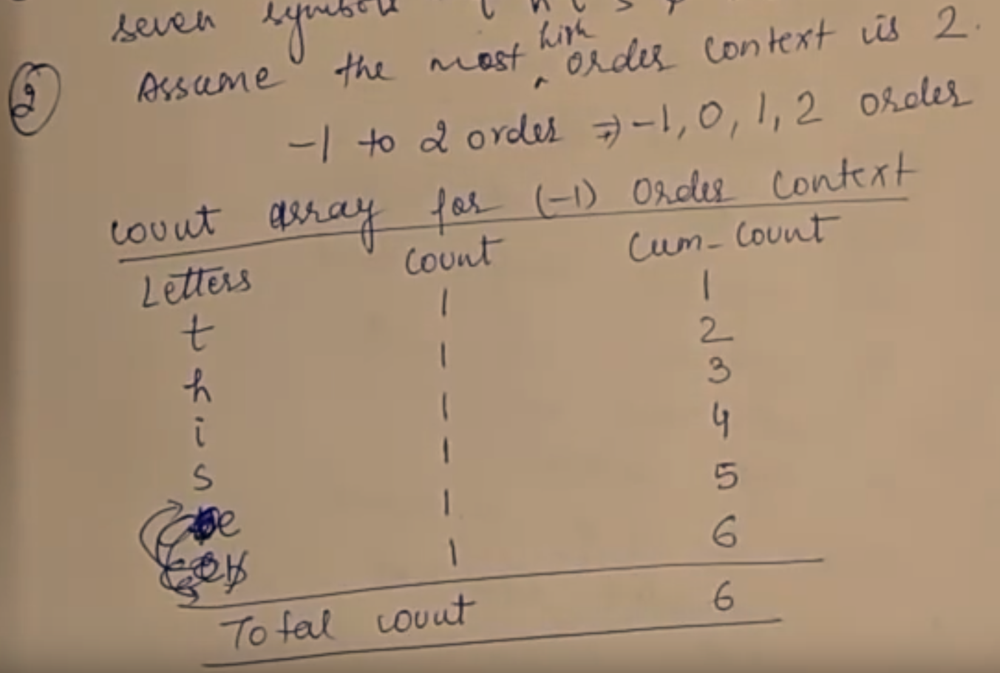
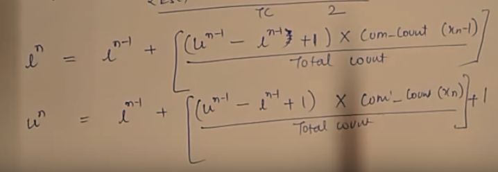

# The Basic Algorithm

[link](https://www.youtube.com/watch?v=_zbGhovjYhs)

- if the symbol has not occurred in the context
  1. an **escape symbol** is encoded
  2. attempts to use the next **smaller context**
  3. each time a symbol is encountered, the count corresponding to that symbol is updated (in all  tables)

# Example

encode the sequence: 

## assumption

1. we already encode some initial seven symbols "this /bis” 
2. assume the most high order context is 2
3. assume that the word length for arithmetic coding is 6, 所以 
   - l (lower bound) = 000 000B
   - u (upper bound) = 111 111B = 63
4. 

## order tables

### -1 order context

- cum_count: cumulative count
- 一个个字母看, 之前数过的就跳过
- 因为 /b 不是字母, 所以把它放最后

- encode context

  

### 0 order context

- 看总的context有多少个这样的字母

### 1 order context

### 2 order context

- formula for calculate the lower order limit and upper order limit

  u公式最后是 -1
  
  

## further encode

1. next letter is /b, 2 order context is "is”

   check the 2 order table 

   

   cum-count = 1, TC (total count) = 2

- then use two formulas to calculate the next lower and upper order limit

- $l^0 = 000 000B, u^0 = 111 111B = 63$

- $cum-count(x_n-1) = 1-1=0?$

- update value of $l$ and $u$

  - $l$
  - $u$

- MSB (the Most Significant Bit 二进制的第一位?) of $l$ and $u$ is $0$, so we send the $0$ and update $l$ and $u$ by shifting left

  $l=000000B, u=111111B?$

- need to update all tables for that particular letter

  - 2 order table

    

  - 1 order table

    

  - 0 order table

    