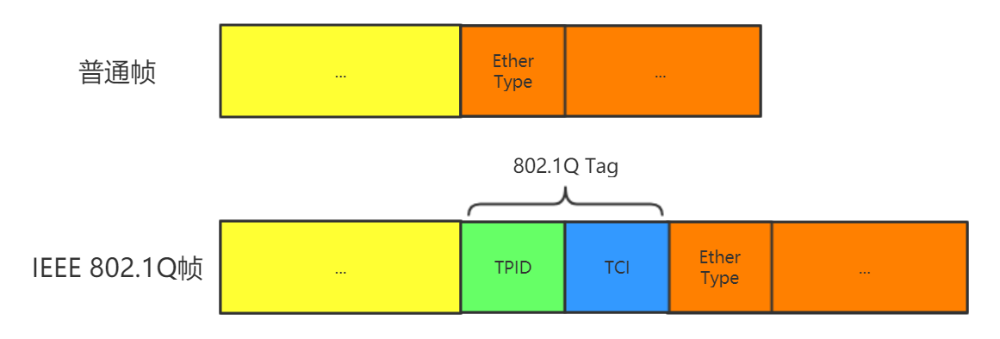
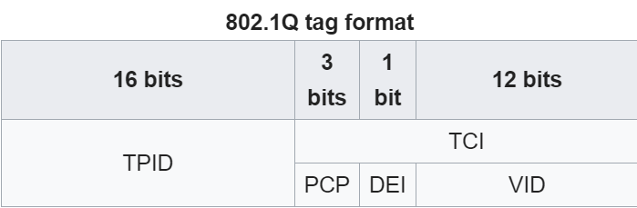
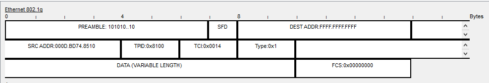
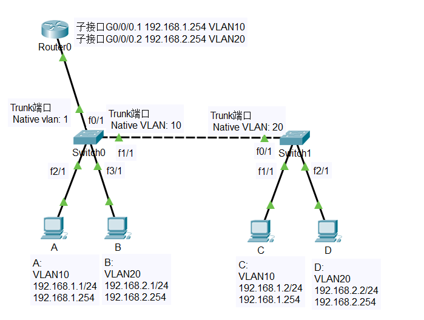
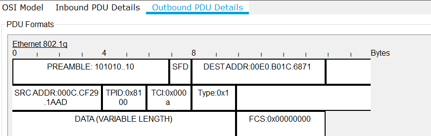
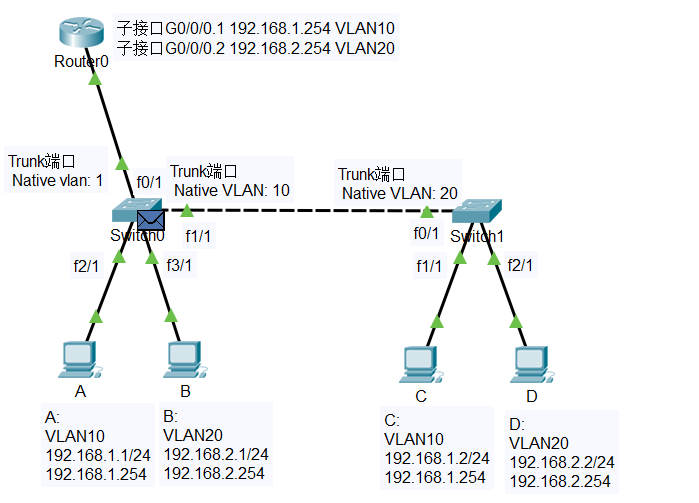

本文章要讨论的问题有:
1. 如果帧的VID和Trunk端口的PVID相同, 为什么Trunk端口要将其VID去掉再转发?
2. 连接两台交换机的端口的PVID不同能否通信?
(可以直接跳到最后看结论)
3. 两台主机在同一个VLAN下, 但是不在同一个子网, 能否通信?

主要工具: Packet Tracer
划分VLAN的方法: 根据交换机端口来划分

# 概念了解
## 标记帧(tagged frame)和未标记帧(untagged frame)
与普通的帧相比, IEEE 802.1Q帧(以下简称802.1Q帧)在帧的中部多了一个 **VLAN标签**


带了4字节VLAN标签的帧成为标记帧
不带4字节的VLAN标签的帧称为未标记帧
加标记(签)或去标记(签)是通过交换机处理的
### VLAN标签的细节
#### TPID
> Tag protocol identifier

这16bits的值是0x8100, 用来标明这个帧的类型是802.1Q. 至于为什么要段信息插在帧的中间, 而不是插在帧的后面或其他地方, 可能是因为这个位置原来刚刚好是普通帧 *Ether Type* 值的位置

#### TCI
> Tag control information

16bits的值可以细分为以下三个值
1. PCP(Priority code point)
2. DEI(Drop eligible indicator)
3. VID(VLAN identifier) VLAN标识符:
这里就是来标明这个帧是属于哪个VLAN的地方了, 0x000和0xFFF这两个值是保留的, 也就是可以标记4094个VLANs.
0x000 表明这个帧没有VLAN ID
0x001 表明这个帧属于 管理VLAN

举个栗子, 我用Cisco的packet tracer做了个仿真实验, 得到了这样一个帧结构

TPID位置标明这是802.1Q帧, 通过后面的TCI值可以看出这个帧被标上了VLAN 10的标记

## VLAN ID
### 端口的缺省VLAN ID
- 在思科交换机上称为Native VLAN, 即本征VLAN
- 在华为交换机上称为PVID(Port VLAN ID), 即端口VLAN ID

## 交换机的MAC表
|VLAN|Mac Address|Port|
|---|---|---|
|10|0001.64BC.6BA4|FastEthernet0/4|
|10|00E0.F78C.296C|FastEthernet0/1|
|20|000D.BD74.8510|FastEthernet0/2|
交换机可以根据帧的MAC地址, 在MAC表中查找相应的VLAN ID, 给帧打上标签

## 路由器的路由表

## 交换机端口类型
### Access端口
- Access端口一般用于连接用户计算机
- Access端口只能属于一个VLAN
- Access端口的PVID与端口所属VLAN的ID相同
- Access端口 **接收** 处理方法:
  - 一般只接受"未打标签"的数据帧, 即普通以太网数据帧
  - 当收到"未打标签"的数据帧时, 根据接收该帧的端口的PVID, 给帧"打标签", 也就是插入4字节的VLAN标签, 标记中VID的取值与端口的PVID一致
- Access端口 **发送** 处理方法:
  - 若帧中的VID与端口的PVID相等, 则去除"标签"并转发该帧; 否则不作处理
### Trunk端口
- Trunk类型端口可以允许多个VLAN通过, 可以接受和发送多个VLAN报文, Trunk端口一般用于交换机之间或交换机和路由器之间的互连
- Trunk端口可以属于多个VLAN
- 用户可以设置Trunk端口的PVID. 默认情况下, Trunk端口的PVID值为1(思科交换机又把Trunk端口的VLAN ID又称为Native VLAN ID)
- Trunk端口 **发送** 处理方法:
  - 对于数据帧中的VID等于端口PVID的数据帧, 去掉"标签"再转发
  - 对于数据帧中的VID不等于端口PVID的数据帧, 直接转发
- Trunk端口 **接收** 处理方法:
  - 接收"已打标签"的数据帧, 而不管数据帧中的VID是否等于端口的PVID
  - 接收"未打标签"的数据帧, 根据端口的PVID值给帧"打标签", 即插入4字节VLAN ID字段, 字段中的VID取值与端口PVID取值相等
### Hybrid端口
- (华为交换机才有这个端口)

# 实验
## 两个交换机的Trunk端口的PVID不同
### Native VLAN和有的主机所属的VLAN相同
如图(switch0的Native VLAN和主机A的VLAN ID相同)
#### 交换机的配置命令
```
```

#### A ping C (Failed)
1. 主机A发送普通帧到switch0
2. switch0给帧打上VLAN10的标签
3. switch0将帧从f0/1(Trunk)端口发出,


#### A ping D
#### C ping A
#### D ping B
### Native VLAN没有和任何主机所属的VLAN相同


# 问题总结
1.


</br></br><b>Reference List</b>:
- [wikipedia IEEE 802.1Q](https://en.wikipedia.org/wiki/IEEE_802.1Q)
- [B站是个好东西之计算机网络-虚拟局域网VLAN](https://www.bilibili.com/video/av34491171)
