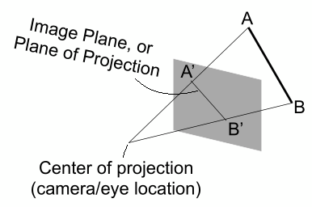

# 介绍

CG和CV的区别

# 基础知识

## dot prodct

> [link](https://zh.wikipedia.org/wiki/%E7%82%B9%E7%A7%AF)

## cross product

> 叉乘

- Cross product is orthogonal to two initial vectors：叉乘会得到一个新的向量，这个向量同时垂直于a和**b**
- Direction determined by right-hand rule：新向量的方向由右手定则来确定（右手的四个手指弯曲使其在水平面同时垂直于**a**、**b**向量，如图中红线所示，拇指指向的方向为新向量的方向）
- Useful in constructing coordinate（坐标） systems

### 计算

- 右手坐标系，$\overrightarrow{x}× \overrightarrow{y} = \overrightarrow{z}$；

- 左手坐标系，$\overrightarrow{x}× \overrightarrow{y} = -\overrightarrow{z}$，OpenGL用的是左手坐标系

- 向量自己跟自己叉乘得到的是一个0**向量**，不是0

- 

  推导过程详见 [link](https://zh.wikipedia.org/wiki/%E5%8F%89%E7%A7%AF)

- 

  ### 作用

- Determine left / right

  

- Determine inside / outside

  

# Transformation

- 2D: rotation, scale(缩放), shear
- 3D

## Linear Transforms

所有的线性变换都可以写成下面这样

### shear

垂直方向不变，水平方向偏移ay

但是平移（translation）不能用上面那种形式表示（一个矩阵乘以一个向量），得用下面这种

叫做Affine map = linear map + translation

为了能够统一地表示所有这些操作（旋转，缩放，平移），需要引入齐次坐标(Homogenous Coordinates)

### rotate

逆时针，绕原点

可以找两个特殊点，来推

看看逆时针和顺时针旋转，会发现这两个矩阵刚好互逆($R^T$是$R$的转置)

$R_\alpha= \begin{pmatrix}cos\alpha&-sin\alpha \\ sin\alpha&cos\alpha\end{pmatrix}$

$R_{-\alpha} = \begin{pmatrix}cos\alpha&sin\alpha \\ -sin\alpha&cos\alpha\end{pmatrix} = R^T_\alpha$ 

BTW: 如果一个矩阵的逆等于它的转置，这个矩阵就叫做正交矩阵。

### Homogenous Coordinates

> 齐次坐标

如果是点，最后一个维度的最后加的是1，前面都为0

如果是向量，最后一个维度都为0，因为向量有**平移不变性**（向量只跟长度、方向有关，与起点无关）所有要加0保护，不让平移操作改变它

增加一个维度还有一个好处，就是运算

- vector + vector = vector

- point - point = vector

- point + vector = point （一个点延一个方向移动到另一个点）

- point + point = 变成这两个点之间的中点, 因为

  $\begin{pmatrix}x \\y \\w\end{pmatrix}$是一个2维的点$\begin{pmatrix}x/w\\y/w\\1\end{pmatrix},w\not= 0$

#### scale

$$
S(s_x, s_y) = \begin{pmatrix}s_x&0&0 \\ 0&s_y&0\\0&0&1\end{pmatrix}
$$

#### rotation

$$
R(\alpha) = \begin{pmatrix}cos\alpha&-sin\alpha&0 \\ sin\alpha&cos\alpha&0\\0&0&1\end{pmatrix}
$$

#### translation

$$
T(t_x, t_y) = \begin{pmatrix}1&0&t_x \\ 0&1&t_y\\0&0&1\end{pmatrix}
$$

## Inverse Transform

$M^{-1}$is the inverse of transform $M$ in both a matrix and geometric sense

## Composing Transforms

## Decomposing Comples Transforms

## 3D Transforms

**很重要，如果w不为0，x、y、z都要除以w得到的才是要的点**

左上角的3*3矩阵还是表示线性变换, $t_x, t_y, t_z$ 还是表示平移。

### scale

> 缩放

### translation

> 平移

### rotate 

- $R_x$是绕x旋转，x轴的坐标不变，所以（0，0）位置是1
- 任何旋转都可以分解为绕x, y, z 旋转
- xyzxyz, 三个轴循环对称，x×y得z，y×z得x，z×x得y，是x×z得-y     ？？？

#### Rotation Formula

> Rodrigues’ rotation formula
>
> 罗格里德斯旋转公式？？？

- **n**是旋转轴：默认是过原点，方向是**n**的方向。如果要沿任意轴旋转，需要先移动到原点再移动回去。
- N那个矩阵其实是向量**n**（可以到上面看叉乘的公式）

## View Transformation

> 观测变换

步骤（用拍照来做比喻）MVP变换

1. **model** transformaiton（模型变换，把要拍照的人都找来）
2. **view** transformaiton（视图变换，找一个好的角度）
3. **projection** transformation（投影，Cheese!）
4. 视口

### Model Transformation

- 调整好模型, 比如先旋转好

### View/Camera Transformation

> 视图变换
>
> 也叫ModelView Transformation，MVP中的MV

- 假定相机永远在原点，朝向-z方向。如果一开始相机不满足条件，只需移动相机，移动的同时保持相机和物体相对静止即可。

  

- 定义相机

  - position 位置：$\overrightarrow{e}$

  - look-at / gaze direction 仰角（垂直）：$\hat{g}$
  - up direction 倾斜角（水平）：$\hat{t}$

- $M_{view}$表示相机要进行变换的矩阵：也就是

  - Translates e to origin 平移到原点

  - Rotates g to -Z 

  - Rotates t to Y

  - Rotates (g × t) To X

    

- $M_{view} = R_{view} T_{view}$，$M_{view}$需要通过平移和旋转得到

  - $T_{view}$ 是平移矩阵，平移到原点，
    $$
    T_{view} = \begin{bmatrix} 1&0&0&-x_e  \\  0&1&0 &-y_e \\ 0&0&1&-z_e \\ 0&0&0&1 \end{bmatrix}
    $$
  
- $M_{view}$是旋转矩阵，作用是：Rotate g to -Z, t to Y, (g × t) to X。但是不好算，只能Consider its inverse rotation: X to (g × t), Y to t, Z to -g，
    $$
    R_{view}^{-1} = \begin{bmatrix} x_{\hat{g}×\hat{t}}&x_t&x_{-g}&0  \\  y_{\hat{g}×\hat{t}}&y_t&y_{-g}&0 \\ z_{\hat{g}×\hat{t}}&z_t&z_{-g}&0 \\ 0&0&0&1 \end{bmatrix}
    $$
    
  
  （可以拿向量$\begin{bmatrix} 1\\0\\0\\0 \end{bmatrix}$，$\begin{bmatrix}0\\1\\0\\0 \end{bmatrix}$，$\begin{bmatrix} 0\\0\\1\\0 \end{bmatrix}$分别去做$R_{view}^{-1}$旋转，就可以得到相机原来的位置）
  
  因为旋转矩阵是正交矩阵，旋转矩阵的逆是其转置，所以
  $$
    R_{view} = \begin{bmatrix} x_{\hat{g}×\hat{t}}&y_{\hat{g}×\hat{t}}&z_{\hat{g}×\hat{t}}&0  \\  x_t&y_t&z_t&0 \\ x_{-g}&y_{-g}&z_{-g}&0 \\ 0&0&0&1 \end{bmatrix}
  $$
  

### Projection Transformation

> 投影变换

#### Orthographic Projection

> 正交投影

- A simple way of understanding 简单的做法

  - Camera located at origin, looking at -Z, up at Y (looks familiar?) 相机位于原点

    

  - Drop Z coordinate，这就是朝向-Z的好处，只要拿掉Z坐标就得到了投影

  - Translate and scale the resulting rectangle to [-1, 1]$^2$ 为了方便其他计算，也算是约定俗成的，之后可能再做一次缩放

    

- In general 通常的做法

  - We want to map a cuboid [l, r] × [b, t] × [f, n] to the “canonical (正则、规范、标准)” cube [-1, 1]$^3$

  

  ​	l, r, b, t, f, n 表示 left, right, bottom, top, far, near, 由于是右手系，far的z值反而会比near的z值小

  - 对比<u>简单的做法</u>，<u>通常的做法</u>需要先将cuboid的中心center与原点origin重合，然后缩放到一个 “canonical” cube

##### 计算

1. translate (center to origin)
2. scale (length/width/height to 2) 

Transfomation Matrix:
$$
M_{ortho}=
\begin{bmatrix} 
\frac{2}{r-l}&0&0&0\\
0&\frac{2}{t-b}&0&0\\
0&0&\frac{2}{n-f}&0\\
0&0&0&1\\
\end{bmatrix}
\begin{bmatrix} 
1&0&0&-\frac{r+l}{2}\\
0&1&0&-\frac{t+b}{2}\\
0&0&1&-\frac{n+f}{2}\\
0&0&0&1\\
\end{bmatrix}
$$

- 右边是平移矩阵：负的是因为要回到原点
- 左边是缩放矩阵：最后$r-l$这段长度会变成$(r-l) * \frac{2}{r-l}$这么长，也就是2，为-1到1的距离
- 

#### Perspective Projection

> 透视投影(近大远小)

- 要用到的一些性质（齐次坐标）
  - (x, y, z, 1), (kx, ky, kz, k != 0), (xz, yz, z 2 , z != 0) all represent the same point (x, y, z) in 3D
    e.g. (1, 0, 0, 1) and (2, 0, 0, 2) both represent (1, 0, 0)
  - simple, but useful

- 投影步骤
  1. “squish” the frustum into a cuboid (n -> n, f -> f) ($M_{persp->ortho}$ ) 先将远平面挤到和近平面一样大
  2. Do orthographic projection (M ortho , already known!) 再正交投影

- 一些规定
  - 近平面啥都不变
  - 远平面的z不变，中心也不变

##### 计算

1. 首先将远平面缩成近平面的大小，所以先找远近平面的关系 

   

   这里面有两个相似三角形，比值是$\frac{n}{z}$

   $y'=\frac{n}{z}y$，$x'=\frac{n}{z}x$

   所以我们知道了缩放后远平面x，y的变化，远平面上的点的变化：
   $$
   \begin{pmatrix}
      x \\
      y \\
      z \\
      1
   \end{pmatrix} \implies
   \begin{pmatrix}
      nx/z \\
      ny/z \\
      unknow \\
      1
   \end{pmatrix} ==
   \begin{pmatrix}
      nx \\
      ny \\
      still\space unknow \\
      z
   \end{pmatrix}
   $$

   - $z$在这里还不知道是怎么变化。
   - 点的坐标都乘上一个数（比如$z$），点还是那个点。

2. 尝试推一下$M^{(4×4)}_{persp->ortho}$
   $\because M^{(4×4)}_{persp->ortho}   \begin{pmatrix}      x \\      y \\      z \\      1   \end{pmatrix} =   \begin{pmatrix}      nx \\      ny \\      unknow \\      z   \end{pmatrix}$
   
   $\therefore M_{persp->ortho} =    \begin{pmatrix}      n&0&0&0 \\      0&n&0&0 \\   	?&?&?&?\\      0&0&1&0   \end{pmatrix}$
   
   - 由于不知道z最后变成什么，也就无法逆推原来是什么乘z
   
3. 寻找更多的线索来确定$M_{persp->ortho} $第三行，比如

   1. **所有近平面的点位置都不变**，所以近平面的点做$M_{persp->ortho} $变化（缩放到和近平面一样大）得到的还是近平面。

      设近平面的点为$\begin{pmatrix}x \\   y \\   n\\   1\end{pmatrix}$，且 $M^{(4×4)}_{persp->ortho}   \begin{pmatrix}      x \\      y \\      z \\      1   \end{pmatrix} =   \begin{pmatrix}      nx \\      ny \\      unknow \\      z   \end{pmatrix}$

      

      由于近平面的点变化后不变，且格式是$\begin{pmatrix}      nx \\      ny \\      unknow \\ n \end{pmatrix}$ ，所以$unknow$应该是$n^2$，也就是说$M_{persp->ortho}\begin{pmatrix}      x \\      y \\      n\\      1   \end{pmatrix} = \begin{pmatrix}      nx \\      ny \\      n^2 \\      n   \end{pmatrix}$，逆推得$\begin{pmatrix}0&0&A&B\end{pmatrix} \begin{pmatrix}      x \\      y \\      n\\      1   \end{pmatrix} = n^2$，$M_{persp->ortho}$的第三行是$\begin{pmatrix}0&0&A&B\end{pmatrix}$，即$An+B=n^2$。

      由于有两个未知数A，B，我们需要更多线索

   2. **所有远平面的点z值都不变**，那我们不妨拿中心点$\begin{pmatrix} 0\\0\\f\\1 \end{pmatrix}== \begin{pmatrix} 0\\0\\f^2\\f \end{pmatrix}$来看看，$M_{persp->ortho}\begin{pmatrix} 0\\0\\f\\1 \end{pmatrix}=\begin{pmatrix} 0\\0\\f^2\\f \end{pmatrix}$，所以$\begin{pmatrix}0&0&A&B\end{pmatrix}\begin{pmatrix} 0\\0\\f\\1 \end{pmatrix} = f^2$，即$Af+B=f^2$

4. 整理一下已获得的线索

   $An+B=n^2\\Af+B=f^2$，得$A=n+f\\B=-nf$ 

5. Finally, every entry in $M_{persp->ortho}$ is known! $ M_{persp->ortho} =    \begin{pmatrix}      n&0&0&0 \\      0&n&0&0 \\   	0&0&n+f&-nf\\      0&0&1&0   \end{pmatrix}$

6. Do orthographic projection ($M_{ortho}$ ) to finish: $M_{persp} = M_{ortho} M_{persp->ortho}$ 

##### 问题

**如果一个平面位于远平面和近平面之间，做透视投影后，z的值会变吗？**

我的答案是会变得靠近远平面：

# Rasterization

> 光栅化

- 实时图形学(>30fps)常用到光栅化

## Aliasing

# Curves & Meshes

> 几何

# Ray Tracing

> 光线追踪

# Animation

> Simulation 模拟

作业一、二：史雨宸，syc0412@mail.ustc.edu.cn
作业四、五：邓俊辰，1050106988[@qq](http://games-cn.org/forums/users/qq/).com
作业三、六、七：刘光哲，lgz17@mails.tsinghua.edu.cn
作业八：禹鹏、郭文鲜，y2505418927@gmail.com，wxguojlu@hotmail.com